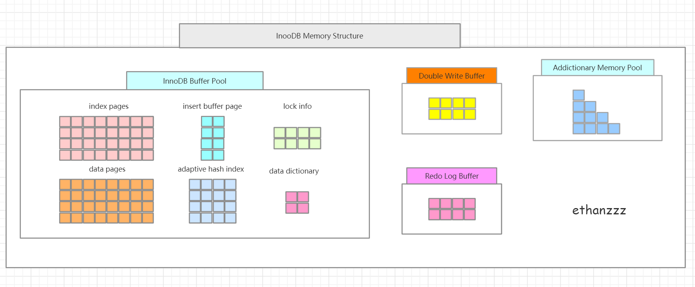
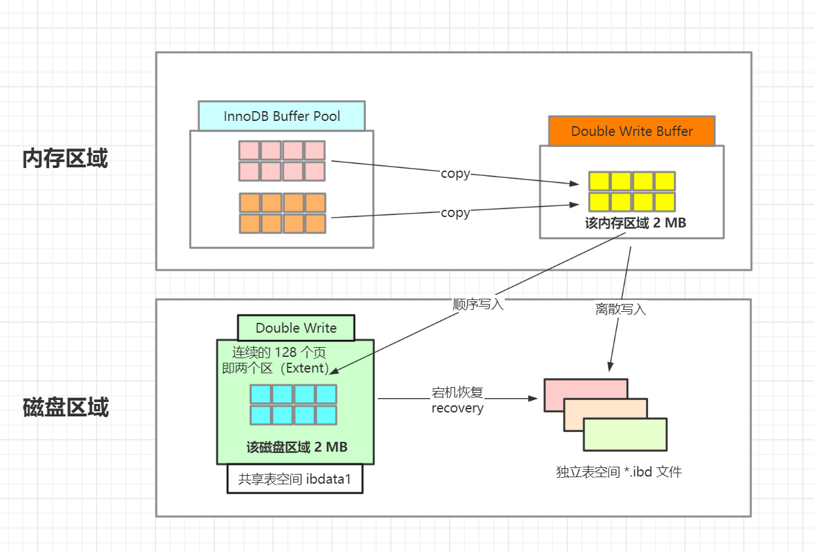
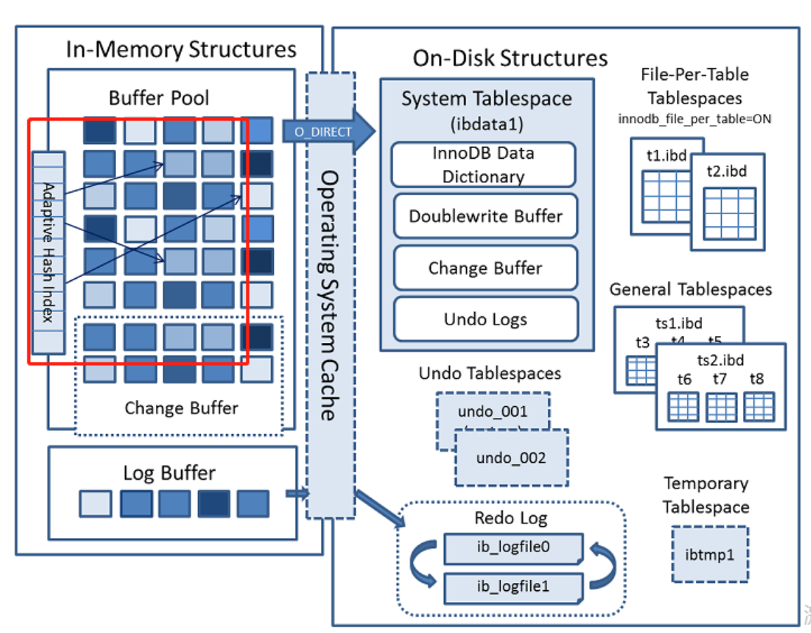

MySQL内存结构图如下：




### 一、双写

---

#### 1.1 为什么要有双写

要解决 Partial page write 一部分写失效问题。

#### 1.2 什么是 Partial page write

当数据库发生宕机，InnoDB 存储引擎正在写入某个页到表中，而这个页只写了一部分，比如 16KB 的页只写了前 4KB，发生了宕机。此时重启数据库，InnoDB 存储引擎无法找到这个经历了 Partial page write（部分写）的页。

因为是 InnoDB 存储引擎是通过 checksum 去寻找页的，发生 Partial page write 问题的页，这种 page 是损坏页，无法找到该 page 的事务号，无法通过 checksum 验证，就无法恢复。

#### 1.3 双写如何解决 Partial write page

InnoDB 在内存中开辟了一块内存区域 Double write buffer，刷脏页时，将缓冲池中的脏页 Copy 到 Double wirte buffer 中，**在写数据页之前，先把这个数据页写到一块独立的物理文件位置（ibdata 共享表空间）**，然后再写到数据文件中。

这样在宕机重启时，如果出现数据页损坏，那么在应用 Redo log 之前，需要通过该页在 ibdata 共享表空间中的副本来还原该页，然后再进行 Redo log 重做。

#### 1.4 每一次脏页的刷新，都要经过双写机制落入磁盘



```sql
mysql> show status like "innodb_dblwr%";
+----------------------------+-------+
| Variable_name              | Value |
+----------------------------+-------+
| Innodb_dblwr_pages_written | 1057  |
| Innodb_dblwr_writes        | 24    |
+----------------------------+-------+
2 rows in set (0.01 sec)
```

- innodb_dblwr_pages_written 是从 double wirte buffer 刷入共享表空间 double write 区域的脏页数量 | 此时写入时顺序的。
- innodb_dblwr_writes 是从 double wirte buffer 刷入独立表空间 .ibd 数据文件的脏页的数量 | 此时写入是离散的。


### 二、自适应哈希

---



hash是一种快速查找的方法，时间复杂度为O(1)，即一般一次就能定位数据。

B+树的查找次数，取决于B+树的高度，生产环境中，B+ 树的高度一般是 3-4 层，故需要查找 3-4 次查询 。

InnoDB 会监控对表上各个索引页的查询，如果观察到建立 Hash 索引可以带来速度提升，则建立 Hash 索引，即称为自适应 Hash 索引（Adaptive Hash Index，AHI）。

AHI 通过缓冲池的 B+ 树构造而来，建立的速度很快，不需要对整张表建立 Hash 索引。**InnoDB 自动根据访问的频率和模式为某些热点数据建立 AHI 索引**。

#### 2.1 AHI 第一个要求

对这个索引页的数据的访问模式（即查询条件），必须是一样的。

例如我们创建了一个联合索引（a,b），会有对应的联合索引页。当我们访问到该索引页时，访问模式（查询条件）可以是以下几种：

- WHERE a=xxx
- WHERE a=xxx and b=xxx

访问模式一样指的是查询的条件一样，若交替进行上述两种查询，那么 InnoDB 不会对这个索引页构造 AHI。

#### 2.2 AHI 的第二个要求

- 以该模式访问100次
- 索引页通过该模式访问了N次，其中N=页记录数*1/16

启用 AHI 后，读写速度可以提高 2 倍，辅助索引的连接操作性能可以提高 5 倍。


### 三、合并插入（变更）缓冲

---

首先我们创建一个表，表的主键是 id。当执行插入操作时，id 列会自动增长。页中的行记录，会按照 id 顺序存放，不需要随机读取其他页的数据，这样的情况下（聚集索引），插入效率很高。但是，在大部分的应用中，不会只有一个聚集索引，更多情况下，少不了 secondary index - 辅助索引，如下表所示：

```sql
# 如下表，除了主键聚集索引，还有辅助索引
create table sec_test (
id int(4) not null primary key auto_increment,
name varchar(20) not null,
age tinyint unsigned not null,
key idx_name(name)
)
```

这时，除了主键聚集索引，还有辅助索引，**对于该非聚集索引来讲，叶子节点的插入不是有序的，这时候需要离散的访问非聚集索引页，插入性能变得很低**。

因此，InnoDB 设计出插入缓冲技术，**对于非聚集索引的插入和更新，不是每一次都直接插入索引页，而是先插入到内存**，具体做法：

① 索引页在缓存中，直接插入。

② 索引页不在缓存中，先将其放入插入缓冲区，再以一定频率和索引页合并。

这样**将同一个索引页多个插入合并到一个 IO 操作中**，提高写性能。

#### 3.1 启用的条件

1. 索引是辅助索引（secondary index）
2. 索引不适合唯一的（如果辅助索引是唯一的，**无法保证唯一性**）

#### 3.2 引起的问题

1. 可能导致数据库**宕机后实例恢复时间变长**。如果应用程序执行大量的插入和更新操作，且涉及非唯一的聚集索引，一旦出现宕机，这时就有大量内存中的插入缓冲区数据没有合并至索引页中，导致实例恢复时间会很长。
2. 在写密集的情况下，插入缓冲会**占用过多的缓冲池内存**，默认情况下最大可以占用1/2，这在实际应用中会带来一定的问题。

#### 3.3 change buffer

MySQL 5.5 之后，用 Change Buffer 代替 Insert Buffer，可以将 Change Buffer 看作 Insert Buffer 的升级。

可以对 DML 操作都进行缓冲，包括 Insert Delete Update 操作，分别缓冲到 Insert Buffer，Delete Buffer，Update Buffer 中。

和之前一样，Change Buffer 适用对象依然是**非唯一的辅助索引**。

InnoDB 存储引擎提供了参数 `innodb_change_buffering` 用来开启各种 Buffer 的选项。

可选值 inserts、deletes、purges、changes、all、none

- inserts => 启用 Insert Buffer
- deletes => 启用 Delete Buffer
- purges => 启用 Update Buffer
- changes => 启用 Insert & Delete Buffer
- all => 启用 Insert & Delete & Update Buffer
- none => 都不启用

该参数默认是 all

可以通过 innodb_change_buffer_max_size 控制 Change Buffer 最大使用内存量。默认是 25，即最多使用缓冲池 25% 的内存空间，该参数最大有效值是 50%


### 四、异步IO

---

用户可以发起一个 IO 请求，不必等待该 IO 请求的结果，发起另外的 IO 请求，当全部 IO 请求发送完毕，等待全部 IO 操作的完成，就是异步 IO。

AIO 的另外一个优势，是可以进行 IO 合并（IO Merge），即将多个 IO 操作合并为 1 个 IO 操作，提高 IOPS 性能。

例如用户要访问的页的 space,page_no 分别为 (8,1) (8,2) (8,3) ，AIO 会判断这三个页是连续的，AIO 会发送一个 IO 请求，从 (8,1) 开始，连续读取 48KB 的页。

```sql
# 开启内核级别的 AIO 支持，需要操作系统提供支持，
# 因此编译 MySQL 时，需要 libaio 库的支持
mysql> show variables like "%native_aio%";
+-----------------------+-------+
| Variable_name         | Value |
+-----------------------+-------+
| innodb_use_native_aio | ON    |
+-----------------------+-------+
1 row in set (0.00 sec)
```


### 五、刷新邻接页

---

当刷新一个脏页时，InnoDB 会检测该页所在区（extent）的所有页，如果是脏页，那么一起刷新。

同样的，该操作属于 AIO 的一个范畴，AIO 可以将多个 IO 写入操作，合并为一个 IO 写入操作。

在传统的机械硬盘时代，打开这个参数能够减少磁盘寻道的开销，显著提升性能。**对于 SSD 设备，寻道时间的性能影响很小，关闭该参数，反而能够分散写操作，提高数据库性**。

```sql
# 是否打开刷新邻接页功能
mysql> show variables like "%neighbor%";
+------------------------+-------+
| Variable_name          | Value |
+------------------------+-------+
| innodb_flush_neighbors | 1     |
+------------------------+-------+
1 row in set (0.00 sec)


- 取值范围：0，1，2
- 默认值：5.7 版本为 1 ，8.0 版本为 0

- 设置为 0 时，表示刷脏页时不刷其附近的脏页
- 设置为 1 时，表示刷脏页时连带其附近毗连的脏页一起刷掉
- 设置为 2 时，表示刷脏页时连带其附近区域的脏页一起刷掉。1与2的区别是2刷的区域更大一些
```