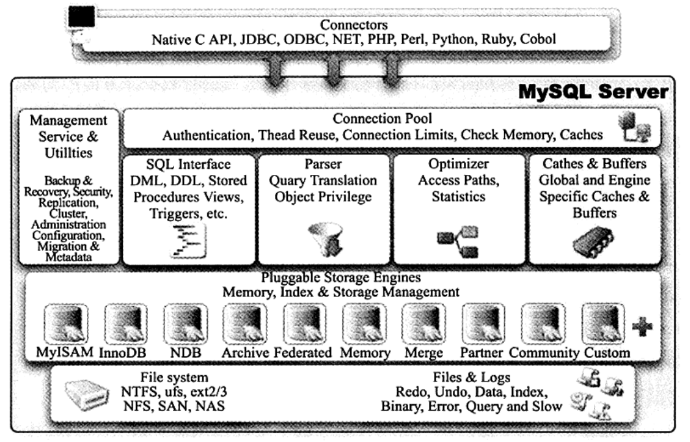

从概念上讲，**数据库是文件的集合**，是依照某种数据模型组织起来并存放于二级存储器中的数据集合；**数据库实例是程序**，是位于用户与操作系统之间的一层数据管理软件，用于对数据库数据的任何操作。应用程序只有通过数据库实例才能和数据库打交道。

MySQL体系结构图如下：

- 连接池组件
- 管理服务和工具组件
- SQL接口组件
- 查询分析器组件
- 优化器组件
- 缓冲（cache）组件
- 插件式存储引擎
- 物理文件

>注：存储引擎是基于表的，而不是数据库。