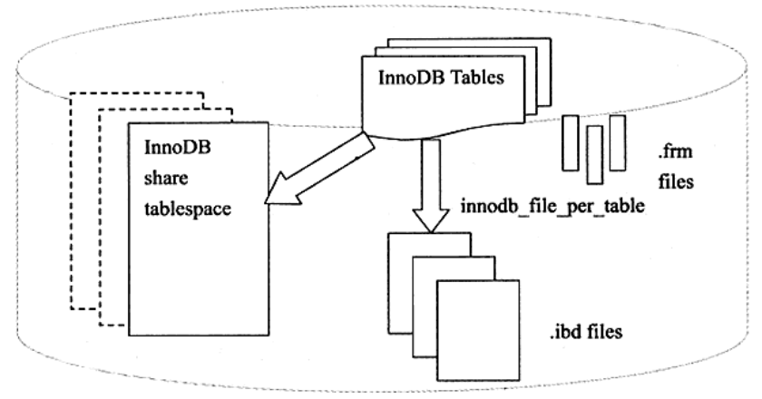

每个表存储引擎有其独有的文件，包括重做日志文件、表空间文件。

### 一、表空间文件

---

InnoDB采用将存储的数据按表空间（tablespace）进行存放的设计。在默认配置下会有一个初始大小为12MB，名为 ibdata1 的文件。可以通过参数 `innodb_data_file_path` 进行设置。

```sql
[mysqld]
innodb_data_file_path = /db/ibdata1:2000M;/dr2/db/ibdata2:2000M:autoextend
```

这里将 /db/ibdata1 和 /dr2/db/ibdata2 两个文件用来组成表空间。若这两个文件位于不同的磁盘上，磁盘的负载可能被平均，因此可以提高数据库的整体性能。同时，两个文件的文件名后缀都跟了属性，表示文件 ibdata1 的大小为2000MB，文件 ibdata2 的大小为2000MB（可自动增长）。

所有基于InnoDB引擎的表的数据都会记录到该共享表空间中。若设置了参数 `innodb_file_per_table`，则用户可以将每个基于InnoDB存储引擎的表产生一个独立表空间。独立表空间命名规则为：**表名.ibd**。

```sql
mysql> show variables like 'innodb_file_per_table';
+-----------------------+-------+
| Variable_name         | Value |
+-----------------------+-------+
| innodb_file_per_table | ON    |
+-----------------------+-------+
1 row in set (0.00 sec)
```

test库设置了innodb_file_per_table，故可以观察到：

```shell
chenyang@chances-MacBook-Pro test % ll
total 47056
-rw-r-----  1 _mysql  _mysql     0B  8 25 14:45 address.MYD
-rw-r-----  1 _mysql  _mysql   1.0K  8 25 14:45 address.MYI
-rw-r-----  1 _mysql  _mysql   112K  8 25 14:50 sys_job.ibd
-rw-r-----  1 _mysql  _mysql   128K  8 30 10:54 t1.ibd
-rw-r-----  1 _mysql  _mysql   112K  8 25 14:50 t2.ibd
```

表sys_job、t1、t2都是基于InnoDB存储引擎的表，由于设置参数`innodb_file_per_table=ON`，因此产生了单独的.ibd独立表空间文件。需要注意的是，这些**单独的表空间文件仅存储该表的数据、索引和插入缓冲BITMAP等信息**，其余信息还是存放在默认的表空间中。




### 二、重做日志文件

---

默认情况下，在数据目录下会有两个名为 `ib_logfile0` 和 `ib_logfile1` 的文件，即为重做日志文件（redo log file）。

该日志文件记录了InnoDB存储引擎的事务日志。当实例或介质失败时，重做日志文件就能排上用场。例如，数据库由于所在主机掉电导致实例失败，InnoDB存储引擎会使用重做日志恢复到掉点前的时刻，以此来保证数据的完整性。

#### 2.1 重做日志文件组概念

每个InnoDB存储引擎至少有一个重做日志文件组（group），每个文件组下至少有2个重做日志文件，如默认的 `ib_logfile0` 和 `ib_logfile1`。

为了得到更高的可靠性，可以设置多个的镜像日志组（mirrored log groups），将不同的文件组放在不同的磁盘上，以此提高重做日志的高可用性。在日志组中每个重做日志文件的大小一致，并以循环写入的方式运行。InnoDB存储引擎先写重做日志文件1，当达到文件的最后时，会切换至重做日志文件2，再当重做日志文件2也被写满时，会再切换到重做日志文件1中。

#### 2.2 重做日志文件相关参数

下列参数影响着重做日志文件的属性：

- innodb_log_file_size（指定每个重做日志文件的大小）
- innodb_log_files_in_group（指定日志文件组中重做日志文件的数量，默认为2）
- innodb_log_group_home_dir（指定日志文件组所在路径，默认为./，表示在MySQL数据库的数据目录下）

#### 2.3 重做日志文件的大小问题

一方面重做日志文件不能设置地太大，如果设置得太大，在恢复时可能需要很长的时间；另一方面又不能设置得太小，否则可能导致一个事务的日志需要多次切换重做日志文件。此外，**重做日志文件太小会导致频繁地发生async checkpoint**，导致性能抖动。

#### 2.4 重做日志文件与二进制文件的区别

- 重做日志文件只记录与该存储引擎本身的事务日志；
- InnoDB存储引擎的重做日志文件记录的是关于每个页（Page）的更改的物理情况；
- 事务进行过程中，不断有重做日志条目被写入到重做日志文件中。

#### 2.5 重做日志条目结构

- InnoDB中，对于各种不同的操作有着不同的重做日志格式
- 重做日志条目结构：
  - redo_log_type：1字节
  - space：表示表空间ID，但采用压缩的方式，因此占用空间可能小于4字节；
  - page_no：页的偏移量，同样采用压缩的方式；
  - redo_log_body：数据部门，恢复时需要对相应的函数进行解析。

#### 2.6 重做日志的写入过程

- 先写入 redo log buffer 中，然后按照一定的条件顺序地写入日志文件。
- 从 redo log buffer 往磁盘写入时，是按**512个字节**，也就是**一个扇区**的大小进行写入。扇区是写入的最小单位，因此可以保证写入必定是成功的，因此在重做日志的写入过程中不需要double write。