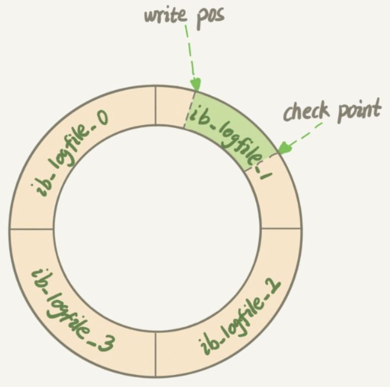
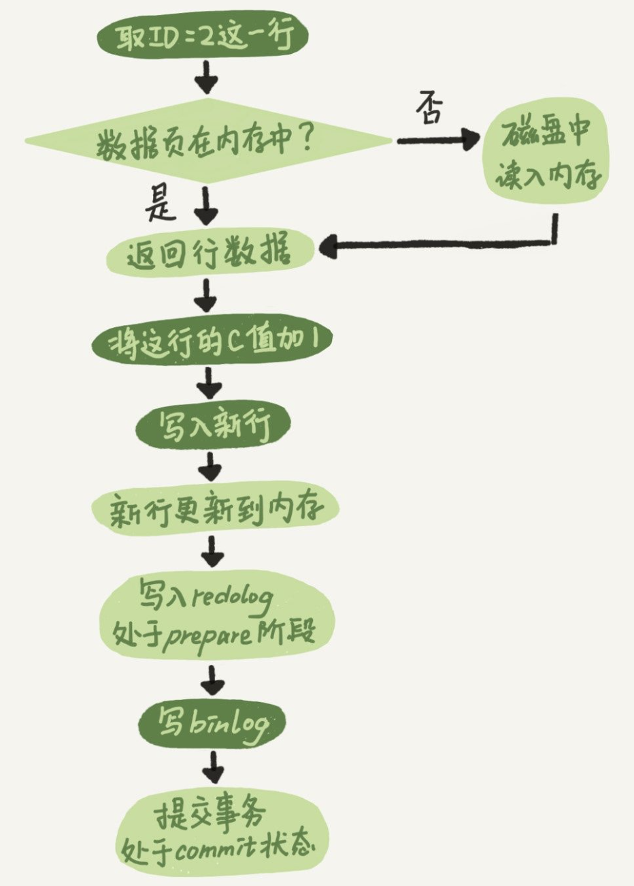
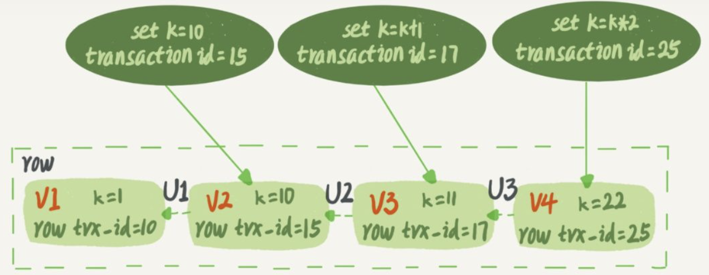
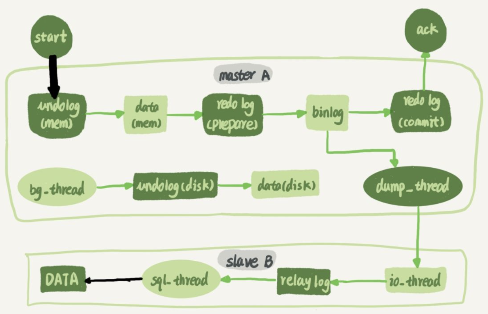

### 一、错误日志（error log）

---

错误日志对MySQL的启动，运行，关闭过程进行了记录，对所有的错误信息，一些警告和正确的信息也进行了记录。在默认情况下，系统记录错误日志的功能是关闭的，错误信息被输出到标准错误输出。错误日志是server层的日志。

```sql
show variables like 'log_error'//查看错误日志位置
```

数据库不能正常启动时，首先分析错误日志。错误日志中的警告对优化也十分有用。


### 二、慢查询日志（slow query log）

---

慢查询日志记录执行时间过长（`long_query_time`设置超时时间阈值）和没有使用索引（`log_queries_not_using_indexes`控制）的查询语句。一般用于问题查找和调优，默认不开启。**慢日志只会记录执行成功的语句**。慢查询日志是server层的日志。

MySQL5.1开始可以把慢查询日志记录放过在一张表中，mysql库下的slow_log表。

```sql
show variables like “long_query_time”;	查看时间阈值， 默认10s
show status like “%slow_queries%”;	查看慢查询配置情况
show variables like “%slow%”;	查看慢查询日志路径
set global slow_query_log=1;	开启慢查询日志
show variables like '%slow_query_log%';查看慢查询日志开启状态
set global log_output='TABLE';	将慢查询日志写在表中
```


### 三、查询日志（general log）

---

查询日志记录了所有对MySQL数据库请求的信息，无论这些请求是否得到了执行甚至包含语法错误。默认关闭。

MySQL5.1开始也可以把查询日志记录放过在一张表中，mysql库下的general_log表。查询日志是server层的日志。

```sql
set global log_output='TABLE';	将查询日志写在表中
```


### 四、二进制日志（binlog）

---

#### 4.1 作用

1. 当存在数据库全备份的时候，可以从全备份开始将数据库重放到之后任意时刻的状态；
2. 实现数据库的主从架构时，使用binlog来同步从库的数据；
3. 判断是否存在sql注入的攻击。

#### 4.2 内容

binlog是逻辑日志，记录的是**相关sql语句的逻辑**，所以从库拿到主库的binlog是可以直接执行的。

binlog有三种格式：row，statement，mixed。

其中mixed是前两种的混合。

- 当binlog_format=statement时，binlog记录的是sql原始语句；
- binlog_format=row时，记录的是涉及到的数据行数据改变前后的值。

两种方式各有优缺点。row方式因为会记录下所有相关的数据行的改变前后的数据，所以占用空间会更大，特别是涉及到的数据行数很多时，但是由于row方式会记录下操作数据时操作前后的数据值，这对于数据恢复时很有用的，所以一般我们可以选择这种方式。statement虽然消耗空间小，但是在某些情况下会造成主从库数据不一致，比如带limit的delete语句，主库和从库可能选择的不同的索引，此时就会造成主库和从库的数据不一致。再说mixed方式，他会自动判断sql语句会不会造成数据不一致，会就使用row方式，不会就使用statement。建议使用row方式。

> binlog是数据库server层实现的，所以任何存储引擎都能使用binlog。
>
> binlog是**追加写入**的，可以一直增加。
>
> binlog是没有故障恢复能力的。

#### 4.3 产生时机

binlog在内存中会对应一个binlog cache的区域（每个线程对应一个），当sql语句（查询类语句是不记录的）执行时就会把语句逻辑写入到binlog cache中，**当事务提交的时候MySQL会把binlog cache中的内容写入磁盘，一个事务的binlog是不能被拆分的，不论事务多大也要确保事务一次性写入磁盘**，这意味着binlog中的语句是按一个个事务排好的，不存在事务语句相互穿插的情况。

在事务提交时进行日志刷盘的操作其实分为两个步骤：

- 第一步叫做write，是把MySQL的binlog cache的内容写到操作系统的文件缓冲区，这个过程实际上是内存操作。
- 第二步叫做fsync，这才是真正把日志内容持久化到磁盘的操作，涉及到磁盘IO，执行速度较慢。

```sql
mysql> show variables like '%sync_binlog%';
+---------------+-------+
| Variable_name | Value |
+---------------+-------+
| sync_binlog   | 1     |
+---------------+-------+
1 row in set (0.01 sec)
```

sync_binlog参数可以控制write和fsync的时机：

- sync_binlog=0 的时候，表示每次提交事务都只 write，不 fsync；（不建议，断电后丢失日志）
- sync_binlog=1 的时候，表示每次提交事务都会执行 fsync；（最多丢失一个事务日志，每次提交都持久化速度慢）
- sync_binlog=N(N>1) 的时候，表示每次提交事务都 write，但累积 N 个事务后才 fsync。（主机断电会丢失最近N个事务的binlog日志，需要在风险和速度之间平衡）

我们还需要注意，每个线程的binlog cache是有限的，**当事务很大缓存放不下时，会将放不下的部分存在临时文件中**，临时文件也是每个线程一个。**binlog文件是所有线程共享的**。

#### 4.4 释放时机

```sql
mysql> show variables like '%expire_logs_days%';
+------------------+-------+
| Variable_name    | Value |
+------------------+-------+
| expire_logs_days | 0     |
+------------------+-------+
1 row in set (0.00 sec)
```

说对于非活动的日志文件，在生成时间超过expire_logs_days配置的天数之后，会被自动删除。默认值为0，表示“没有自动删除”。


### 五、重做日志（redo log）

---

#### 5.1 作用

避免每次事务提交的时候都将数据写入磁盘MySQL使用Write-Ahead Logging(WAL)计数，先写日志再之后的某个时间再把数据从内存刷回磁盘，一次提升响应速度。

作用：**当内存中存在脏页时，MySQL异常重启，此时就可以通过redo log来恢复丢失的数据**。

#### 5.2 内容

redo log是物理日志，记录的是内存中的数据页上的数据变化。

- redo log **保证了事务的持久性和原子性**；
- redo log 是存储引擎层的日志，由只有实现了的存储引擎才能使用；
- redo log 不是无限叠加的，采用的是循环写入的方式。

redo log的文件大小是固定的并且可以有多个文件，从第一个文件的头开始直到最后一个文件的尾，之后又回到第一个文件的头。此时会出现覆盖之前记录的情况。MySQL使用`check point`记录下redo log的一个位置，这个位置之后的记录还有脏页，之前的位置都是已经写回磁盘的记录，所以只要写日志的位置不超过check point就可以了。



#### 5.3 产生时机

redo log在innoDB的内存空间里也有一个redo log buffer的区域先行记录日志内容，当有数据更新时，直接在内存数据页上进行更新，并在redo log buffer中写下日志信息。再在合适的时候把redo log buffer中的内容写入磁盘。这个写磁盘的操作和binlog一样也分为两步，write和fsync。

什么时候是什么时候呢？实际上有这么几种情况：

1. 一个叫做Master Thread的线程每秒会进行一次写盘操作；
2. 每次事务提交的时候可能会执行一次写盘操作（innodb_flush_log_at_trx_commit参数决定)；
   1. 设置为 0 的时候，表示每次事务提交时都只是把 redo log 留在 redo log buffer 中 ;（MySQL异常重启会丢失）
   2. 设置为 1 的时候，表示每次事务提交时都将 redo log 直接持久化到磁盘；（最稳妥）
   3. 设置为 2 的时候，表示每次事务提交时都只是把 redo log 写到操作系统缓存。（主机断电会丢失）

#### 5.4 如何保证数据恢复和数据一致

当在某时刻MySQL异常重启，那么内存中的脏页肯定就丢失了，但是redo log记录了内存中每个脏页的数据，MySQL只需要从check point开始把涉及到的数据页重新从磁盘读入内存，在根据redo log的内容对数据页进行更新，就能恢复之前内存的状态了。

**两阶段提交**

在事务提交的时候不会把数据写入磁盘，但是会把redo log和binlog写入磁盘。一个数据更新的完整操作应该是这样的：

1. 取满足条件的行，若此行所在数据页在内存中直接返回，否则从磁盘中将数据页读入再返回指定数据行；
2. 将数据进行指定操作；
3. 把新数据更新到内存；
4. 写入redo log 处于prepare 阶段
5. 写入binlog
6. 提交事务处于commit阶段



使用两阶段提交是为了**保证异常情况下的binlog和redo log的一致性**。如果没有两阶段提交，那么redo log和binlog必定有一个先写一个后写，若先写binlog，并在写完binlog后写redo log前出现异常。恢复后由于事务没提交，会出现回滚，而binlog却已经记录此事务的逻辑，就出现了不一致的情况。若先写redo log后写binlog，在redo log写完后写binlog前出现异常。恢复后事务可以根据redo log进行之前内存状态的恢复，恢复之后提交事务，而此时binlog没有这一条记录又出现了不一致。redo log 是无法恢复binlog的，所以必定丢失。

使用两阶段提交，我们根据上面的步骤进行分析。假如在步骤4前发生异常，两个日志都没写，恢复后根据redo log恢复内存数据，两个日志都没有异常事务的记录，相当于事务回滚了。在步骤5之前出现异常，这时已经写了redo log但处于prepare阶段，恢复后根据redo log 恢复内存数据时不会使用这个prepare的事务，也相当于事务回滚了。在步骤6之前出现异常，这时写了redo log但处于prepare阶段，同时写了binlog，恢复后，MySQL能够看到redo log 处于prepare阶段，并且已经写了binlog，会自动将此事务提交了。如此不论什么时候出现异常都能够保证一致性。


### 六、回滚日志（undo log）

---

需要了解一下MySQL的**多版本并发控制（MVCC）**。我们都知道数据库事务有四种隔离级别，读未提交，读提交，可重复读，串行化。正因为不同级别的隔离级别的存在，同一时刻，不同事务对同一条数据的访问可能得到不同的结果。也就是说**一条记录在系统中可以存在多个版本**，这就是数据库的多版本并发控制。

再补充一下MySQL中的视图的概念。MySQL中有两个视图的概念，一个是view，即查询语句定义的虚拟表，可以通过 create view创建。还有一个是innoDB在实现MVCC时用到的一致性读视图，即consistent read view用于支持“读提交”和“可重复读”的隔离级别的实现，其没有物理结构，作用是事务执行期间用来定义“我能看到什么数据”。

#### 6.1 作用

保证数据的一致性，保存了事务发生之前的数据的一个版本，可以用于**回滚**，同时可以提供**多版本并发控制**下的读（MVCC）。

可重复读级别下的多版本并发控制示意图如下，真实保存的数据版本其实只有一个，当我们需要之前的版本时，会通过最新值和undo log进行计算得到对应之前版本的数据。row trx_id表示更新此版本数据的事务的ID，当事务通过undo log往回找数据时，以当前事务的启动时刻为准，如果是当前事务启动之前生成的就能看见，否则当前事务就看不见此版本数据。当前事务会一直往前找直到找到第一个能看见的数据版本。注意当前事务启动之后自己生成的数据，自己是看得见的。



在实现上， InnoDB 为每个事务构造了一个数组，用来保存这个事务启动瞬间，当前正在“活跃”的所有事务 ID。“活跃”指的就是，启动了但还没提交。数组里面事务 ID 的最小值记为低水位，当前系统里面已经创建过的事务 ID 的最大值加 1 记为高水位。这个视图数组和高水位，就组成了当前事务的一致性视图（read-view）。而数据版本的可见性规则，就是基于数据的 row trx_id 和这个一致性视图的对比结果得到的。


这样，对于当前事务的启动瞬间来说，一个数据版本的 row trx_id，有以下几种可能：

1. 如果落在绿色部分，表示这个版本是已提交的事务或者是当前事务自己生成的，这个数据是可见的；
2. 如果落在红色部分，表示这个版本是由将来启动的事务生成的，是肯定不可见的；
3. 如果落在黄色部分，那就包括两种情况
   1. 若 row trx_id 在数组中，表示这个版本是由还没提交的事务生成的，不可见；
   2. 若 row trx_id 不在数组中，表示这个版本是已经提交了的事务生成的，可见。

在innoDB中undo log是**采用分段(segment)的方式进行存储**的。rollback segment称为回滚段，每个回滚段中有1024个undo log segment。在MySQL5.5之前，只支持1个rollback segment，也就是只能记录1024个undo操作。在innodb1.1开始，可以支持128个rollback segment，分别从resg slot0 - resg slot127，每一个resg slot，也就是每一个回滚段，内部由1024个undo segment 组成，即总共可以记录128 * 1024个undo操作。innodb1.2开始可以通过参数控制文件路径（innodb_undo_directory），回滚段个数(innodb_undo_logs)，以及文件个数(innodb_undo_tablespaces)。

undo log segment分配页，并写入undo log的这个过程也是要写入重做日志的。

事务提交后undo log的页如果还剩下超过四分之一的空间是可以给其他事务使用的。

#### 6.2 产生时间

数据更新的时候，从undo log segment获取数据页，将对应的日志内容写入数据页中。

#### 6.3 释放时间

分为两种情况，insert undo log涉及到插入操作，而因为插入操作对别的事务不可见，所以在事务提交后可以直接删除不需要进行purge操作。update undo log涉及到更新和删除操作，在事务提交之后可能要用于MVCC，所以不能直接删除，把undo log放入列表中，以供之后的purge操作，purge会判断什么时候可以删除（实际上是等不会有事务在使用此版本的数据时就可以删除了，这是通过事务ID号和数据行的版本号实现的，数据行的版本号就是最近的更新此行数据的事务的事务ID，保存在undo log里面）。


### 七、中继日志（relay log）

---

在业务场景中，往往会配置多个数据库提供服务器，其中一个主库负责写操作业务，多个从库负责读操作业务。此时我们肯定是要把写入到主库的新数据同步到从库中去，才能保证数据的一致性。而这个过程就会使用到中继日志。



如图所示，此图表示了一主一从架构的数据同步过程，当主库写完binlog后就会通过一个线程(dump_thread)将binlog的内容发送给从库，而这些内容就在从库的relay log也就是中继日志中，然后再由sql thread一条一条的执行将数据更新到从库中。sql thread在MySQL5.6之前是单线程的，但是这可能会使得从库更新速度跟不上主库，造成几个小时级别的主从延迟。所以要MySQL5.6之后sql thread这个过程就变成并行的了。中继日志是server层的日志。