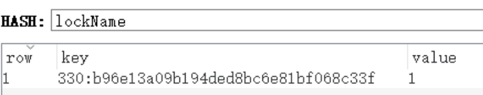
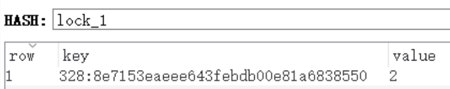

### 一、分布式锁理解及手动实现

---

#### 1.1 什么是分布式锁

分布式锁是控制分布式系统之间同步访问共享资源的一种方式。

在分布式系统中，常常需要协调他们的动作，若不同的系统或是同一个系统的不同主机之间共享了一个或一组资源，那么访问这些资源的时候，往往**需要互斥来防止彼此干扰来保证一致性**，这个时候，便需要使用到分布式锁。

#### 1.2 分布式锁应具备的条件

- 在分布式系统环境下，一段代码在同一时间只能被一个机器的一个线程执行
- 高可用的获取锁与释放锁；
- 高性能的获取锁与释放锁；
- 具备可重入特性（一个线程多次获取同一把锁）；
- 具备锁失效机制，即自动解锁，防止死锁；
- 具备非阻塞特性，即没有获取到锁将直接返回获取锁失败。

#### 1.3 SETNX 介绍

Redis实现分布式锁的核心便在于SETNX命令，它是SET if Not eXists的缩写，如果键不存在，则将键设置为给定值，在这种情况下，它等于SET；当键已存在时，不执行任何操作；成功时返回1，失败返回0。

使用示例：两次插入相同键不同值，第一次返回成功，第二次返回失败。

```bash
local:0>setnx name 'chance'
"1"
local:0>setnx name 'wcy'
"0"
```

也可使用set命令实现跟SETNX一样的效果，还能设置过期时间。

```bash
local:0>set age 20 nx ex 60
"OK"
local:0>set age 30 nx ex 60
null
local:0>get age
"20"
local:0>ttl age
"42"
```

>set命令介绍：
>
>SET key value [EX seconds] [PX milliseconds] [NX|XX]
>生存时间（TTL，以秒为单位）
>Redis 2.6.12 版本开始:(等同SETNX 、 SETEX 和 PSETEX)
>EX second ：设置键的过期时间为 second 秒，SET key value EX second 效果等同于 SETEX key second value 。
>PX millisecond ：设置键的过期时间为millisecond毫秒，SET key value PX millisecond 效果等同于 PSETEX key millisecond value 。
>NX ：只在键不存在时，才对键进行设置操作，SET key value NX 效果等同于 SETNX key value 。
>XX ：只在键已经存在时，才对键进行设置操作。


### 二、Redisson

---

Redisson是架设在Redis基础上的一个Java驻内存数据网格（In-Memory Data Grid），Redisson支持Redis多种连接方式（单机、集群、主从、哨兵等），包含分布式锁、布隆过滤器、分布式对象、分布式集合等多种工具。

#### 2.1 引入依赖

```xml
<dependency>
  <groupId>org.redisson</groupId>
  <artifactId>redisson-spring-boot-starter</artifactId>
  <version>3.16.0</version>
</dependency>
```

#### 2.2 RedissonConfig配置

```java
@Configuration
@EnableCaching
public class RedissonConfig {
  @Value("${spring.redis.host}")
  private String host;

  @Value("${spring.redis.port}")
  private String port;

  @Bean(destroyMethod = "shutdown")
  public RedissonClient redissonClient() {
    Config config = new Config();
    /*
      连接哨兵：config.useSentinelServers().setMasterName("myMaster").addSentinelAddress()
      连接集群：config.useClusterServers().addNodeAddress()
      连接主从：config.useMasterSlaveServers().setMasterAddress("xxx").addSlaveAddress("xxx")
     */

    // 连接单机
    config.useSingleServer()
      .setAddress("redis://" + this.host + ":" + this.port);
    return Redisson.create(config);
  }

}
```

#### 2.3 API

```java
@Api(tags = "Redis")
@RestController
@RequestMapping("/testRedisson")
@Slf4j
public class TestRedissonController {

  @Resource
  private RedissonClient redissonClient;

  @GetMapping("/testRedisson")
  @ApiOperation("Redisson")
  public CommonRsp testRedisson(@RequestParam Long goodsId) {
    RLock lock = redissonClient.getLock("lock_" + goodsId);
    String threadName = Thread.currentThread().getName();
    try {
      // 注意：若设置了锁的过期时间则没有看门狗机制

      // 阻塞，拿不到锁会一直尝试获取；锁的有效期默认30秒，有看门狗机制延长锁的有效期
      lock.lock();

      // 阻塞，加锁成功后设置指定的有效时间，时间到自动释放锁（无论拿到锁线程是否执行结束），前提是没有调用解锁方法；没有看门狗
      lock.lock(10, TimeUnit.SECONDS);

      // 尝试获取锁，加锁成功后启动看门狗；非阻塞，失败立马返回；注意释放锁时要判断是否存在及是否被当前线程保持
      boolean tryLock = lock.tryLock();
      if (!tryLock) {
        return CommonRsp.error("加锁失败，请稍后重试！");
      }

      // 在指定时间内尝试获取锁，失败立即返回；有看门狗
      boolean tryLock2 = lock.tryLock(5, TimeUnit.SECONDS);
      if (!tryLock2) {
        return CommonRsp.error("加锁失败，请稍后重试！");
      }

      // 指定时间内尝试获取锁，失败立即返回；成功后设置有效时间为指定值，无看门狗
      boolean tryLock1 = lock.tryLock(5, 10, TimeUnit.SECONDS);
      if (!tryLock1) {
        return CommonRsp.error("加锁失败，请稍后重试！");
      }

      // 注意：异步加锁需要调用get()方法使线程执行完成，否则会造成多个线程同时拿到锁
      RFuture<Void> voidRFuture = lock.lockAsync();
      voidRFuture.get();

      // 同lock.tryLock();
      RFuture<Boolean> booleanRFuture = lock.tryLockAsync();
      Boolean aBoolean = booleanRFuture.get();
      if (!aBoolean) {
        return CommonRsp.error("加锁失败，请稍后成重试！");
      }

      // 注意重载方法中只有一个long时，要传的是线程ID
      RFuture<Boolean> booleanRFuture1 = lock.tryLockAsync(Thread.currentThread().getId());
      Boolean aBoolean1 = booleanRFuture1.get();
      if (!aBoolean1) {
        return CommonRsp.error("加锁失败，请稍后重试！");
      }

      // 同lock.tryLock(5, TimeUnit.SECONDS)
      RFuture<Boolean> rFuture = lock.tryLockAsync(3, TimeUnit.SECONDS);
      Boolean aBoolean3 = rFuture.get();
      if (!aBoolean3) {
        return CommonRsp.error("加锁失败，请稍后重试！");
      }

      // 同lock.tryLock(5, 10, TimeUnit.SECONDS)
      RFuture<Boolean> booleanRFuture4 = lock.tryLockAsync(3, 10, TimeUnit.SECONDS);
      Boolean aBoolean4 = booleanRFuture4.get();
      if (!aBoolean4) {
        return CommonRsp.error("加锁失败，请稍后重试！");
      }

      // 原理同lock.tryLockAsync(3, 10, TimeUnit.SECONDS)，区别在于多个是线程ID的参数
      RFuture<Boolean> booleanRFuture5 = lock.tryLockAsync(3, 10, TimeUnit.SECONDS, Thread.currentThread().getId());
      Boolean aBoolean5 = booleanRFuture5.get();
      if (!aBoolean5) {
        return CommonRsp.error("加锁失败，请稍后重试！");
      }

      log.info("{}：获取到锁", threadName);
      TimeUnit.SECONDS.sleep(5);
      log.info("{}：业务执行结束", threadName);
    } catch (Exception e) {
      log.error("testRedisson exception:", e);
      return CommonRsp.error(e.getMessage());
    } finally {
      // 判断锁是否存在
      boolean locked = lock.isLocked();
      // 判断锁是否被当前线程保持
      boolean heldByCurrentThread = lock.isHeldByCurrentThread();
      log.info("{}：获取锁状态：{} 是否当前线程保留：{}", threadName, locked, heldByCurrentThread);
      if (locked && heldByCurrentThread) {
        lock.unlock();
        log.info("{}：释放锁", threadName);
      } else {
        log.info("{}：未获得锁不用释放", threadName);
      }
    }
    return CommonRsp.success();
  }

}
```

> 注意：只有在不指定锁的过期时间时，看门狗机制才会生效
>
> ```java
> if (leaseTime != -1L) {
>   this.internalLockLeaseTime = unit.toMillis(leaseTime);
> } else {
>   this.scheduleExpirationRenewal(threadId);
> }
> ```

#### 2.4 lock方法演示

使用8701、8702端口同时启动两个服务，**传入相同的参数**，快速向两个服务各调用一次。

8701服务效果：

```
2022-12-30 11:10:12.111  INFO 4796 --- [nio-8701-exec-3] c.e.l.c.testRedis.TestRedisController    : http-nio-8701-exec-3：获取到锁
2022-12-30 11:10:17.112  INFO 4796 --- [nio-8701-exec-3] c.e.l.c.testRedis.TestRedisController    : http-nio-8701-exec-3：业务执行结束
2022-12-30 11:10:17.114  INFO 4796 --- [nio-8701-exec-3] c.e.l.c.testRedis.TestRedisController    : http-nio-8701-exec-3：获取锁状态：true 是否当前线程保留：true
2022-12-30 11:10:17.115  INFO 4796 --- [nio-8701-exec-3] c.e.l.c.testRedis.TestRedisController    : http-nio-8701-exec-3：释放锁
```

8702服务效果：

```
2022-12-30 11:10:17.122  INFO 10168 --- [nio-8702-exec-6] c.e.l.c.testRedis.TestRedisController    : http-nio-8702-exec-6：获取到锁
2022-12-30 11:10:22.124  INFO 10168 --- [nio-8702-exec-6] c.e.l.c.testRedis.TestRedisController    : http-nio-8702-exec-6：业务执行结束
2022-12-30 11:10:22.126  INFO 10168 --- [nio-8702-exec-6] c.e.l.c.testRedis.TestRedisController    : http-nio-8702-exec-6：获取锁状态：true 是否当前线程保留：true
2022-12-30 11:10:22.128  INFO 10168 --- [nio-8702-exec-6] c.e.l.c.testRedis.TestRedisController    : http-nio-8702-exec-6：释放锁
```

从上述日志可看出：8701服务先拿到锁，执行完业务释放锁后8702服务才能拿到锁，达到了分布式锁想要的效果。

#### 2.5 演示看门狗机制

同样使用lock()方法，不指定过期时间（默认30秒），睡眠40s模拟执行业务，看是否自动续期。

8701服务效果：

```java
2022-12-30 14:41:25.898  INFO 13804 --- [nio-8701-exec-1] c.e.l.c.testRedis.TestRedisController    : http-nio-8701-exec-1：获取到锁
2022-12-30 14:42:05.899  INFO 13804 --- [nio-8701-exec-1] c.e.l.c.testRedis.TestRedisController    : http-nio-8701-exec-1：业务执行结束
2022-12-30 14:42:05.901  INFO 13804 --- [nio-8701-exec-1] c.e.l.c.testRedis.TestRedisController    : http-nio-8701-exec-1：获取锁状态：true 是否当前线程保留：true
2022-12-30 14:42:05.905  INFO 13804 --- [nio-8701-exec-1] c.e.l.c.testRedis.TestRedisController    : http-nio-8701-exec-1：释放锁
```

8702服务效果：

```javs
2022-12-30 14:42:05.913  INFO 14320 --- [nio-8702-exec-1] c.e.l.c.testRedis.TestRedisController    : http-nio-8702-exec-1：获取到锁
2022-12-30 14:42:45.914  INFO 14320 --- [nio-8702-exec-1] c.e.l.c.testRedis.TestRedisController    : http-nio-8702-exec-1：业务执行结束
2022-12-30 14:42:45.917  INFO 14320 --- [nio-8702-exec-1] c.e.l.c.testRedis.TestRedisController    : http-nio-8702-exec-1：获取锁状态：true 是否当前线程保留：true
2022-12-30 14:42:45.921  INFO 14320 --- [nio-8702-exec-1] c.e.l.c.testRedis.TestRedisController    : http-nio-8702-exec-1：释放锁
```

 从日志可看出每个拿到锁的线程都执行了40s，并且8702服务在8701服务执行到第30s的时候仍然没有拿到锁，说明自动续期生效。

#### 2.6 演示无看门狗情况

同样使用lock()方法，指定过期时间为5s，睡眠8s模拟执行业务，看是否自动续期

​    8701服务效果：

```java
2022-12-30 14:33:49.840  INFO 12276 --- [nio-8701-exec-1] c.e.l.c.testRedis.TestRedisController    : http-nio-8701-exec-1：获取到锁
2022-12-30 14:33:57.840  INFO 12276 --- [nio-8701-exec-1] c.e.l.c.testRedis.TestRedisController    : http-nio-8701-exec-1：业务执行结束
2022-12-30 14:33:57.846  INFO 12276 --- [nio-8701-exec-1] c.e.l.c.testRedis.TestRedisController    : http-nio-8701-exec-1：获取锁状态：true 是否当前线程保留：false
2022-12-30 14:33:57.846  INFO 12276 --- [nio-8701-exec-1] c.e.l.c.testRedis.TestRedisController    : http-nio-8701-exec-1：未获得锁不用释放
```

8702服务效果：

```java
2022-12-30 14:33:54.844  INFO 11932 --- [nio-8702-exec-5] c.e.l.c.testRedis.TestRedisController    : http-nio-8702-exec-5：获取到锁
2022-12-30 14:34:02.845  INFO 11932 --- [nio-8702-exec-5] c.e.l.c.testRedis.TestRedisController    : http-nio-8702-exec-5：业务执行结束
2022-12-30 14:34:02.848  INFO 11932 --- [nio-8702-exec-5] c.e.l.c.testRedis.TestRedisController    : http-nio-8702-exec-5：获取锁状态：false 是否当前线程保留：false
2022-12-30 14:34:02.848  INFO 11932 --- [nio-8702-exec-5] c.e.l.c.testRedis.TestRedisController    : http-nio-8702-exec-5：未获得锁不用释放
```

从日志可看出：8701服务先拿到锁执行，5s后锁自动失效被8702服务获取到锁，此时8701的业务仍未执行结束，因此可验证结论--指定过期时间时，不会自动续期。

#### 2.7 公平锁

Redisson分布式锁支持公平和非公平，上文中使用的是非公平锁。

> **公平锁遵循先到先得的原则**

```java
@GetMapping("/testFairLock")
@ApiOperation("公平锁")
public ResultVO<Object> testFairLock(@RequestParam Long goodsId) {
  RLock fairLock = redissonClient.getFairLock("fairLock_" + goodsId);
  String threadName = Thread.currentThread().getName();
  try {
    fairLock.lock();
    log.info("{}：获得锁，开始执行业务", threadName);
    TimeUnit.SECONDS.sleep(3);
    log.info("{}：执行结束", threadName);
    return ResultUtils.success();
  } catch (Exception e) {
    log.error("testFairLock exception:", e);
    return ResultUtils.sysError();
  } finally {
    boolean locked = fairLock.isLocked();
    boolean heldByCurrentThread = fairLock.isHeldByCurrentThread();
    log.info("{}：获取锁状态：{} 是否当前线程保留：{}", threadName, locked, heldByCurrentThread);
    if (locked && heldByCurrentThread) {
      fairLock.unlock();
      log.info("{}：释放锁成功", threadName);
    } else {
      log.info("{}：未获得锁不用释放", threadName);
    }
  }
}
```

#### 2.8 红锁

可以使用红锁来解决主从架构锁失效问题：就是说在主从架构系统中，线程A从master中获取到分布式锁，数据还未同步到slave中时master就挂掉了，slave成为新的master，其它线程从新的master获取锁也成功了，就会出现并发安全问题。

红锁算法：

1. 应用程序获取系统当前时间，毫秒级；
2. 应用程序使用相同的key、value值依次从多个Redis实例中获取锁，如果某一个节点超过一定时间仍然没有获取到锁则直接放弃，尽快尝试从下一个Redis节点获取锁，以避免被宕机的节点阻塞；
3. 计算获取锁的消耗时间=客户端程序当前时间-step1中的时间，获取锁的消耗时间小于总的锁定时间（例如30s）并且半数以上节点（假如有5个节点，则至少有3个节点）获取锁成功，才认为获取锁成功；
4. 计算剩余锁定时间=总的锁定时间-step3中的消耗时间；
5. 如果获取锁失败，对所有的Redis节点释放锁（无论加锁是否成功）。

```java
// 用于Redis集群架构下，这些节点是完全独立的，所以不使用复制或任何其他隐式协调系统
// 该对象可以用来将多个RLock对象关联为一个红锁，每个RLock对象实例可以来自于不同的Redisson实例
@GetMapping("/testRedLock")
@ApiOperation("红锁")
public ResultVO<Object> testRedLock(@RequestParam Long id) {
  String threadName = Thread.currentThread().getName();
  RLock one = redissonClient.getLock("one_" + id);
  RLock two = redissonClient.getLock("two_" + id);
  RLock three = redissonClient.getLock("three_" + id);
  RedissonMultiLock redLock = new RedissonRedLock(one, two, three);
  try {
    redLock.lock();
    log.info("{}：获得锁，开始执行业务", threadName);
    TimeUnit.SECONDS.sleep(2);
    log.info("{}：执行结束", threadName);
    return ResultUtils.success();
  } catch (Exception e) {
    log.error("testRedLock exception:", e);
    return ResultUtils.sysError();
  } finally {
    // 注意：不能使用isLocked()和isHeldByCurrentThread()方法，会抛出UnsupportedOperationException异常
    redLock.unlock();
    log.info("{}：释放锁成功", threadName);
  }
}
```

#### 2.9 联锁

联锁（RedissonMultiLock）对象可以将多个RLock对象关联为一个联锁，实现加锁和解锁功能。每个RLock对象实例可以来自于不同的Redisson实例。

```java
@GetMapping("/testMultLock")
@ApiOperation("联锁")
public ResultVO<Object> testMultLock(@RequestParam Long id) {
  String threadName = Thread.currentThread().getName();
  RLock one = redissonClient.getLock("one_" + id);
  RLock two = redissonClient.getLock("two_" + id);
  RLock three = redissonClient.getLock("three_" + id);
  RedissonMultiLock multiLock = new RedissonMultiLock(one, two, three);
  try {
    // 所有的锁都上锁成功才算成功
    multiLock.lock();
    log.info("{}：获得锁，开始执行业务", threadName);
    TimeUnit.SECONDS.sleep(3);
    log.info("{}：执行结束", threadName);
    return ResultUtils.success();
  } catch (Exception e) {
    log.error("testMultLock exception:", e);
    return ResultUtils.sysError();
  } finally {
    // 注意：不能使用isLocked()和isHeldByCurrentThread()方法，会抛出UnsupportedOperationException异常
    multiLock.unlock();
    log.info("{}：释放锁成功", threadName);
  }
}
```


### 三、Lua脚本实现可重入分布式锁

---

#### 3.1 数据结构

采用redis的hash数据结构，分布式锁的名称作为key、分布式锁的值作为field、重入次数作为value。



#### 3.2 Lua脚本剖析

- 加锁：
  1. 判断锁是否存在（exists），不存在则直接设置锁及过期时间。
  2. 如果锁存在则判断是否是自己的锁（hexists），是自己的则重入，hincrby key field increment，并设置锁的过期时间；否则返回0表示加锁失败。

```lua
if redis.call('exists',KEYS[1]) == 0
then
	redis.call('hset',KEYS[1],ARGV[1],1)
	redis.call('expire',KEYS[1],ARGV[2])
	return 1
elseif redis.call('hexists',KEYS[1],ARGV[1]) == 1
then
	redis.call('hincrby',KEYS[1],ARGV[1],1)
	redis.call('expire',KEYS[1],ARGV[2])
	return 1
else
	return 0
end
```

由于hincrby命令也可以实现hset命令的效果（向Redis插入值），所以可简化为如下所示：

```lua
if redis.call('exists',KEYS[1]) == 0 or redis.call('hexists',KEYS[1],ARGV[1]) == 1
then
	redis.call('hincrby',KEYS[1],ARGV[1],1)
	redis.call('expire',KEYS[1],ARGV[2])
	return 1 
else
	return 0
end
```

- 解锁
  1. 判断自己的锁是否存在（hexists），不存在则返回nil。
  2. 如果自己的锁存在，则减1（hincrby -1），判断减1后的值是否为0，为0则释放锁（del）并返回1；不为0（说明锁被重入，不删除锁），返回0。

```lua
if redis.call('hexists',KEYS[1],ARGV[1]) == 0
then
	return nil
elseif redis.call('hincrby',KEYS[1],ARGV[1],-1) == 0
then
	return redis.call('del',KEYS[1])
else
	return 0
end
```

- 重置锁的过期时间

  看门狗机制内使用，目的是为了重置锁的过期时间。判断自己的锁是否存在，存在就重置过期时间。

```lua
if redis.call('hexists',KEYS[1],ARGV[1]) == 1
then
	return redis.call('expire',KEYS[1],ARGV[2])
else
	return 0
end
```

#### 3.3 代码实现

**DistributedLock（核心实现类）**

```java
public class DistributedLock implements Lock {

  private static final Logger log = LoggerFactory.getLogger(DistributedLock.class);
  private Timer timer = new Timer();
  private StringRedisTemplate stringRedisTemplate;
  private String lockName;
  private String uuid;
  private Long expire = 30L;

  public DistributedLock(StringRedisTemplate stringRedisTemplate, String lockName, String uuid) {
    this.stringRedisTemplate = stringRedisTemplate;
    this.lockName = lockName;
    this.uuid = uuid;
  }

  @Override
  public void lock() {
    tryLock();
  }

  @Override
  public boolean tryLock() {
    try {
      return tryLock(-1L, TimeUnit.SECONDS);
    } catch (Exception e) {
      log.error("tryLock exception:", e);
    }
    return false;
  }

  // 加锁
  @Override
  public boolean tryLock(long time, TimeUnit unit) throws InterruptedException {
    if (-1L != time) {
      expire = unit.toSeconds(time);
    }
    String script = "if redis.call('exists',KEYS[1]) == 0 or redis.call('hexists',KEYS[1],ARGV[1]) == 1 " +
      "then " +
      "redis.call('hincrby',KEYS[1],ARGV[1],1) " +
      "redis.call('expire',KEYS[1],ARGV[2]) " +
      "return 1 " +
      "else " +
      "return 0 " +
      "end";
    String id = getId();
    // 加锁失败，循环尝试获取锁
    while (!stringRedisTemplate.execute(new DefaultRedisScript<>(script, Boolean.class), Arrays.asList(lockName), id, String.valueOf(expire))) {
      TimeUnit.MILLISECONDS.sleep(100);
    }
    // 有效期为默认时间时才启动看门狗线程
    if (-1L == time) {
      resetExpire(id);
      log.info("启动看门狗线程！");
    }
    return true;
  }

  // 解锁
  @Override
  public void unlock() {
    String script = "if redis.call('hexists',KEYS[1],ARGV[1]) == 0 " +
      "then " +
      "return nil " +
      "elseif redis.call('hincrby',KEYS[1],ARGV[1],-1) == 0 " +
      "then " +
      "return redis.call('del',KEYS[1]) " +
      "else " +
      "return 0 " +
      "end";
    Long execute = stringRedisTemplate.execute(new DefaultRedisScript<>(script, Long.class), Arrays.asList(lockName), getId());
    if (Objects.isNull(execute)) {
      throw new IllegalMonitorStateException("this lock doesn't belong to you");
    }
    // 停止看门狗
    timer.cancel();
    log.info("释放锁成功，停止看门狗线程！");
  }

  // 拼接线程ID和UUID组成唯一标识
  public String getId() {
    return Thread.currentThread().getId() + ":" + uuid;
  }

  // 重置过期时间（延迟delay毫秒后开始执行任务，之后每间隔period毫秒执行一次任务）
  private void resetExpire(String id) {
    String script = "if redis.call('hexists',KEYS[1],ARGV[1]) == 1 " +
      "then " +
      "return redis.call('expire',KEYS[1],ARGV[2]) " +
      "else " +
      "return 0 " +
      "end";
    long time = expire * 1000 / 3;
    timer.schedule(new TimerTask() {
      @Override
      public void run() {
        Boolean result = stringRedisTemplate.execute(new DefaultRedisScript<>(script, Boolean.class), Arrays.asList(lockName), id, String.valueOf(expire));
        log.info("重置过期时间结果：{}", result);
      }
    }, time, time);
  }

  @Override
  public void lockInterruptibly() throws InterruptedException {

  }

  @Override
  public Condition newCondition() {
    return null;
  }

}
```

**DistributedLockFactory（工厂类）**

```java
@Component
public class DistributedLockFactory {

  @Resource
  private StringRedisTemplate stringRedisTemplate;

  private String uuid;

  public DistributedLockFactory() {
    this.uuid = UUID.randomUUID().toString().replaceAll("-", "").toString();
  }

  public DistributedLock getRedisLock(String lockName) {
    return new DistributedLock(stringRedisTemplate, lockName, uuid);
  }
}
```

**TestDistributedLockController（控制层）**

```java
@Slf4j
@RequestMapping("/testDistributedLockController")
@Api(tags = "可重入分布式锁")
@RestController
public class TestDistributedLockController {

  private static final String STOCK = "stock";
  @Resource
  private StringRedisTemplate stringRedisTemplate;
  @Resource
  private DistributedLockFactory factory;

  private void deduct() {
    // 查询库存（偷个懒，库存需手动插入）
    String cache = stringRedisTemplate.opsForValue().get(STOCK);
    if (StringUtils.isNotBlank(cache)) {
      Integer stock = Integer.valueOf(cache);
      if (stock > 0) {
        // 减库存
        stringRedisTemplate.opsForValue().set(STOCK, String.valueOf(--stock));
        log.info("扣减库存成功！");
      }
    }
  }

  @GetMapping("/test")
  @ApiOperation("测试（不重入）")
  public CommonRsp test(@RequestParam String lockName) {
    DistributedLock redisLock = factory.getRedisLock(lockName);
    redisLock.lock();
    try {
      TimeUnit.SECONDS.sleep(40);
      deduct();
    } catch (Exception e) {
      log.error("test exception:", e);
      return CommonRsp.error("失败！");
    } finally {
      redisLock.unlock();
    }
    return CommonRsp.success();
  }

  @GetMapping("/testReentrant")
  @ApiOperation("测试（重入）")
  public CommonRsp testReentrant(@RequestParam String lockName) {
    DistributedLock redisLock = factory.getRedisLock(lockName);
    redisLock.lock();
    try {
      reentrant(lockName);
      deduct();
    } catch (Exception e) {
      log.error("testReentrant exception:", e);
      return CommonRsp.error("失败！");
    } finally {
      redisLock.unlock();
    }
    return CommonRsp.success();
  }

  private void reentrant(String lockName) {
    DistributedLock redisLock = factory.getRedisLock(lockName);
    redisLock.lock();
    try {
      log.info("重入成功了！");
    } catch (Exception e) {
      log.error("reentrant exception:", e);
    } finally {
      redisLock.unlock();
    }
  }

}
```

#### 3.4 常规使用演示

使用8701、8702端口同时启动两个服务，传入相同的参数，睡眠6秒模拟执行业务逻辑，快速向两个服务各调用一次。

8701服务结果：

```
2023-01-09 15:28:05.627  INFO 14440 --- [nio-8701-exec-3] c.e.l.c.t.d.DistributedLock              : 启动看门狗线程！
2023-01-09 15:28:05.627  INFO 14440 --- [nio-8701-exec-3] .e.l.c.t.d.TestDistributedLockController : http-nio-8701-exec-3：加锁成功
2023-01-09 15:28:11.634  INFO 14440 --- [nio-8701-exec-3] .e.l.c.t.d.TestDistributedLockController : 扣减库存成功！
2023-01-09 15:28:11.636  INFO 14440 --- [nio-8701-exec-3] c.e.l.c.t.d.DistributedLock              : 释放锁成功，停止看门狗线程！
```

8702服务效果：

```
2023-01-09 15:28:11.695  INFO 15732 --- [nio-8702-exec-1] c.e.l.c.t.d.DistributedLock              : 启动看门狗线程！
2023-01-09 15:28:11.696  INFO 15732 --- [nio-8702-exec-1] .e.l.c.t.d.TestDistributedLockController : http-nio-8702-exec-1：加锁成功
2023-01-09 15:28:17.703  INFO 15732 --- [nio-8702-exec-1] .e.l.c.t.d.TestDistributedLockController : 扣减库存成功！
2023-01-09 15:28:17.704  INFO 15732 --- [nio-8702-exec-1] c.e.l.c.t.d.DistributedLock              : 释放锁成功，停止看门狗线程！
```

从上述日志可看出：8701服务先拿到锁，执行完业务释放锁后8702服务才能拿到锁，达到了分布式锁想要的效果。

#### 3.5 重入演示

在一次请求中加锁、解锁各两次，在第二次加锁后打断点看看缓存中的值是多少。

缓存中的值：



可以看到value（重入次数）变成2，代表锁被重入，跟预期一致。

看看打印的日志：

```
2023-01-09 15:46:12.129  INFO 14320 --- [nio-8701-exec-1] c.e.l.c.t.d.DistributedLock              : 启动看门狗线程！
2023-01-09 15:46:12.129  INFO 14320 --- [nio-8701-exec-1] .e.l.c.t.d.TestDistributedLockController : http-nio-8701-exec-1：加锁成功
2023-01-09 15:46:12.131  INFO 14320 --- [nio-8701-exec-1] c.e.l.c.t.d.DistributedLock              : 启动看门狗线程！
2023-01-09 15:46:12.131  INFO 14320 --- [nio-8701-exec-1] .e.l.c.t.d.TestDistributedLockController : http-nio-8701-exec-1：加锁成功
2023-01-09 15:46:12.131  INFO 14320 --- [nio-8701-exec-1] .e.l.c.t.d.TestDistributedLockController : 重入成功了！
2023-01-09 15:46:12.133  INFO 14320 --- [nio-8701-exec-1] c.e.l.c.t.d.DistributedLock              : 释放锁成功，停止看门狗线程！
2023-01-09 15:46:12.141  INFO 14320 --- [nio-8701-exec-1] .e.l.c.t.d.TestDistributedLockController : 扣减库存成功！
2023-01-09 15:46:12.143  INFO 14320 --- [nio-8701-exec-1] c.e.l.c.t.d.DistributedLock              : 释放锁成功，停止看门狗线程！
```

从日志可看出：加锁、解锁、看门狗启动/停止都进行了两次，跟预期一致

#### 3.6 看门狗机制演示

把睡眠时间改为40s，观察看门狗是否生效

```
2023-01-09 15:56:29.969  INFO 12180 --- [nio-8701-exec-4] c.e.l.c.t.d.DistributedLock              : 启动看门狗线程！
2023-01-09 15:56:29.969  INFO 12180 --- [nio-8701-exec-4] .e.l.c.t.d.TestDistributedLockController : http-nio-8701-exec-4：加锁成功
2023-01-09 15:56:39.971  INFO 12180 --- [        Timer-0] c.e.l.c.t.d.DistributedLock              : 重置过期时间结果：true
2023-01-09 15:56:49.972  INFO 12180 --- [        Timer-0] c.e.l.c.t.d.DistributedLock              : 重置过期时间结果：true
2023-01-09 15:56:59.973  INFO 12180 --- [        Timer-0] c.e.l.c.t.d.DistributedLock              : 重置过期时间结果：true
2023-01-09 15:57:09.973  INFO 12180 --- [        Timer-0] c.e.l.c.t.d.DistributedLock              : 重置过期时间结果：true
2023-01-09 15:57:09.976  INFO 12180 --- [nio-8701-exec-4] .e.l.c.t.d.TestDistributedLockController : 扣减库存成功！
2023-01-09 15:57:09.977  INFO 12180 --- [nio-8701-exec-4] c.e.l.c.t.d.DistributedLock              : 释放锁成功，停止看门狗线程！
```

从上述日志可看出在执行业务逻辑期间看门狗线程不断的延长锁的过期时间，使得业务完整执行，在此期间锁没有失效或被其它线程获得，说明看门狗是发挥出作用啦，跟预期一致。
