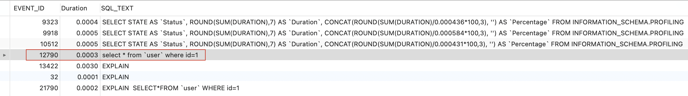

### 一、Performance Schema特点

---

- 提供监测服务器在运行时执行情况服务。通过PERFORMANCE_SCHEMA存储引擎和performance_schema数据库实现监控功能。**Performance Schema主要关注数据性能**，而INFORMATION_SCHEMA主要关注元数据。
- 监控服务器事件。“事件”即服务器需要耗时完成并且可以采集到时间的任何事件。通常，事件可以是函数调用、操作系统等待、SQL描述执行阶段（如解析、排序或者完整的SQL描述、一组SQL描述）。事件采集为服务器以及多个存储引擎提供对同步调用（如互斥）文件或表I/O，表锁等信息的访问。
- Performance Schema事件不同于写入服务器的binary日志事件（日志事件描述数据变更）和事件调度器事件（调度器事件是程序存储类型）。
- Performance Schema事件指向确定的MySQL服务器。Performance Schema表被当做服务器本地表，这些表的变更不会复制或写入binary日志。
- 当前事件是可得到的，如历史记录和统计事件。这可以开发人员决定采集数据次数以及采集数据的时长。事件信息可用于展示线程活跃数或者关联的活跃对象。
- PERFORMANCE_SCHEMA存储引擎通过服务器源码中的“instrumentation points”采集事件数据。
- 采集的事件数据存储在performance_schema数据库中，数据查询与普通的表查询一样，通过SELECT。
- Performance Schema动态配置可以直接更新对应的表，如上所述，可直接使用UPDATE更新，即时生效。
- Performance Schema中的表是**不使用持久化磁盘存储的内存表**。表内容在服务启动时填充，服务关闭时清除。
- MySQL支持的所有平台均可查看监控。
- 数据采集通过修改服务器源码添加采集器。Performance Schema与数据复制或时间调度等不同的地方是没有单独的线程。


### 二、设计规则

---

Performance Schema为提供访问服务器执行信息而设计，同时消耗最少的服务器资源，具体设计原则如下：

- 激活Performance Schema不会改变任何服务器功能，如，不会改变定时线程，不会改变执行计划。
- 除了服务器启动期间产生内存分配外，其他时间不进行内存分配。早期通过固定内存尺寸分配架构，不需要对内存扩缩容或重新分配，这对于实现运行时高性能是至关重要的。
- 服务器监控开销小，持续且无感知地进行。激活Performance Schema不影响服务可用性。
  不改变解析器。不产生新的关键字或者描述。
- Performance Schema即使出现异常也不能影响服务器代码的正常运行。
- 在最初事件采集或后面进行的事件检索之间选择处理时，优先考虑加快采集速度，因为，采集一直存在，然而，检索是按需进行，也可能不需要。
- 方便添加采集点。
- 采集器版本化（兼容性）。如果采集器更新，之前的代码应该继续正常运作。这有利于第三方开发者，因为不需要与Performance Schema最新版始终保持一致。


### 三、配置

---

#### 3.1 查看MySQL版本

```sql
SHOW VARIABLES LIKE "%version%";
```

#### 3.2 配置profiling

1. 查看profiling状态

   ```sql
   SHOW VARIABLES LIKE "%prof%";
   
   +------------------------+-------+
   | Variable_name          | Value |
   +------------------------+-------+
   | have_profiling         | YES   |
   | profiling              | OFF   |
   | profiling_history_size | 15    |
   +------------------------+-------+
   ```

   profiling为OFF，此时无法查看SQL执行时间。

2. 开启profiling支持

   ```sql
   set profiling=1;
   ```

   profile未来将被删除，使用Performance Schema替。

#### 3.3 Performance Schema

1. 查看performance schema状态

   ```sql
   SHOW VARIABLES LIKE 'performance_schema';
   ```

   performance_schema默认开启。

2. wait配置

   ```sql
   -- 开启等待事件采集器
   UPDATE performance_schema.setup_instruments SET ENABLED='YES', TIMED='YES' WHERE NAME LIKE 'wait%';
   ```

   ```sql
   -- 开启等待事件消费者
   UPDATE performance_schema.setup_consumers SET ENABLED='YES' WHERE NAME LIKE '%wait%';
   ```

3. 采集器描述

   ```sql
   -- 开启采集器描述
   UPDATE PERFORMANCE_SCHEMA.setup_instruments 
   SET ENABLED = 'YES',
   TIMED = 'YES' 
   WHERE
   	NAME LIKE '%statement/%';
   ```

4. 采集器阶段

   ```sql
   -- 开启采集器阶段
   UPDATE PERFORMANCE_SCHEMA.setup_instruments 
   SET ENABLED = 'YES',
   TIMED = 'YES' 
   WHERE
   	NAME LIKE '%stage/%';
   ```

5. 消费者事件描述

   ```sql
   -- 开启消费者事件状态
   UPDATE PERFORMANCE_SCHEMA.setup_consumers 
   SET ENABLED = 'YES' 
   WHERE
   	NAME LIKE '%events_statements_%';
   ```

6. 消费者事件阶段

   ```sql
   -- 开启消费者事件阶段
   UPDATE PERFORMANCE_SCHEMA.setup_consumers 
   SET ENABLED = 'YES' 
   WHERE
   	NAME LIKE '%events_stages_%';
   ```


### 四、实战

---

#### 4.1 查询

```sql
-- 查询测试
SELECT * FROM test.user where id = 1;
```

#### 4.2 获取SQL事件ID

执行一条SQL后，Performance Schema会生成该条SQL的事件，通过事件ID可以查询该条SQL的相关执行信息，查询该SQL的事件语句如下：

```sql
-- 查看sql对应的event_id
SELECT EVENT_ID,
TRUNCATE (TIMER_WAIT/1000000000000,6) AS Duration,SQL_TEXT FROM PERFORMANCE_SCHEMA.events_statements_history_long WHERE SQL_TEXT LIKE '%id=1%';
```

将时间TIMER_WAIT处理为秒，保留6位有效数字，Performance Schema中时间单位为皮秒，`1秒=10^12皮秒`，因此，TIMER_WAIT除以10^12。

查询SQL的结果如下，事件ID：EVENT_ID为12790，可根据该事件ID查询SQL执行信息，该SQL总耗时为0.0003秒。



#### 4.3 查询SQL各阶段耗时

上面获取SQL执行的事件ID为12790。

```sql
-- 根据event_id查询各阶段耗时
SELECT event_name AS Stage,
TRUNCATE (TIMER_WAIT/1000000000000,6) AS Duration FROM PERFORMANCE_SCHEMA.events_stages_history_long WHERE NESTING_EVENT_ID=12790;
```

stage/sql/starting	0.0001
stage/sql/Executing hook on transaction begin.	0.0000
stage/sql/starting	0.0000	启动
stage/sql/checking permissions	0.0000	检查权限
stage/sql/Opening tables	0.0000	打开表
stage/sql/init	0.0000	初始化
stage/sql/System lock	0.0000	系统锁
stage/sql/optimizing	0.0000	优化耗时
stage/sql/statistics	0.0000	统计
stage/sql/preparing	0.0000	准备耗时
stage/sql/executing	0.0000	执行耗时
stage/sql/end	0.0000	发送结束
stage/sql/query end	0.0000	查询结束
stage/sql/waiting for handler commit	0.0000	
stage/sql/closing tables	0.0000	关闭表
stage/sql/freeing items	0.0000	释放items
stage/sql/cleaning up	0.0000	清理