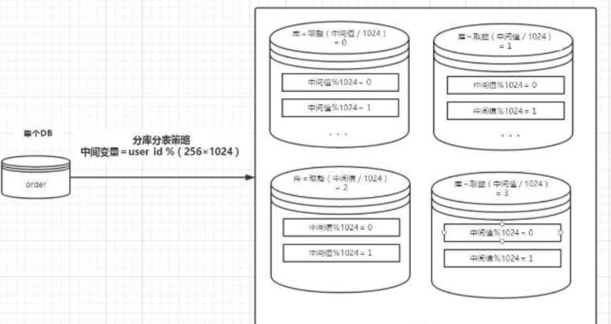

### 一、单表不能超过500万？

---

曾经在互联网技术圈广为流传着这么一个说法：MySQL 单表数据量大于 2000 万行，性能会明显下降。事实上，这个传闻据说最早起源于百度。具体情况大概是这样的，当年的 DBA 测试 MySQL性能时发现，当单表的量在 2000 万行量级的时候，SQL 操作的性能急剧下降，因此，结论由此而来。然后又据说百度的工程师流动到业界的其它公司，也带去了这个信息，所以，就在业界流传开这么一个说法。

再后来，阿里巴巴《Java 开发手册》提出单表行数超过 500 万行或者单表容量超过 2GB，才推荐进行分库分表。对此，有阿里的黄金铁律支撑，所以，很多人设计大数据存储时，多会以此为标准，进行分表操作。

那么，你觉得这个数值多少才合适呢？为什么不是 300 万行，或者是 800 万行，而是 500 万行？也许你会说这个可能就是阿里的最佳实战的数值吧？那么，问题又来了，这个数值是如何评估出来的呢？

事实上，这个数值和实际记录的条数无关，而与 MySQL 的配置以及机器的硬件有关。因为，MySQL 为了提高性能，会将表的索引装载到内存中。InnoDB buffer size 足够的情况下，其能完成全加载进内存，查询不会有问题。但是，**当单表数据库到达某个量级的上限时，导致内存无法存储其索引，使得之后的 SQL 查询会产生磁盘 IO，从而导致性能下降**。当然，这个还有具体的表结构的设计有关，最终导致的问题都是**内存限制**。这里，增加硬件配置，可能会带来立竿见影的性能提升哈。

### 二、分库分表

---

**在项目一开始不采用分库与分表设计，而是随着业务的增长，在无法继续优化的情况下，再考虑分库与分表提高系统的性能。**对此，阿里巴巴《Java 开发手册》补充到：如果预计三年后的数据量根本达不到这个级别，请不要在创建表时就分库分表。

那么，回到一开始的问题，你觉得这个数值多少才合适呢？我的建议是，根据自身的机器的情况综合评估，如果心里没有标准，那么暂时以 500 万行作为一个统一的标准，相对而言算是一个比较折中的数值。