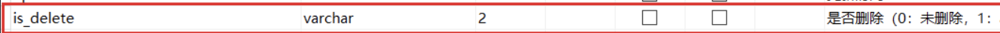

### 一、背景介绍

---

mysql库中有张表的查询速度特别慢，只有几万条数据。推测使用由于数据类型与表字段类型不一致导致需要进行类型转换和索引失效导致查询速度慢的问题。


### 二、思路

---

- 数值型（整数类型、浮点数类型）
- 字符型
- 日期和时间类型
- 二进制类型

#### 2.1 数值类型

| 类型                | 说明               | 大小<br />（bytes） | 存储范围                                                     | 存储范围（带符号）                                           |
| ------------------- | ------------------ | ------------------- | ------------------------------------------------------------ | ------------------------------------------------------------ |
| TINYINT             | 很小的整数         | 1                   | 0 〜255                                                      | -128〜127                                                    |
| SMALLINT            | 小的整数           | 2                   | 0〜65535                                                     | -32768〜32767                                                |
| MEDIUMINT           | 中等大小的整数     | 3                   | 0〜16777215                                                  | -8388608〜8388607                                            |
| INT (INTEGHR)       | 普通大小的整数     | 4                   | 0〜4294967295                                                | -2147483648〜2147483647                                      |
| BIGINT              | 大整数             | 8                   | 0〜18446744073709551615                                      | -9223372036854775808〜9223372036854775807                    |
| FLOAT               | 单精度浮点数       | 4                   | 0 和 1.175494351E-38～3.402823466E+38                        | -3.402823466E+38～1.175494351E-38                            |
| DOUBLE              | 双精度浮点数       | 8                   | 0，(2.225 073 858 507 201 4 E-308，1.797 693 134 862 315 7 E+308) | (-1.797 693 134 862 315 7 E+308，-2.225 073 858 507 201 4 E-308)，0，(2.225 073 858 507 201 4 E-308，1.797 693 134 862 315 7 E+308) |
| DECIMAL (M, D)，DEC | 压缩的“严格”定点数 | M+2                 |                                                              |                                                              |

> DECIMAL 的存储空间并不是固定的，而由精度值 M 决定，占用 M+2 个字节。
>
> 注意： 在 MySQL 中，定点数以字符串形式存储，在对精度要求比较高的时候（如货币、科学数据），使用 DECIMAL 的类型比较好，另外两个浮点数进行减法和比较运算时也容易出问题，所以在使用浮点数时需要注意，并**尽量避免做浮点数比较**。

#### 2.2 日期和时间类型

| 类型      | 说明                     | 大小（bytes） |
| --------- | ------------------------ | ------------- |
| YEAR      | 年份值                   | 1             |
| TIME      | 时间值或持续时间         | 3             |
| DATE      | 日期值                   | 3             |
| DATETIME  | 混合日期和时间值         | 8             |
| TIMESTAMP | 混合日期和时间值，时间戳 | 4             |

#### 2.3 字符串类型

| 类型       | 说明                                        | 大小（bytes）                                          |
| ---------- | ------------------------------------------- | ------------------------------------------------------ |
| CHAR(M)    | 固定长度非二进制字符串                      | M，1<=M<=256                                           |
| VARCHAR(M) | 变长非二进制字符串                          | L+1，在此，L< = M和 1<=M<=255                          |
| TINYTEXT   | 非常小的非二进制字符串                      | L+1，在此，L<2^8                                       |
| TEXT       | 小的非二进制字符串                          | L+2，在此，L<2^16                                      |
| MEDIUMTEXT | 中等大小的非二进制字符串                    | L+3，在此，L<2^24                                      |
| LONGTEXT   | 大的非二进制字符串                          | L+4，在此，L<2^32                                      |
| ENUM       | 枚举类型，只能有一个枚举字符串值            | 1或2个，取决于枚举值的数目 (最大值为65535)             |
| SET        | 一个设置，字符串对象可以有零个或多个SET成员 | 1、2、3、4或8个，取决于集合 成员的数量（最多64个成员） |

注意：VARCHAR 和 TEXT 类型是变长类型，其存储需求取决于列值的实际长度（在前面的表格中用 L 表示），而不是取决于类型的最大可能尺寸。

例如，一个 VARCHAR(10) 列能保存一个最大长度为 10 个字符的字符串，实际的存储需要字符串的长度 L 加上一个字节以记录字符串的长度。对于字符 “abcd”，L 是 4，而存储要求 5 个字节。

#### 2.4 二进制类型

| 类型           | 说明                 | 大小（bytes）     |
| -------------- | -------------------- | ----------------- |
| BIT(M)         | 位字段类型           | 大约 (M+7)/8      |
| BINARY(M)      | 固定长度二进制字符串 | M                 |
| VARBINARY (M)  | 可变长度二进制字符串 | M+1               |
| TINYBLOB (M)   | 非常小的BLOB         | 8                 |
| BLOB (M)       | 小 BLOB              | L+2，在此，L<2^16 |
| MEDIUMBLOB (M) | 中等大小的BLOB       | L+3，在此，L<2^24 |
| LONGBLOB (M)   | 非常大的BLOB         | L+4，在此，L<2^32 |


### 三、问题复现

---



为is_delete字段创建索引。

使用**数值类型**查询：

```sql
EXPLAIN
SELECT * FROM test 
WHERE
is_delete	=0
```

索引失效，会发现type类型变成了all全表查询。

使用**字符串类型**查询：

```sql
EXPLAIN
SELECT * FROM test 
WHERE
is_delete	='0'
```

索引生效，type类型为ref。


### 四、结论

---

**在进行数值类型转换时，会使我们的索引失效**。补充：**mysql在遇到字符串和数字比较的时候，会默认将字符串转换为数值类型进行处理**，所以如果is_delete类型为数值类型，那么如果sql给它的数据类型为字符串类型，那么索引是不会失效的。

在进行实体设计，包括给sql语句赋值的时候。最好是与数据库的数据类型保持以及，避免由于数据类型不一致的原因出现索引失效的情况。


### 五、索引失效情况

---

#### 5.1 索引列上有计算

```sql
EXPLAIN
SELECT * FROM test 
WHERE
is_delete+1=1
```

#### 5.2 对索引使用函数

```sql
EXPLAIN
SELECT * FROM test 
WHERE
SUM(is_delete)=1
```

#### 5.3 对索引隐式类型转换

1. 如果索引字段是字符型，但是条件查询时，传入的是整型的话，会出现索引失效问题。
2. 如果索引是整型，但是条件查询的时候，传入的是字符型，不会出现索引失效问题。

mysq在遇到字符串和数字比较的时候，会默认将字符串转换为数值类型进行处理，所以如果is_delete类型为数值类型，那么如果sql赋值给它的数据类型为字符串类型，那么索引是不会失效的。