在线性表中，数据元素之间仅有线性关系，每个数据元素只有一个直接前趋和直接后继；在树型结构中，数据元素之间有着明显的层次关系，并且每一层中的数据元素可能和下一层的多个元素相关，但只能和上一层的一个元素相关。而在图结构中，结点之间的关系可以是任意的，图中任意两个数据元素之间都可能相关。

### 一、定义和基本术语

---

#### 1.1 定义

图（graph）G由两个集合V和E组成，其中V是顶点（vertex）的**有穷非空集合**，E是图中边的**有穷集合**。E(G)可以为空，但为空时G只有顶点而没有边。

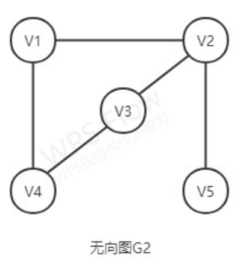

可以看到上述图中的边并没有方向，所以我们把这类图叫做无向图，而(x,y)表示从顶点x到顶点y的一条边，例如上图中的(v1,v2)，就表示一条边。同样，由于它的边没有方向，因此(v2,v1)与(v1,v2)是一样的。

下图就是一个有向图的例子。

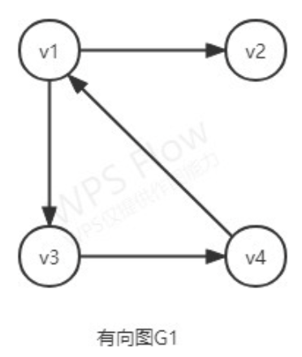

为了跟无向图区别，有向图中一条边（有向图中的边也叫弧）由<x,y>来表示，其中，x是有向边的始点（弧尾），y是有向边的终点（弧头）。

#### 1.2 基本术语

1. **子图**：设有两个图G＝(V,E)和G‘＝(V’,E‘)。若V’V且E‘ÍE,则称图G’是图G的子图。

   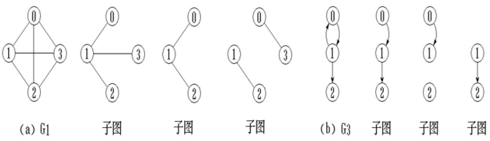

2. **无向完全图和有向完全图**：若有n个顶点的无向图有`n(n-1)/2`条边，则为完全无向图。有n个顶点的有向图有`n(n-1)`条边，则为完全有向图。

   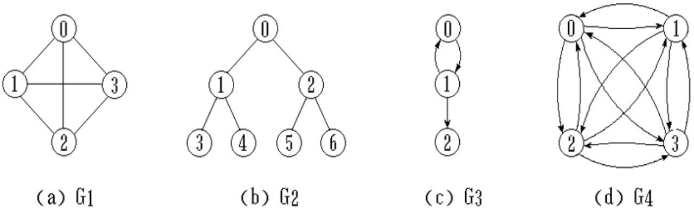

3. **稀疏图和稠密图**：有很少条边或弧(e < nlog~2~n)的图称为稀疏图，反之称为稠密图。

4. **权和网**：在实际应用中，每条边可以标上具有某种含义的数值，该数值称为该边上的权。这种带权的图通常称为一个网。

   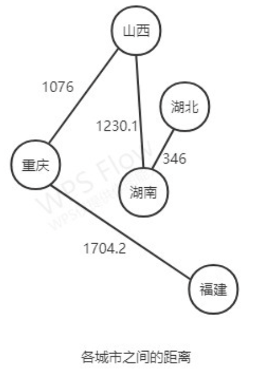

5. **邻接点**：对于无向图，能够组成一条边的两个结点互为邻接点。

6. **度、入度、出度**：无向图顶点的边数叫做度。有向图顶点分为入度和出度。

7. **路径**和**路径长度**：在无向图中，路径就是从一个顶点出发，经过其相关联的边到达另一顶点的过程。在有向图中，路径也就有方向了。路径长度就是一条路径上经过的边或弧的数目。

8. **回路或环**：第一个顶点和最后一个顶点相同的路径称为回路或环。

9. **简单路径、简单回路、简单环**：序列中顶点不重复出现的路径称为简单路径。除了第一个顶点和最后一个顶点之外，其余顶点不重复出现的回路称为简单回路或简单环。

10. **连通、连通图、连通分量**：在无向图中，如果两个顶点之间有路径，则称这两个顶点是连通的。如果对于图中任意两个顶点都有路径，即任意两个路径都连通，则称G为连通图。所谓连通分量，指的是无向图中的**极大连通子图**（注意理解“极大”）。例如下图：

    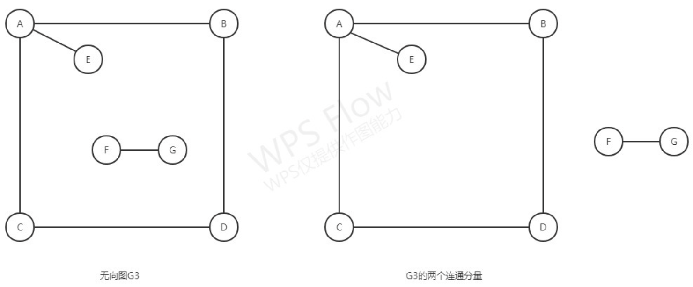

11. **强连通图和强连通分量**：在有向图中，若任意两个顶点间都有路径，则称G是强连通图。有向图中的极大强连通子图称作强连通分量。

12. **连通图的生成树**：一个极小连通子图，它含有图中全部顶点，但只有n-1条边，这样的连通子图称为连通图的生成树。一棵有n个顶点的生成树有且仅有n-1条边。如果一个图有n个顶点和小于n-1条边，则是非连通图。如果它多于n-1条边，则一定有环。但是，有n-1条边的图不一定是生成树。

13. **有向树和生成森林**：有一个顶点的入度为0，其余顶点的入度均为1的有向图称为有向树。一个有向图的生成森林是由若干棵有向树组成，含有图中全部顶点，但只有足以构成若干棵不相交的有向树的弧。例如

    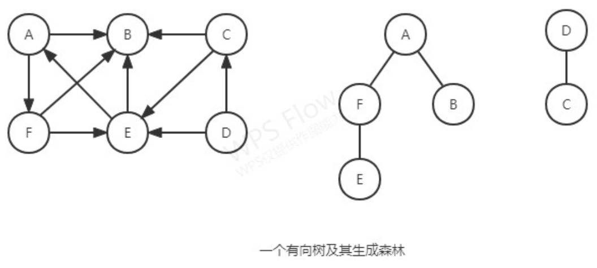


### 二、存储结构

---

由于图的结构比较复杂，任意两个顶点之间都可能存在联系，因此无法以数据元素在存储区中的物理位置来表示元素之间的关系，即图没有顺序存储结构。

但图是一个平面的结构，也就是说可以把图放在一个直角坐标系中，仅用两个坐标就可以表示其顶点。由此，我们可以发现二维数组也相当于是有两个“坐标”，而与二维数组相关联的也就是矩阵了。所以我们可以借助二维数组来表示元素之间的关系，称为邻接矩阵法。

#### 2.1 邻接矩阵（无向图和有向图）

**邻接矩阵表示法：**

假设有一个数组A [ i ] [ j ] A[i][j]A[i][j]，i ii和j jj分别表示图中两个顶点的位置，若i ii和j jj之间存在边（有向图中的边带方向），则A [ i ] [ j ] = 1 A[i][j]=1A[i][j]=1，否则A [ i ] [ j ] = 0 A[i][j]=0A[i][j]=0。
上图中G1和G2的邻接矩阵如下图所示。

  

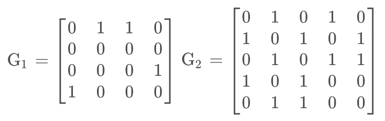

若G是网，则邻接矩阵可以定义为

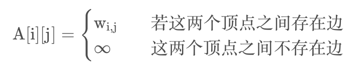

对于邻接矩阵表示法，**这里的二维数组是用来表示两个顶点间的关系的**。而对于单个的顶点，需要分别存储它们的信息。可以再用一个一维数组来存储顶点的信息。其具体存储表示如下：

```
#define MaxInt 32767			//表示极大值
#define MVNum 100				//表示最大顶点数
typedef char VerTexType;		//假设顶点的数据类型为字符型
typedef int ArcType;			//假设权的边值为整形
typedef struct
{
	VerTexType vexs[MVNum];
	ArcType arcs[MVNum][MVNum];
	int vexnum,arcnum;			//图的当前顶点数和边数
}AMGraph;
```

**采用邻接矩阵表示法创建无向网：**

1. 首先我们要知道该无向图有多少个顶点和边，以便后面我们建立相应的数组。
2. 知道了它们的个数后，我们就可以开始建立一维数组来存储顶点的信息，然后构造二维数组并初始化。
3. 初始化后，我们要考虑的就是如何**确定**两顶点构成的边在邻接矩阵中的**位置**并将边值输入到邻接矩阵中。

- 由二维数组可知，一条边的位置由i 和j 确定，i 和j 也就是两顶点在一维数组中的下标
- 由此，我们可以创建一个函数来求两顶点的下标

```java
public class Graph {
  /**
   * 节点数量
   */
  private int V;

  /**
   * 邻接矩阵
   */
  private int[][] adjacencyMatrix;

  public Graph(int V) {
    this.V = V;
    adjacencyMatrix = new int[V][V];
  }

  public void addEdge(int v, int w, int weight) {
    adjacencyMatrix[v][w] = weight;
    // 无向图的邻接矩阵是对称的
    adjacencyMatrix[w][v] = weight;
  }

  public int getWeight(int v, int w) {
    return adjacencyMatrix[v][w];
  }
}
```

使用二维数组`adjacencyMatrix`来表示无向图的邻接矩阵。`addEdge`方法用于添加边，`getWeight`方法用于获取两个节点之间的权重（如果有边相连）。

```java
public static void main(String[] args) {
  int V = 5; // 节点数量
  Graph graph = new Graph(V);

  graph.addEdge(0, 1, 2);
  graph.addEdge(0, 2, 3);
  graph.addEdge(1, 3, 1);
  graph.addEdge(2, 4, 4);

  for (int i = 0; i < V; i++) {
    for (int j = 0; j < V; j++) {
      System.out.print(graph.getWeight(i, j) + " ");
    }
    System.out.println();
  }
}
```


#### 2.2 邻接表

**邻接表表示法：**

邻接表（Adjacency List）是图的一种链式存储结构。所谓邻接表，就是每个顶点后面链接与该顶点邻接的结点（该顶点和链接的每个结点都可以构成一条边），然后又将每个顶点整合在一起，组成一个结构体数组。我们将该结构体称为顶点结点表，把链接的邻接结点称为边结点。

1. 顶点结点表
   所有顶点以顺序结构的形式存储。该结点包括数据域（data） 和链域（firstarc） 两部分。数据域用于存储顶点 v~i~ 的名称或其它有关信息；链域用于指向链表中第一个结点（与该顶点邻接的第一个邻接点）。

2. 边结点表
   边结点包括邻接点域（adjvex）、数据域（data） 和链域（nexarc） 三部分。其中，邻接点域致使与顶点邻接的点在图中的位置（相当于顶点结点表中顺序存储的下标）；数据域存储和边相关的信息（没有时可以不用）；链域致使与顶点邻接的下一条边的结点。

两表中的链域都是指示邻接点。

下面为G1、G2 的邻接表

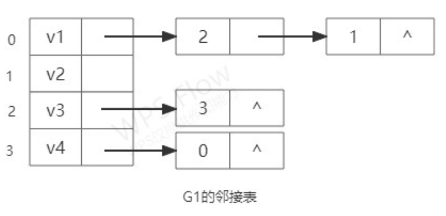

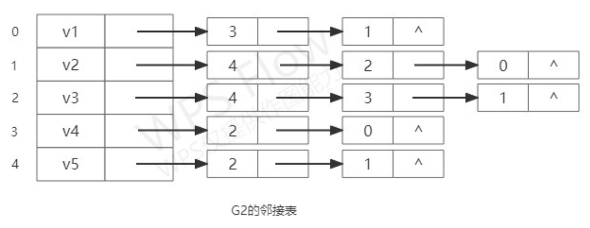

**采用邻接表表示法创建无向图：**

算法分析：

1. 首先我们还是要先确定该图有几个顶点和边，即先输入最大顶点数和最大边数
2. 然后我们将顶点结点表初始化，输入每个顶点的信息（即值域data），并将其每个指针初始化为NULL。
3. 初始化工作完成后，一般来说，我们是先选取一个顶点 v~i~ 及其邻接点 v~j~ ，然后找到该顶点及其邻接点在图中的位置（即顶点结点表中的顶点下标）
4. 找到位置后，由于顶点和其邻接点属于不同的结点，而在前面我们并没有对边结点做相应的操作，所以在这里我们应创建一个新的边结点p1，使adjvex的值为该顶点在图中的位置，然后使 v~i~ 的链域指向p1。_
5. 又因为我们创建的是无向表，所以我们也要在图中找到 v~j~ 的位置，然后生成另一个新的边结点p2，使adjvex的值为该邻接点在图中的位置，并使 v~j~ 指向p2。
6. 对于多个邻接点，我们采用的是前插法

```java
public class Graph {

  /**
   * 节点数量
   */
  private int V;

  /**
   * 邻接表
   */
  private List<List<Integer>> adjacencyList;

  public Graph(int V) {
    this.V = V;
    adjacencyList = new ArrayList<>(V);
    for (int i = 0; i < V; i++) {
      adjacencyList.add(new LinkedList<>());
    }
  }

  public void addEdge(int v, int w) {
    adjacencyList.get(v).add(w);
    adjacencyList.get(w).add(v);
  }

  public List<Integer> getNeighbors(int v) {
    return adjacencyList.get(v);
  }
}
```

`addEdge`方法用于添加边，而`getNeighbors`方法用于获取一个节点的所有邻居节点。

```java
public static void main(String[] args) {
  // 节点数量
  int V = 5;
  Graph graph = new Graph(V);

  graph.addEdge(0, 1);
  graph.addEdge(0, 2);
  graph.addEdge(1, 3);
  graph.addEdge(2, 4);

  for (int i = 0; i < V; i++) {
    System.out.print("Node " + i + " is connected to: ");
    List<Integer> neighbors = graph.getNeighbors(i);
    for (Integer neighbor : neighbors) {
      System.out.print(neighbor + " ");
    }
    System.out.println();
  }
}
```


