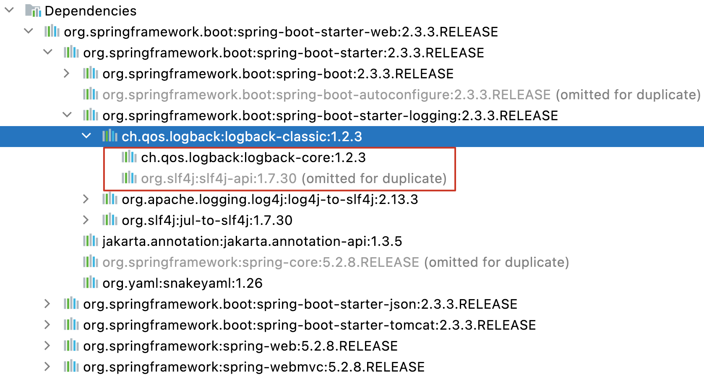
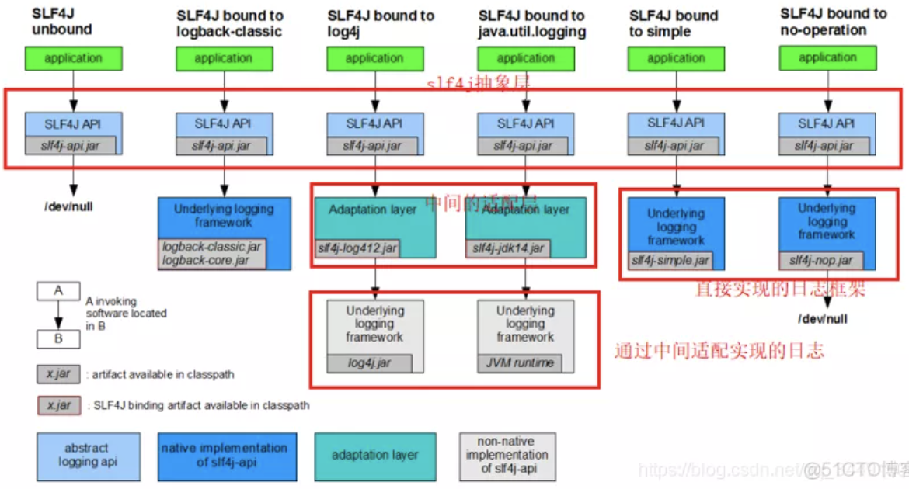

## 一、市面上的日志框架以及日志抽象层类

---

日志框架分为3部分：**日志门面**、**日志适配器**、**日志库**。

1. 日志门面：JCL、SLF4j、jboss-logging这些框架都是日志门面。门面设计模式是面向对象的一种设计模式，类似JDBC，也就是说这些货本身自己不干活，就是一套接口规范，让调用者不需要关心日志底层具体是什么框架在干活
2. 日志库：log4j、logback、JUL、log4j2都是日志库，也就是真实干活的人
3. 日志适配器：它是解决日志门面和日志库接口不兼容的，一般配套的都是兼容的

所以我们的目标是挑选一个日志门面，再挑选一个日志库，搭配使用即可，Log4j2是Log4j升级版、Log4j2是Apache写的一套框架，由于太优秀太过复杂，因此也比较小众。JUL太简陋了基本没人用。


## 二、slf4j+Logback

---

在springboot中，**默认抽象接口层使用slf4j**，**实现层用logback**，创建了一个demo项目，当我们引入spring-boot-starter的时候，就默认帮我们引入logback、slf4j。



当我们创建一个boot项目，我们没有配置任何其它配置，就看到在控制台下打印日志，Logback默认打印debug级别日志，但是我们注意到debug级别的日志没有记录下来，那是因为**Spring Boot为Logback提供了默认的配置文件base.xml**，另外Spring Boot 提供了两个输出端的配置文件console-appender.xml和file-appender.xml，base.xml引用了这两个配置文件。所以Springboot默认日志级别是info，可以看到base.xml引用两个配置。

```xml
<?xml version="1.0" encoding="UTF-8"?>

<included>
  <include resource="org/springframework/boot/logging/logback/defaults.xml" />
  <property name="LOG_FILE" value="${LOG_FILE:-${LOG_PATH:-${LOG_TEMP:-${java.io.tmpdir:-/tmp}}}/spring.log}"/>
  <include resource="org/springframework/boot/logging/logback/console-appender.xml" />
  <include resource="org/springframework/boot/logging/logback/file-appender.xml" />
  <root level="INFO">
    <appender-ref ref="CONSOLE" />
    <appender-ref ref="FILE" />
  </root>
</included>
```

在这里，可以看到 Spring boot已通过将根记录器设置为INFO来覆盖 Logback 的默认日志记录级别，这是我们在上面的示例中没有看到调试消息的原因。

### 2.1 简单配置

小项目可以直接在application.yml中对logback简单配置，如下。

```yaml
logging:
  level:
    com:
      javayihao: trace
  path: /spring/log
  pattern:
    console: '%d{yyyy-MM-dd HH:mm:ss.SSS}+++[%thread] %-5level %logger{50} - %msg%n'
    file: '%d{yyyy-MM-dd HH:mm:ss.SSS}===[%thread] %-5level %logger{50} - %msg%n'
```

### 2.2 通过logback专有的xml配置文件详细配置

通过application.yml文件配置Logback，对于大多数Spring Boot应用来说已经足够了，但是对于一些大型的企业应用来说似乎有一些相对复杂的日志需求。在Spring Boot中你可以在logback.xml或者在logback-spring.xml中对Logback进行配置，相对于 `logback.xml`，`logback-spring.xml` 更加被偏爱。如果是其他名字，只需在application.properties中配置logging.config=classpath:logback-boot.xml使用自己的日志配置文件即可。

```xml
<configuration scan="true" scanPeriod="60 seconds" debug="false">  
  <property name="glmapper-name" value="glmapper-demo" /> 
  <contextName>${glmapper-name}</contextName> 

  <appender>
    //xxxx
  </appender>   

  <logger>
    //xxxx
  </logger>

  <root>             
    //xxxx
  </root>  
</configuration>
```

#### configuration标签

- scan：当此属性设置为true时，配置文件如果发生改变，将会被重新加载，默认值为true。
- scanPeriod：设置监测配置文件是否有修改的时间间隔，如果没有给出时间单位，默认单位是毫秒。当scan为true时，此属性生效。默认的时间间隔为1分钟。
- debug：当此属性设置为true时，将打印出logback内部日志信息，实时查看logback运行状态。默认值为false。

#### property标签

用来定义变量值的标签，有两个属性

- name的值是变量的名称
- value的值时变量定义的值。

通过property定义的值会被插入到logger上下文中。定义变量后，可以使“${name}”来使用变量。如上面的xml所示。

#### contextName标签

每个logger都关联到logger上下文，默认上下文名称为“default”。但可以使用contextName标签设置成其他名字，用于区分不同应用程序的记录。

#### appender标签

appender种类：

- ConsoleAppender：把日志添加到控制台
- FileAppender：把日志添加到文件
- RollingFileAppender：滚动记录文件，先将日志记录到指定文件，当符合某个条件时，将日志记录到其他文件。它是FileAppender的子类

**filter子标签**

filter是appender里面的子元素。它作为过滤器存在，执行一个过滤器会有返回DENY，NEUTRAL，ACCEPT三个枚举值中的一个。appender 有多个过滤器时，按照配置顺序执行。

- DENY：日志将立即被抛弃不再经过其他过滤器
- NEUTRAL：有序列表里的下个过滤器过接着处理日志
- ACCEPT：日志会被立即处理，不再经过剩余过滤器

filter的class有**ThresholdFilter**以及**LevelFilter**。

ThresholdFilter：临界值过滤器，过滤掉低于指定临界值的日志。当日志级别等于或高于临界值时，过滤器返回NEUTRAL；当日志级别低于临界值时，日志会被拒绝。

```xml
<filter class="ch.qos.logback.classic.filter.ThresholdFilter">
  <level>INFO</level>
</filter>
```

LevelFilter：级别过滤器，根据日志级别进行过滤。如果日志级别等于配置级别，过滤器会根据onMath(用于配置符合过滤条件的操作) 和 onMismatch(用于配置不符合过滤条件的操作)接收或拒绝日志。

```xml
<!-- 过滤器，只记录INFO级别的日志 -->
<filter class="ch.qos.logback.classic.filter.LevelFilter">
  <level>INFO</level>
  <onMatch>ACCEPT</onMatch>
  <onMismatch>DENY</onMismatch>
</filter>
```

**file子标签**

用于指定被写入的文件名，可以是相对目录，也可以是绝对目录，如果上级目录不存在会自动创建，没有默认值。

```xml
<file>
  ${logging.path}/glmapper-spring-boot/glmapper-loggerone.log
</file>
```

这个表示当前appender将会将日志写入到${logging.path}/glmapper-spring-boot/glmapper-loggerone.log这个目录下。

**rollingPolicy 子标签**

这个子标签用来描述滚动策略的。这个只有appender的class是RollingFileAppender时才需要配置。这个也会涉及文件的移动和重命名（a.log->a.log.2018.07.22）。class有`TimeBasedRollingPolicy`和`FixedWindowRollingPolicy`。

TimeBasedRollingPolicy：最常用的滚动策略，它根据时间来制定滚动策略，既负责滚动也负责出发滚动。这个下面又包括了两个属性：

- FileNamePattern
- maxHistory

```xml
<rollingPolicy class="ch.qos.logback.core.rolling.TimeBasedRollingPolicy">
  <!--日志文件输出的文件名:按天回滚 daily -->
  <FileNamePattern>
    ${logging.path}/glmapper-spring-boot/glmapper-loggerone.log.%d{yyyy-MM-dd}
  </FileNamePattern>
  <!--日志文件保留天数-->
  <MaxHistory>30</MaxHistory>
</rollingPolicy>
```

上面的这段配置表明每天生成一个日志文件，保存30天的日志文件。

FixedWindowRollingPolicy：根据固定窗口算法重命名文件的滚动策略。

**encoder 子标签**

对记录事件进行格式化。它干了两件事：

- 把日志信息转换成字节数组
- 把字节数组写入到输出流

```xml
<encoder class="ch.qos.logback.classic.encoder.PatternLayoutEncoder">
  <Pattern>%d{yyyy-MM-dd HH:mm:ss.SSS} [%X{traceId}] [%thread] %-5level %logger{36} -%msg%n
  </Pattern>
</encoder>
```

目前encoder只有PatternLayoutEncoder一种类型。


### 2.3 案例

#### 定义一个只打印error级别日志的appender

```xml
<!-- 错误日志 appender ： 按照每天生成日志文件 -->
<appender name="ERROR-APPENDER" class="ch.qos.logback.core.rolling.RollingFileAppender">
  <append>true</append>
  <!-- 过滤器，只记录 error 级别的日志 -->
  <filter class="ch.qos.logback.classic.filter.ThresholdFilter">
    <level>error</level>
  </filter>
  <!-- 日志名称 -->
  <file>${logging.path}/glmapper-spring-boot/glmapper-error.log</file>
  <!-- 每天生成一个日志文件，保存30天的日志文件 -->
  <rollingPolicy class="ch.qos.logback.core.rolling.TimeBasedRollingPolicy">
    <!--日志文件输出的文件名:按天回滚 daily -->
    <FileNamePattern>${logging.path}/glmapper-spring-boot/glmapper-error.log.%d{yyyy-MM-dd}</FileNamePattern>
    <!--日志文件保留天数-->
    <MaxHistory>30</MaxHistory>
  </rollingPolicy>
  <encoder class="ch.qos.logback.classic.encoder.PatternLayoutEncoder">
    <!--格式化输出：%d表示日期，%thread表示线程名，%-5level：级别从左显示5个字符宽度%msg：日志消息，%n是换行符-->
    <pattern>%d{yyyy-MM-dd HH:mm:ss.SSS} [%thread] %-5level %logger{50} - %msg%n</pattern>
    <!-- 编码 -->
    <charset>UTF-8</charset>
  </encoder>
</appender>
```

#### 定义一个输出到控制台的appender

```xml
<!-- 默认的控制台日志输出，一般生产环境都是后台启动，这个没太大作用 -->
<appender name="STDOUT" class="ch.qos.logback.core.ConsoleAppender">
  <encoder class="ch.qos.logback.classic.encoder.PatternLayoutEncoder">
    <Pattern>%d{HH:mm:ss.SSS} %-5level %logger{80} - %msg%n</Pattern>
  </encoder>
</appender>
```

#### logger

用来设置某一个包或者具体的某一个类的日志打印级别以及指定appender。

#### root

根logger，也是一种logger，且只有一个level属性。


## 三、slf4j+Log4j2

---

### 3.1 引入pom

```xml
<dependency>
  <groupId>org.springframework.boot</groupId>
  <artifactId>spring-boot-starter</artifactId>
  <exclusions>
    <!--排除 springboot 默认的 logback 依赖 -->
    <exclusion>
      <groupId>org.springframework.boot</groupId>
      <artifactId>spring-boot-starter-logging</artifactId>
    </exclusion>
  </exclusions>
</dependency>
<!--引入 log4j2-->
<dependency>
  <groupId>org.springframework.boot</groupId>
  <artifactId>spring-boot-starter-log4j2</artifactId>
  <version>2.2.6.RELEASE</version>
</dependency>
<!--异步,使用 log4j2 的 AsyncLogger 时需要包含 disruptor-->
<dependency>
  <groupId>com.lmax</groupId>
  <artifactId>disruptor</artifactId>
  <version>3.4.2</version>
</dependency>
```

### 3.2 application.yml

```yaml
# 引入日志配置文件
logging:
  config: classpath:log4j2.xml
```

### 3.3 log4j2.xml放在目录resources下即可

```xml
<?xml version="1.0" encoding="UTF-8"?>
<!--Configuration 后面的 status，这个用于设置 log4j2 自身内部的信息输出级别，可以不设置，当设置成 trace 时，你会看到 log4j2 内部各种详细输出-->
<!--monitorInterval：Log4j2 能够自动检测修改配置 文件和重新配置本身，设置间隔秒数-->
<configuration status="error"  monitorInterval="30">
  <!--日志级别以及优先级排序: OFF > FATAL > ERROR > WARN > INFO > DEBUG > TRACE > ALL -->

  <!--变量配置-->
  <Properties>
    <!-- 格式化输出：%date 表示日期，%thread 表示线程名，%-5level：级别从左显示 5 个字符宽度 %msg：日志消息，%n 是换行符-->
    <!-- %logger{36} 表示 Logger 名字最长 36 个字符 -->
    <property name="LOG_PATTERN" value="%d{yyyy-MM-dd HH:mm:ss.SSS} [%t] %-5level [%logger{50}:%L] - %msg%n" />
    <!-- 定义日志存储的路径 -->
    <property name="FILE_PATH" value="/var/log/songo" />
    <property name="FILE_NAME" value="songo" />
  </Properties>

  <appenders>

    <console name="Console" target="SYSTEM_OUT">
      <!--输出日志的格式-->
      <PatternLayout pattern="${LOG_PATTERN}" charset="UTF-8"/>
    </console>

    <!-- 这个会打印出所有的info及以上级别的信息，每次大小超过size，则这size大小的日志会自动存入按年份-月份建立的文件夹下面并进行压缩，作为存档-->
    <RollingFile name="RollingFileInfo" fileName="${FILE_PATH}/${FILE_NAME}/${FILE_NAME}.log" filePattern="${FILE_PATH}/${FILE_NAME}/${FILE_NAME}-INFO-%d{yyyy-MM-dd}_%i.log.gz" append="true">
      <PatternLayout pattern="${LOG_PATTERN}" charset="UTF-8"/>
      <Policies>
        <!-- 基于时间的触发策略。该策略主要是完成周期性的log文件封存工作。有两个参数：
               interval，integer型，指定两次封存动作之间的时间间隔。单位:以日志的命名精度来确定单位，
                   比如yyyy-MM-dd-HH 单位为小时，yyyy-MM-dd-HH-mm 单位为分钟
               modulate，boolean型，说明是否对封存时间进行调制。若modulate=true，
                   则封存时间将以0点为边界进行偏移计算。比如，modulate=true，interval=4hours，
                   那么假设上次封存日志的时间为00:00，则下次封存日志的时间为04:00，
                   之后的封存时间依次为08:00，12:00，16:00-->
        <TimeBasedTriggeringPolicy interval="1"/>
        <SizeBasedTriggeringPolicy size="10MB"/>
      </Policies>
      <!-- DefaultRolloverStrategy 属性如不设置，则默认为最多同一文件夹下当天 7 个文件后开始覆盖-->
      <DefaultRolloverStrategy max="30">
        <!-- 删除处理策略，在配置的路径中搜索，maxDepth 表示往下搜索的最大深度 -->
        <Delete basePath="${FILE_PATH}/${FILE_NAME}/" maxDepth="2">
          <!-- 文件名搜索匹配，支持正则 -->
          <IfFileName glob="*.log.gz" />
          <!--!Note: 这里的 age 必须和 filePattern 协调, 后者是精确到 dd, 这里就要写成 xd, xD 就不起作用
                    另外, 数字最好 >2, 否则可能造成删除的时候, 最近的文件还处于被占用状态,导致删除不成功!-->
          <!--7天-->
          <IfLastModified age="7d" />
        </Delete>
      </DefaultRolloverStrategy>
    </RollingFile>
  </appenders>

  <!--Logger 节点用来单独指定日志的形式，比如要为指定包下的 class 指定不同的日志级别等。-->
  <!--然后定义 loggers，只有定义了 logger 并引入的 appender，appender 才会生效-->
  <loggers>
    <!--若是 additivity 设为 false，则子 Logger 只会在自己的 appender 里输出，而不会在父 Logger 的 appender 里输出。-->
    <!--Console、RollingFileInfo 没有配置 ThresholdFilter，默认走的是 AsyncRoot 的 level 级别，
            com.songo.mapper 为我项目 mapper 的包路径，级别设为 debug，可以打印 sql 语句-->
    <AsyncLogger name="com.songo.mapper" level="debug" additivity="false">
      <appender-ref ref="Console"/>
      <appender-ref ref="RollingFileInfo"/>
    </AsyncLogger>
    <AsyncLogger name="org.springframework" level="warn" additivity="false">
      <appender-ref ref="Console"/>
      <appender-ref ref="RollingFileInfo"/>
    </AsyncLogger>
    <AsyncRoot level="info" includeLocation="true">
      <AppenderRef ref="Console"/>
      <AppenderRef ref="RollingFileInfo" />
    </AsyncRoot>
  </loggers>
</configuration>
```


## 四、总结

---

日志抽象类SLF4j和其他日志实现类的使用。



springboot官方推荐slf4+logback。