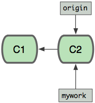
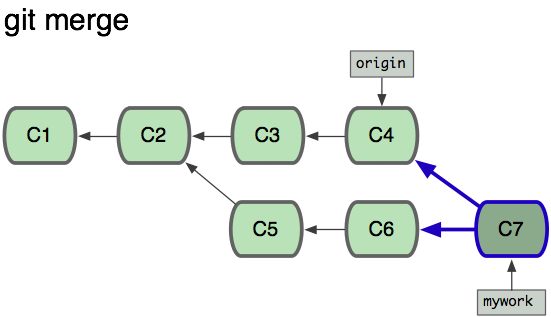
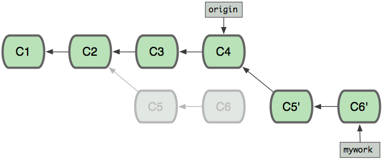
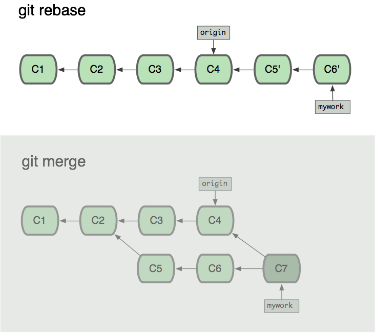

假设现在基于远程分支"origin"，创建一个叫"mywork"的分支
```
$ git checkout -b mywork origin
```

现在我们在这个mywork分支做一些修改，然后生成两个提交(commit).

```
$ vi file.txt
$ git commit -m "xxx"
$ vi otherfile.txt
$ git commit -m "xxx"
```
但是与此同时，有些人也在"origin"分支上做了一些修改并且做了提交了. 这就意味着"origin"和"mywork"这两个分支各自"前进"了，它们之间"分叉"了

在这里，可以用"pull"命令把"origin"分支上的修改拉下来和你的修改合并；结果看起来就像一个新的"合并的提交"：


> 如果想让"mywork"分支历史看起来像没有经过任何合并一样，可以用 git rebase：
>
> ```shell
> $ git checkout mywork
> $ git rebase origin
> ```

这些命令会把你的"mywork"分支里的每个提交(commit)取消掉，并且把它们临时 保存为补丁(patch)(这些补丁放到".git/rebase"目录中)，然后把"mywork"分支更新到最新的"origin"分支，最后把保存的这些补丁应用到"mywork"分支上。

当'mywork'分支更新之后，它会指向这些新创建的提交(commit)，而那些老的提交会被丢弃。 如果运行垃圾收集命令(pruning garbage collection)，这些被丢弃的提交就会删除。

现在我们可以看一下用合并(merge)和用rebase所产生的历史的区别：

在rebase的过程中，也许会出现冲突(conflict)。在这种情况，git会停止rebase并会让你去解决冲突；在解决完冲突后，用"git-add"命令去更新这些内容的索引(index)，然后，你无需执行 git-commit,只要执行:

```
$ git rebase --continue
```
这样git会继续应用(apply)余下的补丁。

在任何时候，你可以用--abort参数来终止rebase的行动，并且"mywork" 分支会回到rebase开始前的状态。
```
$ git rebase --abort
```
