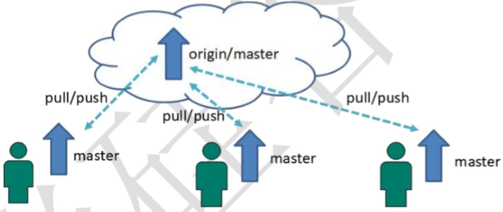
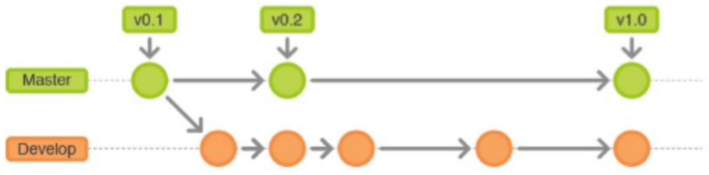
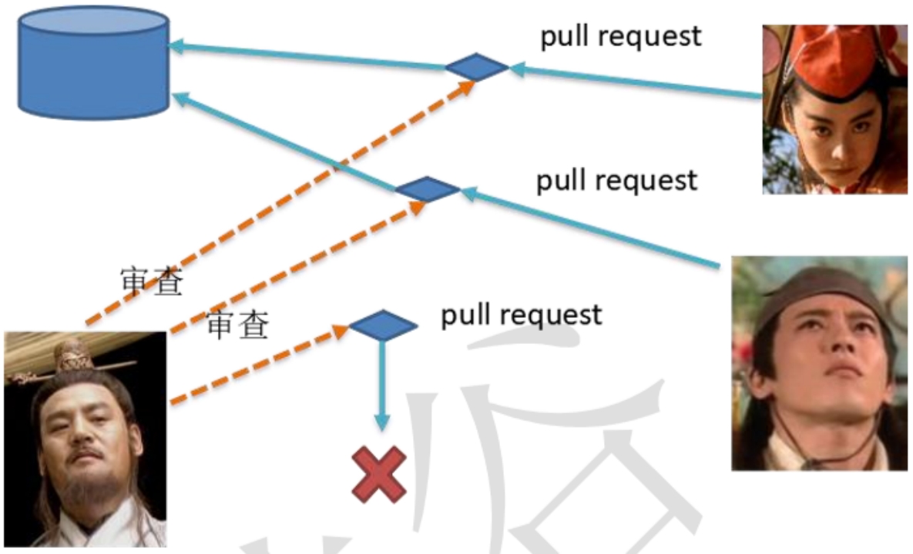
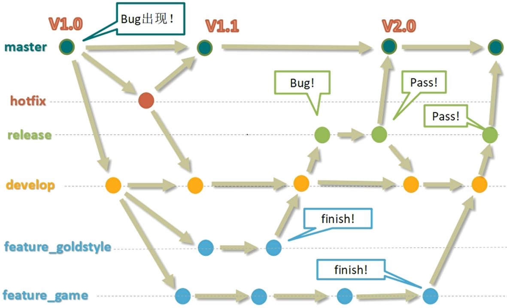
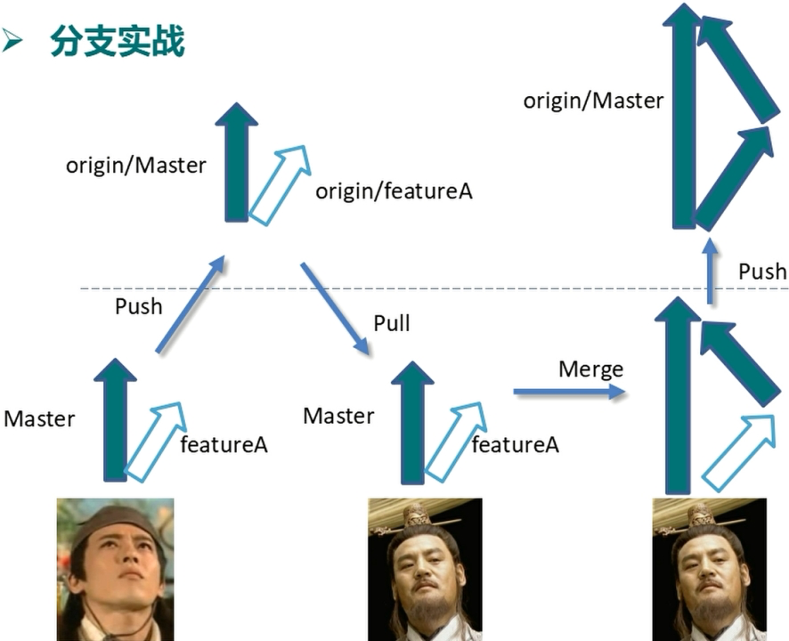

### 一、概念

---

在项目开发过程中使用Git的方式。

### 二、分类

---

#### 2.1 集中式工作流

像SVN一样，集中式工作流以中央仓库作为项目所有修改的单点实体。所有修改都提交到Master这个分支上。

这种方式与SVN的主要区别就是开发人员有本地库，Git很多特性并没有用到。

#### 2.2 gitflow工作流

gitflow工作流通过为功能开发、发布准备和维护设立了独立的分支，让发布迭代过程更流畅。严格的分支模型也为大型项目提供了一些必要的结构。

#### 2.3 forking工作流

forking工作流是在GitFlow基础上，充分利用了Git的Fork和pull request的功能以达到代码审核的目的。更适合安全可靠地管理大团队的开发者，而且能接受不信任贡献者的提交。

### 三、gitflow工作流详解

---

#### 3.1 分支种类

- **主干分支** master

  负责管理正在运行的生产环境代码，永远保持与正在运行的生产环境完全一致。

- **开发分支** develop

  负责管理正在开发过程中的代码，一般情况下应该是最新的代码。

- **bug修复分支** hotfix

  负责管理生产环境下出现的紧急修复的代码，从主干分支分出，修理完并测试上线后，并回主干分支，并回后，视情况可删除该分支。

- **准生产分支**（预发布分支） release

  较大的版本上线前，会从开发分支中分出准生产分支，进行最后阶段的集成测试。该版本上线后，会合并到主干分支。生产环境运行一段较稳定后可以视情况删除。

- **功能分支** feture

  为了不影响较短周期的开发工作，一般把中长期开发模块，会从开发分支中独立出来。开发完成后会合并到开发分支。

#### 3.2 gitflow工作流举例

#### 3.3 分支实战

