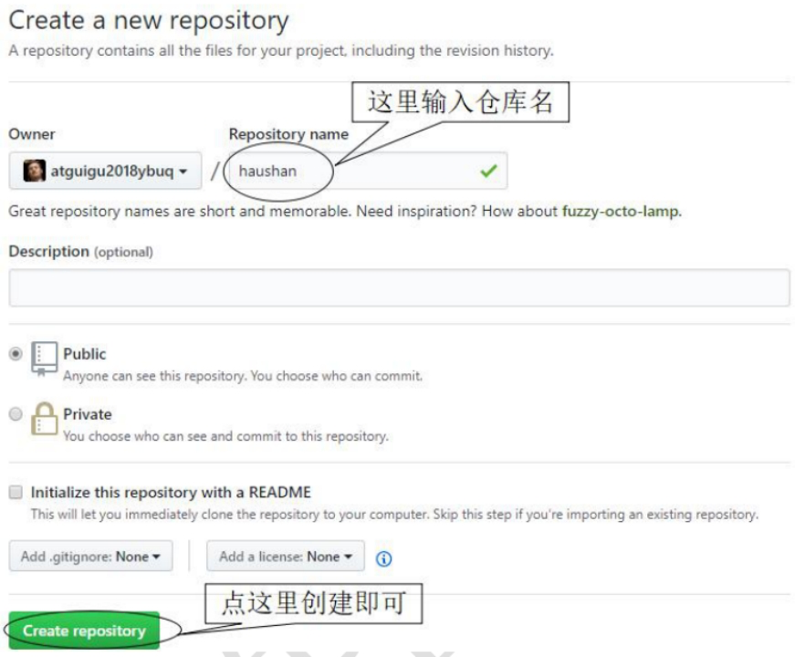

### 一、初始化本地库

---


### 二、在github上创建远程库

---




### 三、创建远程库地址别名

---

查看远程库地址别名：`git remote -v`

`git remote add [别名] [远程地址]`

例：

```shell
git remote add origin git@github.com:Chance-Wu/notes.git
```


### 四、推送

---

`git push [别名] [分支名]`

例：

```shell
git push origin master
```


### 五、克隆

---

`git clone [远程地址]`

