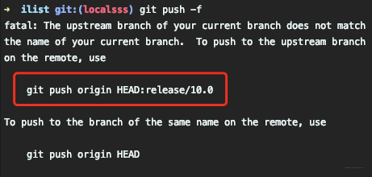

### 一、本地回退

---

当在本地做了错误的 commit，先找到要回退的版本的`commit id`：

```bash
git reflog
```

接着回退版本:

```bash
git reset --hard cac0
```
cac0就是你要回退的版本的`commit id`的前面几位。

回退到某次提交。回退到的指定提交以后的提交都会从提交日志上消失。

工作区和暂存区的内容都会被重置到指定提交的时候，如果不加`--hard`则只移动`HEAD`指针，不影响工作区和暂存区的内容。

> 结合`git reflog`找回提交日志上看不到的版本历史，撤回某次操作前的状态。这个方法可以对你的回退操作进行回退，因为这时候`git log`已经找不到历史提交的hash值了。


###  二、远程回退

---

#### 2.1 回退自己的远程分支
当错误commit已经推送到远程分支，就需要回滚远程分支。
1. 首先要回退本地分支：

   ```shell
   git reflog
   git reset --hard cac0
   ```

   

2. 由于本地分支回滚后，版本将落后远程分支，必须**使用强制推送覆盖远程分支**，否则后面将无法推送到远程分支。

   ```shell
   git push -f origin branch_name
   ```



#### 2.2 回退公共远程分支
如果你回退公共远程分支，把别人的提交给丢掉了怎么办？

假如你的远程master分支情况是这样的：

`A1–A2–B1`

- A、B分别代表两个人；
- A1、A2、B1代表各自的提交；
- 所有人的本地分支都已经更新到最新版本，和远程分支一致。

这时发现A2这次commit有误，你用reset回滚远程分支master到A1，那么理想状态是你的同事一拉代码git pull，他们的master分支也回滚了
然而现实却是，你的同事会看到下面的提示：

```bash
$ git status
On branch master
Your branch is ahead of 'origin/master' by 2 commits.
  (use "git push" to publish your local commits)
nothing to commit, working directory clean
```
也就是说，你的同事的分支并没有主动回退，而是比远程分支超前了两次提交，因为远程分支回退了。
不幸的是，现实中，他们一看到如上提示，就习惯性的git push一下，一看到界面上显示的是推送的提示就直接点了推送按钮，卧槽，辛辛苦苦回滚的版本就这样轻松的被你猪一样的队友给还原了，所以，只要有一个队友push之后，远程master又变成了：

`A1 – A2 – B1`

这就是分布式，每个人都有副本。

所以需要用另外一种方法来回退版本。


### 三、公共远程回退git revert

---

使用git reset回退公共远程分支的版本后，需要**其他所有人手动用远程master分支覆盖本地master分支**，显然，这不是优雅的回退方法。

```bash
git revert HEAD        //撤销最近一次提交
git revert HEAD~1      //撤销上上次的提交，注意：数字从0开始
git revert 0ffaacc     //撤销0ffaacc这次提交
```
git revert 命令撤销某次提交。它会**产生一个新的提交，虽然代码回退了，但是版本依然是向前的，所以，当你用revert回退之后，所有人pull之后，他们的代码也自动的回退了**。但是，要注意以下几点：

- revert 是撤销一次提交，所以后面的commit id是你需要回滚到的版本的前一次提交。
- 使用revert HEAD是撤销最近的一次提交，如果你最近一次提交是用revert命令产生的，那么你再执行一次，就相当于撤销了上次的撤销操作，换句话说，你连续执行两次revert HEAD命令，就跟没执行是一样的。
- 使用revert HEAD~1 表示撤销最近2次提交，这个数字是从0开始的，如果你之前撤销过产生了commi id，那么也会计算在内的。
- **如果使用 revert 撤销的不是最近一次提交，那么一定会有代码冲突**，需要你合并代码，合并代码只需要把当前的代码全部去掉，保留之前版本的代码就可以了。
- git revert 命令的好处就是不会丢掉别人的提交，即使你撤销后覆盖了别人的提交，他更新代码后，可以在本地用 reset 向前回滚，找到自己的代码，然后拉一下分支，再回来合并上去就可以找回被你覆盖的提交了。


###  四、revert 合并代码，解决冲突

---

使用revert命令，如果不是撤销的最近一次提交，那么一定会有冲突，如下所示：

```bash
<<<<<<< HEAD
全部清空
第一次提交
=======
全部清空
>>>>>>> parent of c24cde7... 全部清空
```
解决冲突很简单，因为我们只想回到某次提交，**因此需要把当前最新的代码去掉即可，也就是HEAD标记的代码**：

```bash
<<<<<<< HEAD
全部清空
第一次提交
=======
```
把上面部分代码去掉就可以了，然后再提交一次代码就可以解决冲突了。