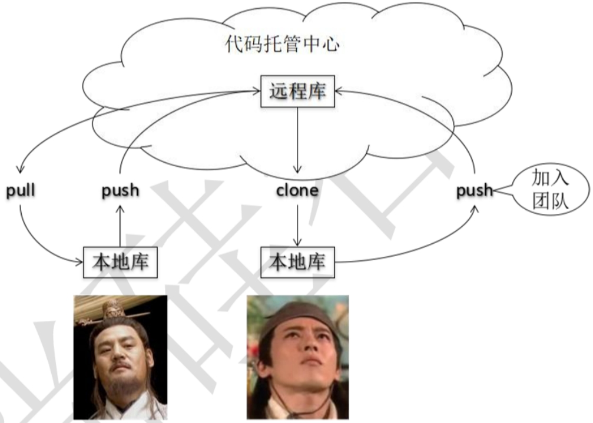
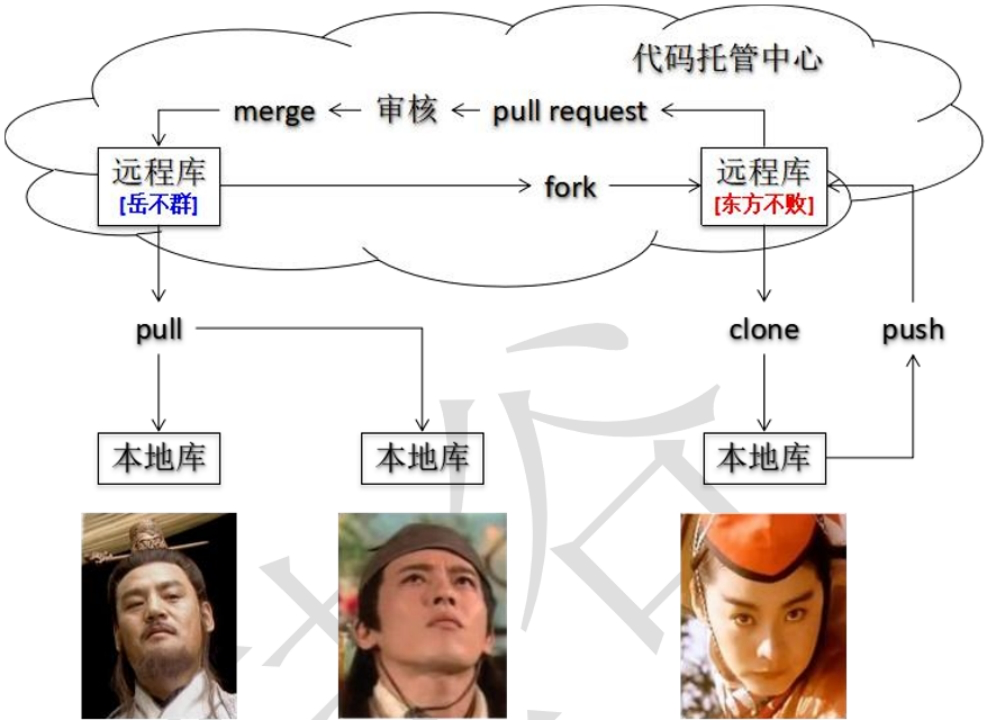
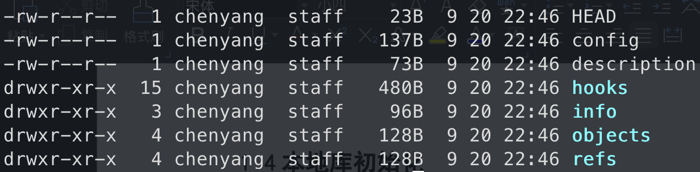
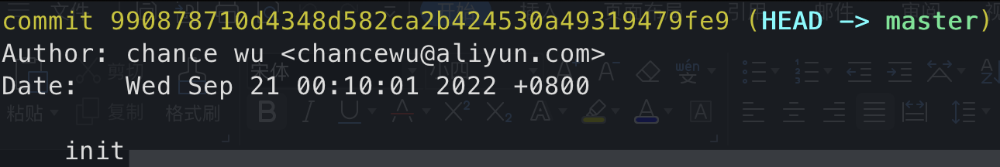
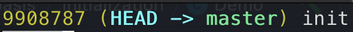
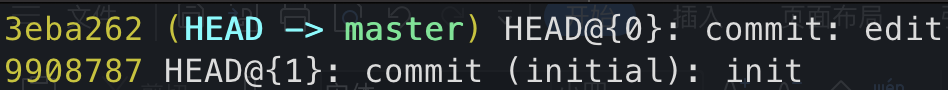
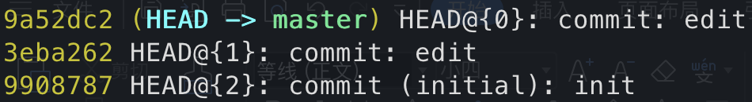
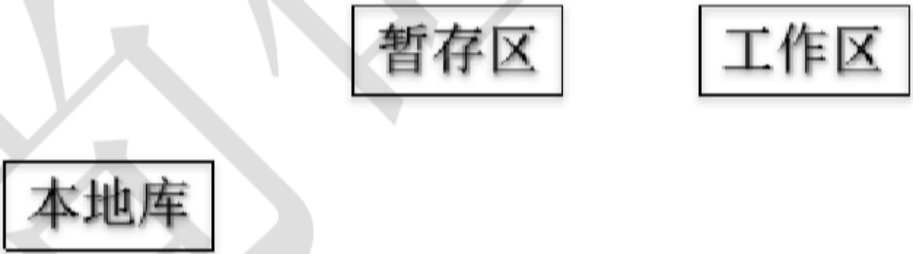

### 一、git结构

---

工作区（写代码）

——> `git add` 到暂存区（临时存储）

——> `git commit` 到本地库（历史版本）


### 二、Git和代码托管中心

---

代码托管中心的任务：维护远程库。

- 局域网环境下：Gitlab服务器
- 外网环境下：Github、码云


### 三、本地库有和远程库

---

#### 3.1 团队内部协作



#### 3.2 跨团队协作




- `fork`：复制一份称为一个新的远程库。
- `pull request`：发起一个拉取请求。
- `merge`：审核之后拉取。


### 四、本地库初始化

---

#### 4.1 git init

生成.git目录，存放的是本地库相关的子目录和文件，不能删除也不要胡乱修改。



#### 4.2 设置签名

区分不同开发人员的身份。

- 项目级别/仓库级别：仅在当前本地库范围内有效。

  ```shell
  git config user.name wuchenyang
  git config user.email chancewu@aliyun.com
  ```

- 系统用户级别：登录当前操作系统的用户范围

  ```shell
  git config --global user.name wuchenyang
  git config --global user.email chancewu@aliyun.com
  ```

  ```shell
  chenyang@chances-MacBook-Pro ~ % cat ~/.gitconfig
  [user]
  	name = chance wu
  	email = chancewu@aliyun.com
  [http]
  	postBuffer = 1048576000
  ```

>优先级别：
>
>- 就近原则
>- 如果只有系统用户级别的签名，就以系统用户级别签名为准
>- 二者都没有不允许


### 五、基本操作

#### 5.1 查看工作区、暂存区状态

`git status`

#### 5.2 将工作区的”新建/修改“添加到暂存区

`git add [file name]`

>注：删除暂存区或分支上的文件，但本地又需要使用，只是不希望这个文件被版本控制，使用 `git rm --cache [file name]`

#### 5.3 将暂存区的内容提交到本地库

`git commit -m "commit message" [file name]`

#### 5.4 查看历史记录

`git log`



`git log --pretty=oneline`	每一条日志只显示一行


`git log --oneline`	简介的形式显示



`git reflog`	查看所有分支的所有操作记录（包括commit和reset操作），包括已经被删除的commit记录



**HEAD@{移动到当前版本需要多少步}**

#### 5.5 前进后退版本

本质：



> 方式一、基于索引值操作：`git reset --hard [局部索引值]`
>
> ```shell
> git reset --hard 9908787
> 9908787 (HEAD -> master) HEAD@{0}: reset: moving to 9908787
> 9a52dc2 HEAD@{1}: commit: edit
> 3eba262 HEAD@{2}: commit: edit
> 9908787 (HEAD -> master) HEAD@{3}: commit (initial): init
> ```

> 方式二、使用^符号（只能后退）：`git reset --hard HEAD^`
>
> 一个^表示后退一步，n个表示后退n步。

>方式三、使用~符号：`git reset --hard HEAD~n`
>
>n表示后退n步。

#### 5.6 reset命令的三个参数对比

- --soft：仅在本地库移动HEAD指针。

  

- --mixed：在本地库移动HEAD指针；重置暂存区。

  

- `--hard`：在本地库移动HEAD指针；重置暂存区；重置工作区。

#### 5.7 删除文件并找回

- 删除操作已经提交到本地库：指针位置指向历史记录。
- 删除操作尚未提交到本地库：指针位置使用HEAD。