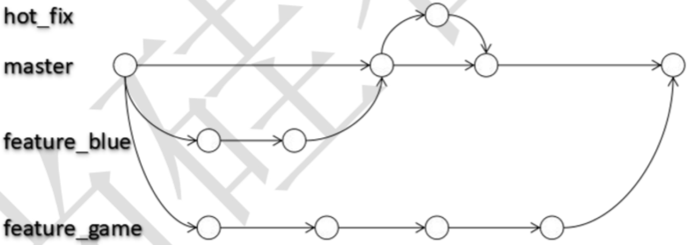
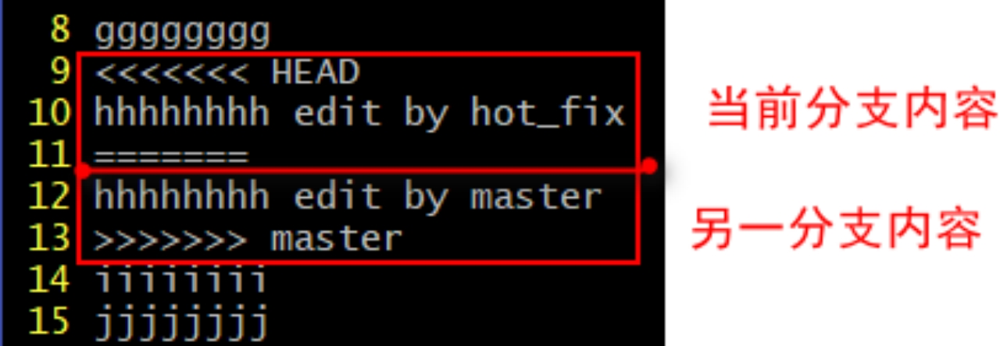

### 一、分支的概念

---

在版本控制过程中，使用多条线同时推进多个任务。



- 同时并行推进多个功能开发，提高开发效率。
- 各个分支在开发过程中，如果某一个分支开发失败，不会对其他分支有任何影响。失败的分支删除重新开始即可。


### 二、分支操作

---

#### 2.1 创建分支

`git branch [分支名]`

#### 2.2 查看分支

`git branch -v`

#### 2.3 切换分支

`git checkout [分支名]`

#### 2.4 合并分支

1. 切换到接收修改的分支上（被合并，增加新内容）上

   ```shell
   git checkout [被合并分支名]
   ```

2. 执行merge命令

   ```shell
   git merge [有新内容分支名]
   ```


### 三、解决冲突

---

#### 3.1 产生冲突原因

多个开发者同时使用或者操作git中的同一个文件，最后在以此提交和push的时候，第一个操作的是可以正常提交的，而之后的开发者想要执行pull（拉）和pull（push）操作的时候，就会报冲突异常conflict。

#### 3.2 冲突的表现



#### 3.3 冲突的解决

1. 编辑文件，**删除特殊符号**。
2. **把文件修改到满意的程度，保存退出**。
3. `git add [文件名]`
4. `git commit -m “日志信息”`

注意：此时commit一定不能带具体文件名。