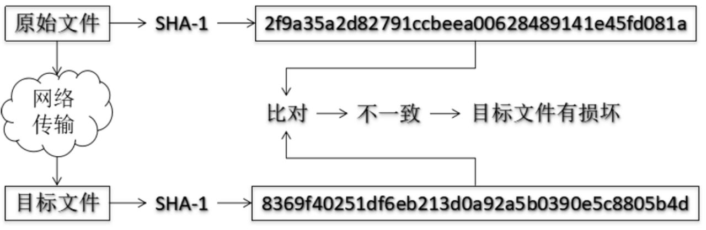
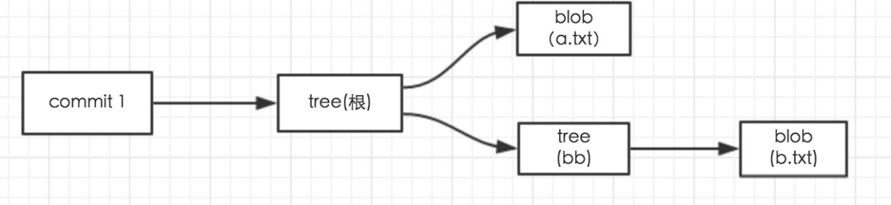
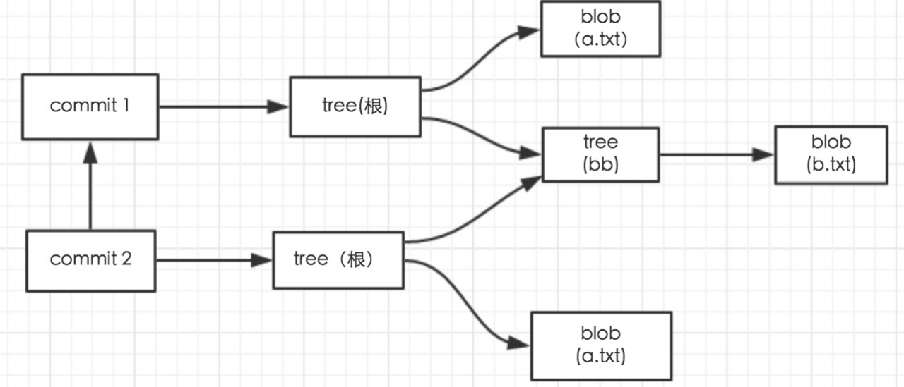
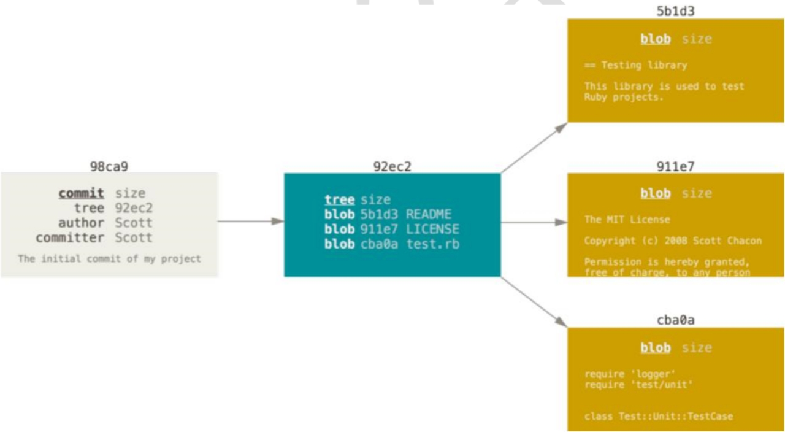
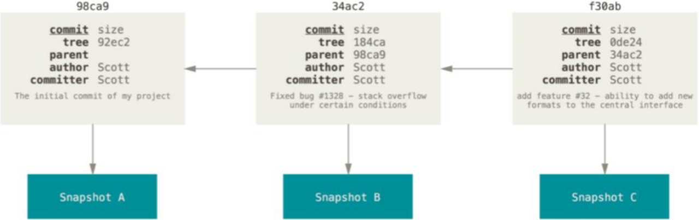

### 一、哈希

---

哈希是一个系列的加密算法，各个不同的哈希算法虽然加密强度不同，但是有以下几个共同点：

- 不管输入数据的数据量有多大，输入同一个哈希算法，得到的加密结果**长度固定**。
- 哈希算法确定，输入数据确定，输出数据能够保证不变。
- 哈希算法确定，输入数据有变化，输出数据一定有变化，而且通常变化很大
- 哈希算法**不可逆**。

Git底层采用的是`SHA-1`算法。

>哈希算法可以被用来验证文件。
>
>
>
>git就是靠这种机制来从根本上保证数据完整性的。


### 二、git保存版本的机制

---

#### 2.1 集中式版本控制工具的文件管理机制

以文件变更列表的方式存储信息。这类系统将它们保存的信息看作是一组基本文件和每个文件随时间逐步累积的差异。


#### 2.2 git的文件管理机制

git把数据看作是小型文件系统的一组快照。每次提交更新时git都会**对当前的全部文件制作一个快照并保存这个快照的索引**。为了高效，如果文件没有修改，Git不再重新存储该文件，而是只保留一个链接指向之前存储的文件。所以Git的工作方式可以称之为快照流。

#### 2.3 git文件管理机制细节

git会将所有改动的文件存到 `.git/objects/` 的文件夹下。

例如创建以下文件：

```
gitTest
├── a.txt
└── bb
    └── b.txt
```

git的文件对象分为四类：`blob`、`tree`、`commit`、`tags`。

git管理的**文件都以blob类型存在**，而**目录文件则以tree类型存在**，tree类型内部可以引用若干个blob和tree文件。

当执行了commit 之后git会依照我们工程的目录结构在objects里相应的建立一套blob和tree文件，可是我们的示例工程只有两个文件和一个文件夹，为什么objects里确有五个文件，这里就要说说commit类型了，commit类型内部可以引用一个tree类型文件和一个commit类型文件。

关于文件的名字，**objects内部的文件全部是以sha-1命名**，如果是blob类型则以文件内容做sha-1计算得出40字符的校验和，然后为了不让这个objects内部文件过多，所以使用40字符的前两位来建立一个文件夹，在以后38位为文件名，包括commit和tree全部使用sha-1校验和来命名。

这五个文件是以什么结构关联的：

每个commit引用一个tree，根据工程目录结构这个tree在引用一个blob(a.txt)和一个tree（bb），这个tree（bb）则引用一个blob（b.txt）如图：



改动以下a.txt然后再提交一个版本，在a.txt添加22222222222内容执行add和commit，添加一个版本，比刚刚多了三个文件。因为我们改动了a.txt文件，所以这里在保留上一个版本的a.txt的基础上新增加一个a.txt文件，git只对有改动的文件进行备份保留。另外两个文件分别是commit2和一个根tree，现在这8个文件的关系如图：



commit文件内部可以引用一个commit，这样commit之间就可以建立关系了，因为只有a.txt文件做了改动所以只有a.txt文件新建了一个，然后被commit2引用，bb和b.txt文件未做改动则commit2依然引用之前的文件。

git的”提交对象“：



提交对象及其父对象形成的链条：



