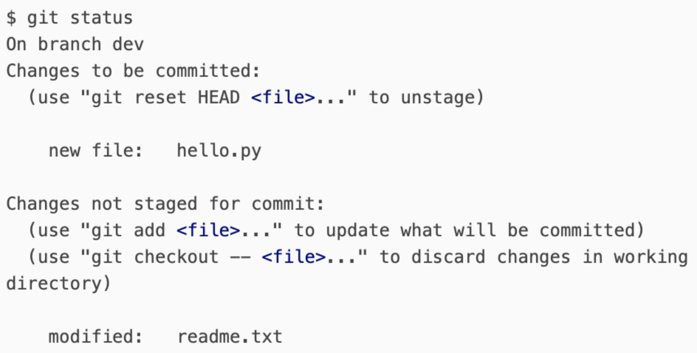

### 一、临时保存修改

---

当你接到一个修复一个代号101的bug的任务时，很自然地，你想创建一个分支issue-101来修复它，但是，等等，当前正在dev上进行的工作还没有提交：

当前工作只进行到一半，没法提交，预计完成还需1天时间。但是。必须先修改bug。

git提供了一个stash功能，可以把当前工作现场“储藏起来”，等以后恢复后继续工作。

`git stash`

再使用git status查看工作区，就是干净的（**除非没有被Git管理的文件**），因此可以放心地创建分支来修复bug。

### 二、切换到需要修复的分支并新建修复分支

---

假定需要在master分支上修复，就从master创建临时分支：

`git checkout master`

`git checkout -b hotfix_20220923`

### 三、修复bug并提交代码

---

在hotfix_20220923分支上修改代码，并提交。

### 四、切换到master分支，将修复分支合并到master

---

`git checkout master`

`git merge --no-ff -m "merged hotfix_20220923" hotfix_20220923`

### 五、切回dev分支继续开发

git switch dev

git status

`git stash list`		查看当前 stash 保存的全部记录

1. 一是用 `git stash apply` 恢复，但是恢复后，stash内容并不删除，你需要用git stash drop来删除；
2. 另一种方式是用 `git stash pop`，恢复的同时把stash内容也删了：