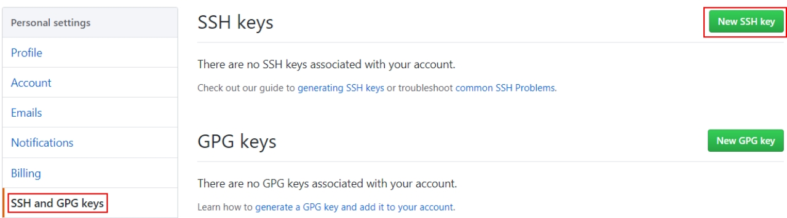
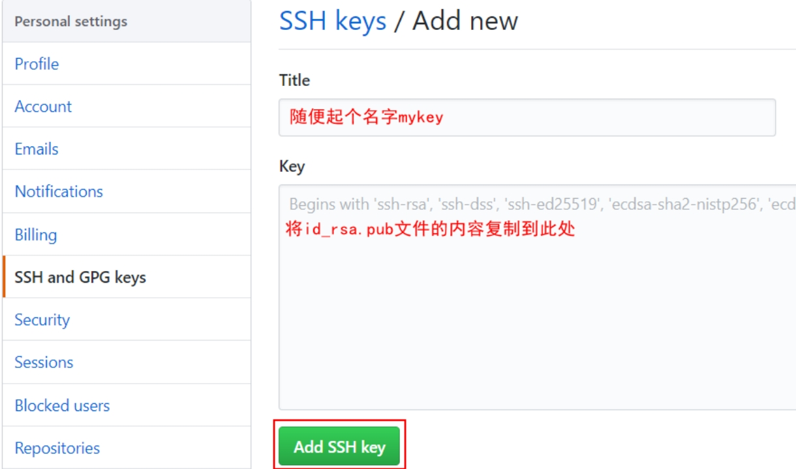

1. 进入当前用户的目录

   `cd ~`

2. 删除.ssh目录

   `rm -rvf .ssh`

3. 运行目录生成.ssh秘钥目录

   `ssh-keygen -trsa -C chancewu@aliyun.com`

4. 进入.ssh目录查看文件列表

   

5. 查看id_ras.pub文件内容

6. 复制id_ras.pub文件内容，登录github，点击头像→Settings→SSH and GPG keys

   

   

7. 回到git bash 创建远程地址别名（SSH地址）

   `git remote add origin git@github.com:Chance-Wu/pictures.git`

8. 推送文件测试