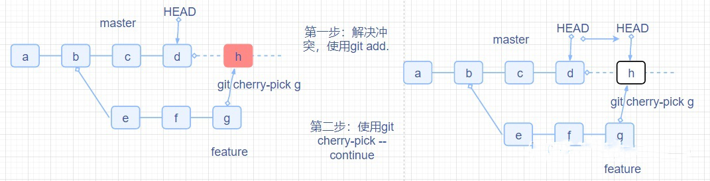
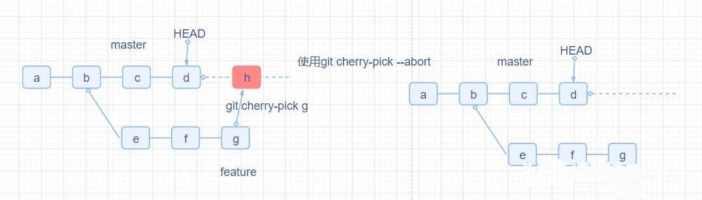
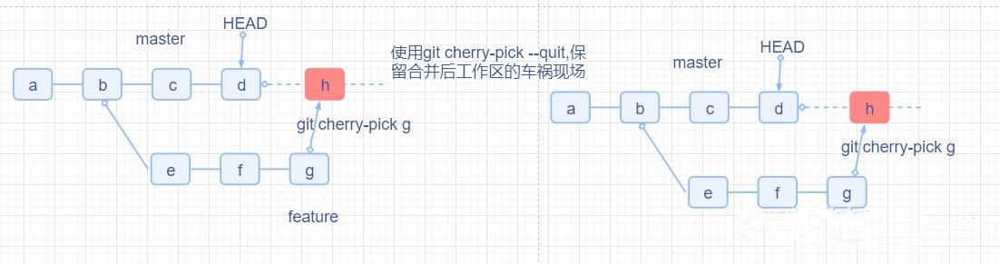

在不同分支之间进行代码合并时，通常会有两种情况：一种情况是需要另一个分支的所有代码变动，那么就可以直接合并（git merge），另一种情况是**只需要部分代码的变动**（某几次提交），这时就可以使用以下命令来合并指定的提交：

1. 在被合并的分支上进行查询commit操作

   ```bash
   git log --oneline   // 赋值需要合并的commit hash值
   ```

2. 回到主分支后进行操作

   ```bash
   // 合并一个commit_hash执行
   git cherry-pick <commit hash>
    
   // 合并多个commit_hash执行
   git cherry-pick commit_hashA commit_hashB
    
   // 合并多个连续的commit_hash执行(..)
   git cherry-pick commit_hashA..commit_hashB
   ```

   最后连续的写法，要注意一点：
   需要注意的是，commit_hashA必须比commit_hashB提前提交，也就是说在被挑选的分支上，先有的commit_hashA，然后才有的commit_hashB。

   此处的commit_hash指的是被合并分支上的commit_hash，要提前记住再切回来执行相关代码！

3. 添加 -x 标志，它会生成标准化的提交消息，通知用户它是从哪里pick出来的。

   ```bash
   git cherry-pick -x <commit hash>
   ```


### 合并是出现冲突如何处理

---

#### 采用 --continue 继续合并

第一步：需要合并人解决对应的冲突文件，然后提交到暂存区

```bash
git add . 
```

第二步：使用下面的命令继续执行

```bash
git cherry-pick --continue
```




#### 放弃合并：（回归原始状态，保留状态）

- 回归原始状态:

  ```bash
  // 使用当前的指令，合并的动作暂停，并且回归到操作前的样子
  git cherry-pick --abort
  ```

  

-  保留状态：

  ```bash
  //使用当前的指令，会保留车祸现场，退出cherry-pick
  git cherry-pick --quit
  ```

  