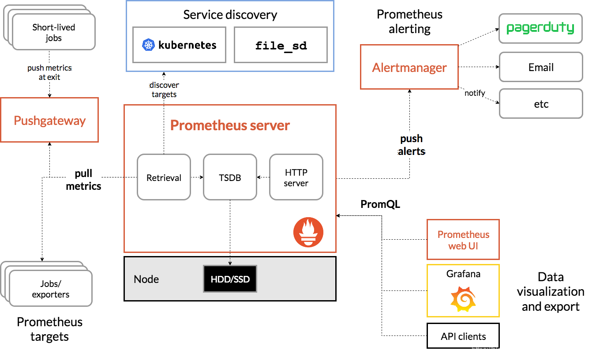
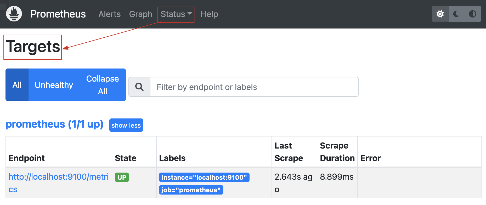
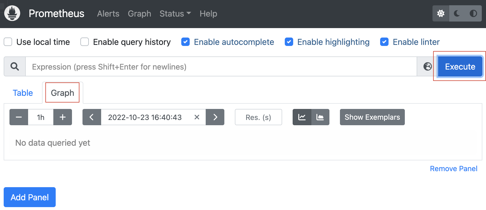
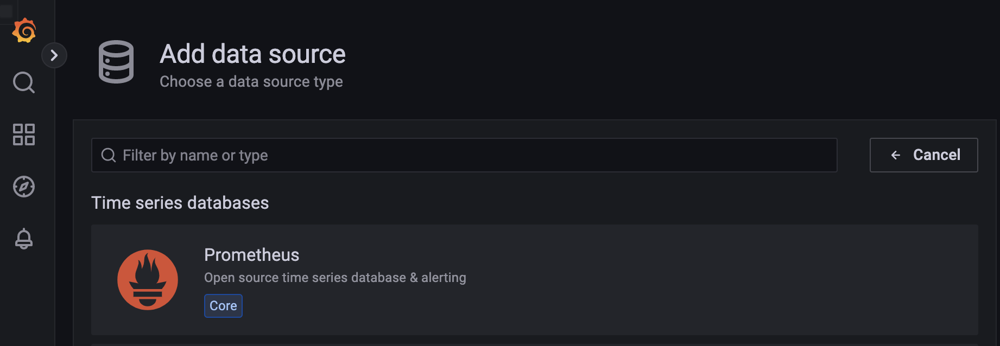
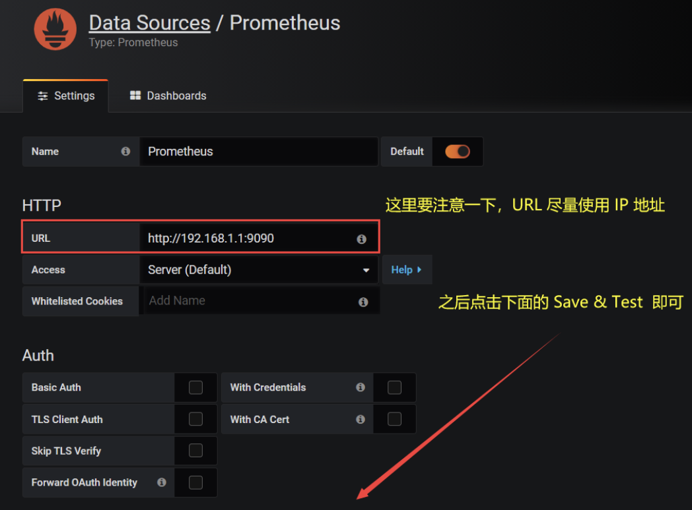
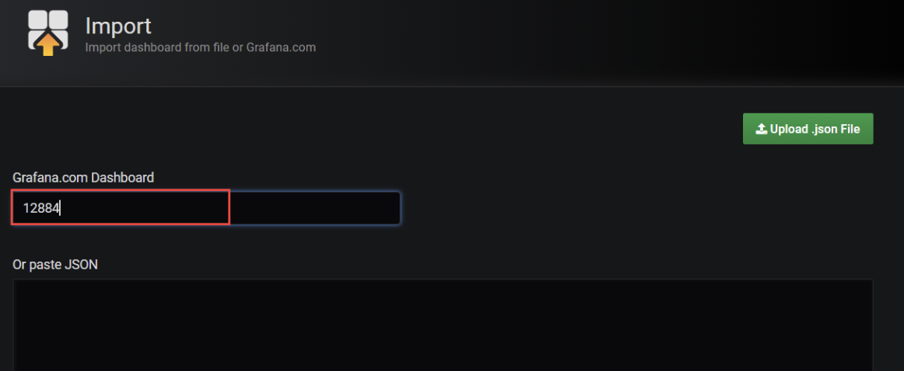
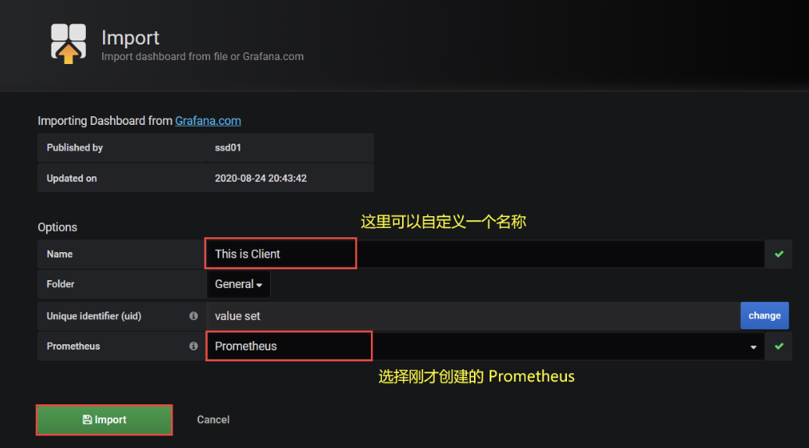
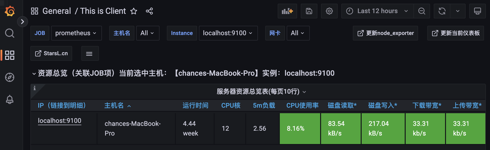

### 一、简介

---

普罗米修斯是一套开源的监控&报警&时间序列数据库组合。

基本原理是**通过HTTP协议周期性抓取被监控组件的状态**，这样做的好处是任意组件只要提供HTTP接口就可以接入监控系统，不需要任何SDK或者其他的集成过程。这样做非常适合虚拟化环境比如VM或者Docker。

#### 1.1 优势

- 易于管理
  - 核心部分只有一个单独的二进制文件，不存在任何的第三方依赖（数据库，缓存等等）；
  - 唯一需要的就是本地磁盘，因此不会有潜在级联故障的风险。
- 强大的查询语言PromQL
  - Prometheus内置一个强大的数据查询语言PromQL，通过PromQL可以实现对监控数据的查询、聚合；
  - 同时PromQL也被应用于数据可视化以及警告中。
- 高效
  - 对于监控系统而言，大量的监控任务必然导致有大量的数据产生。而Prometheus可以高效的处理这些数据。
- 可扩展
  - Prometheus支持联邦集群，可以让多个Prometheus实例产生一个逻辑集群;
  - 当单实例Prometheus处理的任务量过大时，通过使用功能分区（`sharding`）+联邦集群（`federation`）可以对其进行扩展。
- 易于集成
  - 目前官网提供了多种语言的客户端 SDK，基于这些 SDK 可以快速让应用程序纳入到监控系统中，同时还支持与其它的监控系统集成。
- 可视化
  - Prometheus Server 自带一个 UI，通过这个 UI 可以方便对数据进行查询和图形化展示；
  - 同时还可以对接 Grafana 可视化工具展示精美监控指标。


### 二、基础架构

---



如上图：Prometheus主要由以下部分组成：

- Prometheus：主要是负责存储、抓取、聚合、查询方面。
- Alertemanager：主要是负责实现报警功能。
- Pushgateway：主要是实现接收有 Client-push 过来的指标数据，在指定的时间间隔，有主程序来抓取。
- *_exporter：主要是负责采集物理机、中间件的信息。


### 三、安装

---

准备工作：

| 主机名     | 操作系统   | IP 地址     |
| ---------- | ---------- | ----------- |
| Prometheus | CentOS 7.4 | 192.168.1.1 |
| Client     | CentOS 7.4 | 192.168.1.2 |
| Granfana   | CentOS 7.4 | 192.168.1.3 |

>在所有节点上安装ntpdate工具，并进行时间同步（因为Prometheus对时间要求非常严格）
>
>```shell
>yum -y install ntpdate
>/usr/sbin/ntpdate ntp1.aliyun.com
>```

#### 3.1 下载

```shell
$ wget https://github.com/prometheus/prometheus/releases/download/v2.16.0/prometheus-2.16.0.linux-amd64.tar.gz
$ tar xf prometheus-2.16.0.linux-amd64.tar.gz
$ mv prometheus-2.16.0.linux-amd64 /usr/local/prometheus
```

#### 3.2 配置

```shell
$ useradd -s /sbin/nologin prometheus
$ chown -R prometheus:prometheus /usr/local/prometheus/
```

```shell
$ vim /usr/lib/systemd/system/prometheus.service
[Unit]
Description=prometheus
After=network.target 

[Service]
User=prometheus
Group=prometheus
WorkingDirectory=/usr/local/prometheus
ExecStart=/usr/local/prometheus/prometheus
[Install]
WantedBy=multi-user.target
```

```shell
$ systemctl daemon-reload
$ systemctl enable --now prometheus
```

当启动Prometheus后，便可以通过9090端口来访问Prometheus自带的UI界面。


### 四、后端存储配置

---

默认情况下Prometheus会将采集的数据存储到本机的/usr/local/prometheus/data目录，存储数据的大小受限和扩展不便。所以这里使用 `influxdb` 作为后端的数据库来存储数据。

1. 安装

   ```shell
   $ wget https://dl.influxdata.com/influxdb/releases/influxdb-1.7.8.x86_64.rpm
   $ yum -y localinstall influxdb-1.7.8.x86_64.rpm
   $ cp /etc/influxdb/influxdb.conf /etc/influxdb/influxdb.conf.default
   $ systemctl enable --now influxdb
   ```

2. 验证

   ```shell
   $ influx
   Connected to http://localhost:8086 version 1.7.8
   InfluxDB shell version: 1.7.8
   > create database prometheus;
   > exit
   ```

3. 配置Prometheus集成influxdb

   ```shell
   $ vim /usr/local/prometheus/prometheus.yml
   ```

   在最后面添加：

   ```shell
   remote_write:
     - url: "http://localhost:8086/api/v1/prom/write?db=prometheus"
   remote_read:
     - url: "http://localhost:8086/api/v1/prom/read?db=prometheus"
   ```

   重启 Prometheus：

   ```shell
   $ systemctl restart prometheus
   ```

>注意：influxdb配置密码，参考 [官网文档](https://docs.influxdata.com/influxdb/v1.7/supported_protocols/prometheus/) 来进行配置。


### 五、实现监控

---

- Prometheus 并不能直接监控服务，其主要任务负责数据的收集，存储并对外提供数据查询支持；
- 为了能够监控到某些东西，如：主机的 CPU 使用率，我们需要使用到 `Exporter`。

#### 5.1 安装Node_Exporter

```shell
$ wget https://github.com/prometheus/node_exporter/releases/download/v0.18.1/node_exporter-0.18.1.linux-amd64.tar.gz
$ tar xf node_exporter-0.18.1.linux-amd64.tar.gz
$ mv node_exporter-0.18.1.linux-amd64 /usr/local/exporter/
```

```shell
$ vim /usr/lib/systemd/system/node_exporter.service
[Unit]
Description=node_exporter
After=network.target 

[Service]
User=prometheus
Group=prometheus
ExecStart=/usr/local/exporter/node_exporter \
          --web.listen-address=:20001 \
          --collector.systemd \
          --collector.systemd.unit-whitelist=(sshd|nginx).service \
          --collector.processes
[Install]
WantedBy=multi-user.target

$ systemctl daemon-reload
$ systemctl enable --now node_exporter
```

当启动node_exporter服务后，便可通过20001端口来访问Client的监控指标。


#### 5.2 修改Prometheus配置文件

```shell
$ vim /usr/local/prometheus/prometheus.yml
- job_name: "Client"
  static_configs:
  - targets:
    - "192.168.1.2:20001"
$ systemctl restart prometheus
```

#### 5.3 验证

可以查看Client主机的状态：



同时Prometheus也可以通过Graph来图形化展示：




### 六、使用Prometheus+Grafana实现可视化界面

---

在 Prometheus 中，我们可以使用 Web 界面进行数据的查询和展示，但是展示效果不是很好；所以我们这里使用 Grafana 来配合 Prometheus 使用。

#### 6.1 安装Grafana

```shell
$ wget https://dl.grafana.com/oss/release/grafana-6.1.4-1.x86_64.rpm
$ tar xf grafana-6.1.4-1.x86_64.rpm
$ systemctl enable --now grafana-server
$ netstat -anpt | grep 3000
```

#### 6.2 配置Grafana的web界面


Add data source（添加数据源）





Import（导入模版）







