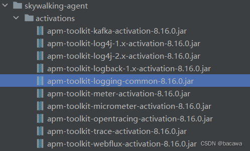

[参考](https://blog.csdn.net/miluan_ren/article/details/118187342)

### 一、skywalking服务端安装步骤

---

#### 1.1 前置环境

首先需要安装JDK，并确保以下端口可用：

- 11800：探针和Skywalking通讯的gRPC端口
- 12800：UI视图程序和Skywalking通讯的HTTP端口
- 8080：可视化视图UI服务的启动端口

#### 1.2 对oap进行配置

- 进入config文件夹，对application.yml文件进行编辑。

- 集群部分

  ```yaml
  cluster:
    # 配置我们是集群还是单节点。这里我们是单节点，所以不做改变。
    selector: ${SW_CLUSTER:standalone}

- 存储部分这里使用elasticsearch7

  ```yaml
  storage:
    selector: ${SW_STORAGE:elasticsearch}
    ……
    elasticsearch:
      # sky-walking 在 ES 中索引的前缀
      nameSpace: ${SW_NAMESPACE:"Sky-walking"}
      # 在 ES 安装的位置与端口
      clusterNodes: ${SW_STORAGE_ES_CLUSTER_NODES:0.0.0.0:9200}
  ```

- 自监控

  ```yaml
  prometheus-fetcher:
    selector: ${SW_PROMETHEUS_FETCHER:default}
    default:
      enabledRules: ${SW_PROMETHEUS_FETCHER_ENABLED_RULES:"self"}
      active: ${SW_PROMETHEUS_FETCHER_ACTIVE:true}
    ……
  telemetry:
    selector: ${SW_TELEMETRY:prometheus}

#### 1.3 对webapp进行配置

- 进入webapp文件夹，对application.yml进行编辑

  ```yaml
  serverPort: 8686
  
  # Comma seperated list of OAP addresses.
  oapServices: ${SW_OAP_ADDRESS:-http://0.0.0.0:12800}
  
  zipkinServices: ${SW_ZIPKIN_ADDRESS:-http://0.0.0.0:9412}
  ```

#### 1.4 启动

服务端OAP部署：

```bash
./oapService.sh
```

>注意：SkyWalking-oap-server服务启动后会暴露`11800`和`12800`两个端口，分别为收集监控数据的端口11800和接收前端请求的端口12800

服务端UI部署：

```bash
./webappService.sh
```

访问http://localhost:8686/


### 二、SpringBoot集成skywalking

---

#### 2.1 下载解压agent

>注意：agent版本和oap版本需要适配，版本不适配可能会出现页面无法访问、agent上报不到页面等问题。
>
>**下载地址**： https://skywalking.apache.org/downloads/

需要配置skywalking-agent文件夹下，config/agent.config配置文件，列出最关键的两个配置，其他配置大家可以自行摸索。

```properties
agent.service_name=${SW_AGENT_NAME:HS}
collector.backend_service=${SW_AGENT_COLLECTOR_BACKEND_SERVICES:127.0.0.0:11800}
```

#### 2.2 日志对接

在skywalking的UI端有一个日志模块，用于收集客户端的日志，默认是没有数据的，支持如下方式的日志对接。



下面使用springboot默认的logback为例子配置：

1. 引入依赖

   ```xml
   <!--打印skywalking的TraceId到日志-->
   <dependency>
     <groupId>org.apache.skywalking</groupId>
     <artifactId>apm-toolkit-logback-1.x</artifactId>
     <version>${skywalking.version}</version>
   </dependency>
   
   <dependency>
     <groupId>org.apache.skywalking</groupId>
     <artifactId>apm-toolkit-trace</artifactId>
     <version>${skywalking.version}</version>
   </dependency>
   ```

2. 添加配置文件，添加配置文件logback-spring.xml

   ```xml
   <?xml version="1.0" encoding="UTF-8"?>
   
   <configuration scan="true" scanPeriod="10 seconds" debug="true">
     <!--日志文件主目录：这里{user.home}为当前服务器用户主目录-->
     <property name="LOG_PATH" value="${user.home}/logs/xxx}"/>
   
     <!-- ERROR级别日志 -->
     <!-- 滚动记录文件，先将日志记录到指定文件，当符合某个条件时，将日志记录到其他文件 RollingFileAppender-->
     <appender name="ERROR" class="ch.qos.logback.core.rolling.RollingFileAppender">
       <File>${user.home}/logs/springboot-mybatis/springboot-mybatis_error.log</File>
       <!-- 过滤器，只记录WARN级别的日志 -->
       <filter class="ch.qos.logback.classic.filter.LevelFilter">
         <level>ERROR</level>
         <onMatch>ACCEPT</onMatch>
         <onMismatch>DENY</onMismatch>
       </filter>
       <!-- 最常用的滚动策略，它根据时间来制定滚动策略.既负责滚动也负责出发滚动 -->
       <rollingPolicy class="ch.qos.logback.core.rolling.TimeBasedRollingPolicy">
         <!--日志输出位置  可相对、和绝对路径 -->
         <fileNamePattern>${user.home}/logs/springboot-mybatis/springboot-mybatis-error-%d{yyyyMMdd}.log.%i</fileNamePattern>
         <timeBasedFileNamingAndTriggeringPolicy class="ch.qos.logback.core.rolling.SizeAndTimeBasedFNATP">
           <maxFileSize>500MB</maxFileSize>
         </timeBasedFileNamingAndTriggeringPolicy>
       </rollingPolicy>
   
       <encoder class="ch.qos.logback.classic.encoder.PatternLayoutEncoder">
         <Pattern>%d{yyyy-MM-dd HH:mm:ss.SSS} [%X{traceId}] [%thread] %-5level %logger{36} -%msg%n
         </Pattern>
       </encoder>
     </appender>
   
     <!-- DEBUG级别日志 appender -->
     <appender name="DEBUG" class="ch.qos.logback.core.rolling.RollingFileAppender">
       <File>${user.home}/logs/springboot-mybatis/springboot-mybatis_debug.log</File>
       <rollingPolicy class="ch.qos.logback.core.rolling.TimeBasedRollingPolicy">
         <fileNamePattern>${user.home}/logs/springboot-mybatis/springboot-mybatis-debug-%d{yyyyMMdd}.log.%i</fileNamePattern>
         <timeBasedFileNamingAndTriggeringPolicy class="ch.qos.logback.core.rolling.SizeAndTimeBasedFNATP">
           <maxFileSize>500MB</maxFileSize>
         </timeBasedFileNamingAndTriggeringPolicy>
       </rollingPolicy>
       <encoder class="ch.qos.logback.classic.encoder.PatternLayoutEncoder">
         <Pattern>%d{yyyy-MM-dd HH:mm:ss.SSS} [%X{traceId}] [%thread] %-5level %logger{36} -%msg%n
         </Pattern>
       </encoder>
     </appender>
   
     <!-- INFO级别日志 appender -->
     <appender name="INFO" class="ch.qos.logback.core.rolling.RollingFileAppender">
       <File>${user.home}/logs/springboot-mybatis/springboot-mybatis_info.log</File>
       <!-- 过滤器，只记录INFO级别的日志 -->
       <filter class="ch.qos.logback.classic.filter.LevelFilter">
         <level>INFO</level>
         <onMatch>ACCEPT</onMatch>
         <onMismatch>DENY</onMismatch>
       </filter>
       <rollingPolicy class="ch.qos.logback.core.rolling.TimeBasedRollingPolicy">
         <fileNamePattern>${user.home}/logs/springboot-mybatis/springboot-mybatis-info-%d{yyyyMMdd}.log.%i</fileNamePattern>
         <timeBasedFileNamingAndTriggeringPolicy class="ch.qos.logback.core.rolling.SizeAndTimeBasedFNATP">
           <maxFileSize>500MB</maxFileSize>
         </timeBasedFileNamingAndTriggeringPolicy>
       </rollingPolicy>
       <encoder class="ch.qos.logback.classic.encoder.PatternLayoutEncoder">
         <Pattern>%d{yyyy-MM-dd HH:mm:ss.SSS} [%X{traceId}] [%thread] %-5level %logger{36} -%msg%n
         </Pattern>
       </encoder>
     </appender>
   
     <appender name="STDOUT" class="ch.qos.logback.core.ConsoleAppender">
       <encoder charset="{log.charset}">
         <Pattern>%d{yyyy-MM-dd HH:mm:ss.SSS} [%X{traceId}] [%thread] %-5level %logger{36} -%msg%n
         </Pattern>
       </encoder>
     </appender>
   
     <appender name="grpc-log" class="org.apache.skywalking.apm.toolkit.log.logback.v1.x.log.GRPCLogClientAppender">
       <encoder class="ch.qos.logback.core.encoder.LayoutWrappingEncoder">
         <layout class="org.apache.skywalking.apm.toolkit.log.logback.v1.x.mdc.TraceIdMDCPatternLogbackLayout">
           <Pattern>%d{yyyy-MM-dd HH:mm:ss.SSS} [%X{tid}] [%thread] %-5level %logger{36} -%msg%n</Pattern>
         </layout>
       </encoder>
     </appender>
   
     <root level="INFO">
       <appender-ref ref="grpc-log"/>
       <appender-ref ref="INFO"/>
       <appender-ref ref="ERROR"/>
       <appender-ref ref="STDOUT"/>
     </root>
   
   </configuration>
   ```

   代码中添加日志

#### 2.3 使用探针方式启动

使用idea启动，配置VM options，javaagent配置的参数即skywalking-agent的绝对路径。

```
-javaagent:/Users/chenyang/dev/skywalking-agent/skywalking-agent.jar
```

启动工程

#### 2.4 使用jar启动

```
java -javaagent:D:\code\test\HS\src\main\skywalking-agent\skywalking-agent.jar -Dskywalking.agent.service_name=springboot-mybatis -Dskywalking.collector.backend_service=127.0.0.0:11800 -jar app.jar
```

