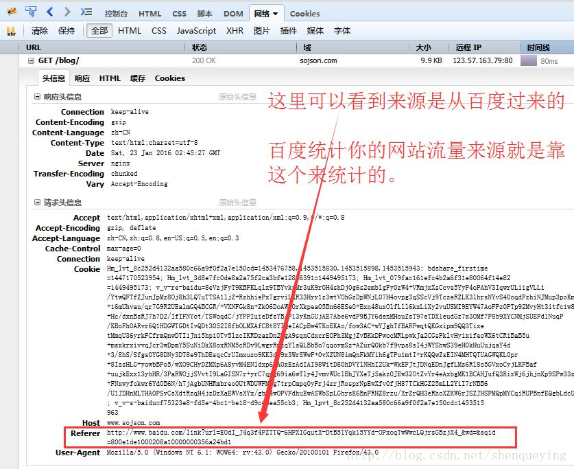

http请求头中Referer的含义和作用：

[Referer ](http://www.sojson.com/tag_referer.html)是 [ HTTP ](http://www.sojson.com/tag_http.html)请求`header` 的一部分，当浏览器向web 服务器发送请求的时候，头信息里有包含 [ Referer ](http://www.sojson.com/tag_referer.html)。比如我在www.google.com 里有一个`www.baidu.com` 链接，那么点击这个`www.baidu.com` ，它的`header` 信息里就有：Referer=http://www.google.com

由此可以看出来吧。它就是表示一个来源。看下图的一个请求的[ Referer ](http://www.sojson.com/tag_referer.html)信息。

>[Referer ](http://www.sojson.com/tag_referer.html)的正确英语拼法是`referrer` 。由于早期HTTP规范的拼写错误，为了保持向后兼容就将错就错了。其它网络技术的规范企图修正此问题，使用正确拼法，所以目前拼法不统一。还有它第一个字母是大写。

### 一、Referer作用

---

#### 1.1 防盗链

我在www.google.com里有一个`www.baidu.com`链接，那么点击这个`www.baidu.com`，它的header信息里就有：

> Referer=http://www.google.com

那么可以利用这个来防止盗链了，比如我只允许我自己的网站访问我自己的图片服务器，那我的域名是`www.google.com`，那么图片服务器每次取到Referer来判断一下是不是我自己的域名`www.google.com`，如果是就继续访问，不是就拦截。

这是不是就达到防盗链的效果了？

**将这个http请求发给服务器后，如果服务器要求必须是某个地址或者某几个地址才能访问，而你发送的referer不符合他的要求，就会拦截或者跳转到他要求的地址，然后再通过这个地址进行访问。**

#### 1.2 防止恶意请求

比如静态请求是`*.html`结尾的，动态请求是`*.shtml`，那么由此可以这么用，所有的`*.shtml`请求，必须[ Referer ](http://www.sojson.com/tag_referer.html)为我自己的网站。

> Referer=http://www.google.com

### 二、空Referer，什么情况下会出现Referer

---

首先，我们对空[ Referer ](http://www.sojson.com/tag_referer.html)的定义为，[ Referer ](http://www.sojson.com/tag_referer.html)头部的内容为空，或者，一个[ HTTP ](http://www.sojson.com/tag_http.html)请求中根本不包含[ Referer ](http://www.sojson.com/tag_referer.html)头部。

那么什么时候[ HTTP ](http://www.sojson.com/tag_http.html)请求会不包含[ Referer ](http://www.sojson.com/tag_referer.html)字段呢？根据Referer的定义，它的作用是指示一个请求是从哪里链接过来，那么当一个请求并不是由链接触发产生的，那么自然也就不需要指定这个请求的链接来源。

比如，直接在浏览器的地址栏中输入一个资源的URL地址，那么这种请求是不会包含[ Referer ](http://www.sojson.com/tag_referer.html)字段的，因为这是一个“凭空产生”的[ HTTP ](http://www.sojson.com/tag_http.html)请求，并不是从一个地方链接过去的。

### 那么在防盗链设置中，允许空Referer和不允许空Referer有什么区别？

允许[ Referer ](http://www.sojson.com/tag_referer.html)为空，意味着你允许比如浏览器直接访问，就是空。

