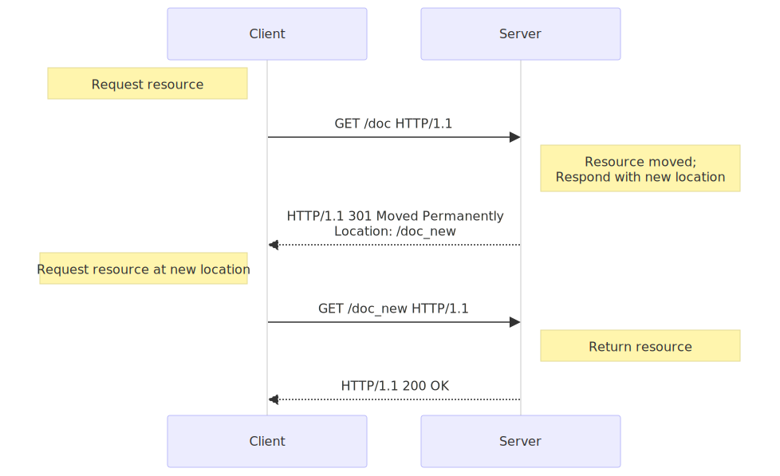

**URL 重定向**（也称为 *URL 转发*）是一种为页面、表单或者整个 Web 站点/应用提供多个 URL 地址的技术。HTTP 对此操作有一种特殊类型的响应，称为 **HTTP 重定向**（HTTP redirect）。

重定向可实现许多目标：

- 站点维护或停机期间的临时重定向。
- 永久重定向将在更改站点的 URL 后，保留现有的链接/书签、上传文件时表示进度的页面等。

### 一、原理

---

在 HTTP 协议中，重定向操作由服务器向请求发送特殊的重定向响应而触发。重定向响应包含以 `3` 开头的状态码，以及 **Location 标头**，其保存着重定向的 URL。

浏览器在接收到重定向时，它们会立刻加载 `Location` 标头中提供的新 URL。除了额外的往返操作中会有一小部分性能损失之外，重定向操作对于用户来说是不可见的。

不同类型的重定向映射可以划分为三个类别：

1. 永久重定向
2. 临时重定向
3. 特殊重定向

#### 永久重定向

这种重定向操作是**永久性**的。它表示原 URL 不应再被使用，而选用新的 URL 替换它。搜索引擎机器人、RSS 阅读器以及其他爬虫将更新资源原始的 URL。

| 状态码 | 状态文本           | 处理方法                                                | 典型应用场景                       |
| :----- | :----------------- | :------------------------------------------------------ | :--------------------------------- |
| 301    | Moved Permanently  | GET 方法不会发生变更。其他方法有可能会变更为 GET 方法。 | 网站重构。                         |
| 308    | Permanent Redirect | 方法和消息主体都不发生变化。                            | 使用用于非 GET 链接/操作重组网站。 |

#### 1.2 临时重定向

有时候请求的资源无法从其标准地址访问，但是却可以从另外的地方访问。在这种情况下，可以使用临时重定向。

搜索引擎和其他爬虫不会记录新的、临时的 URL。在创建、更新或者删除资源的时候，临时重定向也可以用于显示临时性的进度页面。

