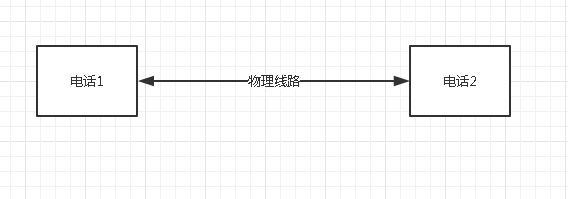
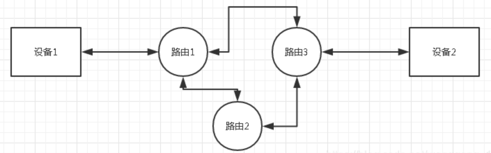
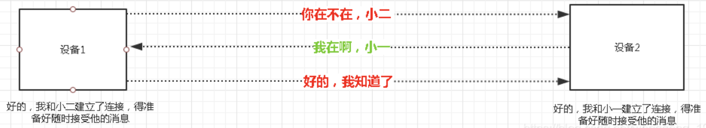

### 一、分组交换网络

---

最早的电话网络是以很容易理解的形式存在的，就是单纯的一根线加两端的设备，设备之间所沟通的所有信息都通过一根特定的电缆来回传输，如下图：

这样的连接是比较好理解的，搭起两边的线，就是一个连接。但是我们讨论的是计算机网络，计算机网络中两个设备节点如何通信？

计算机网络采取**分组交换技术**，什么意思呢？就是我有【一块数据】要发给对方小明，那我会把这【一块数据】分成N份【单位数据】，分别发出去，而每份【单位数据】走哪条路是不一定的，但是这些【单位数据】总要全部到达小明手里，小明再根据【单位数据】里记录的序号拼接起来，组成完整的【一块数据】。这就是分组的意思所在。

### 二、协议和协议实现

---

在具体的应用中，光有大体思路是不行的，还有很多细节问题，需要两个设备之间提前约定好协议，才能协同完成通信。举个例子：A向B发了10份【单位数据】，而B其实只收到9份【单位数据】，怎么办？

TCP协议大家都应该是知道的，但协议只是想法，真正起作用的是**在路由节点和设备节点上的协议软件**，是运行在设备上的具体执行者，它根据协议指导，对具体数据进行控制和操作。

认识到协议和协议软件这一点非常重要，因为**连接的限制恰恰就是受软件在设备中资源分配的影响的**。

### 三、连接的真面目

---

上面说的第一种电话网络，如果两个设备搭设了一条线，那么两个电话就一定确定对方在线，因为他俩独享一条实时存在的线。但计算机网络的连接呢？

像上面的图一样(图里不深究TCP，仅仅用来说明连接大体过程)，其实他们俩并不能确保对方就是在线，只是通过几番确认，认为对方一直会在。而如果确认了对方存在，那么就会为以后的对话通讯分配内存、CPU处理时间等资源，每个设备都会在本地去维持这么一个状态，来告诉自己是有一个连接的，这些设备所花的资源和维护的状态，就是连接。而整个网络是不会记录有着一条连接的，所以说**连接只是记录在各个设备的一个状态信息**。

那么，到现在我们知道了，连接其实并不是所谓的有一根电线连起两个设备，而是两方确认了一下对方的存在后，自己在本地记录的状态。那么下面可以讨论一下以前迷惑重重的概念了。

### 四、为什么服务器都有连接数量限制

---

有以下两点只做讨论：

1. **物理带宽**的限制，决定了一个时间段内发起连接的数据包不会超过某个数，造成了设备的链接数量的限制。
2. 维持连接需要分配内存等资源，**设备的资源**有限，决定了一定有个最大连接数的极限。

### 五、为什么需要TCB

---

我们找到的所有资料上都写着，**TCP是面向连接的服务**，所有要通过TCP进行通信的应用都要先建立连接才能通信，在通信完毕之后要记得关闭连接。

>结论：
>
>连接实际上是操作系统内核的一种数据结构，称为**TCP控制块（TCB）**，对于linux而言是`tcp_sock`结构。不光连接，连数据包也是由一个数据结构来控制，linux里面称为`sk_buff`结构。

当应用希望写数据时，并不是直接向网卡驱动发数据，而是**先放入到一个缓冲区中**，然后根据一定算法（达到一定数量或者调用flush之后），网卡主动从缓冲区中拷贝出来。

当网卡收到数据时，数据包要先经过如下几步：

1. 数据包要先经过**网卡校验**正确与否。
2. **数据链路层根据报头的类型传给不同的上层类型**（IP层或者其他），并移除了数据链路层报头。
3. IP层也需要先校验，然后**根据IP报头选择不同的类型（TCP或者UDP）**，然后移除IP层报头，并将剩余的数据发送到相应的处理程序（tcp或udp)。
4. 到了tcp层，处理程序此时**根据tcp首部中的端口号选择一个socket**，并将其载荷数据拷贝进去。

所以到这里，我们就应该知道，**每个socket必须要有自己独立的发送缓冲区和接收缓冲区**，并且还应该还有其他控制结构或者标示结构，这就构成了TCB，没有TCB，接收到的数据根本就不知道要传递到哪里？

对了，有一句话在这里没说，就是**网卡收到的数据是以数据流的形式**，然后在到某层的时候，它会负责将数据流构造成一个操作系统可以认识的数据结构的形式，这样对操作系统操作会非常方便。

### 六、为什么说四元组是连接的唯一标识

---

我们可能已经多次看到这样一种说法：**一个tcp连接由一个连接四元组唯一标识**。连接四元组是指`<\source ip,source port,target ip,target port>`。

在网络接收过程中是如何利用到这四元组呢？

看了上个部分，你可能会有种错觉，是网卡一步一步向上传递的。其实严格说并不是这样，**当网卡收到数据之后，首先经过校验没有错误之后，通过DMA直接发送到内存缓冲区中，然后给CPU发送一个中断信号，通知操作系统一个数据包到了**。

> 注意：这里面的内存缓冲区并不是socket的接收缓冲区，而是网卡驱动提前向操作系统申请的一块内存，并且驱动会提前告诉网卡这块内存的地址（注意是物理地址）和大小。如果没有这块内存缓冲区，那么网卡会直接将数据丢掉。

在操作系统获悉到一个数据包来到之后，就利用中断函数来一步步执行并解析数据包，到了TCP层，**TCP要决定将数据包发给那个socket的接收缓冲区**。

怎么找？这里TCP就是利用连接四元组，并**以这个四元组为key，查找hash表找到对应的socket的socket结构指针，并利用该指针找到对应socket的接收缓冲区，并将载荷数据拷贝进去**。

所以，一种常见的攻击是**SYN洪水**，它的原理就是，此时服务器会产生大量的socket结构，大量的占据内存，然而并没有ACK数据到达，这样，如果有成千上万个SYN请求，那服务器的内存很快就会耗完，服务器也就down了。

### 七、HTTP短链接和长连接

---

对于HTTP 1.0的http标准而言，默认连接是短连接。服务器当发送完最后一个字节的数据之后将关闭连接，也就是**回收tcp_sock结构**，这样，如果客户端再发送数据给服务器，将直接丢弃。即使此时客户端还有这样的结构，但是我们说连接已经关闭或者已经断了。

那客户端知不知道啥时候服务器的连接关闭？不知道，双方可以在任何时候来关闭自己的连接而没有必要通知对方。不过，对于短连接而言，通知不通知也没有意义了。

> 短连接的弊端：对一个服务器要连续发送多个请求，需要为每次请求建立新的连接。

为了降低建立连接的时间，HTTP 1.1引入了长连接的概念，并把它搞成了默认的连接方式。当完成一个业务之后，**socket结构并不回收**。这样，只要在socket结构还存在的时候，客户端发送的任何数据，服务器都可以收到，这就是所谓的长连接。

相比短连接而言，长连接并没有什么特别的新的技术，只是维护socket结构时间长了。因为，说http长连接更不如说是tcp长连接。

还有一种连接方式是pipeline，或者叫**管道化连接**。实际上，管道化连接是一种特殊形式的长连接。我们知道**长连接节约了建立连接的时间，但是对于连续N个请求，我们还是需要等前一个响应收到之后才能发送下一个请求，如果在一个timeline上看，有点象一个锯齿**。那我们知道网络传输的时间是很长的，那如果我们需要发起N个请求，客户端到服务器的传输时间为t，那总的时间为N*t*2；

如何缩短这部分时间呢？有人想到了个很自然的方法，我可不可以不等前一个响应回来就直接发送请求？在timeline图中就像在一个管子里不停的发请求，至于服务器的状态，我也根本不在乎。

管道化连接的方法的确降低了网络传输时间，但是它可能也引入了新的问题。因为客户端并不知道服务器啥时候关闭连接，那有可能管道里的请求，server处理了一部分就关闭了。但是客户端并不知道server处理了哪些？客户端只能选择重新建立连接并重传这些请求。如果这些请求全是对静态数据的请求也就罢了，如果是动态post数据，比如一个订单数据，再不幸的是server已经处理了这个数据，再来一份数据，server将再会处理一遍。这对用户实际的意图讲相差甚远。

也正是这个原因，管道化连接最好不要轻易使用。