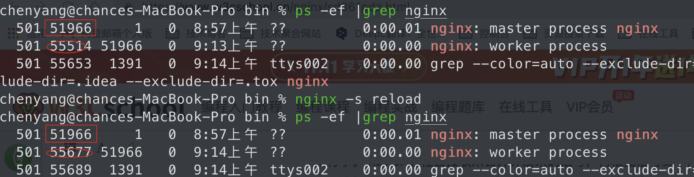
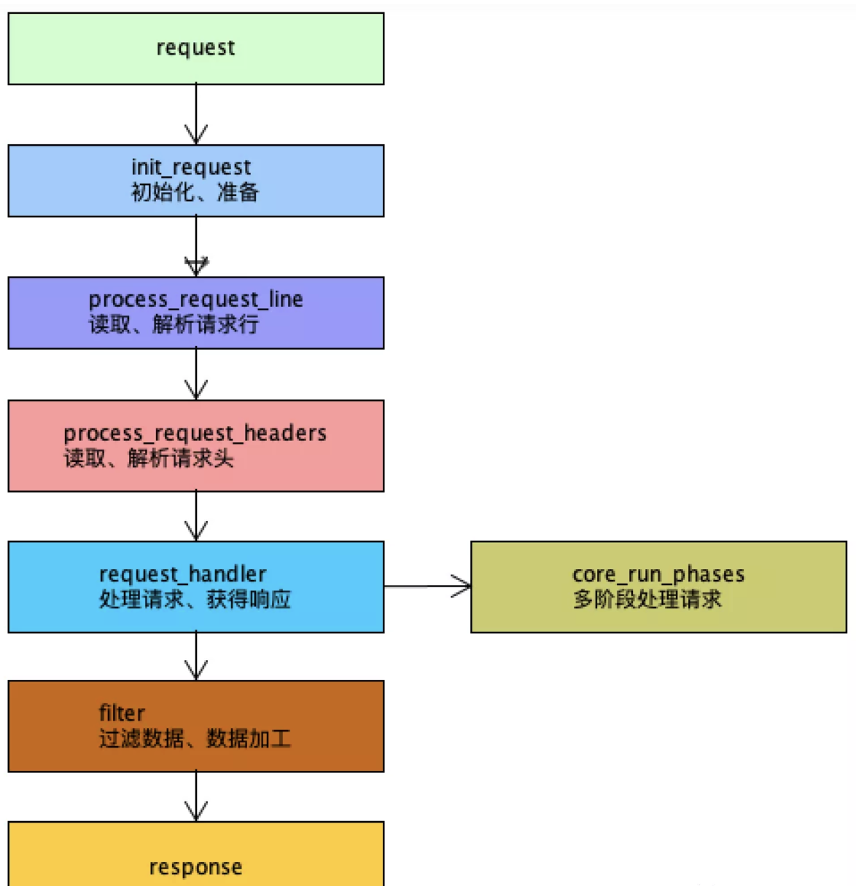

nginx启动后，在unix系统中会以daemon（守护进程）的方式在后台运行，后台进程包含一个master进程和多个worker进程。可以手动地关掉后台模式，让nginx在前台运行，并且通过配置让nginx取消master进程，从而可以使 nginx 以单进程方式运行（关闭后台模式，一般是用来调试用的）。nginx 是以**多进程**的方式来工作的，当然 nginx 也是**支持多线程**的方式的，只是我们主流的方式还是多进程的方式，也是 nginx 的默认方式。

master 进程主要用来管理 worker 进程，包含：接收来自外界的信号，向各 worker 进程发送信号，监控 worker 进程的运行状态，当 worker 进程退出后(异常情况下)，会自动重新启动新的 worker 进程。而基本的网络事件，则是放在 worker 进程中来处理。多个 worker 进程之间是对等的，他们**同等竞争来自客户端的请求**，各进程互相之间是独立的。**一个请求，只可能在一个 worker 进程中处理**，一个 worker 进程，不可能处理其它进程的请求。worker 进程的个数是可以设置的，一般我们会设置与机器cpu核数一致，这与 nginx 的进程模型以及事件处理模型是分不开的。nginx 的进程模型，可以由下图来表示：


### 一、如何操作nginx

---

我们只需要与 master 进程通信就行了。master 进程会接收来自外界发来的信号，再根据信号做不同的事情。要控制 nginx，只需要**通过 kill 向 master 进程发送信号就行了**。比如`kill -HUP pid`，则是告诉 nginx，从容地重启 Nginx，服务是不中断的。

master 进程在接收到 HUP 信号后是怎么做的呢？首先 master 进程在接到信号后，会先重新加载配置文件，然后再启动新的 worker 进程，并向所有老的 worker 进程发送信号，告诉他们可以光荣退休了。新的 worker 在启动后，就开始接收新的请求，而老的 worker 在收到来自 master 的信号后，就不再接收新的请求，并且在当前进程中的所有未处理完的请求处理完成后，再退出。Nginx 在 0.8 版本之后，引入了一系列命令行参数，来方便我们管理。比如，`./nginx -s reload`，就是来重启 Nginx，`./nginx -s stop`，就是来停止 Nginx 的运行。




### 二、worker进程如何处理请求

---

当我们提供 80 端口的 http 服务时，一个连接请求过来，每个进程都有可能处理这个连接，怎么做到的呢？首先，每个 worker 进程都是从 master 进程 fork 过来，在 master 进程里面，先建立好需要 listen 的 socket（listenfd）之后，然后再 fork 出多个 worker 进程。所有 worker 进程的 listenfd 会在新连接到来时变得可读，为保证只有一个进程处理该连接，所有 worker 进程在注册 listenfd 读事件前抢 accept_mutex，**抢到互斥锁的那个进程注册 listenfd 读事件，在读事件里调用 accept 接受该连接**。当一个 worker 进程在 accept 这个连接之后，就开始读取请求，解析请求，处理请求，产生数据后，再返回给客户端，最后才断开连接，这样一个完整的请求就是这样的了。


### 三、nginx进程模型的好处

---

多进程：一个master进程，多个worker进程。

- master主进程（管理worker进程）
  - 对外接口：接收外部的操作(信号)；
  - 对内转发：根据外部的操作的不同，通过信号管理worker；
  - 监控：监控worker进程的运行状态，worker进程运行异常终止后，自动重启worker进程。
- worker进程（所有worker进程都是平等的）
  - 实际处理：网络请求，由worker进程处理；
  - worker进程数量：在nginx.conf中配置，一般设置为核心数，充分利用cpu资源。同时避免进程数量过多，避免进程竞争CPU资源，增加上下文切换的损耗。

>master工作过程细节：
>
>1. master启动，加载配置，并初始化监听socket，等待连接进来
>2. master fork出worker进程
>3. 新请求到来时，所有worker进程的listenfd都变为可读
>4. worker进程，竞争accept_mutex获胜的注册listenfd的读事件
>5. worker进程，在读事件中，accpet当前连接并处理请求


### 四、如何处理事件

---

nginx 采用多 worker 的方式来处理请求，**每个 worker 里面只有一个主线程**，那能够处理的并发数很有限啊，多少个 worker 就能处理多少个并发，何来高并发呢？**nginx 采用了异步非阻塞的方式来处理请求**，即nginx 是可以同时处理成千上万个请求的。想想 apache 的常用工作方式（apache 也有异步非阻塞版本，但因其与自带某些模块冲突，所以不常用），每个请求会独占一个工作线程，当并发数上到几千时，就同时有几千的线程在处理请求了。这对操作系统来说，是个不小的挑战，**线程带来的内存占用非常大**，线程的上下文切换带来的 cpu 开销很大，自然性能就上不去了，而这些开销完全是没有意义的。



多阶段处理请求：

1. 请求地址重写
2. 权限验证
3. 内容处理（对应location配置）
4. 记录日志

过滤数据并加工：

1. 过滤response的Header
2. gzip压缩数据


### 五、为什么采用异步非阻塞的方式

---

一个请求的完整过程：

- 首先，请求过来，要**建立连接**，然后再接收数据，接收数据后，再发送数据。
- 具体到系统底层，就是**读写事件**，而当读写事件没有准备好时，必然不可操作，如果不用非阻塞的方式来调用，那就得阻塞调用了，事件没有准备好，那就只能等了，等事件准备好了，你再继续吧。阻塞调用会进入内核等待，cpu 就会让出去给别人用了，对单线程的 worker 来说，显然不合适，当网络事件越多时，大家都在等待呢，cpu 空闲下来没人用，cpu利用率自然上不去了，更别谈高并发了。如果加进程数，这跟apache的线程模型有什么区别，注意，**别增加无谓的上下文切换**。在 nginx 里面，最忌讳阻塞的系统调用。
- 非阻塞就是，**事件没有准备好，马上返回 EAGAIN**，告诉你，事件还没准备好，过会再来吧。过一会，再来检查一下事件，直到事件准备好了为止，在这期间，可以先去做其它事情，然后再来看看事件好了没。虽然不阻塞了，但你得不时地过来检查一下事件的状态，你可以做更多的事情了，但带来的开销也是不小的。所以，才会有了**异步非阻塞的事件处理机制**，具体到系统调用就是像 select/poll/epoll/kqueue 这样的系统调用。它们提供了一种机制，让你可以**同时监控多个事件**，调用他们是阻塞的，但可以设置超时时间，在超时时间之内，如果有事件准备好了，就返回。

> 异步非阻塞的事件处理机制正好解决了我们上面的两个问题，拿 epoll 为例(在后面的例子中，我们多以 epoll 为例子，以代表这一类函数)。
>
> - 当事件没准备好时，放到 epoll 里面，**事件准备好了，我们就去读写**；
> - 当读写返回 EAGAIN 时，我们将它再次加入到 epoll 里面。
>
> 这样，只要有事件准备好了，我们就去处理它，只有当所有事件都没准备好时，才在 epoll 里面等着。这样，就可以并发处理大量的并发了，这里的并发请求，是指未处理完的请求，线程只有一个，所以同时能处理的请求当然只有一个了，只是在请求间进行不断地切换而已，切换也是因为异步事件未准备好，而主动让出的。**这里的切换是没有任何代价**，循环处理多个准备好的事件。

与多线程相比，这种事件处理方式是有很大的优势的：

- 不需要创建线程
- 每个请求占用的内存也很少
- 没有上下文切换，事件处理非常的轻量级
- 并发数再多也不会导致无谓的资源浪费（上下文切换）
- 更多的并发数，只是会占用更多的内存而已。 

对连接数进行过测试，在 24G 内存的机器上，处理的并发请求数达到过 200 万。现在的网络服务器基本都采用这种方式，这也是nginx性能高效的主要原因。


### 六、总结

---

对于一个基本的 Web 服务器来说，事件通常有三种类型：

1. 网络事件
2. 信号
3. 定时器

网络事件通过异步非阻塞可以很好的解决掉。如何处理信号与定时器？

首先，信号的处理。对 nginx 来说，有一些特定的信号，代表着特定的意义。信号会中断掉程序当前的运行，在改变状态后，继续执行。如果是系统调用，则可能会导致系统调用的失败，需要重入。关于信号的处理，大家可以学习一些专业书籍，这里不多说。对于 nginx 来说，如果nginx正在等待事件（epoll_wait 时），如果程序收到信号，在信号处理函数处理完后，epoll_wait 会返回错误，然后程序可再次进入 epoll_wait 调用。

另外，再来看看定时器。由于 epoll_wait 等函数在调用的时候是可以设置一个超时时间的，所以 **nginx 借助这个超时时间来实现定时器**。nginx里面的定时器事件是放在一颗维护定时器的红黑树里面，每次在进入 epoll_wait前，先从该红黑树里面拿到所有定时器事件的最小时间，在计算出 epoll_wait 的超时时间后进入 epoll_wait。所以，当没有事件产生，也没有中断信号时，epoll_wait 会超时，也就是说，定时器事件到了。这时，nginx会检查所有的超时事件，将他们的状态设置为超时，然后再去处理网络事件。由此可以看出，当我们写 nginx 代码时，在处理网络事件的回调函数时，通常做的第一个事情就是判断超时，然后再去处理网络事件。

用如下伪代码来总结一下nginx的事件处理模型：

```java
while (true) {
  for t in run_tasks:
  t.handler();
  update_time(&now);
  timeout = ETERNITY;
  for t in wait_tasks: /* sorted already */
  if (t.time <= now) {
    t.timeout_handler();
  } else {
    timeout = t.time - now;
    break;
  }
  nevents = poll_function(events, timeout);
  for i in nevents:
  task t;
  if (events[i].type == READ) {
    t.handler = read_handler;
  } else { /* events[i].type == WRITE */
    t.handler = write_handler;
  }
  run_tasks_add(t);
}
```