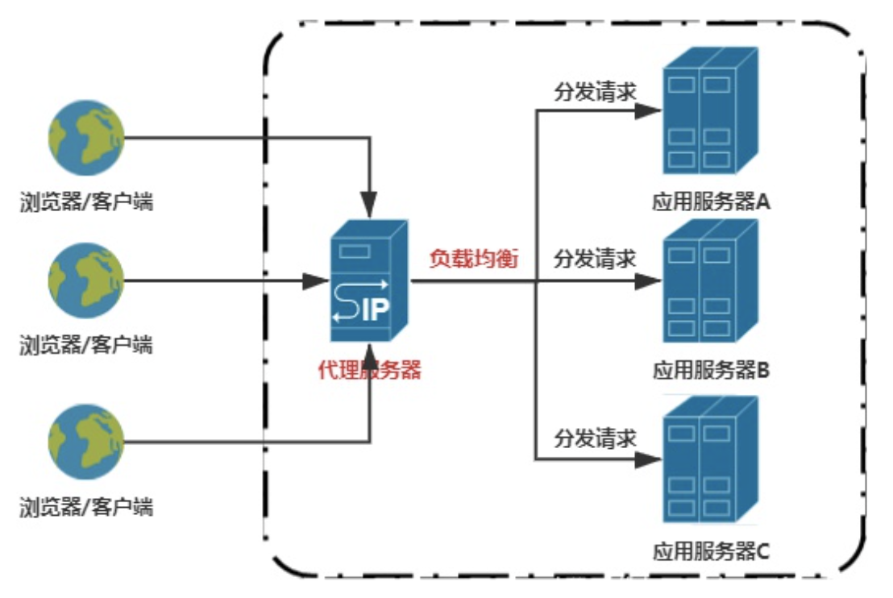

### 一、代理服务

---


代理分为正向代理和反向代理。


### 二、正向代理

---


#### 2.1 正向代理转发https说明

在实现nginx正向代理之前，先说明一下，现在的网站基本上都是https，因此要实现nginx正向代理转发请求，除了要配置**转发http80端口的请求**，还有**配置https443端口的请求**。

>nginx正向代理转发http，这样写没毛病，可以正常转发。

```json
server {
	resolver 114.114.114.114;	#指定DNS服务器IP地址
	listen 80;
	location / {
		proxy_pass http://$host$request_uri;	#设定代理服务器的协议和地址
		proxy_buffers 256 4k;
		proxy_max_temp_file_size 0k;
		proxy_connect_timeout 30;
		proxy_send_timeout 60;
		proxy_read_timeout 60;
		proxy_next_upstream error timeout invalid_header http_502;
	}
}
```

>nginx不支持直接转发https，网上这样配置并不会生效。

```json
server {
	resolver 114.114.114.114;	#指定DNS服务器IP地址
	listen 443;
	location / {
		proxy_pass https://$host$request_uri;	#设定代理服务器的协议和地址
		proxy_buffers 256 4k;
		proxy_max_temp_file_size 0k;
		proxy_connect_timeout 30;
		proxy_send_timeout 60;
		proxy_read_timeout 60;
		proxy_next_upstream error timeout invalid_header http_502;
	}
}
```

如上配置，http请求正常转发了，但是发现https并没有转成功，而是报错HTTP/1.1 400 Bad Request。

nginx官方并不支持直接转发https请求，阿里的一个大佬对nginx拓展了一个ngx_http_proxy_connect_module模块，并且在github上开源了https://github.com/chobits/ngx_http_proxy_connect_module。

不过维护的ngx_http_proxy_connect_module模块的补丁也是有nginx版本限制的（目前维护了1.4.x~1.19.x版本），如README.md说明：

如果安装的nginx版本不在1.4.x~1.19.x这个范围内，那无法支持正向代理转发https请求。

#### 2.2 安装nginx

1. 以1.9.2版本为例，使用root用户进行安装：

   ```shell
   $ cd /usr/nginx
   $ wget http://nginx.org/download/nginx-1.9.2.tar.gz
   $ tar -xzvf nginx-1.9.2.tar.gz
   $ cd /usr/nginx/nginx-1.9.2
   $ make && make install
   ```

   这里安装nginx通过install进行编译安装，编译后默认安装目录为`/usr/local/nginx`，后续配置新模块ngx_http_proxy_connect_module还需要重新install编译一次。

2. 下载新模块：GitHub上下载`ngx_http_proxy_connect_module`的zip压缩包源码。

   ```shell
   GitHub - chobits/ngx_http_proxy_connect_module: A forward proxy module for CONNECT request handling
   ```

3. 将新模块ngx_http_proxy_connect_module源码压缩包上传到服务器/usr/nginx目录，并解压并重命名。

   ```shell
   $ mkdir -p /usr/nginx
   $ cd /usr/nginx
   $ /usr/nginx
   $ unzip ngx_http_proxy_connect_module-master.zip
   $ mv ngx_http_proxy_connect_module-master ngx_http_proxy_connect_module
   ```

4. 使用root用户进入nginx的资源目录/usr/nginx/nginx-1.9.2，给nginx添加新模块ngx_http_proxy_connect_module和并重新编译nginx。

   ```shell
   $ /usr/nginx/nginx-1.9.2
   $ patch -p1 < /usr/nginx/ngx_http_proxy_connect_module/patch/proxy_connect.patch
   $ ./configure --add-module=/usr/nginx/ngx_http_proxy_connect_module
   $ make && make install
   ```

   这里nginx-1.9.2版本对应proxy_connect.patch补丁

5. 使用root用户安装和编译新模块完成后，如果你希望后续不使用root用户运维，可以授权安装目录/usr/local/nginx给nginx用户或者其他普通用户。

   ```shell
   chown -R nginx:nginx /usr/local/nginx
   chown root:root /usr/local/nginx/sbin/nginx
   chmod +s /usr/local/nginx/sbin/nginx
   ```

   二进制/usr/local/nginx/sbin/nginx文件需要重新归属为root用户，并且权限位添加s权限（权限位+s的二进制文件属于是管道文件，也就是普通用户也可执行该二进制文件，执行后产生的进程属于该文件的权限所有者，这里文件所有者是root）。

6. 修改nginx的配置分别添加`http`和`https`的`server`，其他配置保持不变。

   ```shell
   vi /usr/local/nginx/conf/nginx.conf
   ```

7. 这两个`server`主要配置是对`DNS解析`和`proxy_pass代理`进行：

   ```json
   #正向代理转发http请求
   server {
     resolver 114.114.114.114	#指定DNS服务器IP地址
     listen 80;	#监听80端口，http默认端口80
     server_name localhost;	#服务器IP或域名
     location / {	#正向代理转发http请求
       proxy_pass                 http://$host$request_uri;
       proxy_set_header           HOST $host;
       proxy_buffers              256 4k;
       proxy_max_temp_file_size   0k;
       proxy_connect_timeout      30;
       proxy_send_timeout         60;
       proxy_read_timeout         60;
       proxy_next_upstream error  timeout invalid_header http_502;
     }
   }
   ```

   ```shell
   #正向代理转发https请求
   server {
   resolver 114.114.114.114;	#指定DNS服务器IP地址
   listen 443;	#监听443端口，https默认端口443
   proxy_connect;	#正向代理转发https请求
       proxy_connect_allow            443 563;
       proxy_connect_connect_timeout  10s;
       proxy_connect_read_timeout     10s;
       proxy_connect_send_timeout     10s;
       location / {
           proxy_pass http://$host;
           proxy_set_header Host $host;
       }
   }
   ```

   ```
   – DNS说明：
   （国内外）目前比较主流的DNS：
   （国外）谷歌：8.8.8.8 Google Developers
   （国外）OpenDNS：208.67.222.222 signup.opendns.com
   （国内）114：114.114.114.114 114DNS--抗攻击DNS，超高可靠，提供智能DNS解析。公众DNS服务地址为114.114.114.114
   （国内）腾讯：119.29.29.29 www.dnspod.cn
   （国内）阿里：223.5.5.5 阿里DNS
   （国内）百度：180.76.76.76 dudns.baidu.com
   ```

8. 检查和刷新nginx配置

   ```shell
   /usr/local/nginx/sbin/nginx -t
   /usr/local/nginx/sbin/nginx -s reload
   ```

9. Linux下验证代理服务器是否能正常代理转发http和https请求

   ```shell
   curl http://www.baidu.com -v -x 127.0.0.1:80
   curl https://www.baidu.com -v -x 127.0.0.1:443
   ```


### 三、反向代理

---



反向代理，指的是浏览器/客户端并不知道自己要访问具体哪台目标服务器，只知道去访问代理服务器，代理服务器再通过反向代理+负载均衡实现请求分发到应用服务器的一种代理服务。 

**反向代理服务的特点是代理服务器代理的对象是应用服务器，也就是对于浏览器/客户端来说应用服务器是隐藏的**。

#### 3.1 nginx实现反向代理

修改nginx配置vi /usr/local/nginx/conf/nginx.conf 在http模块中配置如下：

```json
# 反向代理+负载均衡
upstream reverseProxyServer {
	#负载均衡应用服务器A：权重为10。10s内连接请求失败2次，nginx在10s内任务server是不可用的，将不再发送请求给这台服务器
	server 192.168.0.1:8080 weight=10 max_fails=2 fail_timeout=10s;
	server 192.168.0.2:8080 weight=5 max_fails=2 fail_timeout=10s;
	server 192.168.0.3:8080 weight=5 max_fails=2 fail_timeout=10s;
}

server {
	listen		80;	#监听80端口
	server_name	localhost;	#服务器ip或域名

	location / {
		root 	html;
		index	index.html	index.htm;
	}

	# 反向代理请求路径中含有/appname的所有请求到upstream定义的对应反向代理模块
	location /appname {
		proxy_pass http://reverseProxyServer;
	}
}
```

检查刷新nginx配置：

```shell
/usr/local/nginx/sbin/nginx -t
/usr/local/nginx/sbin/nginx -s reload
```

浏览器访问：http://代理服务器ip:8080/appname/ReverseProxy1.thml