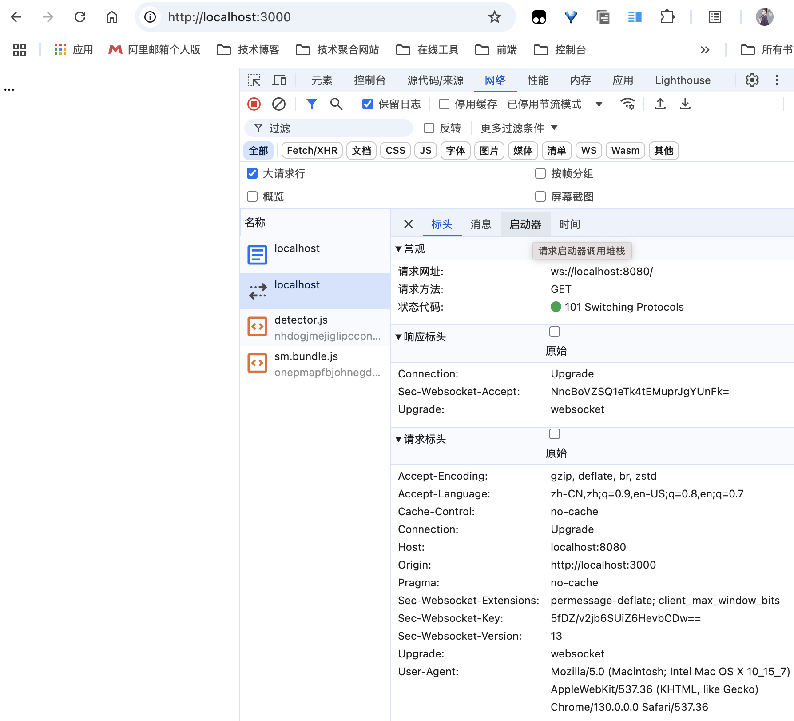
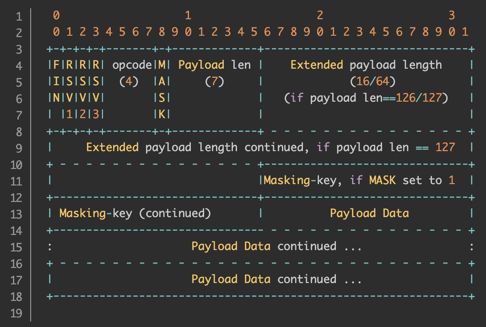

### 一、概览

---

websocket是一种协议，它的出现，使得浏览器具备了实时双向通信的能力。


### 二、什么是websocket

---

websocket是H5提供的一种全双工网络通讯技术，它属于应用层协议，**基于TCP传输协议，复用HTTP的握手通道**。

#### 2.1 特点

1. 可以在浏览器中使用
2. 支持双向通信
3. 使用简单

>- 单工：简单的说就是一方只能发信息，另一方则只能收信息，通信是单向的，类似传呼机。
>- 半双工：比单工先进一点，就是双方都能发信息，但同一时间则只能一方发信息，类似对讲机。
>- 全双工：比半双工再先进一点，就是双方不仅都能发信息，而且能够同时发送，类似电话。

#### 2.2 对比HTTP协议的优点

1. 支持双向通信，实时性更强。
2. 对二进制支持更好。
3. 较少的控制开销。连接创建后，websocket 客户端、服务端进行数据交换时协议控制的数据包头部较小。在不包含头部的情况下，服务端到客户端的包头只有2~10字节（取决于数据包长度），客户端到服务端的的话，需要加上额外 4个字节的掩码。而 HTTP 协议每次通信都需要携带完整的头部。（简单来说，就是通讯资源开销少了）
4. 支持扩展。websocket 协议定义了扩展，用户可以扩展协议，或者实现自定义的子协议。（比如支持自定义压缩算法等）


### 三、如何使用

---

为了方便，这里使用 ws 这个库。相比 socket.io 库，ws 实现更加轻量，也更加适合学习。

#### 3.1 服务端

构建一个 express 服务端，使其监听 3000 端口，然后在服务器中开启 8080 端口供 websocket 使用。

通过 on-connection 方法进行 ws 连接，通过 on-message 方法进行消息监听，当收到来自客户端的消息时，打印消息。

```js
var app = require('express')();
var server = require('http').Server(app);
// 引入 ws 库
var WebSocket = require('ws');

// websocket server 使用 8080 端口
var wss = new WebSocket.Server({ port: 8080 });

wss.on('connection', function connection(ws) {
    console.log('server: receive connection.');
    
    // 监听客户端发来的消息
    ws.on('message', function incoming(message) {
        console.log('server: received: %s', message);
    });

    // 服务端发送消息出去
    ws.send('world');
});

// 渲染客户端页面
app.get('/', function (req, res) {
  res.sendfile(__dirname + '/index.html');
});

// 服务端使用 3000 端口
app.listen(3000);
```

#### 3.2 客户端

在客户端中，我们 通过 WebSocket 构造函数向 8080 端口发起 WebSocket 连接。

连接建立后，我们通过 onmessage 方法监听来自服务器的消息并打印消息，同时通过 onopen 方法中的 send 方法向服务端发送消息。
```html
<!DOCTYPE html>
<html lang="en">
...
<script>
  // 连接到 websocket 服务
  var ws = new WebSocket('ws://localhost:8080');

  ws.onopen = function () {
    console.log('ws onopen');
    ws.send('from client: hello');
  };

  ws.onmessage = function (e) {
    console.log('ws onmessage');
    console.log('from server: ' + e.data);
  };
</script>
```

#### 3.3 运行结果

服务端输出：

```
server: receive connection.
server: received hello
```

客户端输出：

```
client: ws connection is open
client: received world
```


### 四、ws是如何建立连接的

---

WebSocket 复用了 HTTP 的握手通道。具体指的是，客户端通过 HTTP 请求与 WebSocket 服务端协商升级协议。协议升级完成后，后续的数据交换则遵照 WebSocket 的协议来进行通信。

#### 4.1 客户端：申请协议升级

首先，客户端使用 `var ws = new WebSocket('ws://localhost:8080')` 发起协议升级的 HTTP 请求，采用的是标准的 HTTP 报文格式，且只支持 GET 方法。

浏览器访问http://localhost:3000/。



此次请求的首部如下（非完整，省略了不重要的首部）：

```http
GET / HTTP/1.1
Host: localhost:8080
Origin: http://localhost:3000
Connection: Upgrade
Upgrade: websocket
Sec-WebSocket-Version: 13
Sec-WebSocket-Key: 5fDZ/v2jb6SUiZ6HevbCDw==
```

- `Connection: Upgrade`：表示要升级协议。
- `Upgrade: websocket`：表示要升级成 WebSocket 协议。
- `Sec-WebSocket-Version: 13`：表示 WebSocket 的版本。如果服务端不支持该版本，需要返回一个 Sec-WebSocket-Versionheader，里面包含服务端支持的版本号。
- `Sec-WebSocket-Key`：与后面服务端响应首部的 Sec-WebSocket-Accept 是配套的，提供基本的防护，比如恶意的连接，或者无意的连接。

#### 4.2 服务端：响应协议升级

服务端返回内容如下：

```http
HTTP/1.1 101 Switching Protocols
Connection:Upgrade
Upgrade: websocket
Sec-WebSocket-Accept: NncBoVZSQ1eTk4tEMuprJgYUnFk=
```

状态代码101表示协议切换成功，到此完成协议升级，后续的数据交互都按照新的协议来。（例如后期的错误码，会按照新的协议来）。

#### 4.3 Sec-WebSocket-Accept的计算

>Sec-WebSocket-Accept 头（header） 用在 WebSocket 开放握手中。 它会出现在响应头中。 也就是说，这是由服务器发送到客户端的头（header），用以告知服务器愿发起一个 WebSocket 连接。

`Sec-WebSocket-Accept` 是根据客户端请求首部的 `Sec-WebSocket-Key` 计算出来的。

计算公式：

1. 将 `Sec-WebSocket-Key` 跟 `258EAFA5-E914-47DA-95CA-C5AB0DC85B11` 拼接。
2. 通过 `SHA1` 计算出摘要，并转成 `base64` 字符串。

验证：

```js
// Sec-WebSocket-Accept 是根据客户端请求首部的 Sec-WebSocket-Key 计算出来的
//1.将 Sec-WebSocket-Key 跟 258EAFA5-E914-47DA-95CA-C5AB0DC85B11 拼接。
//2.通过 SHA1 计算出摘要，并转成 base64 字符串。
const crypto = require('crypto');
const magic = '258EAFA5-E914-47DA-95CA-C5AB0DC85B11';
const secWebSocketKey = '5fDZ/v2jb6SUiZ6HevbCDw==';

let secWebSocketAccept = crypto.createHash('sha1')
	.update(secWebSocketKey + magic)
	.digest('base64');

console.log(secWebSocketAccept);
// NncBoVZSQ1eTk4tEMuprJgYUnFk=
```


### 五、数据帧格式

---

在 webSocket 协议中，数据是通过 **数据帧** 来传递的。

协议规定了数据帧的格式，A 端要想给 B 端推送数据，必须要将推送的数据 **组装** 成一个数据帧，这样 B 端才能接收到正确的数据；同样，B 端接收到 A 端发送的数据时，必须按照帧的格式来 **解包**，才能真确获取 A 端发来的数据。

webSocket 数据帧格式如下：



该图乍一看比较懵逼，但是其实理解起来特别简单。最上方的第二排数字，每个数字表示一个 bit 位，这个可以用来确定数据帧格式的每一部分占用的 bit 位数。

> 1位=1比特；1字=2字节；1字节=8位；1字=16位。

然后，从该图的左上角开始，依次介绍一下他们的作用。

#### 5.1 FIN

占用**1个bit位**，**用来标记当前数据帧是不是最后一个数据帧**，因为一个消息可能分成多个数据帧来传递，当然，如果只需要一个数据帧的话，第一个数据帧也就是最后一个。

#### 5.2 RSV1,RSV2,RSV3

这三儿各占用**1个 bit 位**，根据 RFC 的介绍，这三个 bit 位是用做扩展用途，没有这个需求的话都会设置为 0。

#### 5.3 Opcode

Opcode（opration code） 故名思议，操作码，占用 **4 个 bit 位**，也就是一个 16 进制数，它用来描述要传递的数据是什么或者用来干嘛的，只能为下面这些值：

>4 个 1：二进制 1111，代表十进制中的 15，0-15，可以表示 16 个数，就可以用来表示 16 进制

- 0x0 denotes a continuation frame 标示当前数据帧为分片的数据帧，也就是当一个消息需要分成多个数据帧来传送的时候，需要将 opcode 设置位 0x0。
- 0x1 denotes a text frame 标示当前数据帧传递的内容是文本。
- 0x2 denotes a binary frame 标示当前数据帧传递的是二进制内容，不要转换成字符串。
- 0x8 denotes a connection close 标示请求关闭连接。
- 0x9 denotes a ping 标示 Ping 请求。
- 0xA denotes a pong 标示 Pong 数据包，当收到 Ping 请求时自动给回一个 Pong。

目前协议中就规定了这么多，0x3 - 0x7（3 到 7） 以及 0xB - 0xF（11 到 15） 都是用来预留作其它用途。

#### 5.4 MASK

占用一个 bit 位，标示数据有没有使用掩码，RFC 中有说明，服务端发送给客户端的数据帧 **不能** 使用掩码，客户端发送给服务端的数据帧 **必须** 使用掩码。

如果一个帧的数据使用了掩码，那么在 Maksing-key 部分必须是一个 32 个 bit 位的掩码，用来给服务端解码数据。


### 六、组装数据帧

---

#### 6.1 掩码算法

掩码键（Masking-key）是由客户端挑选出来的 32 位的随机数。掩码操作不会影响数据载荷的长度。掩码、反掩码操作都采用如下算法：

首先，假设：

- original-octet-i：为原始数据的第 i 个字节。
- transformed-octet-i：为转换后的数据的第 i 个字节。
- j：为 i mod 4 的结果。
- masking-key-octet-j：为 mask key 第 j 个字节。

>j = i MOD 4 transformed-octet-i = original-octet-i XOR masking-key-octet-j

#### 6.2 数据分片

WebSocket 的每条消息可能被切分为多个数据帧。当 webSocket 的接收方收到一个数据帧时，会根据 FIN 的值来判断，是否已经收到消息的最后一个数据帧。

当接收到的数据帧 FIN 为 1 时，表示当前数据帧为消息的最后一个数据帧，此时接收方已经收到完整的消息，可以对消息进行处理。当接收到的数据帧 FIN 为 0 时，则接收方还需要继续监听接收其余的数据帧。

此外，opcode 在数据交换的场景下，表示的是数据的类型。0x1 表示文本，0x2 表示二进制。而 0x0 比较特殊，表示延续帧（continuation frame），顾名思义，就是完整消息对应的数据帧还没接收完。

#### 6.3 数据分片例子

```http
Client: FIN=1, opcode=0x1, msg="hello"
Server: (process complete message immediately) Hi.
Client: FIN=0, opcode=0x1, msg="and a"
Server: (listening, new message containing text started)
Client: FIN=0, opcode=0x0, msg="happy new"
Server: (listening, payload concatenated to previous message)
Client: FIN=1, opcode=0x0, msg="year!"
Server: (process complete message) Happy new year to you too!
```

**第一条消息**

FIN=1, 表示是当前消息的最后一个数据帧。服务端收到当前数据帧后，可以处理消息。opcode=0x1，表示客户端发送的是文本类型。

**第二条消息**
FIN=0，opcode=0x1，表示发送的是文本类型，且消息还没发送完成，还有后续的数据帧。

FIN=0，opcode=0x0，表示消息还没发送完成，还有后续的数据帧，当前的数据帧需要接在上一条数据帧之后。

FIN=1，opcode=0x0，表示消息已经发送完成，没有后续的数据帧，当前的数据帧需要接在上一条数据帧之后。服务端可以将关联的数据帧组装成完整的消息。


### 七、保持心跳

---

WebSocket 为了保证客户端、服务端能够进行实时的双向通信，需要确保客户端、服务端之间的 TCP 通道保持连接没有断开。然而，对于长时间没有数据往来的连接，如果依旧长时间保持着，会造成连接资源的浪费。

但不排除有些场景，客户端、服务端虽然长时间没有数据往来，但仍需要保持连接。这个时候，可以采用心跳的方式来实现。

- 发送方->接收方：ping
- 接收方->发送方：pong

ping、pong 的操作，对应的是 WebSocket 的两个控制帧，opcode 分别是 0x9、0xA。

举例，WebSocket 服务端向客户端发送 ping，只需要如下代码（采用ws模块）

```js
ws.ping('', false, true);
```


### 八、Sec-WebSocket-key/Accept的作用

---

前面提到的 Sec-WebSocket-Key/Sec-WebSocket-Accept，主要作用在于提供基础的防护，减少恶意连接、意外连接。

作用大致归纳如下：

1. 避免服务端收到非法的 websocket 连接（比如 http 客户端不小心请求连接 websocket 服务，此时服务端可以直接拒绝连接）
2. 确保服务端理解 websocket 连接，因为 ws 握手阶段采用的是 http 协议，因此可能 ws 连接是被一个 http 服务器处理并返回的，此时客户端可以通过 Sec-WebSocket-Key 来确保服务端认识 ws 协议。（并非百分百保险，比如总是存在那么些无聊的 http 服务器，光处理 Sec-WebSocket-Key，但并没有实现 ws 协议。。。）
3. 用浏览器里发起 ajax 请求，设置 header 时，Sec-WebSocket-Key 以及其他相关的 header 是被禁止的。这样可以避免客户端发送 ajax 请求时，意外请求协议升级（websocket upgrade）
4. 可以防止反向代理（不理解 ws 协议）返回错误的数据。比如反向代理（反向代理：A 通过 B 服务器访问到 C、D、E... 等服务器的资源）前后收到两次 ws 连接的升级请求，反向代理把第一次请求的返回给 cache 住，然后第二次请求到来时直接把 cache 住的请求给返回（无意义的返回）。
5. Sec-WebSocket-Key 主要目的并不是确保数据的安全性，因为 Sec-WebSocket-Key、Sec-WebSocket-Accept 的转换计算公式是公开的，而且非常简单，最主要的作用是预防一些常见的意外情况（非故意的）。


### 九、数据掩码的作用

---

WebSocket 协议中，数据掩码的作用是增强协议的安全性。但数据掩码并不是为了保护数据本身，因为算法本身是公开的，运算也不复杂。除了加密通道本身，似乎没有太多有效的保护通信安全的办法。

很多同学会疑惑，除了增加计算机器的运算量外似乎并没有太多的收益，为什么还要引入掩码计算呢。

答案还是两个字：安全。但并不是为了防止数据泄密，而是为了防止早期版本的协议中存在的代理缓存污染攻击（proxy cache poisoning attacks）等问题。

#### 9.1 代理缓存污染攻击

在正式描述攻击步骤之前，我们假设有如下参与者：

- 攻击者、攻击者自己控制的服务器（简称“邪恶服务器”）、攻击者伪造的资源（简称“邪恶资源”）
- 受害者、受害者想要访问的资源（简称“正义资源”）
- 受害者实际想要访问的服务器（简称“正义服务器”）
- 中间代理服务器

攻击步骤一：

1. 攻击者浏览器向邪恶服务器发起 WebSocket 连接。根据前文，首先是一个协议升级请求。
2. 协议升级请求实际到达代理服务器。
3. 代理服务器将协议升级请求转发到邪恶服务器。
4. 邪恶服务器同意连接，代理服务器将响应转发给攻击者。

由于 upgrade 的实现上有缺陷，代理服务器以为之前转发的是普通的 HTTP 消息。因此，当协议服务器同意连接，代理服务器以为本次会话已经结束。

攻击步骤二：

1. 攻击者在之前建立的连接上，通过 WebSocket 的接口向邪恶服务器发送数据，且数据是精心构造的 HTTP 格式的文本。其中包含了正义资源的地址，以及一个伪造的 host（指向正义服务器）。
2. 请求到达代理服务器 。虽然复用了之前的 TCP 连接，但代理服务器以为是新的 HTTP 请求。
3. 代理服务器向邪恶服务器请求邪恶资源。
4. 邪恶服务器返回邪恶资源。代理服务器缓存住邪恶资源（url是对的，但host是正义服务器的地址）。

到这里，受害者可以登场了：

1. 受害者通过代理服务器访问正义服务器的正义资源。
2. 代理服务器 检查该资源的 url、host，发现本地有一份缓存（伪造的）。
3. 代理服务器将邪恶资源返回给受害者。
4. 受害者卒。

附：前面提到的精心构造的 “HTTP 请求报文”。

```http
Client → Server:
POST /path/of/attackers/choice HTTP/1.1 Host: host-of-attackers-choice.com Sec-WebSocket-Key: <connection-key>
Server → Client:
HTTP/1.1 200 OK
Sec-WebSocket-Accept: <connection-key>
```

#### 9.2 解决方案

最初的提案是对数据进行加密处理。基于安全、效率的考虑，最终采用了折中的方案：对数据载荷进行掩码处理。

需要注意的是，这里只是限制了浏览器对数据载荷进行掩码处理，但是坏人完全可以实现自己的 WebSocket 客户端、服务端，不按规则来，攻击可以照常进行。

但是对浏览器加上这个限制后，可以大大增加攻击的难度，以及攻击的影响范围。如果没有这个限制，只需要在网上放个钓鱼网站骗人去访问，一下子就可以在短时间内展开大范围的攻击。