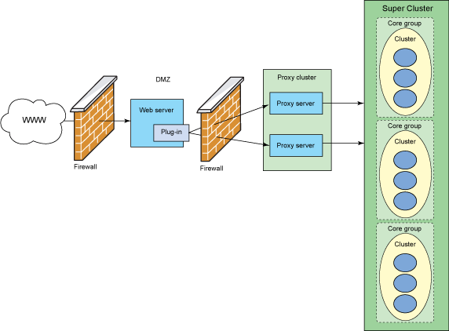
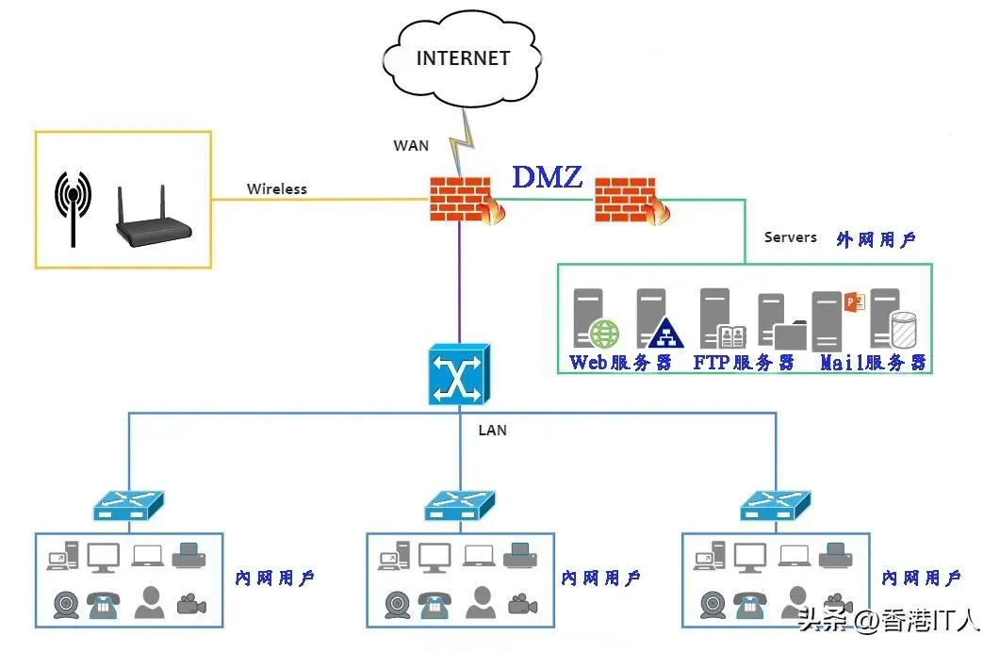

Demilitarized Zone——隔离区

它是为了解决安装防火墙后外部网络不能访问内部网络服务器的问题，而设立的一个位于**内部网络与外部网络之间的缓冲区**，在这个网络区域内可以放置一些公开的服务器资源。

例如FTP服务器、E-Mail服务器及网站服务器等允许外部用户访问这些服务器，但不可能接触到存放在内网中的信息，就算黑客入侵DMZ 中服务器，也不会影响到公司内部网络安全，不允许任何外部网络的直接访问，实现内外网分离，在企业的信息安全防护加了一道屏障。

DMZ区域针对不同资源提供不同安全级别的保护，网络主要分为三个区域：

1. 安全级别最高的内网
2. 安全级别中等的DMZ区域
3. 安全级别最低的外网

公司可以将核心和重要的，只供内部网络用户提供的服务器部署在内网，将WEB服务器、E-Mail服务器、FTP服务器等需要为内部和外部网络同时提供服务的服务器放置到防火墙后的DMZ区内。

通过合理的策略规划，使DMZ中服务器不但免受到来自外网络的入侵和破坏，也不会对内网中的服务器或机密信息造成影响。

DMZ区域的应用，分为三个区域负责不同的工作任务也拥有不同的访问策略。

### 一、内网可以访问外网

---

内网的用户可以没有限制地访问外网。在这个策略中，防火墙需要进行地址转换。

### 二、内网可以访问DMZ

---

此策略是为了方便内网用户使用和管理DMZ中的服务器。

### 三、外网不能访问内网

---

内网中存放了很多公司内部文件，不允许外网的用户访问这些数据。

### 四、外网可以访问DMZ

---

DMZ中的服务器就是要给外网用户提供服务，所以外网必须可以访问DMZ。同时，外网访问DMZ需要由防火墙完成对外地址到服务器实际地址的转换。

### 五、DMZ访问内网的限制

---

当入侵者攻击DMZ时，就可以保护内网的重要数据。

### 六、DMZ不能访问外网

---

DMZ中放置邮件服务器时，就需要访问外网，否则将不能正常工作。在网络中，非军事区(DMZ)目的是把内部网络和其他访问服务的网络分开，阻止内网和外网直接通信，以保证内网安全。
如果没有DMZ的设置，需要使用外网服务器的用户必须在防火墙上开放指定端口（就是Port Forwarding技术）使互联网的用户能访问外网服务器，不过，这种做法会因为防火墙对互联网开放了一些必要的端口而降低了内网区域的安全性，黑客们只需要攻击外网服务器，那么整个内部网络就完全崩溃了。DMZ区的出现刚好就是为了需要架设外网服务器的企业解决了内部网络的安全性问题。

