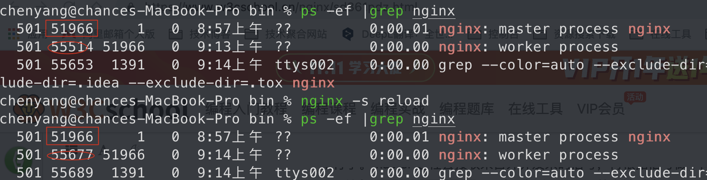

nginx启动后，在unix系统中会以daemon（守护进程）的方式在后台运行，后台进程包含一个master进程和多个worker进程。可以手动地关掉后台模式，让nginx在前台运行，并且通过配置让nginx取消master进程，从而可以使 nginx 以单进程方式运行（关闭后台模式，一般是用来调试用的）。nginx 是以**多进程**的方式来工作的，当然 nginx 也是**支持多线程**的方式的，只是我们主流的方式还是多进程的方式，也是 nginx 的默认方式。

master 进程主要用来管理 worker 进程，包含：接收来自外界的信号，向各 worker 进程发送信号，监控 worker 进程的运行状态，当 worker 进程退出后(异常情况下)，会自动重新启动新的 worker 进程。而基本的网络事件，则是放在 worker 进程中来处理。多个 worker 进程之间是对等的，他们**同等竞争来自客户端的请求**，各进程互相之间是独立的。**一个请求，只可能在一个 worker 进程中处理**，一个 worker 进程，不可能处理其它进程的请求。worker 进程的个数是可以设置的，一般我们会设置与机器cpu核数一致，这与 nginx 的进程模型以及事件处理模型是分不开的。nginx 的进程模型，可以由下图来表示：

我们只需要与 master 进程通信就行了。master 进程会接收来自外界发来的信号，再根据信号做不同的事情。要控制 nginx，只需要**通过 kill 向 master 进程发送信号就行了**。比如`kill -HUP pid`，则是告诉 nginx，从容地重启 Nginx，我们一般用这个信号来重启 Nginx，或重新加载配置，因为是从容地重启，因此服务是不中断的。master 进程在接收到 HUP 信号后是怎么做的呢？首先 master 进程在接到信号后，会先重新加载配置文件，然后再启动新的 worker 进程，并向所有老的 worker 进程发送信号，告诉他们可以光荣退休了。新的 worker 在启动后，就开始接收新的请求，而老的 worker 在收到来自 master 的信号后，就不再接收新的请求，并且在当前进程中的所有未处理完的请求处理完成后，再退出。当然，直接给 master 进程发送信号，这是比较老的操作方式，Nginx 在 0.8 版本之后，引入了一系列命令行参数，来方便我们管理。比如，`./nginx -s reload`，就是来重启 Nginx，`./nginx -s stop`，就是来停止 Nginx 的运行。如何做到的呢？我们还是拿 reload 来说，我们看到，执行命令时，我们是启动一个新的 Nginx 进程，而新的 Nginx 进程在解析到 reload 参数后，就知道我们的目的是控制 Nginx 来重新加载配置文件了，它会向 master 进程发送信号，然后接下来的动作，就和我们直接向 master 进程发送信号一样了。

