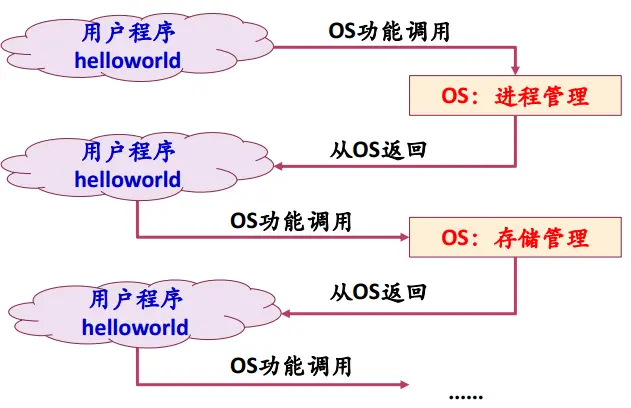
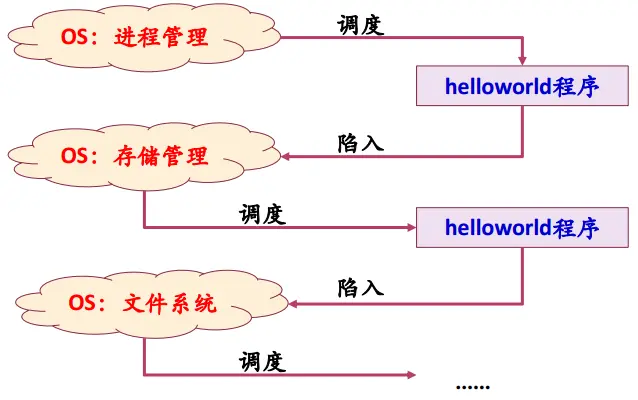

### 一、操作系统做了什么

---

通过一个例子进行说明：给出一个c程序helloworld

```c
#include<stdio.h>
int main(int argc, char *argv[]){
  puts(“hello world”);
  return 0;
}
```

**说明：**其功能就是在标准的显示器上显示一个字符串。下面看此程序的执行过程。

- 首先用户要告诉操作系统执行此程序：

  如何告知？比如我们可以在命令行输入相应的命令或者双击此程序的图标。

- 操作系统接到用户的请求之后就会到磁盘上找到此程序的相关信息，检查其类型是否是可执行文件；并通过程序首部信息，确定代码和数据在可执行文件中的位置并计算出对应的磁盘块地址。

- 为了要执行此程序，操作系统首先要创建一个新的进程，并**将此程序的可执行文件映射到该进程结构**，表示由该进行执行此程序。之后操作系统为此程序设置CPU上下文环境，并跳到程序开始处（假设调度程序选中了此程序）。

- 当在执行程序的第一条指令的时候会发生缺页异常：因为程序在执行的时候，先要将程序的代码和数据装入内存，CPU才能够去执行。但是此时还没有读入内存，于是硬件机制就会捕获此异常，并且把控制权交给操作系统。

- 操作系统管理了系统中的内存，当然内存有很多中，比如这里我们拿页式管理方案的话，内存就会有很多的物理页面，操作系统的内存管理模块就会分配一页空闲物理内存，并且根据前面计算出的磁盘块地址把程序代码读到内存中，然后继续执行程序。有时候程序可能很大，所以一次分配可能不够，于是在执行过程中可能产生多次缺页异常。

- 然后程序执行`puts`函数（系统调用）。而puts函数是一个系统调用，于是控制权又交给了操作系统。

- 操作系统找到要将字符串送往的显示设备，通常设备是由一个进程控制的，所以，操作系统将要写的字符串送给该进程。

- 控制设备的进程告诉设备的窗口系统它要显示的字符串，窗口系统确定这是一个合法的操作，然后将字符串转换成像素，将像素写入设备的存储映像区。

- 然后视频硬件将像素转换成显示器可以接收的一组控制/数据信号。显示器然后解释此信号，激发液晶屏。

**总结**：

- 从用户的角度看上述执行过程

  

- 从操作系统的角度来看就是，如果操作系统选中了一个程序，那么就去调度此程序执行，程序执行过程中会不断的陷入操作系统，由操作系统去提供一些服务，当服务完成之后操作系统又会去调用程序去执行。

  


### 二、操作系统的定义和作用

---

#### 2.1 定义

操作系统是计算机系统中的一个系统软件，是一些程序模块的集合：

- 它们能以尽量有效、合理的方式组织和管理计算机的软硬件资源
- 合理地组织计算机的工作流程，控制程序的执行并向用户提供各种服务功能
- 使得用户能够灵活、方便地使用计算机，使整个计算机系统高效运行。

#### 2.2 


