### 一、进程

---

#### 1.1 多道程序设计

允许多个程序同时进入内存并运行，提高CPU的利用率，目的是提高系统效率。

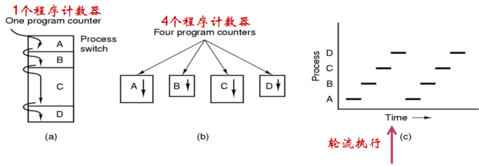

a图内存中有四个程序，串行执行，因为这里只有一个程序计数器。

当有了**多道程序技术**之后就得到了b图，**每个程序各自独立的占用一个逻辑程序计数器**，达到并发执行效果。

从c图中可以看到多个程序是轮流执行的。

#### 1.2 并发环境与并发程序

并发环境指一段时间间隔内，单处理器上有两个或两个以上的程序同时处于开始运行但尚未结束的状态，并且次序不是事先确定的。在并发环境下执行的程序就是并发程序。

#### 1.3 定义

进程是具有独立功能的程序关于某个数据集合上的一次运动活动，是**系统进行资源分配和调度的独立单位**。

- 进程是程序的一次执行过程，一个程序执行多次那是不同的进程；
- 是正在运行的程序的抽象，或者说是对CPU的一个抽象；
- 将一个CPU变换成多个虚拟的CPU；
- 系统资源以进程为单位分配，如内存、文件等，**操作系统为每个独立的进程分配了独立的地址空间**；
- 操作系统将CPU调度给需要的进程，即将CPU的控制权交给某个进程就称为调度。

#### 1.4 特征

- 结构性：**由数据段、程序段、PCB构成**
- 动态性：可以被动态地创建、执行、撤销
- 并发性：同一时间内有多个进程在运行
- 独立性：独立运行以及获得OS资源的基本单位
- 异步性：异步执行

组成 

1. 程序：描述进程要完成的功能 。
2. 数据集合：程序在执行时所需要的数据和工作区。 
3. 程序控制块PCB：包含进程的描述信息和控制信息。它是进程存在的唯一标志。

##### 1.4.1 进程控制块-PCB

- 又称进程描述符或进程属性
- 操作用于管理控制进程的一个专门的数据结构
- 记录进程的各种属性，描述进程的动态变化过程
- PCB是系统感知进程存在的唯一标志：进程与PCB一一对应
- 进程表：所以进程的PCB集合。进程表的大小往往固定，这也决定了一个操作系统最多支持多少进程，有时我们称为系统支持的并发度

##### 1.4.2 PCB中需要保存的信息

1. 进程描述信息
   - 进程标识符（`process id`），这个标识是唯一的，通常是一个整数
   - 进程名，通常基于可执行文件名，这是不唯一的
   - 用户标识符（`user id`）
   - 进程组关系

2. 进程控制信息

   - 当前状态

   - 优先级

   - 代码执行入口地址

   - 程序的磁盘地址

   - 运行统计信息（执行时间、页面调度）

   - 进程间同步和通信

   - 进程的队列指针

   - 进程的消息队列指针

3. 所拥有的资源和使用情况
   - 虚拟地址空间的使用状况
   - 打开的文件列表
4. CPU线程信息，这是当CPU不运行的时候操作系统需要把一些重要的信息记录下来
   - 寄存器值（通用寄存器、程序计数器`PC`、程序状态字`PSW`、栈指针）
   - 指向该进程页表的指针

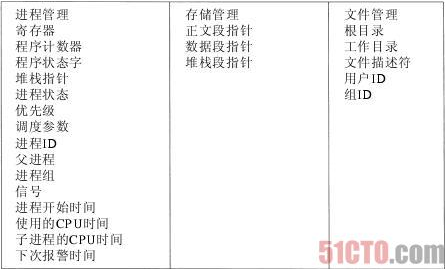

### 二、进程状态及状态的转换（重点）

---

#### 2.1 进程的三种基本状态

| 进程基本状态 |                                                              |
| ------------ | ------------------------------------------------------------ |
| 运行态       | 占用CPU，并在CPU上运行                                       |
| 就绪态       | 已经具备运行条件，但由于没有空闲CPU，而且暂时不能运行        |
| 等待态       | 因等待某一事件而暂时不能运行，如等待读盘结果。又称为阻塞态、封锁态、睡眠态 |

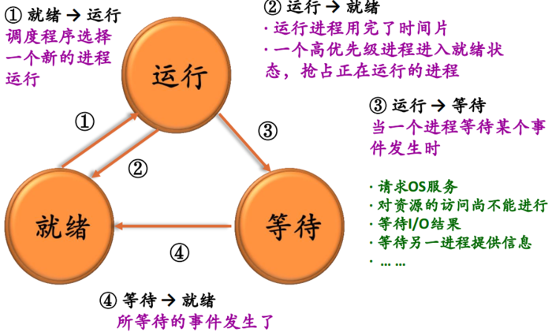

#### 2.2 进程的其他状态

- 创建态：已完成创建一个进程所必要的工作，如`PID、PCB`。但尚未同意执行该进程，因为资源有限
- 终止态：终止执行后，进程进入该状态。可完成一些数据统计工作。资源回收。
- 挂起态：用于调节负载，进程不占用内存空间，其进程映像交换到磁盘上。

#### 2.3 五状态模型

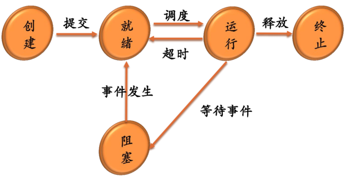

#### 2.4 七状态模型

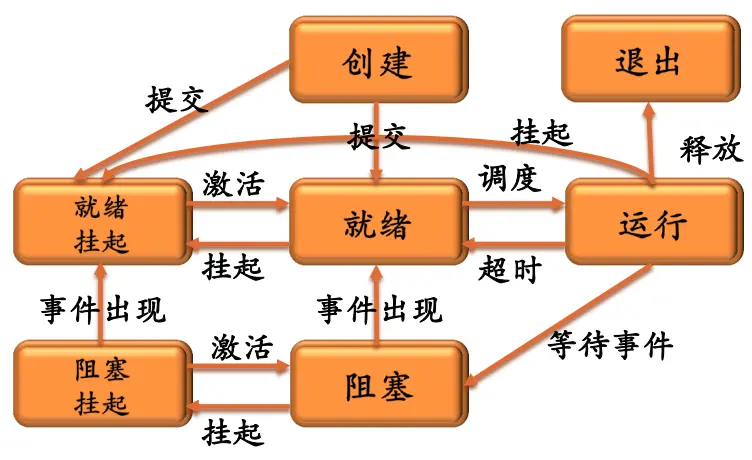

- 挂起状态的进程不能直接被CPU调度执行
- 挂起状态进程也许在等在某个事件，也可能不在等待某个事件。如果挂起的进程正在等待某个事件，则**阻塞条件与挂起条件无关**，引起阻塞的事件发生也不会使得进程立即被执行
- 触发进程进入挂起状态的实体：可以是终端用户、也可以父进程、或OS
- 进程必须通过**激活**才能离开挂起状态

#### 2.5 Linux状态转换示意图

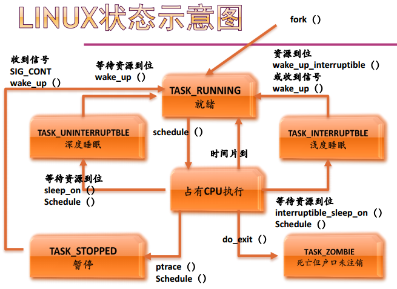

这里使用fork()创建一个进程。浅度睡眠和深度睡眠不同在于前者在睡眠时会接收信号，而后者则不会。正在运行的程序可能因为调试断点出现一个暂停的状态。

### 三、进程队列

---

- 操作系统为每一类进程建立一个或多个队列
- 队列元素为`PCB`
- 伴随进程状态的改变，其`PCB`从一个队列进入另一个队列

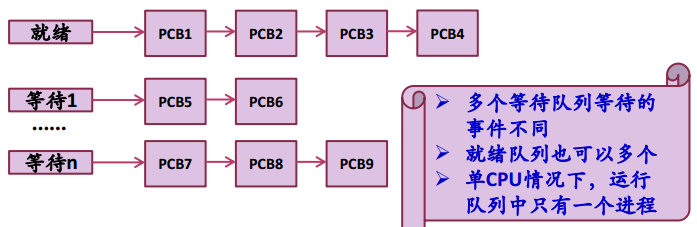

真实情况下，就绪态也是排多个队列。而等待态由于各自产生的原因（事件）不同而排不同的队列。

#### 3.1 五状态进程模型的队列模型

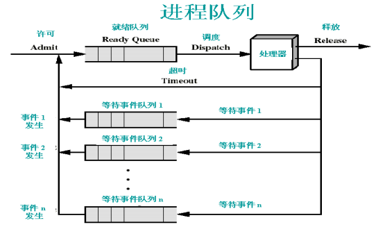

### 四、进程控制

---

进程控制操作完成进程各状态之间的转换，由具有特定功能的原语（其实就是程序，只是这些程序不许与被中断）完成。关于进程控制的原语如下：

- 进程创建原语
- 进程撤销原语
- 阻塞原语
- 唤醒原语
- 激活原语
- 改变进程优先级

**原语：**完成某种特定功能的一段程序，具有不可分割性或不可中断性，即原语的执行必须是连续的，在执行过程中不允许被中断。又称原子操作。

#### 4.1 进程的创建

- 给新进程分配一个**唯一标识**以及**进程控制块**（没有被使用的）；
- 为进程分配独立地址空间；
- 初始化进程控制块：设置默认值（如状态为New...）；
- 设置相应地队列指针。如：把新进程加到就绪队列链表中；
- 主要操作是UNIX中：`fork/exec`，Windows中：`CreateProcess`。

#### 4.2 进程的撤销

结束进程，主要完成的工作：

- 回收进程所占用的资源，如关闭打开的文件、断开网络连接、回收分配的内存等；
- 撤销该进程的PCB；
- 在UNIX中使用：`exit`，Windows中：`TerminateProcess`。

#### 4.3 进程阻塞

处于运行状态的进程，在其运行过程中期待某一事件发生，如等待键盘输入、等待磁盘数据传输完成、等待其他进程发送消息。**当被等待的事件未发生时，由进程自己执行阻塞原语，使自己由运行态变为阻塞态**。在UNIX中使用`wait`，在Windows中使用`WaitForSingleObject`。

#### 4.4 UNIX的几个进程控制操作

- **`fork()`** 通过复制调用进程来建立新的进程，是最基本的进程建立过程。也就是通过复制父进程来创建子进程。
- **`exec()`** 包括一些列系统调用，它们都是通过用一段新的程序代码覆盖原来的地址空间，实现进程代码的转换。
- **`wait()`** 提供初级进程同步操作，能使一个进程等待另一个进程的结束。
- **`exit()`** 用来终止一个进程的运行。

>fork()实现：
>
>- 为子进程分配一个空闲的进程描述符，即`PCB`，在UNIX中又叫`proc`结构；
>- 分配给子进程唯一标识`pid`；
>- 以一次一页的方式复制父进程的地址空间，这是一个无用功，因为创建子进程就是为了让子进程完成与父进程不同的工作，所以父进程的很多内容其实子进程是不需要的。于是在`Linux`中采用了写复制技术`COW`加快创建进程；
>- 从父进程处共享资源，如打开的文件和当前工作目录等；
>- 将子进程的状态设置为就绪，插入到就绪队列；
>- 对子进程返回标识符`0`；
>- 向父进程返回子进程的`pid`；

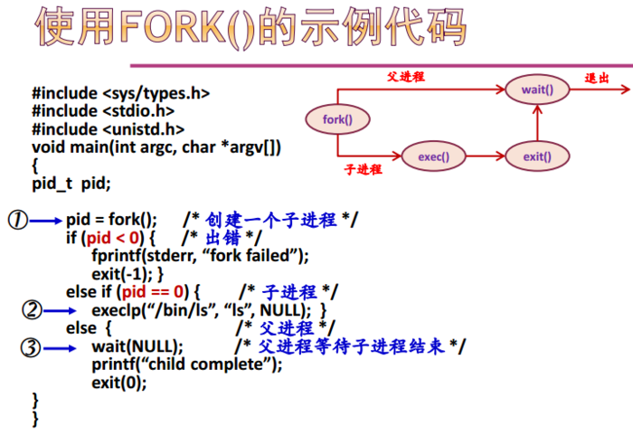

### 五、深入理解进程概念

---

#### 5.1 进程的分类

- 系统进程/用户进程 这里系统进程的优先级要高；
- 前台进程/后台进程 用户一般只和前台进程交互；
- CPU密集型进程/IO密集型进程。

#### 5.2 进程层次结构

- UNIX中是一个进程家族树的概念：`init`为根进程。于是如果某一个进程结束了，那么其子孙进程都必须结束。
- Windows中的所有进程的地位都是相同的。

#### 5.3 进程和程序的区别

- 进程更能准确刻画并发，而程序不能
- 程序是静态的，进程是动态的
- 进程有生命周期的，有诞生有消亡，是短暂的；而程序是相对长久的
- 一个程序可对应多个进程
- 进程具有创建其他进程的功能

#### 5.4 进程的地址空间

操作系统为每个进程分配了一个地址空间。这里我们看一个例子：

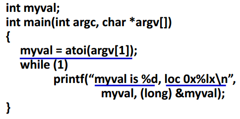

这个程序我们从命令行中输入数据，比如：

myval 7

myval 8

此时我们会发现虽然进程不同，但是打印出来的地址确实一样的。这里我们从进程地址空间来分析：

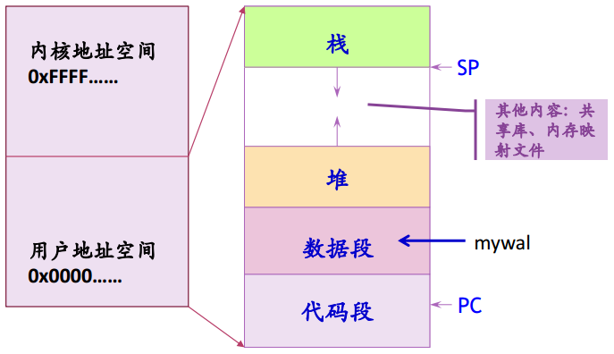

上面的两个进程都有这样一个地址空间，也就是说这两个进程是在不同的地址空间上的相同的位置，所以虽然地址是一样的，但是实际上在实际内存中的地址是不一样的。

#### 5.5 进程映像

对进程执行活动全过程的静态描述（快照）。由进程地址空间内容、硬件寄存器内容及与该进程相关的内核数据结构、内核栈组成

- 与用户相关：进程地址空间（代码段、数据段、堆和栈、共享栈等）
- 与寄存器相关：程序计数器、指令寄存器、程序状态寄存器、栈指针、通用寄存器等的值
- 与内核相关：
  - 静态部分：`PCB`及各种资源数据结构
  - 动态部分：内核栈（不同进程在进入内核后使用不同的内核栈）

#### 5.6 上下问切换

- 将CPU硬件状态从一个进程换到另一个进程的过程称为上下文切换，其实就是运行环境的切换。
- 进程运行时，其硬件状态保存在CPU上的寄存器中。寄存器有：程序计数器、程序状态寄存器、栈指针、通用寄存器、其他控制寄存器的值
- 进程不运行时，这些寄存器的值保存在进程控制块中；当操作系统要运行一个新的进程时，将进程控制块中相关值送到对应的寄存器中。

### 六、线程

---

#### 6.1 线程的引入

- 应用的需要
- 开销的考虑
- 性能的考虑

##### 6.1.1 应用的需要

#### 6.2 线程的基本概念

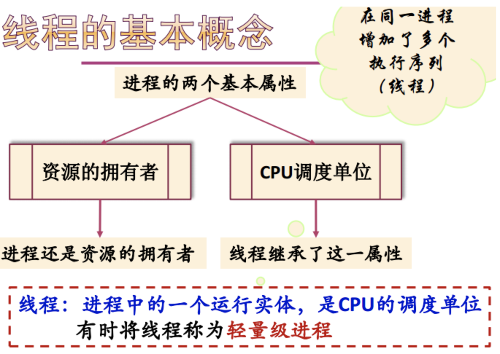

线程的属性：

- 有标识符ID
- 有状态及状态转换-->需要提供一些操作
- 不运行时需要保存的上下文（程序计数器等寄存器）
- 有自己的栈和栈指针
- 共享所在进程的地址空间和其他资源
- 创建、撤销另一个线程（程序开始是以一个单线程方式运行的）

#### 6.3 线程机制的实现

一般有三种实现机制

- 用户级线程
- 核心级线程
- 混合（两者结合）方法

##### 6.3.1 用户级线程

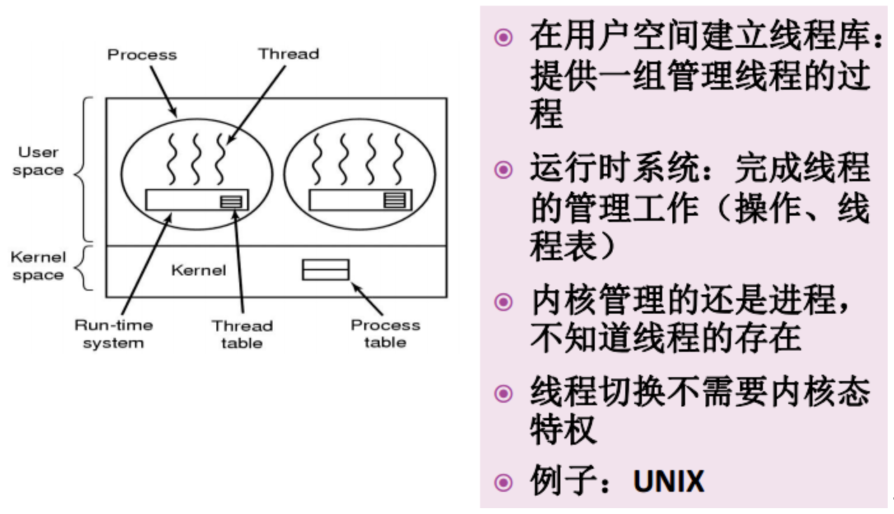

线程是由运行时系统管理的，在内核中只有进程表。典型例子就是UNIX POSIX线程库--PTHREAD

- POSIX（Portable Operating System Interface）
- 多线程编程接口，以线程库方式提供给用户

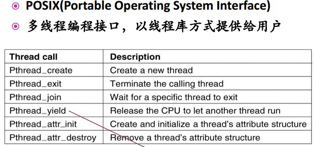

优点：

- 线程切换快
- 调度算法是应用程序特定的
- 用户级线程可运行在任何操作系统上（只需要实现线程库）

缺点：

- 内核只将处理器分配给进程，同一进程中的两个线程不能同时运行于两个处理器上
- 大多数系统调用是阻塞的，因此，由于内核阻塞进程，故进程中所有线程也被阻塞。（可以在调用之前判断进行解决，如果是阻塞线程，那么就换其他线程）

##### 6.3.2 核心级线程

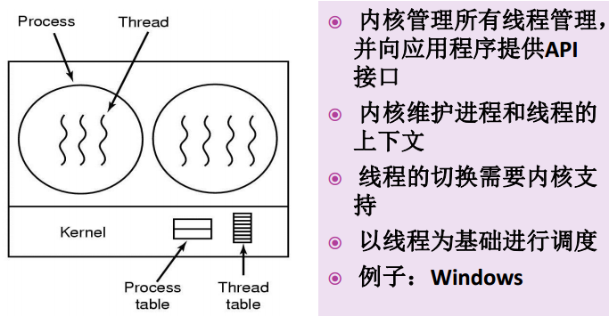

##### 6.3.3 混合模型

- 线程创建在用户空间完成
- 线程调度等在核心态完成
- 

