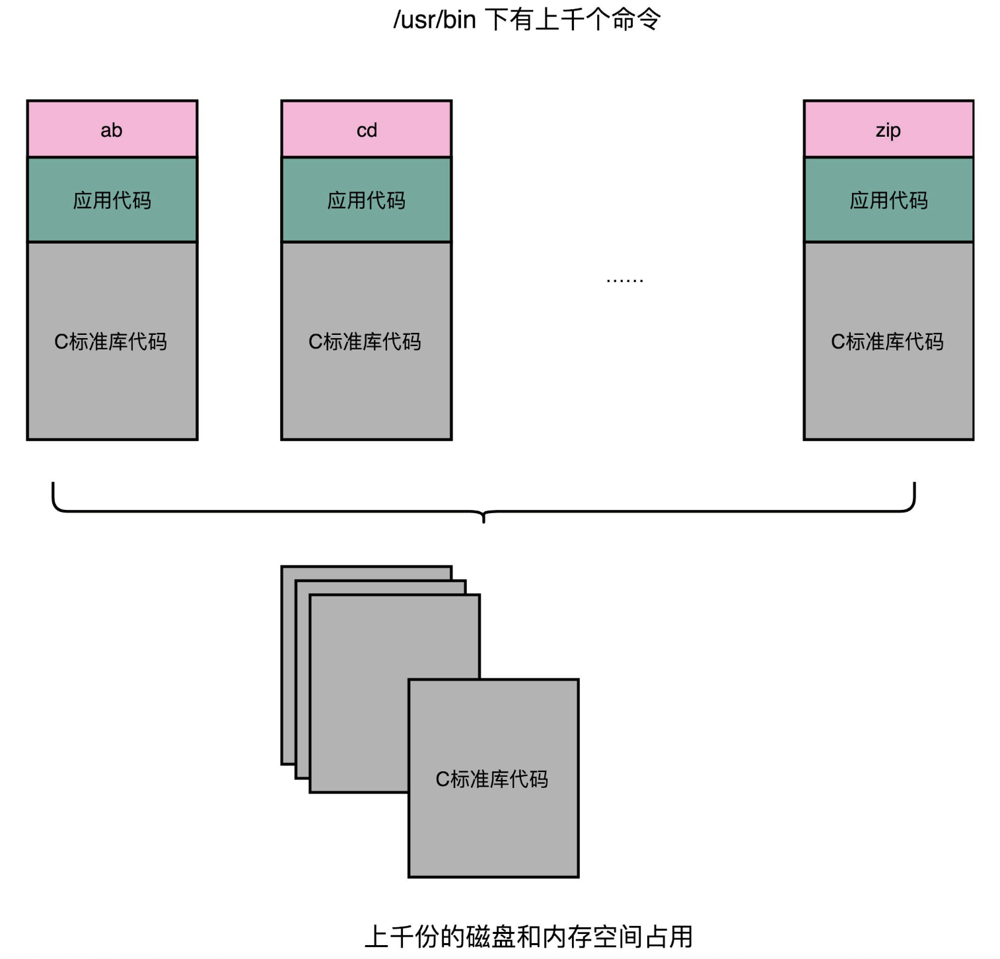
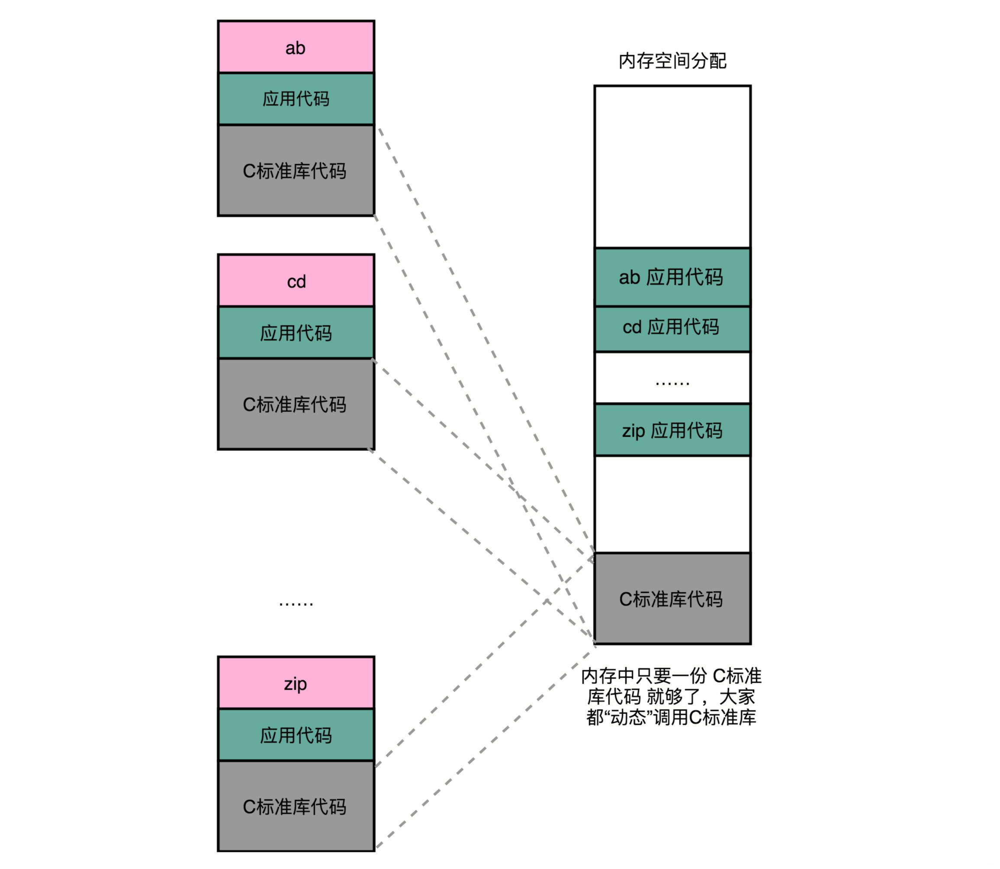
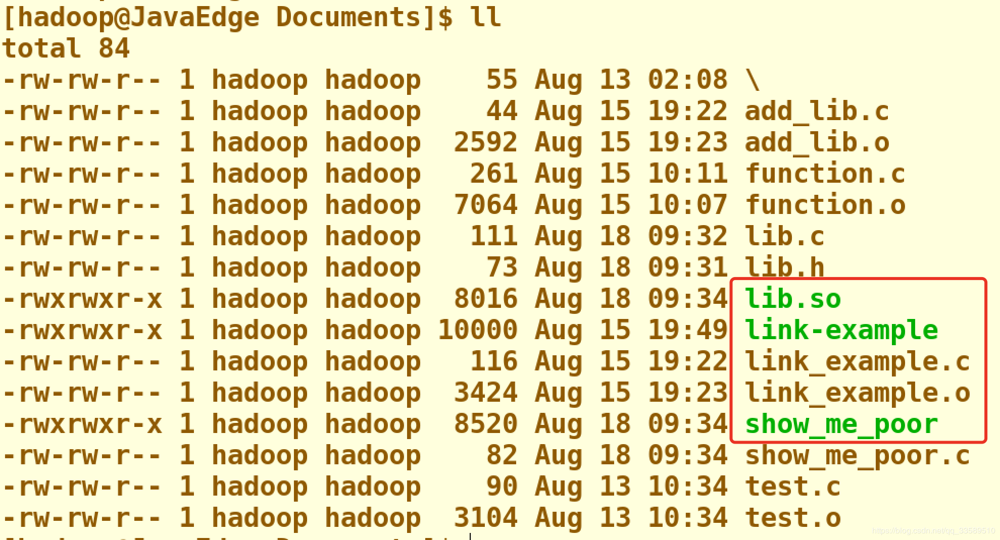

把对应的不同文件内的代码段，合并到一起，成为最后的可执行文件。

链接的方式，让我们在写代码的时候做到了“复用”。同样的功能代码只要写一次，然后提供给很多不同的程序进行链接就行了。

“链接”其实有点儿像我们日常生活中的**标准化、模块化**生产。有一个可以生产标准螺帽的生产线，就可生产很多不同的螺帽。只要需要螺帽，都可以通过链接的方式，去复制一个出来，放到需要的地方。

但是，如果我们有很多个程序都要通过装载器装载到内存里面，那里面链接好的同样的功能代码，也都需要再装载一遍，再占一遍内存空间。这就好比，假设每个人都有骑自行车的需要，那我们给每个人都生产一辆自行车带在身边，固然大家都有自行车用了，但是马路上肯定会特别拥挤。

### 一、链接可以分为动、静，共享运行省内存

---

如果能够让同样功能的代码，在不同的程序里面，不需要各占一份内存空间，那该有多好啊！就好比，现在马路上的共享单车，我们并不需要给每个人都造一辆自行车，只要马路上有这些单车，谁需要的时候，直接通过手机扫码，都可以解锁骑行。

这个思路就引入一种新的链接方法，叫作**动态链接（Dynamic Link）**。相应的，我们之前说的合并代码段的方法，就是**静态链接（Static Link）**。

在动态链接的过程中，我们想要“链接”的，不是存储在硬盘上的目标文件代码，而是加载到内存中的**共享库（Shared Libraries）**。这个加载到内存中的共享库会被很多个程序的指令调用到。

- 在Windows下，这些共享库文件就是.dll文件，也就是Dynamic-Link Libary（DLL，动态链接库） 用了“动态链接”的意思。
- 在Linux下，这些共享库文件就是.so文件，也就是Shared Object（一般我们也称之为动态链接库）。 用了“共享”的意思。

正好覆盖了两方面的含义。

### 二、地址无关很重要，相对地址解烦恼

---

要在程序运行的时候共享代码，这些机器码必须“**地址无关**”。即我们编译出来的共享库文件的指令代码，是地址无关码（Position-Independent Code）。换句话说就是，这段代码，无论加载在哪个内存地址，都能够正常执行。

> 如果还不明白，举一个生活中的例子：如果我们有一个骑自行车的程序，要“前进500米，左转进入天安门广场，再前进500米”。 它在500米之后要到天安门广场了，这就是地址相关的。 如果程序是“前进500米，左转，再前进500米”，无论你在哪里都可以骑车走这1000米，没有具体地点的限制，这就是地址无关的。

大部分函数库其实都可以做到地址无关，因为它们都接受特定的输入，进行确定的操作，然后给出返回结果就好了。无论是实现一个向量加法，还是实现一个打印的函数，这些代码逻辑和输入的数据在内存里面的位置并不重要。而常见的地址相关的代码，比如绝对地址代码（Absolute Code）、利用重定位表的代码等等，都是地址相关的代码。

回想一下之前讲过的重定位表。在程序链接的时候，我们就把函数调用后要跳转访问的地址确定下来了，这意味着，如果这个函数加载到一个不同的内存地址，跳转就会失败。

对于所有动态链接共享库的程序来讲，虽然我们的共享库用的都是同一段物理内存地址，但是在不同的应用程序里，它所在的虚拟内存地址是不同的。

没办法、也不应该要求动态链接同一个共享库的不同程序，必须把这个共享库所使用的虚拟内存地址变成一致。如果这样的话，我们写的程序就必须明确地知道内部的内存地址分配。那么问题来了，我们要怎么样才能做到，动态共享库编译出来的代码指令，都是地址无关码呢？

动态代码库内部的变量和函数调用都很容易解决，我们只需要使用**相对地址（Relative Address）**。各种指令中使用到的内存地址，给出的不是一个绝对的地址空间，而是一个相对于当前指令偏移量的内存地址。

因为 **整个共享库是放在一段连续的虚拟内存地址中的，无论装载到哪一段地址，不同指令之间的相对地址都是不变的**。

### 三、动态链接的解决方案

---

**PLT和GOT**

要实现动态链接共享库，也并不困难，和前面的静态链接里的符号表和重定向表类似拿出一小段代码来看一看。

- lib.h 定义了动态链接库的一个函数 ***show_me_the_money***

  

- lib.c 包含了lib.h的实际实现

  

- show_me_poor.c 调用了 lib 里面的函数

  

- 把 lib.c 编译成了一个动态链接库，也就是 .so 文件

  

- 最终生成文件集

  

在编译的过程中，指定了一个 ***-fPIC*** 的参数。

其实就是Position Independent Code意，也就是要把这个编译成一个地址无关代码。

然后，我们再通过gcc编译 ***show_me_poor*** 动态链接了 ***lib.so*** 的可执行文件。

