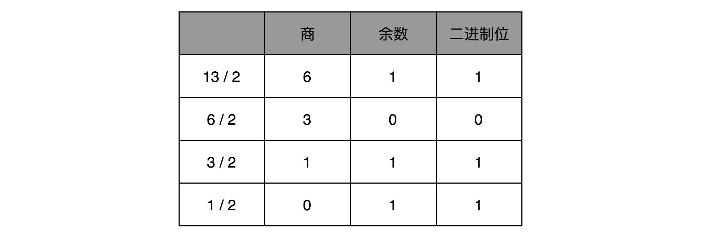
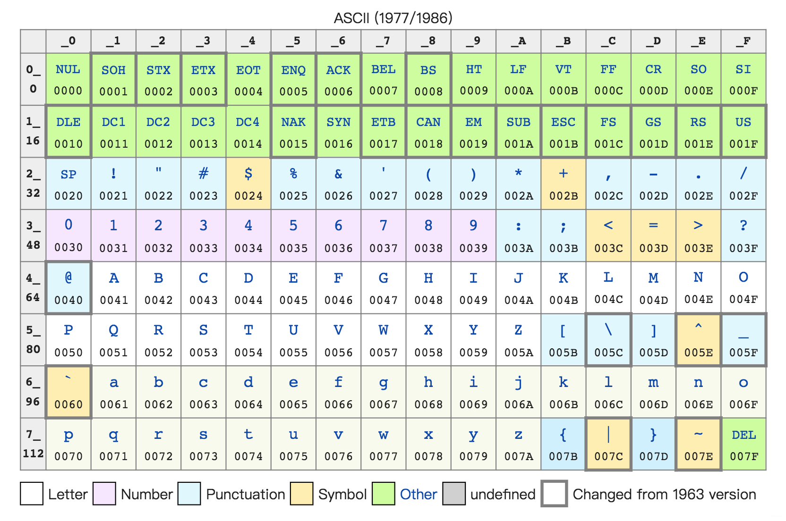
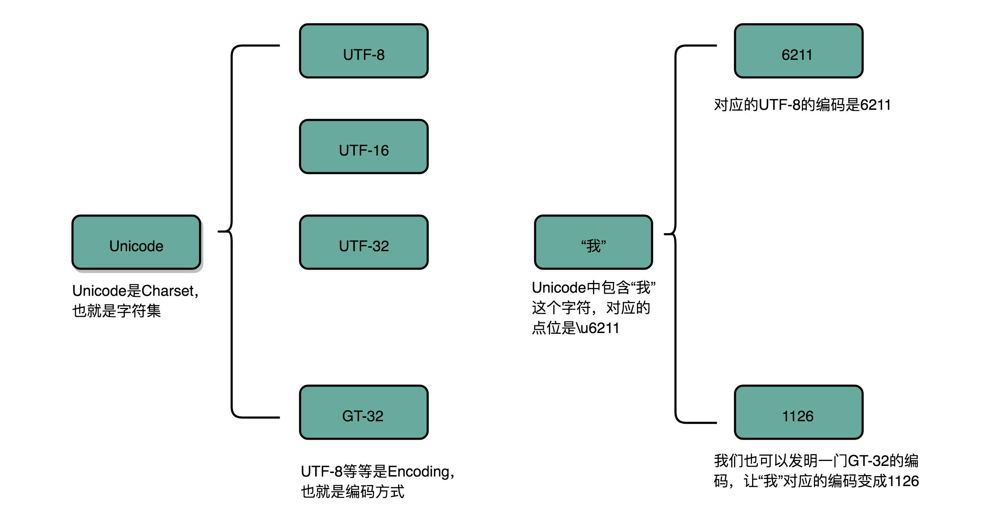

> 程序 = 算法 + 数据结构

对应到计算机的组成原理(硬件层面)

- 算法 --- 各种计算机指令
- 数据结构 --- 二进制数据

计算机用0/1组成的二进制，来表示所有信息

- 程序指令用到的机器码，是使用二进制表示的
- 存储在内存里面的字符串、整数、浮点数也都是用二进制表示的

在实际应用中最常遇到的问题，也就是文本字符串是怎么表示成二进制的，特别是我们会遇到的乱码究竟是怎么回事儿。

在开发的时候，所说的Unicode和UTF-8之间有什么关系。

### 一、理解二进制的“逢二进一”

---

二进制和我们平时用的十进制，并没有本质区别，只是平时是“逢十进一”，这里变成了“逢二进一”

每一位，相比于十进制下的0～9这十个数字，我们只能用0和1这两个数字。

任何一个十进制的整数，都能通过二进制表示出来

把一个二进制数，对应到十进制，非常简单，就是把从右到左的第N位，乘上一个2的N次方，然后加起来，就变成了一个十进制数

当然，既然二进制是一个面向程序员的“语言”，这个从右到左的位置，自然是从0开始的。

比如_0011_这个二进制数，对应的十进制表示，就是

> 0×2^3^+0×2^2^+1×2^1^+1×2^0^ =3

代表十进制的3

对应地，如果我们想要把一个十进制的数，转化成二进制，使用**短除法**就可以了

也就是，把十进制数除以2的余数，作为最右边的一位。然后用商继续除以2，把对应的余数紧靠着刚才余数的右侧，这样递归迭代，直到商为0就可以了。

- 比如，我们想把13这个十进制数，用短除法转化成二进制，需要经历以下几个步骤：

  

因此，对应的二进制数，就是1101

刚才我们举的例子都是正数，对于负数来说，情况也是一样的吗？

我们可以把一个数最左侧的一位，当成是对应的正负号，比如0为正数，1为负数，这样来进行标记。

这样，一个4位的二进制数， 0011就表示为+3。而1011最左侧的第一位是1，所以它就表示-3。这个其实就是整数的**原码表示法**

原码表示法有一个很直观的缺点就是，0可以用两个不同的编码来表示，1000代表0， 0000也代表0。习惯万事一一对应的程序员看到这种情况，必然会被“逼死”。

于是，我们就有了另一种表示方法。我们仍然通过最左侧第一位的0和1，来判断这个数的正负。但是，我们不再把这一位当成单独的符号位，在剩下几位计算出的十进制前加上正负号，而是在计算整个二进制值的时候，在左侧最高位前面加个负号。

比如，一个4位的二进制补码数值1011，转换成十进制，就是

> −1×2^3^+0×2^2^+1×2^1^+1×2^0^ =−5

如果最高位是1，这个数必然是负数；最高位是0，必然是正数。并且，只有0000表示0，1000在这样的情况下表示-8。一个4位的二进制数，可以表示从-8到7这16个整数，不会白白浪费一位。

当然更重要的一点是，用补码来表示负数，使得我们的整数相加变得很容易，不需要做任何特殊处理，只是把它当成普通的二进制相加，就能得到正确的结果。

我们简单一点，拿一个4位的整数来算一下，比如 -5 + 4 = -1，-5 + 6 = 1

我们各自把它们转换成二进制来看一看。如果它们和无符号的二进制整数的加法用的是同样的计算方式，这也就意味着它们是同样的电路。

### 二、字符串的表示，从编码到数字

---

不仅数值可以用二进制表示，字符乃至更多的信息都能用二进制表示。

最典型的例子就是**字符串（Character String）**。

最早计算机只需要使用英文字符，加上数字和一些特殊符号，然后用8位的二进制，就能表示我们日常需要的所有字符了，即**ASCII码（American Standard Code for Information Interchange，美国信息交换标准代码）**。

ASCII码就好比一个字典，用8位二进制中的128个不同的数，映射到128个不同的字符里。

> 比如，小写字母a在ASCII里面，就是第97个，也就是二进制的0110 0001，对应的十六进制表示就是 61。而大写字母 A，就是第65个，也就是二进制的0100 0001，对应的十六进制表示就是41。

在ASCII码里面，数字9不再像整数表示法里一样，用0000 1001来表示，而是用0011 1001 来表示。字符串15也不是用0000 1111 这8位来表示，而是变成两个字符1和5连续放在一起，也就是 0011 0001 和 0011 0101，需要用两个8位来表示。

我们可以看到，最大的32位整数，就是2147483647。如果用整数表示法，只需要32位就能表示了。但是如果用字符串来表示，一共有10个字符，每个字符用8位的话，需要整整80位。比起整数表示法，要多占很多空间。

这也是为什么，很多时候我们在存储数据的时候，要采用二进制序列化这样的方式，而不是简单地把数据通过CSV或者JSON，这样的文本格式存储来进行序列化。不管是整数也好，浮点数也好，**采用二进制序列化会比存储文本省下不少空间**。

ASCII码只表示了128个字符，一开始倒也堪用，毕竟计算机是在美国发明的。然而随着越来越多的不同国家的人都用上了计算机，想要表示譬如中文这样的文字，128个字符显然是不太够用的。于是，计算机工程师们开始各显神通，给自己国家的语言创建了对应的**字符集（Charset）和字符编码（Character Encoding）**。

### 三、字符集

---

表示的可以是字符的一个集合。

比如，我们日常说的Unicode，其实就是一个字符集，包含了150种语言的14万个不同的字符。

### 四、字符编码

---

则是对于字符集里的这些字符，怎么一一用二进制表示出来的一个字典。

我们上面说的Unicode，就可以用UTF-8、UTF-16，乃至UTF-32来进行编码，存储成二进制。所以，有了Unicode，其实我们可以用不止UTF-8一种编码形式，我们也可以自己发明一套 GT-32 编码，比如就叫作Java Time 32好了。只要别人知道这套编码规则，就可以正常传输、显示这段代码。

同样的文本，采用不同的编码存储下来。如果另外一个程序，用一种不同的编码方式来进行解码和展示，就会出现乱码。这就好像两个军队用密语通信，如果用错了密码本，那看到的消息就会不知所云。在中文世界里，最典型的就是“手持两把锟斤拷，口中疾呼烫烫烫”的典故。

没有经验的同学，在看到程序输出“烫烫烫”的时候，以为是程序让CPU过热发出报警，于是尝试给CPU降频来解决问题。

如果我们想要用Unicode编码记录一些文本，特别是一些遗留的老字符集内的文本，但是这些字符在Unicode中可能并不存在。于是，Unicode会统一把这些字符记录为U+FFFD这个编码。

如果用UTF-8的格式存储下来，就是\xef\xbf\xbd。如果连续两个这样的字符放在一起，\xef\xbf\xbd\xef\xbf\xbd，这个时候，如果程序把这个字符，用GB2312的方式进行decode，就会变成“锟斤拷”。这就好比我们用GB2312这本密码本，去解密别人用UTF-8加密的信息，自然没办法读出有用的信息。

而“烫烫烫”，则是因为如果你用了Visual Studio的调试器，默认使用MBCS字符集

“烫”在里面是由0xCCCC来表示的，而0xCC又恰好是未初始化的内存的赋值。于是，在读到没有赋值的内存地址或者变量的时候，电脑就开始大叫“烫烫烫”了。