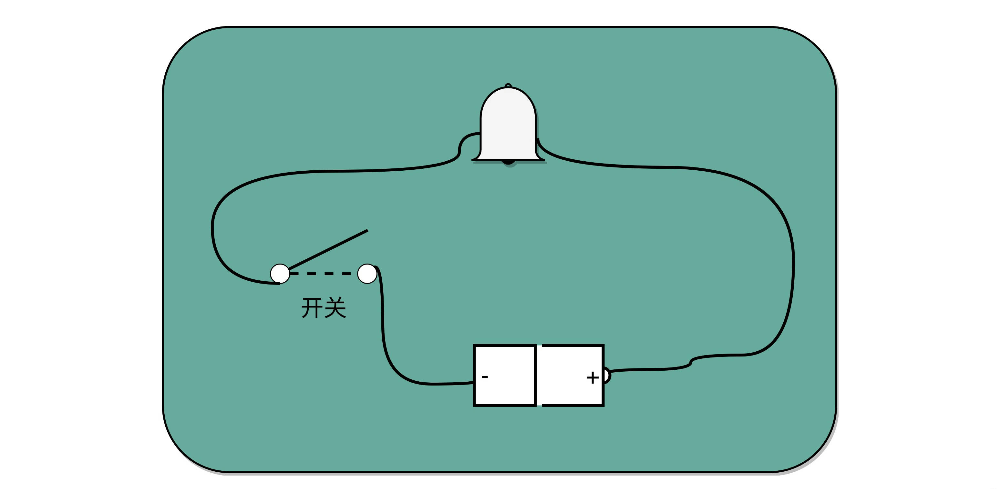

### 一、怎么做到“千里传书”

---

在军事用途中，信息能否更早更准确地传递出去经常是事关成败的大事。

所以我们看到中国古代的军队有“击鼓进军”和“鸣金收兵”，通过打鼓和敲钲发出不同的声音，来传递军队的号令。

如果我们把军队当成一台计算机，那“金”和“鼓”就是这台计算机的“1”和“0”。

我们可以通过不同的编码方式，来指挥这支军队前进、后退、转向、追击等等。

“金”和“鼓”比起跑腿传口信，固然效率更高了，但是能够传递的范围还是非常有限，超出个几公里恐怕就听不见了。于是，人们发明了更多能够往更远距离传信的方式，比如海上的灯塔、长城上的烽火台。因为光速比声速更快，传的距离也可以更远。

但是，这些消息传递信息的方式都面临一个问题，就是受限于只有“1”和“0”这两种信号，不能传递太复杂的信息，那电报的发明就解决了这个问题。

从信息编码的角度来说，金、鼓、灯塔、烽火台类似电报的二进制编码

电报传输的信号有两种，一种是短促的点信号（dot信号），一种是长一点的划信号（dash信号）

我们把“点”当成“1”，把“划”当成“0”。这样一来，我们的电报信号就是另一种特殊的二进制编码了

电影里最常见的电报信号是“SOS”，这个信号表示出来就是 “点点点划划划点点点”。

比起灯塔和烽火台这样的设备，电报信号有两个明显的优势

- 信号的传输距离迅速增加 电报本质上是通过电信号来进行传播的，所以从输入信号到输出信号基本上没有延时
- 输入信号的速度加快了很多 电报机只有一个按钮，按下就是输入信号，按的时间短一点，就是发出了一个“点”信号 按的时间长一些，就是一个“划”信号 一个手指，就能快速发送电报。
- 一个摩尔斯电码的电报机 

> 电报机本质上就是一个“蜂鸣器+长长的电线+按钮开关”。
>
> 蜂鸣器装在接收方手里，开关留在发送方手里。双方用长长的电线连在一起。当按钮开关按下的时候，电线的电路接通了，蜂鸣器就会响。短促地按下，就是一个短促的点信号；按的时间稍微长一些，就是一个稍长的划信号。
>
> 
>
> 有了电池开关和铃铛，你就有了最简单的摩尔斯电码发报机。

### 二、理解继电器，给跑不动的信号+1s

---

有了电报机，只要铺设好电报线路，就可以传输我们需要的讯息了。但是这里面又出现了一个新的挑战，就是随着电线的线路越长，电线的电阻就越大。

当电阻很大，而电压不够的时候，即使你按下开关，蜂鸣器也不会响。你可能要说了，我们可以提高电压或者用更粗的电线，使得电阻更小，这样就可以让整个线路铺得更长一些。但是这个再长，也没办法从北京铺设到上海吧。要想从北京把电报发到上海，我们还得想些别的办法。

对于电报来说，电线太长了，使得线路接通也没有办法让蜂鸣器响起来。

那么，我们就不要一次铺太长的线路，而把一小段距离当成一个线路，也和驿站建立一个小电报站。我们在小电报站里面安排一个电报员，他听到上一个小电报站发来的信息，然后原样输入，发到下一个电报站去。

这样，我们的信号就可以一段段传输下去，而不会因为距离太长，导致电阻太大，没有办法成功传输信号。为了能够实现这样接力传输信号，在电路里面，工程师们造了一个叫作**继电器（Relay）** 的设备。

