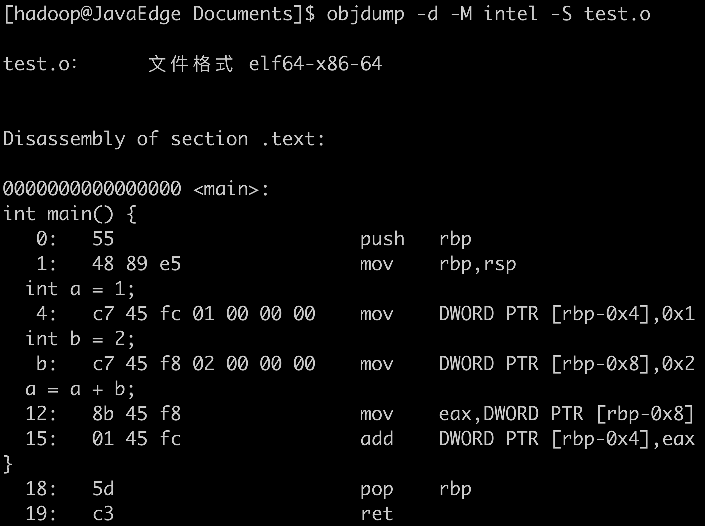
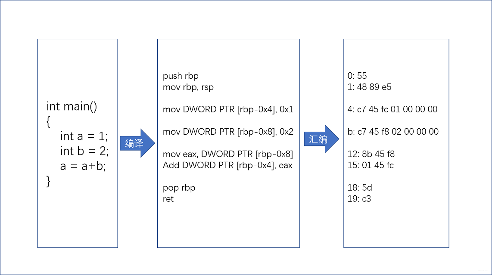
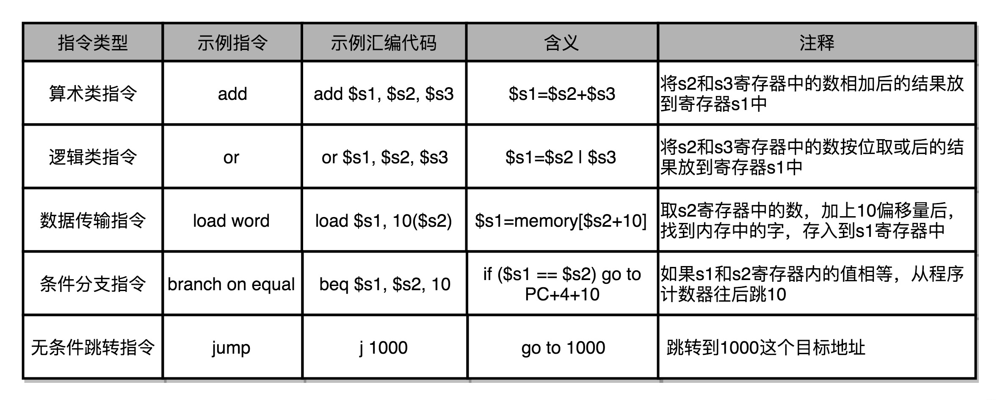

为什么早期的计算机程序要使用打孔卡，而不能像我们现在一样，用C或者Python这样的高级语言来写呢？

因为计算机或者说CPU本身，并没有能力理解这些高级语言。即使在2019年的今天，我们使用的现代个人计算机，仍然只能处理所谓的“机器码”，也就是一连串的“0”和“1”这样的数字。

我们每天用高级语言的程序，最终是怎么变成一串串“0”和“1”的？这一串串“0”和“1”又是怎么在CPU中处理的？


### 一、在软硬件接口中，CPU帮我们做的事

---

CPU(Central Processing Unit，中央处理器)

- **硬件的角度**
  一个超大规模集成电路，通过电路实现了加法、乘法乃至各种各样的处理逻辑。
- **软件工程师的角度**
  一个执行各种计算机指令（Instruction Code）的逻辑机器。这里的计算机指令，就好比一门CPU能够听得懂的语言，即机器语言（Machine Language）

**不同的CPU能够听懂的语言不太一样**

个人PC用的是Intel的CPU，iPhone用的是ARM的CPU，这两者能听懂的语言就不太一样。类似这样两种CPU各自支持的语言，就是两组不同的**计算机指令集(Instruction Set)**。

**存储程序型计算机（Stored-program Computer）**

计算机程序，不可能只有一条指令，而是成千上万条指令组成。但CPU不能一直放着所有指令，所以程序平时是存储在存储器。这种程序指令存储在存储器里面的计算机，我们就叫作**Plugboard Computer**。在没有现代计算机之前，有着聪明才智的工程师们，早就发明了一种叫Plugboard Computer的计算设备。在一个布满了各种插口和插座的板子上，工程师们用不同的电线来连接不同的插口和插座，从而来完成各种计算任务

- IBM的Plugboard
  
  


### 二、编译=>汇编(代码=>机器码)

---

代码，到底是怎么变成一条条计算机指令，最后被CPU执行的呢？

- test.c
  
  
  **编译（Compile)成汇编代码**

要让这段程序在Linux跑起来，需要把整个程序翻译成**汇编语言**（ASM，Assembly Language)的程序。针对汇编代码，可以再用汇编器（Assembler）翻译成机器码（Machine Code）。这些机器码由“0”和“1”组成的机器语言表示,这一条条机器码，就是一条条的计算机指令。**这样一串串的16进制数字，就是CPU能够真正认识的计算机指令。**

在Linux上，可使用`gcc`和`objdump`，把对应的汇编代码和机器码都打印出来。


左侧一堆数字，就是一条条机器码。右边一系列的push、mov、add、pop等，这些就是对应的汇编代码。一行C语言代码，有时候只对应一条机器码和汇编代码，有时候则是对应两条机器码和汇编代码。汇编代码和机器码之间是一一对应的。



实际在用GCC（GUC编译器套装，GUI Compiler Collectipon）编译器的时候，可直接把代码编译成机器码，为什么还需要汇编代码呢？

那一串数字表示的机器码，摸不着头脑。但即使你没有学过汇编代码，看的时候多少也能“猜”出一些这些代码的含义。汇编代码就是“**给程序员看的机器码**”。也正因为这样，机器码和汇编代码是一一对应的。很容易记住add、mov这些用英文表示的指令，而8b 45 f8这样的指令，由于很难一下子看明白是在干什么，所以会非常难以记忆。




### 三、解析指令和机器码

---

下面我们放大局部，来看看这一行行的汇编代码和机器指令，到底是什么意思。

Intel CPU，有2000条左右的CPU指令。一般来说，常见的指令可以分成五大类。

#### 3.1 算术类指令

加减乘除，在CPU层面，都会变成一条条算术类指令。

#### 3.2 数据传输类指令

给变量赋值、在内存里读写数据，用的都是数据传输类指令。

#### 3.3 逻辑类指令

逻辑上的与或非

#### 3.4 条件分支类指令

日常的“if/else”

#### 3.5 无条件跳转指令

写一些大一点的程序，我们常常需要写一些函数或者方法。在调用函数的时候，其实就是发起了一个无条件跳转指令。



汇编器是怎么把对应的汇编代码，翻译成为机器码的。不同的CPU有不同的指令集，也就对应着不同的汇编语言和不同的机器码。为了方便快速理解这个机器码的计算方式，我们选用最简单的MIPS指令集，来看看机器码是如何生成的。

MIPS是一组由MIPS技术公司在80年代中期设计出来的CPU指令集。就在最近，MIPS公司把整个指令集和芯片架构都完全开源了。


MIPS的指令是一个**32位的整数**，高6位叫**操作码**（Opcode）：也就是代表这条指令具体是一条什么样的指令，剩下的26位有三种格式，分别是R、I和J。

#### 3.6 R指令

一般用来做算术和逻辑操作，里面有读取和写入数据的寄存器的地址。如果是逻辑位移操作，后面还有位移操作的位移量。而最后的功能码，则是在前面的操作码不够的时候，扩展操作码表示对应的具体指令的。

#### 3.7 I指令

通常是用在数据传输、条件分支，以及在运算的时候使用的并非变量还是常数的时候。这个时候，没有了位移量和操作码，也没有了第三个寄存器，而是把这三部分直接合并成了一个地址值或者一个常数。

#### 3.8 J指令

一个跳转指令，高6位之外的26位都是一个跳转后的地址

```
add $t0,$s2,$s1
```

下面都用十进制来表示对应的代码。

对应的MIPS指令里

- opcode是0
- rs代表第一个寄存器s1的地址是17
- rt代表第二个寄存器s2的地址是18
- rd代表目标的临时寄存器t0的地址是8
- 因为不是位移操作，所以位移量是0

把这些数字拼在一起，就变成了一个MIPS的加法指令。为了读起来方便，我们一般把对应的二进制数，用16进制表示出来。在这里，也就是0X02324020。这个数字也就是这条指令对应的机器码。


回到开头我们说的打孔带：

- 打孔代表1
- 没有打孔代表0
- 用4行8列代表一条指令来打一个穿孔纸带，那么这条命令大概就长这样：
  


### 四、总结

---

打孔卡，其实就是一种存储程序型计算机。

只是这整个程序的机器码，不是通过计算机编译出来的，而是由程序员的人脑“编译”成一张张卡片的对应的程序，也不是存储在设备里，而是存储成一张打好孔的卡片。但是整个程序运行的逻辑和其他CPU的机器语言没有什么分别，也是处理一串“0”和“1”组成的机器码而已。

我们看到了一个C语言程序，是怎么被编译成为汇编语言，乃至通过汇编器再翻译成机器码的。

除了C这样的编译型的语言之外，不管是Python这样的解释型语言，还是Java这样使用虚拟机的语言，其实最终都是由不同形式的程序，把我们写好的代码，转换成CPU能够理解的机器码来执行的。

只是解释型语言，是通过解释器在程序运行的时候逐句翻译，而Java这样使用虚拟机的语言，则是由虚拟机对编译出来的中间代码进行解释，或者即时编译成为机器码来最终执行。


### 五、推荐阅读

---

- 了解Intel CPU的指令集参看
  《计算机组成与设计：软/硬件接口》第5版的2.17小节


### 六、参考

---

深入浅出计算机组成原理

