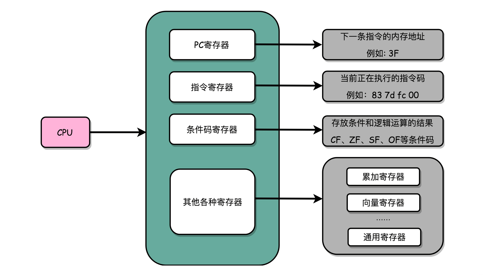

### 一、CPU如何执行指令

---

实际上，一条条计算机指令执行起来非常复杂。好在CPU在软件层面已经为我们做好了封装。

对于程序员来说，我们只要知道，写好的代码变成了指令之后，是一条一条**顺序执行**。

不管几百亿的晶体管的背后是怎么通过电路运转起来的。逻辑上，我们可以认为，**CPU其实就是由一堆寄存器组成的**。而寄存器就是CPU内部，由多个触发器（Flip-Flop）或者锁存器（Latches）组成的简单电路。

>触发器和锁存器，其实就是两种不同原理的数字电路组成的逻辑门。如果想要深入学习的话，可以学习数字电路的相关课程。

N个触发器或者锁存器，就可以组成一个N位（Bit）的寄存器，能够保存N位的数据。比方说，我们用的64位Intel服务器，寄存器就是64位的。

#### 1.1 寄存器

寄存器（Register），是中央处理器内的组成部分。寄存器是有限存贮容量的高速存贮部件，它们可用来暂存指令、数据和地址。在中央处理器的控制部件中，包含的寄存器有指令寄存器（IR）和程序计数器。在中央处理器的算术及逻辑部件中，包含的寄存器有累加器。

在计算机体系结构里，处理器中的寄存器是少量且速度快的计算机存储器，借由提供快速共同地访问数值来加速计算机程序的运行：典型地说就是在已知时间点所作的计算中间的数值。

寄存器是存储器层次结构中的最顶端，也是系统操作数据的最快速途径。寄存器通常都是以他们可以保存的比特数量来估量，举例来说，一个8位寄存器或32位寄存器。寄存器现在都以寄存器数组的方式来实现，但是他们也可能使用单独的触发器、高速的核心存储器、薄膜存储器以及在数种机器上的其他方式来实现出来。

这个名词通常都用来意指由一个指令输出或输入可以直接索引到的寄存器组群。更适当的是称他们为“架构寄存器”。例如，x86指令集定义八个32位寄存器的集合，但一个实现x86指令集的CPU可以包含比八个更多的寄存器。

##### PC寄存器（Program Counter Register）

亦称**指令地址寄存器**（Instruction Address Register）。

存放下一条需要执行的计算机指令的内存地址。

##### 指令寄存器（Instruction Register）

存放当前正在执行的指令。

##### 条件码寄存器（Status Register）

用里面的一个一个标记位（Flag），存放CPU进行算术或者逻辑计算的结果。

