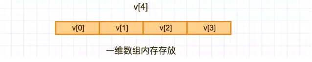
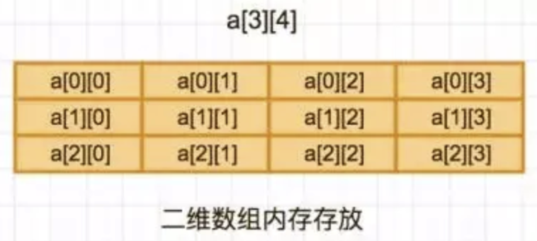

一个优秀的程序、优美的代码，往往具有良好的局部性。

### 一、程序局部性原理

---

程序在执行时呈现出局部性规律，即在一段时间内，整个程序的执行仅限于程序中的某一部分。相应地，执行所访问的存储空间也**局限于某个内存区域**，具体来说，局部性通常有两种形式：时间局部性和空间局部性。

- **时间局部性（Temporal Locality）：**被引用过一次的存储器位置在未来会被多次引用（通常在循环中）。
- **空间局部性（Spatial Locality）：**如果一个存储器的位置被引用，那么将来他附近的位置也会被引用。


### 二、举例

---

```cpp
//求数组元素之和，v为数组名，n为数组大小，
int sum(int *v, int n)
{
  int i = 0;
  int sum = 0;

  for (i=0; i<n; ++i)
  {
    sum+=v[i];
  }	

  return sum;
}
```

数组的特点是在内存中是像下图一样连续存放的。



根据代码以及局部性定义可知：

对于循环中的sum变量：有良好的时间局部性。因为在for循环结束之前，每次执行循环体都有对 sum 的访问。而 sum 没有空间局部性。因为sum 是标量（也就是说通过 sum 这个地址只能得到一个值）。

对于循环体中的 v 变量：有良好的空间局部性。因为数组v是按顺序存放在内存中，每次访问 v[i]总是在 v[i-1] 的下一个位置。而v没有时间局部性，因为在循环体中，每个元素v[i]只会被访问一次。


### 三、局部性对程序效率的影响

---

遍历二维数组的例子：

```cpp
#include <stdio.h>
#include <stdlib.h>
#include <time.h>

int a[500][500];

//先访问行
void fun_1()
{    
  int i,j;    
  for(i=0; i<500; i++)    
  {
    for(j=0; j<500; j++)
    {
      a[i][j]=i;
    }    
  }
}

//先访问列
void fun_2()
{    
  int i,j;  
  for(j=0; j<500; j++)    
  {
    for(i=0; i<500; i++)
    {
      a[i][j]=i;
    }    
  }
}

int main()
{
  clock_t start, finish;
  double  duration;

  start = clock();
  fun_1();
  finish = clock();
  duration = (double)(finish - start) / CLOCKS_PER_SEC;
  printf( "fun_1:  %f seconds\n", duration);

  start = clock();
  fun_2();
  finish = clock();
  duration = (double)(finish - start) / CLOCKS_PER_SEC;
  printf( "fun_2:  %f seconds\n", duration) ;

  return 0;
}
```

```
fun_1:  0.000624 seconds
fun_2:  0.001193 seconds
```

上面的例子，fun_1和fun_2都是对一个二维数组进行遍历赋值。在fun_1函数的for循环体中，是以行序为主序对元素进行遍历。也就是说内层循环先访问第一行的元素，然后第二行......，而二维数组在存储器中也是按照行序为主序来进行存储的。也就是说先存储第一行，然后第二行......，如下图所示。本例中存储顺序和访问顺序一致。所以可以该程序对a[][]的引用有良好的空间局部性。

而fun_2函数只是在fun_1的基础上将求和函数中的双重循环的索引i和j调换一下位置，也就是说在对a[][]进行遍历的时候，以列序为主序。即先访问第一列，在访问第二列......，而前面讲了**二维数组在存储器中也是按照行序为主序来进行存储**；意味着每访问一个元素，就要跳过N个元素才能访问下一个。这种情况下没有良好的空间局部性。



再来看看运行结果，对于同一个数组，具有空间局部性的fun_1函数运行的效率几乎是没有局部性的fun_2函数的提高了一倍，至于为什么有良好局部性的程序有更好的性能，这个和计算机的缓存是息息相关的。