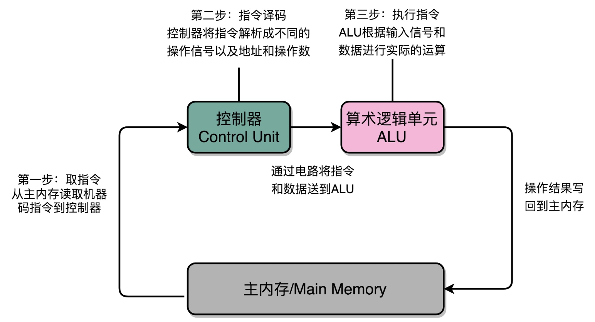
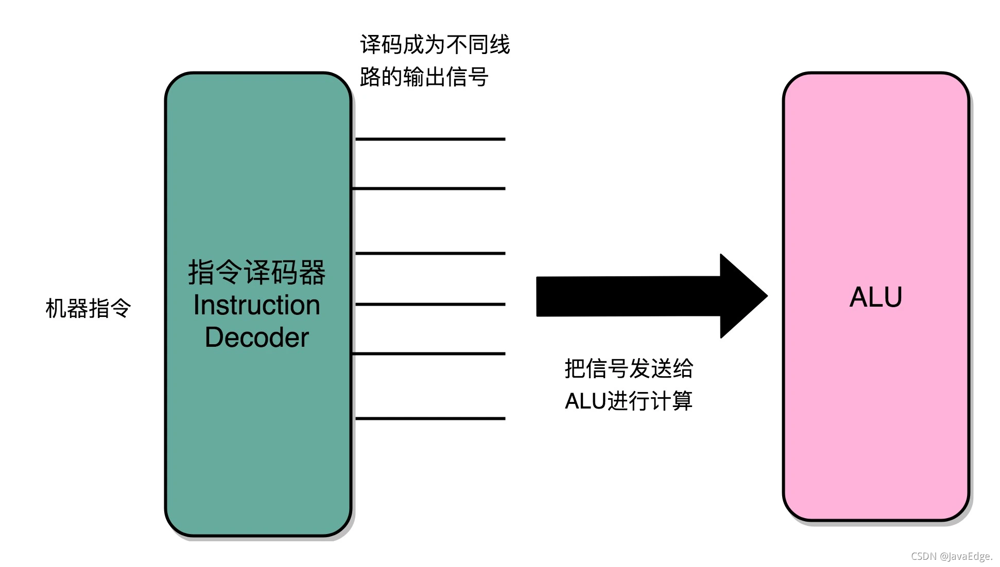

### 一、指令周期（Instruction Cycle）

---

计算机每执行一条指令的过程，可分解为如下步骤：

1. **Fetch（取指令）** 指令放在存储器，通过PC寄存器和指令寄存器取出指令的过程，由控制器（Control Unit）操作。 从PC寄存器找到对应指令地址，据指令地址从内存把具体指令加载到指令寄存器，然后PC寄存器自增。
2. **Decode（指令译码）** 据指令寄存器里面的指令，解析成要进行何操作，是R、I、J中的哪一种指令，具体要操作哪些寄存器、数据或内存地址。该阶段也是由控制器执行。
3. **Execute（执行指令）** 实际运行对应的R、I、J这些特定的指令，进行算术逻辑操作、数据传输或者直接的地址跳转。无论是算术操作、逻辑操作的R型指令，还是数据传输、条件分支的I型指令，都由算术逻辑单元（ALU）操作，即由运算器处理。 如果是一个简单的无条件地址跳转，那可直接在控制器里完成，无需运算器。
4. 重复1～3

这就是个永动机般的“FDE”循环，即指令周期。

CPU还有两个Cycle：

#### 机器周期或CPU周期（Machine Cycle）

CPU内部操作速度很快，但访问内存速度却慢很多。 每条指令都需要从内存里面加载而来，所以**一般把从内存里面读取一条指令的最短时间，称为CPU周期**。

#### 时钟周期及机器主频（Clock Cycle）

一个CPU周期，通常由几个时钟周期累积。一个CPU周期时间，就是这几个Clock Cycle总和。

对于一个指令周期，取出一条指令，然后执行它，至少需两个CPU周期：

- 取出指令，至少得一个CPU周期；
- 执行指令，至少也得一个CPU周期 因为执行完的结果，还要写回内存。

#### 三个周期之间的关系

一个指令周期，包含多个CPU周期，而一个CPU周期包含多个时钟周期。

### 二、建立数据通路

---

一般可以认为，数据通路就是我们的处理器单元，通常由两类原件组成：

- **操作元件**，也叫组合逻辑元件（Combinational Element），就是ALU 在特定的输入下，根据下面的组合电路的逻辑，生成特定的输出。
- **存储元件**，也叫状态元件（State Element） 如在计算过程中要用到的寄存器，无论是通用寄存器还是状态寄存器，都是存储元件。

通过数据总线把它们连接起来，就可完成数据存储、处理和传输，即建立了数据通路。

#### 控制器

可以把它看成只是机械地重复“Fetch - Decode - Execute“循环中的前两个步骤，然后把最后一个步骤，通过控制器产生的控制信号，交给ALU去处理。

#### 控制器将CPU指令解析成不同输出信号

目前Intel CPU支持2000个以上指令。说明控制器输出的控制信号，至少有2000种不同组合。

运算器里的ALU和各种组合逻辑电路，可认为是一个**固定功能的电路**。 控制器“翻译”出来的，就是不同控制信号，告诉ALU去做不同计算。正是控制器，才让我们能“编程”实现功能，才铸就了“存储程序型计算机”。

- 指令译码器将输入的机器码，解析成不同操作码、操作数，然后传输给ALU计算

  

### 三、CPU对硬件电路的要求

---

搭建CPU，还得在数字电路层面，实现如下功能。

#### ALU

就是个无状态，根据输入计算输出结果的第一个电路。

#### 支持状态读写的电路元件-寄存器

要有电路能存储上次计算结果。

该计算结果不一定要立刻给下游电路使用，但可在需要时直接用。常见支持状态读写的电路：

- **锁存器（Latch）**
- **D触发器（Data/Delay Flip-flop）**电路

#### 自动电路，按固定周期实现PC寄存器自增

自动执行Fetch - Decode - Execute。

我们的程序执行，并非靠人工拨动开关执行指令。得有个“自动”电路，无休止执行一条条指令。

看似复杂的各种函数调用、条件跳转，只是修改了PC寄存器保存的地址。PC寄存器里面的地址一修改，计算机即可加载一条指令新指令，往下运行。 PC寄存器还叫程序计数器，随时间变化，不断计数。数字变大了，就去执行一条新指令。所以，我们需要的就是个自动计数的电路。

#### 译码电路

无论是decode指令，还是对于拿到的内存地址去获取对应的数据或者指令，都要通过一个电路找到对应数据，就是“译码器”电路。

把这四类电路，通过各种方式组合在一起就能组成CPU。要实现这四种电路中的中间两种，我们还需要时钟电路的配合。

### 四、总结

---

至此，CPU运转所需的数据通路和控制器介绍完了，也找出完成这些功能，需要的4种基本电路：

- ALU这样的**组合逻辑电路**
- 存储数据的**锁存器和D触发器电路**
- 实现PC寄存器的**计数器电路**
- 解码和寻址的**译码器电路**

> CPU 好像一个永不停歇的机器，一直在不停地读取下一条指令去运行。那为什么 CPU 还会有满载运行和 Idle 闲置的状态呢？

操作系统内核有 idle 进程，优先级最低，仅当其他进程都阻塞时被调度器选中。idle 进程循环执行 HLT 指令，关闭 CPU 大部分功能以降低功耗，收到中断信号时 CPU 恢复正常状态。 CPU在空闲状态就会停止执行，即切断时钟信号，CPU主频会瞬间降低为0，功耗也会瞬间降为0。由于这个空闲状态是十分短暂的，所以你在任务管理器也只会看到CPU频率下降，不会看到降为0。 当CPU从空闲状态中恢复时，就会接通时钟信号，CPU频率就会上升。所以你会在任务管理器里面看到CPU的频率起伏变化。

uptime 命令查看平均负载

满载运行就是平均负载为1.0(一个一核心CPU)，定义为特定时间间隔内运行队列中的平均线程数。 load average 表示机器一段时间内的平均load，越低越好。过高可能导致机器无法处理其他请求及操作，甚至死机。

当CUP执行完当前系统分配的任务，为省电，系统将执行空闲任务（idle task），该任务循环执行HLT指令，CPU就会停止指令的执行，且让CPU处于HALT状态，CPU虽停止指令执行，且CPU部分功能模块将会被关闭（以低功耗），但CPU的LAPIC（Local Advanced Programmable Interrupt Controller）并不会停止工作，即CPU将会继续接收外部中断、异常等外部事件（事实上，CPU HALT状态的退出将由外部事件触发）。“Idle 闲置”是一种低功耗的状态，cpu在执行最低功耗的循环指令。实际上并非啥都没干，而是一直在干最最轻松的事儿。 当CPU接收到这些外部事件，将会从HALT状态恢复，执行中断服务函数，且当中断服务函数执行完毕后，指令寄存器（CS:EIP）将会指向HLT指令的下一条指令，即CPU继续执行HLT指令之后的程序。