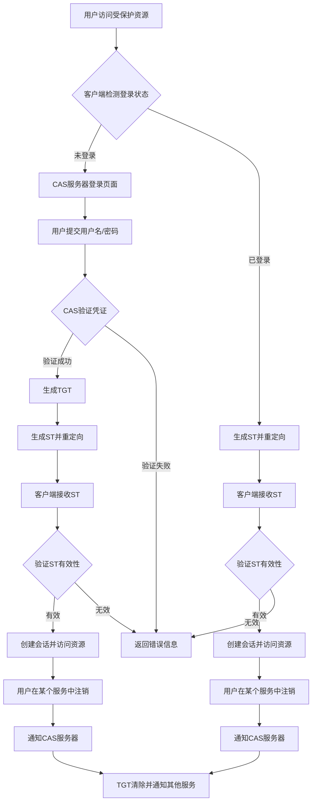

### 一、简介

---

CAS（Central Authentication Service）是一种单点登录（SSO）协议，广泛用于企业级应用中，允许用户通过一次登录即可访问多个系统。

### 二、核心逻辑

---

#### 2.1 用户访问受保护资源

- 用户尝试访问一个受保护的应用（称为“服务”或“客户端”）。
- 应用检测到用户未登录，将用户重定向到CAS服务器的登录页面，并附带一个`service`参数，表示用户希望访问的服务地址。

#### 2.2 重定向到CAS服务器

- CAS服务器接收到请求，检查用户是否已登录：
  - 如果用户已登录（通过Cookie或其他会话机制），直接跳转到2.4。
  - 如果用户未登录，展示登录页面。

#### 2.3 用户提交凭证

- 用户在CAS服务器的登录页面输入用户名和密码。
- CAS服务器验证用户的凭证（如查询数据库、调用LDAP等）。
  - 如果验证失败，返回错误信息并要求重新登录。
  - 如果验证成功，生成一个全局唯一的**Ticket Granting Ticket (TGT)**，并将用户重定向回最初请求的服务地址。

#### 2.4 生成Service Ticket（ST）

- CAS服务器生成一个Service Ticket（ST），并将其附加到重定向URL中。
- 这个ST是一次性票据，专门用于访问特定的服务。

#### 2.5 服务端验证Ticket

- 客户端应用接收到带有 ST的请求后，向CAS服务器发送一个后台请求，验证该 ST 的有效性。
  - 请求通常包含以下参数：
    - `ticket`: Service Ticket。
    - `service`: 当前服务的URL。
- CAS服务器验证 ST ：
  - 如果`ST`有效，返回用户的身份信息（如用户名）。
  - 如果`ST`无效，返回错误信息。

#### 2.6 建立本地会话

- 客户端应用接收到用户身份信息后，创建本地会话（如设置Session或JWT）。
- 用户成功访问受保护资源。

#### 2.7 单点登出

- 如果用户在某个服务中注销，CAS服务器可以通知其他服务同时注销。
- 用户被重定向到CAS服务器的注销页面，清除TGT和相关会话。