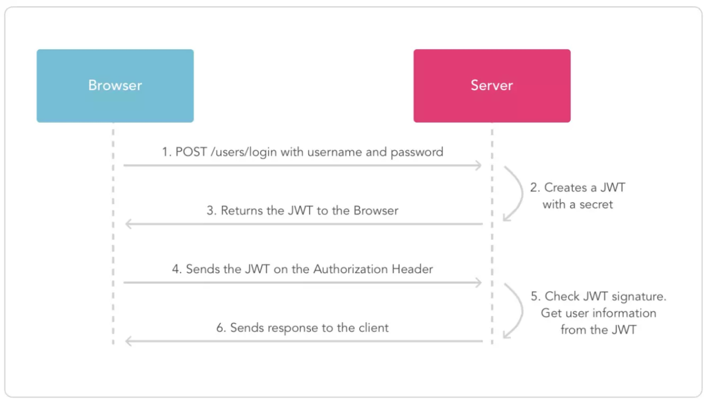
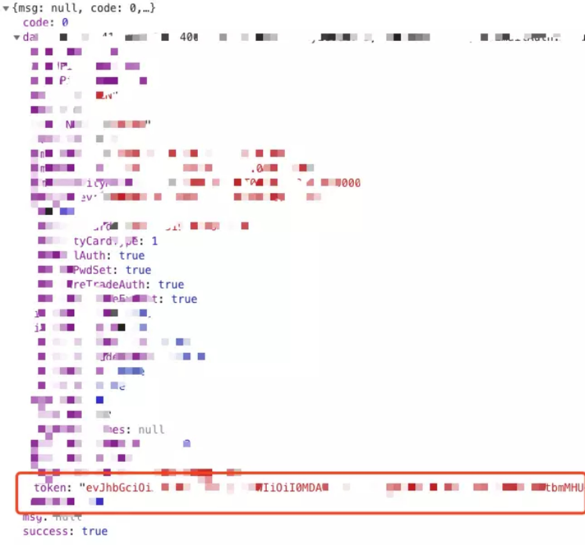
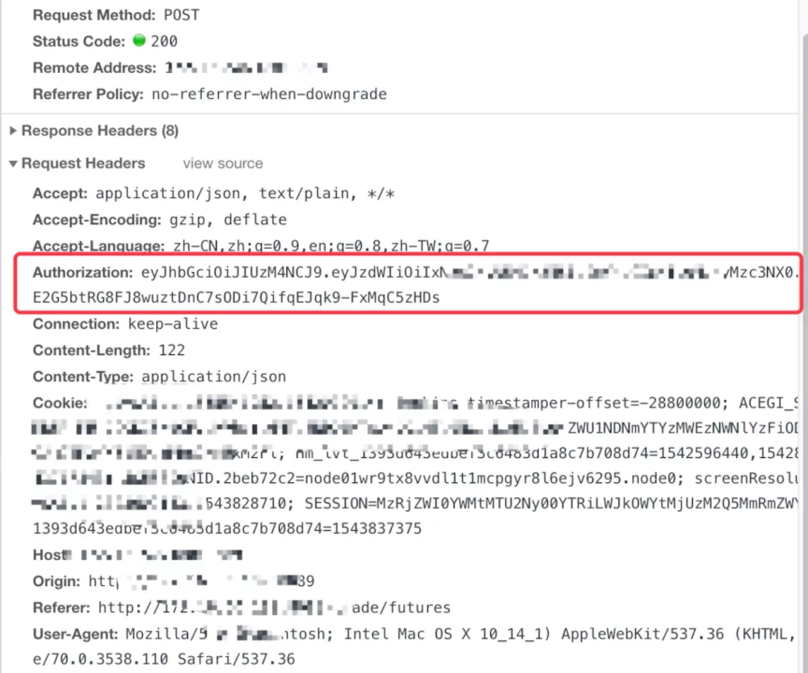

### 一、JWT鉴权

---

1. 用户发起登录请求；

2. 服务端创建一个加密后的JWT信息，用户登录之后把生成的token返回给前端；（可以放入redis缓存）

   

3. 在后续请求中JWT信息作为请求头，发给服务端；

   

4. 服务端拿到JWT后进行解密，正确解密表示此次请求合法，验证通过；解密失败说明token无效或者已过期。

   1. 在拦截器中读取这个header里面的token值；
   2. 拿到之后进行解密校验。

### 二、token认证的优势

---

相对于session认证的方式来说，使用token进行身份认证有下面3个优势：

#### 2.1 无状态

token自身包含了身份验证所需要的所有信息，使得我们的服务器不需要存储Session信息，这显然增加了系统的可用性和伸缩性，大大减轻了服务端的压力。但是，也正是由于token的无状态，也导致了它最大的缺点：

- **当后端在token有效期内废弃一个token或者更改它的权限的话，不会立即生效，一般需要等到有效期过后才可以**；
- 另外，当用户Logout的话，token也还有效。除非，我们在后端增加额外的处理逻辑。

#### 2.2 有效避免了CSRF攻击

Cross Site Request Forgery——跨站请求伪造

为什么token不会存在这样的问题呢？

一般情况下我们使用JWT的话，在我们登录成功获得token之后，一般会选择**存放在local storage中**。然后我们在前端通过某些方式会给每个发到后端的请求加上这个token，这样就不会出现CSRF漏洞的问题。因为，即使有个你点击了非法链接发送了请求到服务端，这个非法请求是不会携带token的，所以这个请求将是非法的。

但是**这样会存在XSS攻击中被盗的风险**，为了避免XSS攻击，你可以选择将token存储在标记为httpOnly的cookie 中。但是，这样又导致了你必须自己提供CSRF保护。

具体采用上面哪两种方式存储token呢，大部分情况下存放在local storage下都是最好的选择，某些情况下可能需要存放在标记为httpOnly的cookie中会更好。

#### 2.3 适合移动端

使用Session进行身份认证的话，需要保存一份信息在服务器端，而且这种方式会依赖到Cookie（需要Cookie保存SessionId），所以不适合移动端。

但是，使用token进行身份认证就不会存在这种问题，因为只要token可以被客户端存储就能够使用，而且token还可以跨语言使用。

#### 2.4 单点登录友好

使用Session进行身份认证的话，实现单点登录，需要我们把用户的Session信息保存在一台电脑上，并且还会遇到常见的Cookie跨域的问题。但是，使用token进行认证的话，token被保存在客户端，不会存在这些问题。

### 三、token认证常见问题及解决办法

---

#### 3.1 注销登录后token还有效

类似具体场景有：

1. 退出登录；
2. 修改密码；
3. 服务端修改了某个用户具有的权限或者角色；
4. 用户的账户被删除/暂停；
5. 用户由管理员注销。

**token一旦派发出去，如果后端不增加其他逻辑的话，它在失效之前都是有效的**。那么，我们如何解决这个问题呢？总结了下面几种方案：

#### 3.2 解决方案

- **将token存入内存数据库**：将token存入redis内存数据库。如果需要**让某个token失效就直接从redis中删除这个token即可**。但是，这样会导致每次使用token发送请求都要先从DB中查询token是否存在的步骤，而且违背了JWT的无状态原则。
- **黑名单机制**：使用内存数据库比如redis维护一个黑名单，如果想让某个token失效的话就直接将这个token加入到黑名单即可。然后，每次使用token进行请求的话都会先判断这个token是否存在于黑名单中。
- **修改密钥 (Secret)**：我们为每个用户都创建一个专属密钥，如果我们想让某个token失效，我们直接修改对应用户的密钥即可。但是，这样相比于前两种引入内存数据库带来了危害更大，比如：a）如果服务是分布式的，则每次发出新的 token 时都必须在多台机器同步密钥。为此，你需要将必须将机密存储在数据库或其他外部服务中，这样和 Session 认证就没太大区别了。b）如果用户同时在两个浏览器打开系统，或者在手机端也打开了系统，如果它从一个地方将账号退出，那么其他地方都要重新进行登录，这是不可取的。
- **保持令牌的有效期限短并经常轮换**：很简单的一种方式。但是，会导致用户登录状态不会被持久记录，而且需要用户经常登录。

一种比较好的方式：**使用用户的密码的哈希值对token进行签名**。因此，如果密码更改，则任何先前的令牌将自动无法验证。

#### 3.3 token的续签问题

token有效期一般都建议设置的不太长，那么token过期后如何认证，如何实现动态刷新token，避免用户经常需要重新登录？

先来看看在Session认证中一般的做法：假如session的有效期30分钟，如果30分钟内用户有访问，就把session有效期被延长30分钟。

1. 类似于Session认证中的做法：这种方案满足于大部分场景。假设服务端给的token有效期设置为30分钟，服务端每次进行校验时，如果发现token的有效期马上快过期了，服务端就重新生成token给客户端。客户端每次请求都检查新旧token，如果不一致，则更新本地的token。这种做法的问题是仅仅在快过期的时候请求才会更新token，对客户端不是很友好。

2. **每次请求都返回新token**：这种方案的的思路很简单，但是，很明显，开销会比较大。

3. token有效期设置到半夜：这种方案是一种折衷的方案，保证了大部分用户白天可以正常登录，适用于对安全性要求不高的系统。

4. 用户登录返回两个token：第一个是acessToken，它的过期时间token本身的过期时间比如半个小时，另外一个是refreshToken它的过期时间更长一点比如为1天。客户端登录后，将accessToken和refreshToken保存在本地，每次访问将accessToken传给服务端。服务端校验accessToken的有效性，如果过期的话，就将refreshToken传给服务端。如果有效，服务端就生成新的accessToken给客户端。否则，客户端就重新登录即可。该方案的不足是：需要客户端来配合；用户注销的时候需要同时保证两个token都无效；重新请求获取token的过程中会有短暂token不可用的情况（可以通过在客户端设置定时器，当accessToken快过期的时候，提前去通过refreshToken获取新的accessToken）。

### 四、总结

---

JWT最适合的场景是不需要服务端保存用户状态的场景。