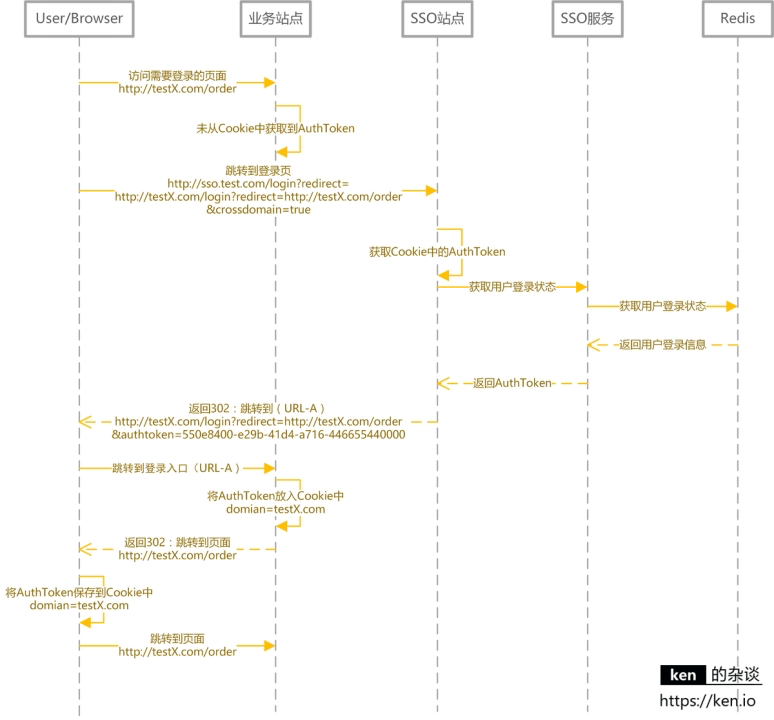

### 一、SSO介绍

---

Single Sign On——单点登录。SSO是在多个应用系统中，用户只需登录一次就可以访问所有相互信任的应用系统。

例如访问在网易账号中心（http://reg.163.com/）登录之后访问以下站点都是登录状态：

- 网易直播 [http://v.163.com](http://v.163.com/)
- 网易博客 [http://blog.163.com](http://blog.163.com/)
- 网易花田 [http://love.163.com](http://love.163.com/)
- 网易考拉 [https://www.kaola.com](https://www.kaola.com/)
- 网易Lofter [http://www.lofter.com](http://www.lofter.com/)

#### 1.1 SSO优点

1. 用户角度：用户能够做到一次登录多次使用，无需记录多套用户名和密码，省心。
2. 系统管理员角度：管理员只需维护好一个统一的账号中心就可以了，方便。
3. 新系统开发角度：新系统开发时只需直接对接统一的账号中心即可，简化开发流程，省时。

#### 1.2 SSO设计目标

需要实现以下核心功能：

- 单点登录
- 单点登出
- 支持跨域单点登录
- 支持跨域单点登出

### 二、SSO设计与实现

---

#### 2.1 核心应用与依赖

| 应用/模块/对象    | 说明                                |
| ----------------- | ----------------------------------- |
| 前台站点          | 需要登录的站点                      |
| SSO站点——登录     | 提供登录的页面                      |
| SSO站点——登出     | 提供注销登录的入口                  |
| SSO服务——登录     | 提供登录服务                        |
| SSO服务——登录状态 | 提供登录状态校验/登录信息查询的服务 |
| SSO服务——登出     | 提供用户注销登录的服务              |
| 数据库            | 存储用户账号信息                    |
| 缓存              | 存储用户的登录信息                  |

#### 2.2 用户登录状态的存储于校验

基于Web站点的SSO，用户在浏览需要登录的页面时，客户端将AuthToken提交给SSO服务校验登录状态/获取用户登录信息。

对于登录信息的存储，建议采用Redis，使用Redis集群来存储登录信息，既可以保证高可用，又可以线性扩充。同时也可以让SSO服务满足负载均衡/可伸缩的需求。

#### 2.3 用户登录/登录校验

按照上图，用户登录后Authtoken保存在Cookie中。 domian= test. com **浏览器会将domain设置成 .test.com， 这样访问所有*.test.com的web站点，都会将Authtoken携带到服务器端**。 然后通过SSO服务，完成对用户状态的校验/用户登录信息的获取。

登录信息获取/登录状态校验：

#### 2.4 用户登出

用户登出时要做的事情：

- 服务端清除缓存（Redis）中的登录状态
- 客户端清除存储的AuthToken

#### 2.5 跨域登录、登出

核心思路是客户端存储AuthToken，服务端通过Redis存储登录信息。由于客户端是将AuthToken存储在Cookie中的。所以跨域要解决的问题，就是如何解决Cookie的跨域读写问题。

**Cookie是不能跨域的。**

解决跨域的核心思路：

- **登录完成之后通过回调的方式，将AuthToken传递给主域名之外的站点**，该站点自行将AuthToken保存在当前域下的Cookie中。
- 登出完成之后通过回调的方式，调用非主域名站点的登出页面，完成设置Cookie中的AuthToken过期的操作。

跨域登录（主域名已登录）：

跨域登录（主域名未登录）：

跨域登出：

### 三、备注

---

如果涉及到APP用户登录等情况，在访问SSO服务时，增加对APP的签名验证就好了。当然，如果有无线网关，验证签名不是问题。