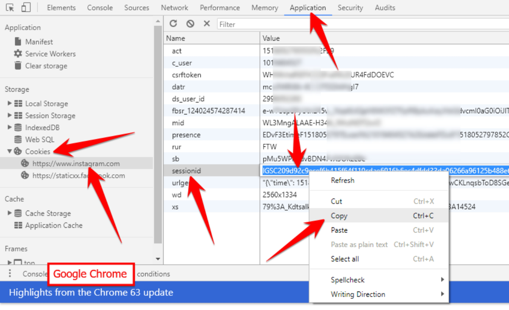
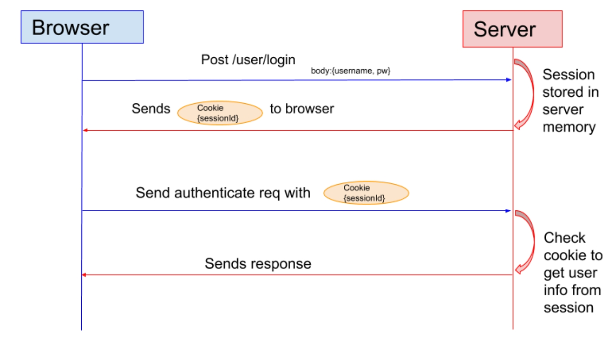
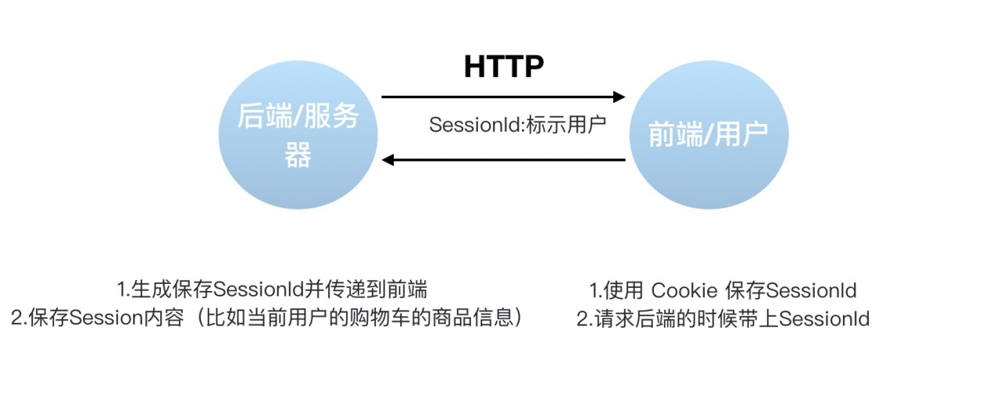
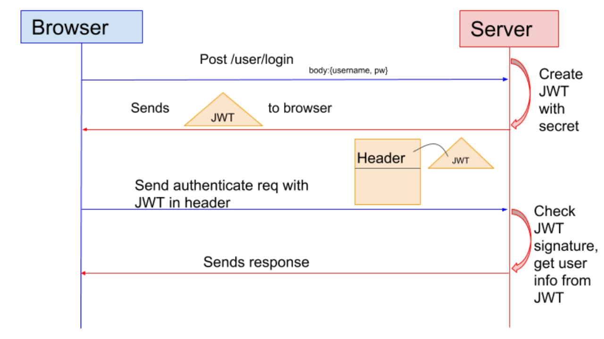

### 一、认证(Authentication)和授权(Authorization)

---

#### 1.1 认证

验证您的身份凭据，通过这个凭据，系统得以知道你就是你，也就是说系统存在你这个用户。称为身份/用户验证。

#### 1.2 授权

发生在认证之后，授权主要掌管访问系统的权限。比如有些特定资源只能具有特定权限的人才能访问比如admin，有些对系统资源操作比如删除、添加、更新只能特定人才具有。


### 二、Cookie

---



Cookie和Session都是用来**跟踪浏览器用户身份的会话方式**，但是两者的应用场景不太一样。

> Cookies是某些网站为了辨别用户身份而储存在用户本地终端上的数据（通常经过加密）。Cookie存放在客户端，一般用来保存用户信息。 
>
> ----维基百科

下面是Cookie的一些应用案例：

1. 在Cookie中**保存已经登录过的用户信息**，下次访问网站的时候页面可以自动帮你登录的一些基本信息给填了。
2. 除此之外，Cookie还能**保存用户首选项，主题和其他设置信息**。使用Cookie保存session或者token，向后端发送请求的时候带上Cookie，这样后端就能取到session或者token了。这样就能记录用户当前的状态了，因为HTTP协议是无状态的。
3. Cookie还可以用来**记录和分析用户行为**。例如你在网上购物的时候，因为HTTP协议是没有状态的，如果服务器想要获取你在某个页面的停留状态或者看了哪些商品，一种常用的实现方式就是将这些信息存放在Cookie。

#### 2.1 设置Cookie返回给客户端

```java
public String setCookie(HttpServletResponse response) {
  // 创建一个 cookie
  Cookie cookie = new Cookie("username", "Jovan");
  //设置 cookie过期时间
  cookie.setMaxAge(7 * 24 * 60 * 60); // expires in 7 days
  //添加到 response 中
  response.addCookie(cookie);

  return "Username is changed!";
}
```

#### 2.2 @CookieValue

获取特定的cookie的值。

```java
@GetMapping("/")
public String readCookie(@CookieValue(value = "username", defaultValue = "Atta") String username) {
  return "Hey! My username is " + username;
}
```

#### 2.3 读取所有Cookie值

```java
@GetMapping("/all-cookies")
public String readAllCookies(HttpServletRequest request) {
  Cookie[] cookies = request.getCookies();
  if (cookies != null) {
    return Arrays.stream(cookies)
      .map(c -> c.getName() + "=" + c.getValue()).collect(Collectors.joining(", "));
  }
  return "No cookies";
}
```


### 三、Cookie和Session的区别

---

Session的主要作用就是**通过服务端记录用户的状态**。典型的场景是购物车，当你要添加商品到购物车的时候，系统不知道是哪个用户操作的，因为HTTP协议是无状态的。服务端给特定的用户创建特定的Session之后就可以标识这个用户并且跟踪这个用户了。

Cookie数据保存在客户端(浏览器端)，Session数据保存在服务器端。相对来说Session安全性更高。如果使用Cookie的一些敏感信息不要写入Cookie中，最好能将Cookie信息加密然后使用到的时候再去服务器端解密。

#### 3.1 使用Session进行身份验证

通过SessionID来实现特定的用户，SessionID一般会选择存放在Redis中。举个例子：用户成功登陆系统，然后**返回给客户端具有SessionID的Cookie**，当用户向后端发起请求的时候会把SessionID带上，这样后端就知道你的身份状态了。详细的过程如下：



1. 用户向服务器发送用户名和密码用于登陆系统。
2. 服务器验证通过后，服务器为用户创建一个Session，并将Session信息存储起来。
3. 服务器向用户返回一个SessionID，写入用户的Cookie。
4. 当用户保持登录状态时，Cookie将与每个后续请求一起被发送出去。
5. 服务器可以将存储在Cookie上的Session ID与存储在内存中或者数据库中的Session信息进行比较，以验证用户的身份，返回给用户客户端响应信息的时候会附带用户当前的状态。

>注意：
>
>1. 依赖Session的关键业务一定要确保客户端开启了Cookie。
>2. 注意Session的过期时间。



Spring Session提供了一种跨多个应用程序或实例管理用户会话信息的机制。参考以下文章：

1. [Getting Started with Spring Session](https://codeboje.de/spring-session-tutorial/)
2. [Guide to Spring Session](https://www.baeldung.com/spring-session)
3. [Sticky Sessions with Spring Session & Redis](https://medium.com/@gvnix/sticky-sessions-with-spring-session-redis-bdc6f7438cc3)

#### 3.2 没有Cookie的话Session还能用吗

一般是通过Cookie来保存SessionID，假如你使用了Cookie保存SessionID的方案的话，如果客户端禁用了Cookie，那么Session就无法正常工作。但是，并不是没有Cookie之后就不能用Session了，比如你可以将SessionID放在请求的url里面https://javaguide.cn/?session_id=xxx 。这种方案的话可行，但是安全性和用户体验感降低。当然，为了你也可以对SessionID进行一次加密之后再传入后端。

#### 3.3 Cookie无法防止CSRF攻击

举个简单的例子：

小壮登录了某网上银行，他来到了网上银行的帖子区，看到一个帖子下面有一个链接写着“科学理财，年盈利率过万”，小壮好奇的点开了这个链接，结果发现自己的账户少了10000元。这是这么回事呢？原来黑客在链接中藏了一个请求，这个请求直接利用小壮的身份给银行发送了一个转账请求,也就是通过你的Cookie向银行发出请求。

<a src=http://www.mybank.com/Transfer?bankId=11&money=10000>科学理财，年盈利率过万</>

上面也提到过，进行Session认证的时候，我们一般使用Cookie来存储SessionId，当我们登陆后后端生成一个SessionId放在Cookie中返回给客户端，服务端通过Redis或者其他存储工具记录保存着这个SessionId，客户端登录以后每次请求都会带上这个SessionId，服务端通过这个SessionId来标示你这个人。如果别人通过cookie拿到了SessionId后就可以代替你的身份访问系统了。

Session认证中Cookie中的SessionId是由浏览器发送到服务端的，借助这个特性，攻击者就可以通过让用户误点攻击链接，达到攻击效果。

但是，我们使用token的话就不会存在这个问题，在我们登录成功获得token之后，一般会选择存放在local storage中。然后我们在前端通过某些方式会给每个发到后端的请求加上这个token,这样就不会出现CSRF漏洞的问题。因为，即使有个你点击了非法链接发送了请求到服务端，这个非法请求是不会携带token的，所以这个请求将是非法的。

> 不论是Cookie还是token都无法避免跨站脚本攻击（Cross Site Scripting）XSS。
>
> XSS中攻击者会用各种方式将恶意代码注入到其他用户的页面中。就可以通过脚本盗用信息比如cookie。

[如何防止CSRF攻击？——美团技术团队](https://tech.meituan.com/2018/10/11/fe-security-csrf.html)


### 四、Token

---

通过这种方式服务器端就不需要保存Session数据了，只用在客户端保存服务端返回给客户的Token就可以了，扩展性得到提升。 

JWT本质上就一段签名的JSON格式的数据。由于它是带有签名的，因此接收者便可以验证它的真实性。

JWT 由 3 部分构成：

1. `Header`：描述JWT的元数据。定义了生成签名的算法以及Token的类型。
2. `Payload`（负载）：用来存放实际需要传递的数据
3. `Signature`（签名）：服务器通过Payload、Header和一个密钥(secret)使用Header里面指定的签名算法（默认是HMAC SHA256）生成。

在基于Token进行身份验证的的应用程序中，服务器通过Payload、Header和一个密钥(secret)创建令牌（Token）并将Token发送给客户端，**客户端将Token保存在Cookie或者localStorage里面**，以后客户端发出的所有请求都会携带这个令牌。你可以把它放在Cookie里面自动发送，但是这样不能跨域，所以更好的做法是**放在HTTP Header的Authorization字段中**：Authorization: Bearer Token。



1. 用户向服务器发送用户名和密码用于登陆系统。
2. 身份验证服务响应并返回了签名的JWT，上面包含了用户是谁的内容。
3. 用户以后每次向后端发请求都在Header中带上JWT。
4. 服务端检查JWT并从中获取用户相关信息。


### 五、OAuth 2.0

---

OAuth是一个行业的标准授权协议，主要用来**授权第三方应用获取有限的权限**。实际上它就是一种授权机制，它的最终目的是为第三方应用颁发一个**有时效性的令牌token**，使得第三方应用能够通过该令牌获取相关的资源。

OAuth 2.0比较常用的场景就是**第三方登录**。另外，现在OAuth 2.0也常见于支付场景（微信支付、支付宝支付）和开发平台（微信开放平台、阿里开放平台等等）。

- [OAuth 2.0 的一个简单解释](http://www.ruanyifeng.com/blog/2019/04/oauth_design.html)
- [10 分钟理解什么是 OAuth 2.0 协议](https://deepzz.com/post/what-is-oauth2-protocol.html)
- [OAuth 2.0 的四种方式](http://www.ruanyifeng.com/blog/2019/04/oauth-grant-types.html)
- [GitHub OAuth 第三方登录示例教程](http://www.ruanyifeng.com/blog/2019/04/github-oauth.html)