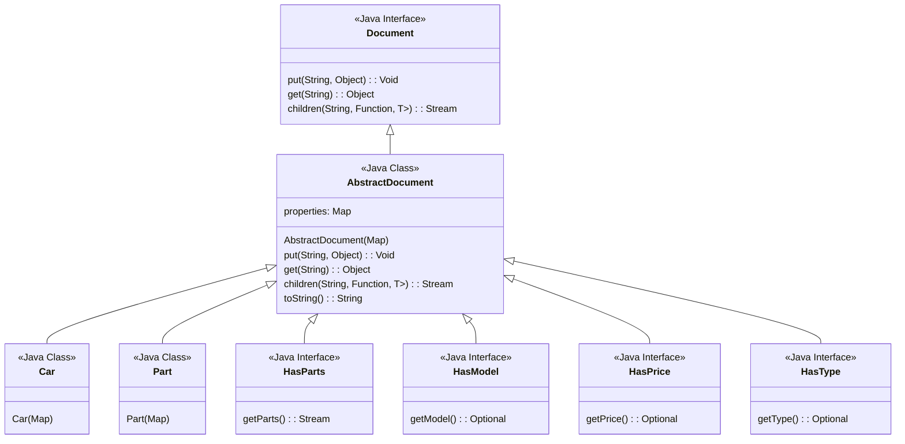
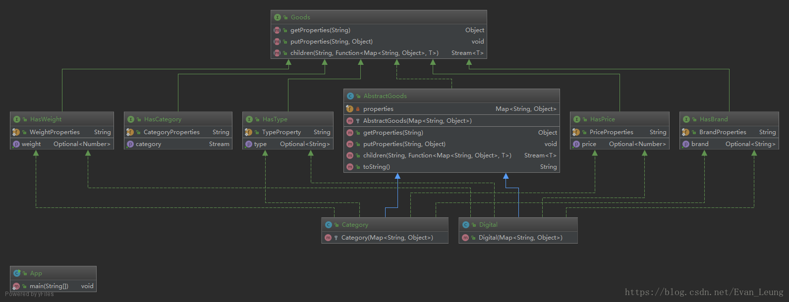
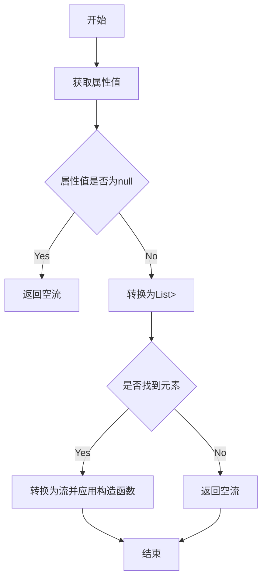

### 一、目的

---

使用**动态属性**，并在保持**类型安全**的同时实现非类型化语言的灵活性。


### 二、解释

---

此模式使用特征的概念来实现类型安全，并将不同类的属性分离为一组接口。

#### 2.1 真实世界示例

>考虑由多个部分组成的汽车。我们不知道特定汽车是否真的拥有所有零件，或者仅仅是零件中的一部分。我们的汽车是动态而且非常灵活的。

抽象文档模式允许在对象不知道的情况下将属性附加到对象。

#### 2.2 程序示例

定义基类：Document和AbstractDocument

```java
/**
 * Document接口定义了抽象文档的基本操作方法。
 *
 * <p>抽象文档是一种键值对集合，可以包含嵌套的子文档。
 * 该接口的主要用途是提供一个标准的方式来操作这些文档中的数据。
 *
 * @author chance
 * @date 2024/11/28 14:03
 * @since 1.0
 */
public interface Document {

    /**
     * 向文档中插入一个键值对。
     * 如果指定键已存在，该方法应替换旧的值。
     *
     * @param key   文档中的键，用于标识值。
     * @param value 与键关联的值。
     */
    void put(String key, Object value);

    /**
     * 根据键获取文档中的值。
     *
     * @param key 要检索的键。
     * @return 与键关联的值，如果键不存在，则返回null。
     */
    Object get(String key);

    /**
     * 获取指定键下所有子文档的流。
     * 该方法允许用户通过提供一个构造函数来转换每个子文档，
     * 这使得用户可以以一致和类型安全的方式处理子文档。
     *
     * @param key         子文档的键。
     * @param constructor 一个函数，用于将子文档（表示为键值对映射）转换为指定类型T的实例。
     * @param <T>         转换后子文档的类型。
     * @return 子文档的流，每个子文档都已转换为指定类型T的实例。
     */
    <T> Stream<T> children(String key, Function<Map<String, Object>, T> constructor);
}
```

```java
public class AbstractDocument implements Document {

    private final Map<String, Object> properties;

    public AbstractDocument(Map<String, Object> properties) {
        Objects.requireNonNull(properties, "Properties must be provided");
        this.properties = properties;
    }

    @Override
    public void put(String key, Object value) {
        properties.put(key, value);
    }

    @Override
    public Object get(String key) {
        return properties.get(key);
    }

    @Override
    public <T> Stream<T> children(String key, Function<Map<String, Object>, T> constructor) {
        // 获取指定键下的所有值
        Object value = get(key);
        if (value instanceof List) {
            // 如果值是列表，则尝试将每个元素转换为Map，并应用构造函数
            List<?> list = (List<?>) value;
            return list.stream()
                    .filter(Map.class::isInstance)
                    .map(el -> (Map<String, Object>) el)
                    .map(constructor);
        } else {
            // 如果不是列表或没有找到键，则返回空流
            return Stream.empty();
        }
    }

    @Override
    public String toString() {
        StringBuilder builder = new StringBuilder();
        builder.append(getClass().getName()).append("[");
        properties.forEach((key, value) ->
                builder.append("[").append(key).append(" : ")
                        .append(value).append("]")
        );
        builder.append("]");
        return builder.toString();
    }
}
```

接着定义一个枚举“属性”和一组类型，价格，模型和零件的接口。这使我们能够为Car类创建静态外观的界面。

```java
/**
 * 汽车枚举属性
 *
 * @author chance
 * @date 2024/11/28 14:50
 * @since 1.0
 */
public enum CarProperty {
    /**
     * 部件
     */
    PARTS,
    /**
     * 类型
     */
    TYPE,
    /**
     * 价格
     */
    PRICE,
    /**
     * 模型
     */
    MODEL
}

```

```java
/**
 * 定义了一个具有类型的文档接口
 *
 * <p>该接口继承自Document，并提供了一种获取类型信息的通用方法
 *
 * @author chance
 * @date 2024/11/28 14:53
 * @since 1.0
 */
public interface HasType extends Document {

    default Optional<String> getType() {
        return Optional.ofNullable((String) get(CarProperty.TYPE.toString()));
    }
}

/**
 * 定义了一个具有价格的文档接口
 *
 * <p>该接口继承自Document，并提供了一种获取价格信息的通用方法
 *
 * @author chance
 * @date 2024/11/28 14:53
 * @since 1.0
 */
public interface HasPrice extends Document {

    default Optional<String> getPrice() {
        return Optional.ofNullable((String) get(CarProperty.PRICE.toString()));
    }
}

/**
 * 定义了一个具有模型的文档接口
 *
 * <p>该接口继承自Document，并提供了一种获取模型信息的通用方法
 *
 * @author chance
 * @date 2024/11/28 14:53
 * @since 1.0
 */
public interface HasModel extends Document {

    default Optional<String> getModel() {
        return Optional.ofNullable((String) get(CarProperty.MODEL.toString()));
    }
}


/**
 * 定义了一个具有部件的文档接口
 *
 * <p>该接口继承自Document，并提供了一种获取部件信息的通用方法
 *
 * @author chance
 * @date 2024/11/28 14:53
 * @since 1.0
 */
public interface HasParts extends Document {

    default Stream<Part> getParts() {
        return children(CarProperty.PARTS.toString(), Part::new);
    }
}
```

接着创建Car类

```java
/**
 * Car 类表示一个特定的抽象文档实现，专注于汽车领域。
 * <p>它继承自 AbstractDocument，并实现了与汽车特性相关的接口，如型号、部件、价格和类型。
 * 这种设计允许 Car 类封装与汽车相关的数据和行为，同时提供灵活的属性管理结构。
 *
 * @author chance
 * @date 2024/11/28 14:59
 * @since 1.0
 */
public class Car extends AbstractDocument implements HasModel, HasParts, HasPrice, HasType {

    /**
     * 构造一个 Car 实例，使用属性集合进行初始化。
     *
     * @param properties 包含汽车属性的键值对映射，例如型号、部件、价格等。
     *                   该构造函数将属性直接传递给父类 AbstractDocument 进行初始化。
     */
    public Car(Map<String, Object> properties) {
        super(properties);
    }
}
```

最后是Car构造和使用方法：

```java
Map<String, Object> wheelProperties = new HashMap<>();
wheelProperties.put(CarProperty.TYPE.toString(), "wheel");
wheelProperties.put(CarProperty.MODEL.toString(), "15C");
wheelProperties.put(CarProperty.PRICE.toString(), 100L);

Map<String, Object> doorProperties = new HashMap<>();
doorProperties.put(CarProperty.TYPE.toString(), "door");
doorProperties.put(CarProperty.MODEL.toString(), "Lambo");
doorProperties.put(CarProperty.PRICE.toString(), 300L);

Map<String, Object> carProperties = new HashMap<>();
carProperties.put(CarProperty.MODEL.toString(), "300SL");
carProperties.put(CarProperty.PRICE.toString(), 10000L);
carProperties.put(CarProperty.PARTS.toString(), Arrays.asList(wheelProperties, doorProperties));

Car car = new Car(carProperties);
System.out.println("Here is our car:");
System.out.println("-> model: " + car.getModel().orElseThrow(() -> new IllegalStateException("Model not found")));
System.out.println("-> price: " + car.getPrice().orElseThrow(() -> new IllegalStateException("Price not found")));
System.out.println("-> parts: ");

car.getParts().forEach(part ->
        System.out.println("\t"
                + "/" + part.getType().orElse(null)
                + "/" + part.getModel().orElse(null)
                + "/" + part.getPrice().orElse(null))
);
```




### 三、适用性及场景

---

- 内容管理系统 (CMS)：在 CMS 中，您可能拥有各种类型的内容，例如文章、图片、视频等。每种类型的内容可以具有共享属性，例如创建日期、作者和标签，同时还具有特定属性，例如图像的图像尺寸或视频的视频时长。
- 文件系统：如果您正在设计一个需要管理不同类型文件的文件系统，例如文档、图像、音频文件和目录，抽象文档模式可以帮助提供一种一致的方式来访问文件大小、创建日期等属性，同时允许特定属性，例如图像分辨率或音频持续时间。
- 电子商务系统：电子商务平台可能有不同类型的产品，例如实体产品、数字下载和订阅。每种类型可以共享名称、价格和描述等通用属性，同时具有独特属性，例如实体产品的运输重量或数字产品的下载链接。
- 医疗记录系统：在医疗保健领域，患者记录可能包含各种类型的数据，例如人口统计、病史、检查结果和处方。抽象文档模式可以帮助管理共享属性，例如患者 ID 和出生日期，同时容纳特殊属性，例如检查结果或处方药。
- 配置管理：在处理软件应用程序的配置设置时，可能会出现不同类型的配置元素，每种元素都有自己的一组属性。抽象文档模式可用于管理这些配置元素，同时确保以一致的方式访问和操作其属性。
- 教育平台：教育系统可能有各种类型的学习材料，例如基于文本的内容、视频、测验和作业。标题、作者和发布日期等常见属性可以共享，而视频时长或作业截止日期等独特属性可以特定于每种类型。
- 项目管理工具：在项目管理应用程序中，您可以拥有不同类型的任务，如待办事项、里程碑和问题。抽象文档模式可用于处理一般属性，如任务名称和受让人，同时允许特定属性，如里程碑日期或问题优先级。
- 文档具有多样化、不断发展的属性结构。
- 动态添加新属性是一个常见的要求。
- 将数据访问与特定格式分离至关重要。
- 可维护性和灵活性对于代码库至关重要。


### 四、内容管理系统CMS

---

开发一个CMS（Content Management System）中的多格式内容处理。其中用户可以创建包含文本、图片、视频等多种类型的内容的文章。可以使用抽象文档模式来设计这样的系统。

#### 4.1 定义一个通用的Content接口

```java
/**
 * 通用的 Content 接口
 * <p>定义了内容对象的基本操作，旨在为不同类型的内容提供一个统一的处理方式
 * 主要用途是获取内容的类型信息，并渲染为字符串形式
 *
 * @author chance
 * @date 2024/11/29 09:49
 * @since 1.0
 */
public interface Content {

    /**
     * 获取内容的类型
     *
     * @return 内容的类型，如文本、图片、视频等
     */
    String getType();

    /**
     * 渲染内容
     * 将内容渲染为字符串形式，具体表现取决于内容的类型和实现
     *
     * @return 渲染后的内容字符串
     */
    String render();
}
```

#### 4.2 文本内容的具体实现

```java
/**
 * 文本内容的具体实现
 * <p>该类实现了{@link Content}接口，用于定义和管理文本类型的内容
 * 主要功能包括返回内容的类型标识和渲染内容的HTML格式
 *
 * @author chance
 * @date 2024/11/29 09:50
 * @since 1.0
 */
public class TextContent implements Content {

    /**
     * 存储文本内容的字符串变量
     */
    private final String text;

    /**
     * 构造函数，用于创建TextContent实例
     *
     * @param text 文本内容
     */
    public TextContent(String text) {
        this.text = text;
    }

    /**
     * 获取内容的类型
     *
     * @return 返回内容类型，此处固定为"text"
     */
    @Override
    public String getType() {
        return "text";
    }

    /**
     * 渲染文本内容为HTML格式
     * <p>
     * 此方法将文本内容封装在HTML的 <p> 标签中，以便在Web页面上显示
     *
     * @return 返回封装好的HTML格式文本内容
     */
    @Override
    public String render() {
        return "<p>" + text + "</p>";
    }
}
```

#### 4.3 图片内容的具体实现

```java
/**
 * 图片内容的具体实现
 * <p>该类实现了{@link Content}接口，用于处理和渲染图片内容
 *
 * @author chance
 * @date 2024/11/29 09:51
 * @since 1.0
 */
public class ImageContent implements Content {

    /**
     * 图片的URL地址
     */
    private final String imageUrl;

    /**
     * 构造函数，用于创建ImageContent对象
     *
     * @param imageUrl 图片的URL地址
     */
    public ImageContent(String imageUrl) {
        this.imageUrl = imageUrl;
    }

    /**
     * 获取内容类型
     * 重写Content接口的getType方法，返回图片类型
     *
     * @return 内容类型，此处固定为"image"
     */
    @Override
    public String getType() {
        return "image";
    }

    /**
     * 渲染内容
     * 重写Content接口的render方法，将图片内容渲染为HTML格式
     *
     * @return 渲染后的HTML字符串，包含img标签和图片URL
     */
    @Override
    public String render() {
        return "";
    }
}
```

#### 4.4 视频内容的具体实现

```java
/**
 * 视频内容的具体实现
 *
 * @author chance
 * @date 2024/11/29 09:55
 * @since 1.0
 */
public class VideoContent implements Content {

    /**
     * 视频的URL地址
     */
    private final String videoUrl;

    /**
     * 构造一个新的视频内容实例
     *
     * @param videoUrl 视频的URL地址
     */
    public VideoContent(String videoUrl) {
        this.videoUrl = videoUrl;
    }

    /**
     * 获取内容的类型
     *
     * @return 返回内容类型，此处固定为"video"
     */
    @Override
    public String getType() {
        return "video";
    }

    /**
     * 渲染内容为HTML格式
     * 对于视频内容，这将生成一个HTML视频标签
     *
     * @return 视频内容的HTML表示
     */
    @Override
    public String render() {
        return "<video controls><source src=\"" + videoUrl + "\" type=\"video/mp4\"></video>";
    }
}
```

#### 4.5 文章类（存储和渲染多种内容）

```java
/**
 * 文章，用来存储和渲染多种内容
 *
 * @author chance
 * @date 2024/11/29 09:57
 * @since 1.0
 */
public class Article {

    private List<Content> contents;

    public Article(List<Content> contents) {
        this.contents = contents;
    }

    public String render() {
        StringBuilder sb = new StringBuilder();
        for (Content content : contents) {
            sb.append(content.render());
        }
        return sb.toString();
    }
}
```

#### 4.6 测试

```java
log.info("构造文章");
Article article = new Article(Arrays.asList(
        new TextContent("Hello World"),
        new ImageContent("https://www.baidu.com"),
        new VideoContent("https://www.baidu.com")
));
log.info("文章渲染结果：{}", article.render());
```


### 五、电子表格软件

---

考虑一个简单的电子表格软件，其中每个单元格可以是数字、文本或公式。可以用抽象文档模式来设计单元格。

#### 5.1 单元格接口

```java
/**
 * 单元格接口
 * <p>定义了电子表格中单元格的基本操作和属性
 * 它提供了获取单元格值和显示单元格内容的方法
 *
 * @author chance
 * @date 2024/11/29 14:11
 * @since 1.0
 */
public interface Cell {

    /**
     * 获取单元格的值
     *
     * @return 单元格的值，类型为Object，以便可以存储各种类型的值
     */
    Object getValue();

    /**
     * 显示单元格的内容
     *
     * @return 以字符串形式返回单元格的内容，便于显示或进一步处理
     */
    String display();
}
```

#### 5.2 数字单元格

```java
/**
 * 数字单元格
 * <p>实现了{@link Cell}接口，用于表示Excel表格中的数字类型单元格
 *
 * @author chance
 * @date 2024/11/29 14:17
 * @since 1.0
 */
public class NumberCell implements Cell {

    private final double value;

    public NumberCell(double value) {
        this.value = value;
    }

    @Override
    public Object getValue() {
        return value;
    }

    @Override
    public String display() {
        return String.valueOf(value);
    }
}
```

#### 5.3 文本单元格

```java
/**
 * 文本单元格
 * <p>实现了{@link Cell}接口用于表示包含文本数据的单元格对象
 * @author chance
 * @date 2024/11/29 14:20
 * @since 1.0
 */
public class TextCell implements Cell {

    private final String text;

    public TextCell(String text) {
        this.text = text;
    }

    @Override
    public Object getValue() {
        return text;
    }

    @Override
    public String display() {
        return text;
    }
}
```

#### 5.4 公式单元格

```java
/**
 * 公式单元格
 * <p>实现了{@link Cell}接口，用于表示Excel表格中的公式类型单元格
 * 公式单元格包含一个公式字符串和一个计算结果
 *
 * @author chance
 * @date 2024/11/29 14:27
 * @since 1.0
 */
public class FormulaCell implements Cell {

    /**
     * 公式字符串，用于表示单元格中的计算公式
     */
    private final String formula;

    /**
     * 计算结果，公式计算后的数值结果
     */
    private final double result;


    /**
     * 构造函数，用于创建一个公式单元格对象
     *
     * @param formula 公式字符串
     * @param result  计算结果
     */
    public FormulaCell(String formula, double result) {
        this.formula = formula;
        this.result = result;
    }

    /**
     * 获取单元格的值
     * 对于公式单元格，返回的是计算结果
     *
     * @return 单元格的值（计算结果）
     */
    @Override
    public Object getValue() {
        return result;
    }

    /**
     * 显示单元格的内容
     * 对于公式单元格，以"=公式 (计算结果)"的格式显示
     *
     * @return 单元格的显示内容
     */
    @Override
    public String display() {
        return "=" + formula + " (" + result + ")";
    }
}
```

#### 5.5 表格类

```java
/**
 * 电子表格
 * <p>用于管理单元格对象
 * 它提供了设置单元格内容和获取单元格显示内容的方法
 *
 * @author chance
 * @date 2024/11/29 14:41
 * @since 1.0
 */
public class Spreadsheet {

    /**
     * 二维数组存储单元格对象
     */
    private Cell[][] cells;

    /**
     * 构造方法，初始化电子表格的行数和列数
     *
     * @param rows 行数
     * @param cols 列数
     */
    public Spreadsheet(int rows, int cols) {
        cells = new Cell[rows][cols];
    }

    /**
     * 设置指定位置的单元格内容
     *
     * @param row  行号
     * @param col  列号
     * @param cell 单元格对象
     */
    public void setCell(int row, int col, Cell cell) {
        cells[row][col] = cell;
    }

    /**
     * 获取指定位置的单元格显示内容
     * 如果该位置没有单元格对象，则返回空字符串
     *
     * @param row 行号
     * @param col 列号
     * @return 单元格的显示内容或空字符串
     */
    public String getDisplay(int row, int col) {
        if (cells[row][col] != null) {
            return cells[row][col].display();
        } else {
            return "";
        }
    }

}
```

#### 5.6 测试

```java
Spreadsheet spreadsheet = new Spreadsheet(1, 3);
spreadsheet.setCell(0, 0, new TextCell("Hello"));
spreadsheet.setCell(0, 1, new NumberCell(3));
spreadsheet.setCell(0, 2, new FormulaCell("1+2", 3));
log.info("表格渲染结果：{}", spreadsheet.getDisplay(0, 0) + spreadsheet.getDisplay(0, 1) + spreadsheet.getDisplay(0, 2));
// 输出：
// 表格渲染结果：Hello3.0=1+2 (3.0)
```

### 六、电子商务系统

---

#### 6.1 实现思路

对商品的属性特征拆分成**价格**、**重量**、**品牌**、**类型**几个特征接口，**不同类型的商品可以根据需要装配对应的属性特征**，本文用的是数码产品，只需要实现特征接口，就可以拥有操作该属性的能力，而且多个不同类型的商品都可以共用一个映射集合，使用key区分开，后期可以动态装配自己的商品属性，可以不断动态添加同一类型的商品(Mp3、耳机、耳塞、音箱等)。

- 数码产品
  - 商品分类
    - 电视
    - 平板
    - 手机
    - xxx



#### 6.2 商品接口

```java
/**
 * 商品接口
 * <p>定义了商品对象的基本操作，包括获取属性、设置属性以及获取子商品集合
 *
 * @author chance
 * @date 2024/12/2 10:08
 * @since 1.0
 */
public interface Goods {

    /**
     * 获取商品的指定属性
     *
     * @param key 属性的键
     * @return 属性的值
     */
    Object getProperty(String key);

    /**
     * 在商品中添加或更新一个属性
     *
     * @param key   属性的键
     * @param value 属性的值
     */
    void putProperties(String key, Object value);

    /**
     * 获取指定类型的子商品集合
     * 通过提供一个键和一个构造函数，将子商品数据转换为指定类型对象的集合
     *
     * @param <T>         子商品集合的类型
     * @param key         子商品集合的键
     * @param constructor 将子商品数据转换为指定类型对象的构造函数
     * @return 子商品集合的流
     */
    <T> Stream<T> children(String key, Function<Map<String, Object>, T> constructor);
}
```

#### 6.3 抽象商品类

```java
/**
 * 抽象商品类
 *
 * @author chance
 * @date 2024/12/2 10:18
 * @since 1.0
 */
public class AbstractGoods implements Goods {

    /**
     * 存储商品属性的映射表
     */
    private final Map<String, Object> properties;

    /**
     * 构造函数，初始化商品属性
     *
     * @param properties 商品属性映射表，不能为空
     * @throws NullPointerException 如果提供的属性为null，则抛出空指针异常
     */
    public AbstractGoods(Map<String, Object> properties) {
        Objects.requireNonNull(properties, "属性不能为空");
        this.properties = properties;
    }

    /**
     * 获取指定键的属性值
     *
     * @param key 属性键
     * @return 对应键的属性值，如果键不存在则返回null
     */
    @Override
    public Object getProperty(String key) {
        return this.properties.get(key);
    }

    /**
     * 向属性映射表中添加或更新键值对
     *
     * @param key   属性键
     * @param value 属性值
     */
    @Override
    public void putProperties(String key, Object value) {
        this.properties.put(key, value);
    }

    /**
     * 获取指定键的子元素流
     *
     * @param key         子元素的键
     * @param constructor 将子元素映射为T类型的函数
     * @param <T>         子元素转换后的类型
     * @return 子元素流，如果键不存在或对应的值为空，则返回空流
     */
    @Override
    public <T> Stream<T> children(String key, Function<Map<String, Object>, T> constructor) {
        Optional<List<Map<String, Object>>> any = Stream.of(getProperty(key))
                .filter(Objects::nonNull)// 过滤掉值为null的元素
                .map(el -> (List<Map<String, Object>>) el)// 将过滤后的元素转换为 List<Map<String, Object>> 类型
                .findAny();// 查找任意元素
        // 如果找到元素，将其转换为流并应用 constructor 函数；如果没有找到元素，返回空流
        return any.isPresent() ? any.get().stream().map(constructor) : Stream.empty();
    }

    @Override
    public String toString() {
        return JSON.toJSONString(this.properties);
    }
}
```



#### 6.4 重量接口

```java
/**
 * 包含重量的接口
 * <p>该接口扩展了{@link Goods}接口，为商品添加了重量的属性和获取方法
 * 主要用于那些需要明确重量信息的商品
 *
 * @author chance
 * @date 2024/12/2 10:36
 * @since 1.0
 */
public interface HasWeight extends Goods {

    /**
     * 定义重量属性的键
     */
    String WEIGHT_PROPERTIES = "weight";

    /**
     * 获取商品的重量
     * 该方法使用了Optional来包装返回值，以优雅地处理可能的空值情况
     * 如果商品没有设置重量属性，则返回Optional.empty()
     *
     * @return Optional<Number> 可能包含重量值的Optional对象，如果未设置重量则为Optional.empty()
     */
    default Optional<Number> getWeight() {
        return Optional.ofNullable((Number) getProperty(WEIGHT_PROPERTIES));
    }
}
```

#### 6.5 类型接口

```java
/**
 * 包含类型的接口
 * <p>该接口继承自{@link Goods}接口，并添加了获取类型信息的方法
 * 主要用于需要类型信息的文档或对象
 *
 * @author chance
 * @date 2024/12/2 10:39
 * @since 1.0
 */
public interface HasType extends Goods {

    /**
     * 定义类型属性的键
     */
    String TYPE_PROPERTIES = "type";

    /**
     * 获取类型的默认实现方法
     * 通过getProperty方法获取类型属性，并使用Optional进行封装，以避免空指针异常
     *
     * @return Optional<String> 包含类型的Optional对象，可能为空
     */
    default Optional<String> getType() {
        return Optional.ofNullable((String) getProperty(TYPE_PROPERTIES));
    }
}
```

#### 6.6 价格接口

```java
/**
 * 包含价格的接口
 * <p>该接口继承自{@link Goods}接口，并添加了获取价格的通用方法
 * 主要用于在抽象文档设计模式中，为可能具有价格属性的文档提供统一的操作接口
 *
 * @author chance
 * @date 2024/12/2 10:46
 * @since 1.0
 */
public interface HasPrice extends Goods {

    String PRICE_PROPERTIES = "price";

    default Optional<Number> getPrice() {
        return Optional.ofNullable((Number) getProperty(PRICE_PROPERTIES));
    }
}
```

#### 6.7 类别接口

```java
/**
 * 包含类别的接口
 * <p>该接口继承自{@link Goods}接口，并添加了获取商品类别信息的方法
 * 主要用于获取商品的类别，以确保在商品文档中可以包含类别信息
 *
 * @author chance
 * @date 2024/12/2 10:49
 * @since 1.0
 */
public interface HasCategory extends Goods {
    /**
     * 定义类别属性名称
     */
    String CATEGORY_PROPERTIES = "category";

    /**
     * 获取商品类别信息的默认方法
     * <p>通过调用此方法，可以获取到商品的类别信息流
     *
     * @return 商品类别信息流
     */
    default Stream<Category> getCategory() {
        return children(CATEGORY_PROPERTIES, Category::new);
    }
}
```

#### 6.8 品牌接口

```java
/**
 * 包含品牌的接口
 * <p>该接口继承自{@link Goods}接口，并添加了获取品牌信息的方法
 * 主要用于在抽象文档设计模式中处理与品牌相关的属性
 *
 * @author chance
 * @date 2024/12/2 10:55
 * @since 1.0
 */
public interface HasBrand extends Goods {

    /**
     * 定义品牌属性的键
     */
    String BRAND_PROPERTIES = "brand";

    /**
     * 获取品牌信息的方法
     * 该方法利用Optional类优雅地处理可能为null的品牌属性值
     * 避免了直接返回null可能引起的NullPointerException
     *
     * @return 返回一个Optional包装的品牌名称字符串，如果品牌属性为null，则返回一个空的Optional对象
     */
    default Optional<String> getBrand() {
        return Optional.ofNullable((String) getProperty(BRAND_PROPERTIES));
    }
}
```

#### 6.9 数码产品

```java
/**
 * 数码产品
 *
 * @author chance
 * @date 2024/12/2 13:01
 * @since 1.0
 */
public class Digital extends AbstractGoods implements HasType, HasBrand, HasPrice, HasWeight {

    /**
     * 构造函数，初始化商品属性
     *
     * @param properties 商品属性映射表，不能为空
     * @throws NullPointerException 如果提供的属性为null，则抛出空指针异常
     */
    public Digital(Map<String, Object> properties) {
        super(properties);
    }
}
```

#### 6.10 商品类别

```java
/**
 * 商品类别
 * <p>继承自{@link AbstractGoods}抽象类，并实现了HasType, HasBrand, HasPrice, HasWeight接口
 * 该类用于表示具有类型、品牌、价格和重量属性的商品类别
 *
 * @author chance
 * @date 2024/12/2 09:40
 * @since 1.0
 */
public class Category extends AbstractGoods implements HasType, HasBrand, HasPrice, HasWeight {

    /**
     * 构造方法，接收一个属性映射，并调用父类构造方法初始化
     *
     * @param properties 包含商品类别属性的映射，如类型、品牌、价格和重量等
     */
    protected Category(Map<String, Object> properties) {
        super(properties);
    }
}
```

#### 6.11 测试

```java
//创建电视属性
Map<String, Object> televisionProperties = new HashMap<>();
televisionProperties.put(HasType.TYPE_PROPERTIES, "电视");
televisionProperties.put(HasPrice.PRICE_PROPERTIES, 2000);
televisionProperties.put(HasBrand.BRAND_PROPERTIES, "创维");
televisionProperties.put(HasWeight.WEIGHT_PROPERTIES, 50);

//创建手机属性
Map<String, Object> phoneProperties = new HashMap<>();
phoneProperties.put(HasType.TYPE_PROPERTIES, "手机");
phoneProperties.put(HasPrice.PRICE_PROPERTIES, 1900);
phoneProperties.put(HasBrand.BRAND_PROPERTIES, "小米");
phoneProperties.put(HasWeight.WEIGHT_PROPERTIES, 0.5);

//创建平板属性
Map<String, Object> padProperties = new HashMap<>();
padProperties.put(HasType.TYPE_PROPERTIES, "平板");
padProperties.put(HasPrice.PRICE_PROPERTIES, 5000);
padProperties.put(HasBrand.BRAND_PROPERTIES, "苹果");
padProperties.put(HasWeight.WEIGHT_PROPERTIES, 0.5);

//创建数码产品属性
Map<String, Object> digitalProperties = new HashMap<>();
digitalProperties.put(HasCategory.CATEGORY_PROPERTIES, Arrays.asList(televisionProperties, phoneProperties, padProperties));
Digital digital = new Digital(digitalProperties);

log.info(digital.toString());

// 输出:
// {"category":[{"price":2000,"weight":50,"type":"电视","brand":"创维"},{"price":1900,"weight":0.5,"type":"手机","brand":"小米"},{"price":5000,"weight":0.5,"type":"平板","brand":"苹果"}]}
```


### 七、优点和权衡

---

#### 7.1 好处

- 灵活性：适应不同的文档结构和属性。
- 可扩展性：动态添加新属性而不破坏现有代码。
- 可维护性：由于关注点分离，促进了代码的干净和适应性。
- 可重用性：类型化视图支持代码重用，以访问特定的属性类型。

#### 7.2 权衡

- 复杂性：需要定义接口和视图，增加了实现开销。
- 性能：与直接数据访问相比，可能会引入轻微的性能开销。
