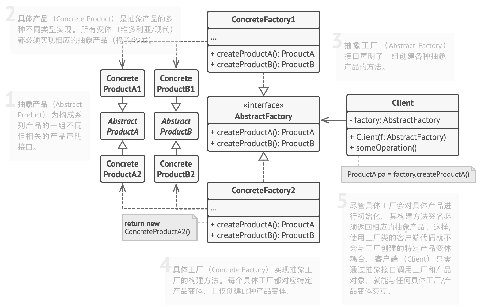

### 一、目的

---

提供一个用于创建相关对象家族的接口，而无需指定其具体类。


### 二、解释

---

抽象工厂模式提供了一种封装一组具有共同主题的单独工厂的方法，而无需指定它们的具体类。

1. 定义抽象产品
2. 创建具体产品
3. 定义抽象工厂
4. 创建具体工厂
5. 使用工厂创建产品对象，并执行相应的操作




### 三、代码示例

---

比如创建一个王国，需要具有共同主题的对象，精灵王国需要精灵国王、精灵城堡和精灵军队，而兽人王国需要兽人国王、兽人城堡和兽人军队。王国中的对象之间存在依赖关系。


首先，为王国中的对象提供一些接口和实现。

#### 3.1 王国中对象的接口和实现

接口：城堡、国王、军队

实现：精灵城堡、精灵国王、精灵军队

```java
/**
 * 城堡接口
 *
 * @author chance
 * @date 2024/12/2 14:57
 * @since 1.0
 */
public interface Castle {

    String getDescription();
}

/**
 * 国王接口
 * @author chance
 * @date 2024/12/2 14:58
 * @since 1.0
 */
public interface King {

    String getDescription();
}

/**
 * 军队接口
 *
 * @author chance
 * @date 2024/12/2 14:59
 * @since 1.0
 */
public interface Army {

    String getDescription();
}
```

```java
/**
 * 精灵城堡实现类
 * 该类实现了{@link Castle}接口，具体描述了精灵城堡
 *
 * @author chance
 * @date 2024/12/2 15:01
 * @since 1.0
 */
public class ElfCastle implements Castle {

    /**
     * 精灵城堡的描述信息
     */
    static final String DESCRIPTION = "This is the Elven castle!";

    /**
     * 获取精灵城堡的描述信息
     *
     * @return 精灵城堡的描述信息
     */
    @Override
    public String getDescription() {
        return DESCRIPTION;
    }
}

/**
 * 精灵国王实现类
 * 该类实现了{@link King}接口，具体描述了精灵国王的特征
 *
 * @author chance
 * @date 2024/12/2 15:02
 * @since 1.0
 */
public class ElfKing implements King {

    /**
     * 精灵国王的描述信息
     */
    static final String DESCRIPTION = "This is the Elven king!";

    /**
     * 获取精灵国王的描述信息
     *
     * @return 返回精灵国王的描述信息
     */
    @Override
    public String getDescription() {
        return DESCRIPTION;
    }
}

/**
 * 精灵王国军队实现类
 * 该类实现了{@link Army}接口，用于创建和管理精灵王国的军队
 *
 * @author chance
 * @date 2024/12/2 15:02
 * @since 1.0
 */
public class ElfArmy implements Army {

    /**
     * 精灵军队的描述信息
     */
    static final String DESCRIPTION = "This is the Elven Army!";

    /**
     * 获取精灵军队的描述信息
     *
     * @return 返回精灵军队的描述信息
     */
    @Override
    public String getDescription() {
        return DESCRIPTION;
    }
}
```

#### 3.2 王国工厂抽象接口和实现类

```java
/**
 * 王国工厂抽象接口
 * <p>该接口用于创建不同类型的王国对象，包括城堡、国王和军队
 * 通过抽象工厂模式，确保同一工厂生产的产品属于同一类别（或风格）
 *
 * @author chance
 * @date 2024/12/2 15:03
 * @since 1.0
 */
public interface KingdomFactory {

    /**
     * 创建城堡的方法
     *
     * @return Castle 实例，代表一个特定类型的城堡
     */
    Castle createCastle();

    /**
     * 创建国王的方法
     *
     * @return King 实例，代表一个特定类型的国王
     */
    King createKing();

    /**
     * 创建军队的方法
     *
     * @return Army 实例，代表一个特定类型的军队
     */
    Army createArmy();
}

/**
 * 精灵王国工厂实现类
 * <p>该类负责创建精灵王国相关的实例，包括城堡、国王和军队
 * 通过实现KingdomFactory接口，具体实现了如何创建精灵王国的组成部分
 *
 * @author chance
 * @date 2024/12/2 15:06
 * @since 1.0
 */
public class ElfKingdomFactory implements KingdomFactory {

    /**
     * 创建城堡的方法
     * 该方法返回一个ElfCastle实例，代表精灵王国的城堡
     *
     * @return Castle的实现类ElfCastle的实例
     */
    @Override
    public Castle createCastle() {
        return new ElfCastle();
    }

    /**
     * 创建国王的方法
     * 该方法返回一个ElfKing实例，代表精灵王国的国王
     *
     * @return King的实现类ElfKing的实例
     */
    @Override
    public King createKing() {
        return new ElfKing();
    }

    /**
     * 创建军队的方法
     * 该方法返回一个ElfArmy实例，代表精灵王国的军队
     *
     * @return Army的实现类ElfArmy的实例
     */
    @Override
    public Army createArmy() {
        return new ElfArmy();
    }
}
```

#### 3.3 为不同的王国工厂设计一个工厂

创建了FactoryMaker，负责返回ElfKingdomFactory或的实例OrcKingdomFactory。客户端可以使用它来创建所需的具体工厂，FactoryMaker而这些具体工厂又将产生不同的具体对象（派生自Army）。在这个例子中，我们还使用枚举来参数化客户端将要求哪种类型的王国工厂。

```java
/**
 * 工厂制造者类，用于创建具体的王国工厂
 * <p>此类实现了工厂方法模式，根据不同的类型创建不同的工厂实例
 *
 * @author chance
 * @date 2024/12/2 16:35
 * @since 1.0
 */
public class FactoryMaker {

    /**
     * 王国类型枚举，用于定义可以创建的王国工厂类型
     */
    public enum KingdomType {
        ELF, ORC
    }

    /**
     * 根据指定的王国类型创建并返回相应的王国工厂
     *
     * @param type 王国类型，用于决定创建哪种类型的王国工厂
     * @return 返回对应类型的王国工厂实例
     * @throws IllegalArgumentException 如果给定的王国类型不受支持，则抛出此异常
     */
    public static KingdomFactory makeFactory(KingdomType type) {
        KingdomFactory factory;
        switch (type) {
            case ELF:
                // 创建并返回精灵王国工厂实例
                factory = new ElfKingdomFactory();
                break;
            case ORC:
                // 创建并返回兽人王国工厂实例
                factory = new OrcKingdomFactory();
                break;
            default:
                // 如果王国类型不受支持，抛出异常
                throw new IllegalArgumentException("KingdomType not supported.");
        }
        return factory;
    }
}
```

#### 3.4 测试

```java
log.info("elf kingdom");
KingdomFactory factory = FactoryMaker.makeFactory(FactoryMaker.KingdomType.ELF);
Castle castle = factory.createCastle();
King king = factory.createKing();
Army army = factory.createArmy();
log.info(castle.getDescription());
log.info(king.getDescription());
log.info(army.getDescription());

log.info("orc kingdom");
KingdomFactory factory2 = FactoryMaker.makeFactory(FactoryMaker.KingdomType.ORC);
Castle castle2 = factory2.createCastle();
King king2 = factory2.createKing();
Army army2 = factory2.createArmy();
log.info(castle2.getDescription());
log.info(king2.getDescription());
log.info(army2.getDescription());

// 输出：
// elf kingdom
// This is the Elven castle!
// This is the Elven king!
// This is the Elven Army!
// orc kingdom
// This is the Orc Castle!
// This is the Orc king!
// This is the Orc Army! 
```


### 四、数据库驱动程序

---

当应用程序需要支持多种数据库时，可以使用抽象工厂模式来创建与特定数据库相关的连接、命令和结果集对象。这样可以确保应用程序能够无缝地切换数据库供应商，而无需更改大量的业务逻辑代码。

#### 4.1 定义抽象接口

这些接口将被具体的数据库实现类所实现。

- 抽象连接
- 抽象命令
- 抽象结果集

```java
/**
 * 定义抽象连接，用于建立和数据库的连接
 * <p>此接口不依赖于具体的数据库类型，提供了统一的连接操作方法
 *
 * @author chance
 * @date 2024/12/3 10:13
 * @since 1.0
 */
public interface Connection {

    /**
     * 打开数据库连接的方法
     * 通过此方法初始化与数据库的通信链路
     */
    void open();

    /**
     * 关闭数据库连接的方法
     * 调用此方法以释放数据库资源并断开通信链路
     */
    void close();

}

/**
 * 抽象命令接口定义了执行查询的操作
 * <p>该接口的实现类需要提供具体的执行查询逻辑
 *
 * @author chance
 * @date 2024/12/3 10:13
 * @since 1.0
 */
public interface Command {

    /**
     * 执行数据库查询
     *
     * @param query 查询语句
     */
    void execute(String query);
}

/**
 * 抽象结果集接口
 * <p>该接口定义了处理结果集的标准方法，用于规范结果集的处理流程
 *
 * @author chance
 * @date 2024/12/3 10:14
 * @since 1.0
 */
public interface ResultSet {

    /**
     * 处理结果集的方法
     * 该方法需要由实现类具体实现，以完成特定的处理逻辑
     */
    void process();
}
```

#### 4.2 实现抽象接口

MySQL实现：

```java
/**
 * MySQL连接
 * <p>该类实现了{@link Connection}接口，专门用于处理与MySQL数据库的连接操作
 * 它提供了打开和关闭连接的方法，旨在简化数据库连接的管理过程
 *
 * @author chance
 * @date 2024/12/3 10:15
 * @since 1.0
 */
public class MySQLConnection implements Connection {

    /**
     * 打开MySQL连接
     * 此方法负责初始化与MySQL数据库的连接它主要执行以下操作：
     * 1. 打印出正在打开MySQL连接的消息
     * 注意：实际的数据库连接逻辑在此处被简化，实际应用中可能涉及更多的连接参数和异常处理
     */
    @Override
    public void open() {
        System.out.println("Opening a MySQL connection.");
    }

    /**
     * 关闭MySQL连接
     * 此方法负责关闭与MySQL数据库的连接它主要执行以下操作：
     * 1. 打印出正在关闭MySQL连接的消息
     * 注意：实际的数据库连接关闭逻辑在此处被简化，实际应用中可能需要处理连接释放和异常情况
     */
    @Override
    public void close() {
        System.out.println("Closing a MySQL connection.");
    }
}

/**
 * MySQL命令
 * <p>该类实现了{@link Command}接口，用于执行MySQL数据库的命令
 * * 主要功能是模拟执行数据库命令的操作
 *
 * @author chance
 * @date 2024/12/3 10:17
 * @since 1.0
 */
public class MySQLCommand implements Command {

    /**
     * 执行MySQL命令
     *
     * @param query 待执行的SQL查询语句
     */
    @Override
    public void execute(String query) {
        System.out.println("Executing MySQL command: " + query);
    }
}

/**
 * MySQL结果集
 * <p>该类实现了{@link ResultSet}接口，专门用于处理MySQL数据库的结果集
 * 它提供了处理MySQL结果集的具体实现
 *
 * @author chance
 * @date 2024/12/3 10:18
 * @since 1.0
 */
public class MySQLResultSet implements ResultSet {

    /**
     * 处理MySQL结果集的方法
     * 当调用此方法时，它会输出一条消息，表明正在处理MySQL结果集
     * 这个方法重写了ResultSet接口中的process方法，提供了具体的处理逻辑
     */
    @Override
    public void process() {
        System.out.println("Processing MySQL result set.");
    }
}
```

PostgreSQL实现：

```java
/**
 * PostgreSQL连接
 * <p>实现了{@link Connection}接口，具体负责PostgreSQL数据库的连接和关闭
 *
 * @author chance
 * @date 2024/12/3 10:16
 * @since 1.0
 */
public class PostgreSQLConnection implements Connection {

    /**
     * 打开PostgreSQL数据库连接
     * 当需要与PostgreSQL数据库建立连接时调用此方法
     */
    @Override
    public void open() {
        System.out.println("Opening a PostgreSQL connection.");
    }

    /**
     * 关闭PostgreSQL数据库连接
     * 当完成对PostgreSQL数据库的操作，释放资源时调用此方法
     */
    @Override
    public void close() {
        System.out.println("Closing a PostgreSQL connection.");
    }
}

/**
 * PostgreSQL命令
 * <p>实现了{@link Command}接口，用于执行PostgreSQL数据库命令
 * 该类提供了与PostgreSQL数据库交互的具体实现
 *
 * @author chance
 * @date 2024/12/3 10:18
 * @since 1.0
 */
public class PostgreSQLCommand implements Command {

    /**
     * 执行PostgreSQL命令的方法
     * 接受一个查询字符串作为参数，并打印执行命令的消息
     *
     * @param query 查询字符串，包含具体的数据库操作指令
     */
    @Override
    public void execute(String query) {
        System.out.println("Executing PostgreSQL command: " + query);
    }
}

/**
 * PostgreSQL结果集
 * <p>该类实现了{@link ResultSet}接口，用于处理来自PostgreSQL数据库的查询结果
 * 主要功能包括对结果集的处理等
 *
 * @author chance
 * @date 2024/12/3 10:19
 * @since 1.0
 */
public class PostgreSQLResultSet implements ResultSet {

    /**
     * 处理结果集的方法
     * 当执行一个SQL查询后，使用此方法来处理得到的结果集
     * 目前该方法仅打印处理信息，具体逻辑可能在后续版本中实现
     */
    @Override
    public void process() {
        System.out.println("Processing PostgreSQL result set.");
    }
}
```

#### 4.3 定义抽象工厂

```java
/**
 * 数据库抽象工厂
 * 用于创建数据库相关的对象，包括连接、命令和结果集
 * 提供了一个抽象层，使得客户端代码可以不依赖于具体的数据库实现
 *
 * @author chance
 * @date 2024/12/3 10:10
 * @since 1.0
 */
public interface DatabaseFactory {


    /**
     * 创建数据库连接对象
     *
     * @return Connection对象，表示数据库的连接
     */
    Connection createConnection();

    /**
     * 创建数据库命令对象
     *
     * @return Command对象，用于执行SQL命令
     */
    Command createCommand();

    /**
     * 创建结果集对象
     *
     * @return ResultSet对象，用于存储查询结果
     */
    ResultSet createResultSet();
}
```

#### 4.4 实现抽象工厂

MySQL工厂：

```java
/**
 * MySQL工厂
 * <p>用于创建数据库相关的对象，包括连接、命令和结果集
 * 提供了一个抽象层，使得客户端代码可以不依赖于具体的数据库实现
 *
 * @author chance
 * @date 2024/12/3 10:20
 * @since 1.0
 */
public class MySQLFactory implements DatabaseFactory {

    /**
     * 创建数据库连接对象
     *
     * @return Connection对象，表示数据库的连接
     */
    @Override
    public Connection createConnection() {
        return new MySQLConnection();
    }

    /**
     * 创建数据库命令对象
     *
     * @return Command对象，用于执行SQL命令
     */
    @Override
    public Command createCommand() {
        return new MySQLCommand();
    }

    /**
     * 创建结果集对象
     *
     * @return ResultSet对象，用于存储查询结果
     */
    @Override
    public ResultSet createResultSet() {
        return new MySQLResultSet();
    }
}
```

PostgreSQL工厂：

```java
/**
 * PostgreSQL工厂
 * <p>该类实现了{@link DatabaseFactory}接口，专门用于创建与PostgreSQL数据库相关的对象
 *
 * @author chance
 * @date 2024/12/3 10:21
 * @since 1.0
 */
public class PostgreSQLFactory implements DatabaseFactory {

    /**
     * 创建并返回一个PostgreSQL数据库连接对象
     *
     * @return Connection 实现了Connection接口的PostgreSQL数据库连接对象
     */
    @Override
    public Connection createConnection() {
        return new PostgreSQLConnection();
    }
    
    /**
     * 创建并返回一个PostgreSQL数据库命令对象
     *
     * @return Command 实现了Command接口的PostgreSQL数据库命令对象
     */
    @Override
    public Command createCommand() {
        return new PostgreSQLCommand();
    }

    /**
     * 创建并返回一个PostgreSQL数据库结果集对象
     *
     * @return ResultSet 实现了ResultSet接口的PostgreSQL数据库结果集对象
     */
    @Override
    public ResultSet createResultSet() {
        return new PostgreSQLResultSet();
    }
}
```

#### 4.5 使用工厂

```java
public class DatabaseClient {

    private final DatabaseFactory factory;

    private Connection connection;

    private Command command;

    private ResultSet resultSet;

    public DatabaseClient(DatabaseFactory factory) {
        this.factory = factory;
        this.connection = factory.createConnection();
        this.command = factory.createCommand();
        this.resultSet = factory.createResultSet();
    }

    public void connect() {
        connection.open();
    }

    public void disconnect() {
        connection.close();
    }

    public void executeQuery(String query) {
        command.execute(query);
        resultSet.process();
    }
}


// 根据配置选择合适的数据库工厂
String dbType = "mysql"; // 假设这是从配置文件或用户输入获取的

DatabaseFactory factory;
if ("mysql".equalsIgnoreCase(dbType)) {
    factory = new MySQLFactory();
} else if ("postgresql".equalsIgnoreCase(dbType)) {
    factory = new PostgreSQLFactory();
} else {
    throw new IllegalArgumentException("Unsupported database type: " + dbType);
}

DatabaseClient client = new DatabaseClient(factory);
client.connect();
client.executeQuery("SELECT * FROM users");
client.disconnect();

// 输出：
// Opening a MySQL connection.
// Executing MySQL command: SELECT * FROM users
// Processing MySQL result set.
// Closing a MySQL connection.
```

`DatabaseClient` 类依赖于 `DatabaseFactory` 接口而不是具体的工厂类。这样做的好处是，如果将来需要支持新的数据库类型，只需添加一个新的工厂类即可，而不需要修改现有的客户端代码。这正是抽象工厂模式的核心优势所在：它提供了高度的灵活性和可扩展性。


### 五、Java中抽象工厂模式的实际应用

---

- Java Swing 的`LookAndFeel`类用于提供不同的外观选项。
- Java 抽象窗口工具包 (AWT) 中的各种实现用于创建不同的 GUI 组件。
- javax.xml.parsers.DocumentBuilderFactory
- javax.xml.transform.TransformerFactory
- javax.xml.xpath.XPathFactory


### 六、适用场景

---

- 如果代码需要与多个不同系列的相关产品交互，但由于无法提前获取相关信息，或者处于对未来拓展性的考虑，不希望代码基于产品的具体类进行构建，在这种情况下，可以使用抽象工厂。
- 抽象工厂为你提供了一个接口，可用于创建每个系列产品的对象。只要通过该接口创建对象，那么你就不会生成与应用程序已生成的产品类型不一致的产品。
- 如果有一个基于一组抽象方法的类，且其主要功能因此变得不明确，那么在这种情况下可以考虑使用抽象工厂模式。
- 在设计良好的程序中，每个类仅负责一件事。如果一个类与多种类型产品交互，就可以考虑将工厂方法抽取到独立的工厂类或具备完整功能的抽象工厂类中。
