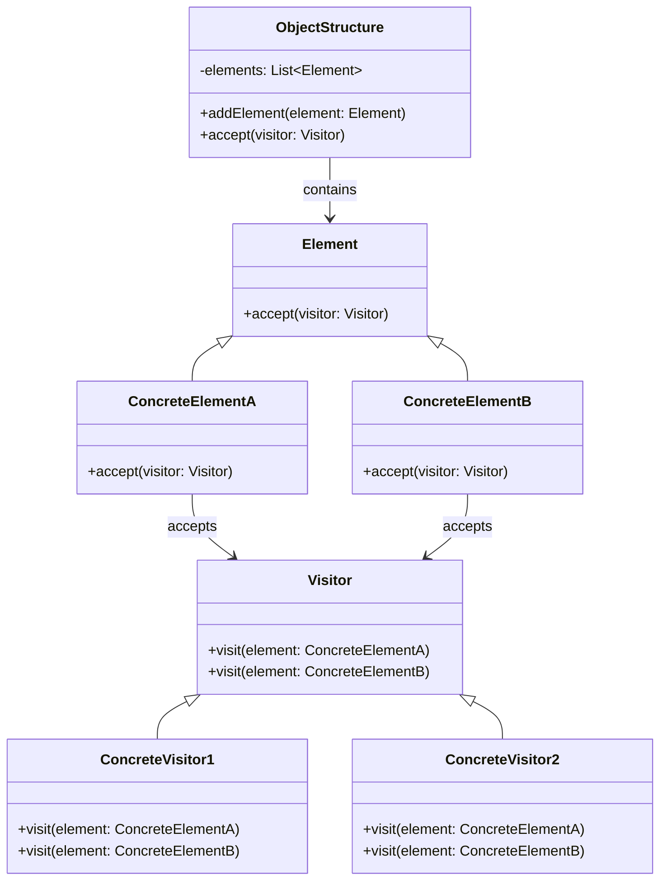

### 一、意图

---

**将操作与对象层次结构解耦**，为各种应用程序提供了灵活的设计。

1. **访问者（Visitor）**：定义一个操作接口，所有具体的访问者都需实现这个接口。
2. **元素（Element）**：需要接受访问者的操作类，这些类通常包含一个accept方法，接受访问者作为参数。
3. **结构（ObjectStructure）**：是对象结构类，通常由一组元素构成，提供访问这些元素的功能。


### 二、解释

---

一个类似现实世界示例是博物馆导游系统，它展示了这种设计模式的实际应用。想象一个博物馆，里面有各种展品，如绘画、雕塑和历史文物。博物馆有不同类型的导游（语音导游、人工导游、虚拟现实导游），提供有关每个展品的信息。每次引入新的导游类型时，导游都实现一个界面来参观不同类型的展品，而不是修改展品。这样，博物馆可以在不改变现有展品的情况下添加新类型的导游，确保系统保持可扩展和可维护，而不会形成任何依赖循环。

允许将函数添加到现有的类层次结构中，而无需修改层次结构。




### 三、示例

---

#### 3.1 访问者接口

```java
/**
 * 访问者接口，定义了访问元素（Element）的接口
 * <p>允许在不修改元素类的前提下，定义作用于元素的新操作。
 * 该设计模式主要用于遍历元素集合，并以适当的操作应用于集合中的每个元素。
 *
 * @author chance
 * @date 2024/12/5 10:11
 * @since 1.0
 */
public interface Visitor {

    /**
     * 访问并作用于ConcreteElementA类型的元素。
     * 该方法使得Visitor能够以特定的方式处理或访问ConcreteElementA元素。
     *
     * @param elementA 被访问的ConcreteElementA类型的元素。
     */
    void visit(ConcreteElementA elementA);

    /**
     * 访问并作用于ConcreteElementB类型的元素。
     * 该方法使得Visitor能够以特定的方式处理或访问ConcreteElementB元素。
     *
     * @param elementB 被访问的ConcreteElementB类型的元素。
     */
    void visit(ConcreteElementB elementB);
}
```

#### 3.2 元素接口

```java
/**
 * 元素接口，定义接受访问者访问的接口方法
 * <p>主要用于访问者模式中，使得不同的访问者可以对一组元素进行不同的操作，而不需要修改元素类本身
 *
 * @author chance
 * @date 2024/12/5 10:11
 * @since 1.0
 */
public interface Element {


    /**
     * 接受访问者访问的方法
     * 允许访问者通过此方法访问元素，并执行访问者定义的操作
     *
     * @param visitor 访问者对象，实现了访问者接口，定义了对元素进行操作的方法
     */
    void accept(Visitor visitor);
}
```

#### 3.3 具体元素类

```java
/**
 * 具体元素A
 * <p>该类实现了{@link Element}接口，为具体元素A定义了接受访问者访问的方法
 * 主要用途是允许访问者以特定方式访问元素，而无需修改元素类本身
 *
 * @author chance
 * @date 2024/12/5 10:12
 * @since 1.0
 */
public class ConcreteElementA implements Element {

    /**
     * 接受访问者访问
     * 该方法是Visitor模式的核心，它允许访问者访问元素并执行相应操作
     * 通过调用visitor的visit方法，将自身作为参数传递，以允许访问者访问当前元素
     *
     * @param visitor 访问者对象，用于执行对当前元素的访问
     */
    @Override
    public void accept(Visitor visitor) {
        visitor.visit(this);
    }

    /**
     * 执行操作A
     * 该方法定义了具体元素A的一个业务操作，输出一条消息表示执行了操作A
     * 这个操作是ConcreteElementA特有的，展示了元素的具体行为
     */
    public void operationA() {
        System.out.println("Operation A in ConcreteElementA");
    }

}

/**
 * 具体元素B
 * <p>该类实现了{@link Element}接口，为具体元素A定义了接受访问者访问的方法
 * 主要用途是允许访问者以特定方式访问元素，而无需修改元素类本身
 *
 * @author chance
 * @date 2024/12/5 10:12
 * @since 1.0
 */
public class ConcreteElementB implements Element {

    /**
     * 接受访问者访问
     * 该方法是Visitor模式的核心，它允许访问者访问元素并执行相应操作
     * 通过调用visitor的visit方法，将自身作为参数传递，以允许访问者访问当前元素
     *
     * @param visitor 访问者对象，用于执行对当前元素的访问
     */
    @Override
    public void accept(Visitor visitor) {
        visitor.visit(this);
    }

    /**
     * 执行操作B
     * 该方法定义了具体元素A的一个业务操作，输出一条消息表示执行了操作B
     * 这个操作是ConcreteElementB特有的，展示了元素的具体行为
     */
    public void operationB() {
        System.out.println("Operation B in ConcreteElementB");
    }

}
```

#### 3.4 具体访问者

```java
/**
 * 实现具体访问者
 * <p>该类实现了{@link Visitor}接口，定义了访问者的行为
 * 它包含两个方法，分别用于访问和操作两种不同的元素类型
 *
 * @author chance
 * @date 2024/12/5 10:14
 * @since 1.0
 */
public class ConcreteVisitor implements Visitor {

    /**
     * 访问和操作ConcreteElementA类型元素的方法
     * 该方法被调用时，会执行elementA的operationA方法
     * 并打印访问了ConcreteElementA的信息
     *
     * @param elementA 被访问的ConcreteElementA类型元素
     */
    @Override
    public void visit(ConcreteElementA elementA) {
        elementA.operationA();
        System.out.println("Visited ConcreteElementA");
    }


    /**
     * 访问和操作ConcreteElementB类型元素的方法
     * 该方法被调用时，会执行elementB的operationB方法
     * 并打印访问了ConcreteElementB的信息
     *
     * @param elementB 被访问的ConcreteElementB类型元素
     */
    @Override
    public void visit(ConcreteElementB elementB) {
        elementB.operationB();
        System.out.println("Visited ConcreteElementB");
    }
}
```

#### 3.5 对象结构类

```java
/**
 * 对象解构
 * <p>该类用于管理一个元素集合，并提供访问者访问这些元素的方法
 * 主要职责包括：
 * 1. 添加元素到集合中
 * 2. 接受访问者的访问
 *
 * @author chance
 * @date 2024/12/5 10:15
 * @since 1.0
 */
public class ObjectStructure {

    /**
     * 元素集合，用于存储待访问的元素
     */
    private List<Element> elements = new ArrayList<>();

    /**
     * 添加元素到对象解构中
     *
     * @param element 要添加的元素
     */
    public void addElement(Element element) {
        elements.add(element);
    }

    /**
     * 接受访问者的访问
     * 此方法遍历元素集合，调用每个元素的accept方法以接受访问
     *
     * @param visitor 执行访问的访问者对象
     */
    public void accept(Visitor visitor) {
        for (Element element : elements) {
            element.accept(visitor);
        }
    }
}
```

>- **元素类**（如 ConcreteElementA 和 ConcreteElementB）实现了 accept 方法，它们会将自己传递给访问者来进行操作。
>
>- **访问者类**（如 ConcreteVisitor）实现了 Visitor 接口，定义了对各个具体元素进行操作的具体行为。
>
>  **对象结构类**（如 ObjectStructure）维护了一个元素集合，并允许访问者访问这些元素。


### 四、优劣

---

#### 4.1 优

1. **扩展性强**：如果要为元素添加新操作，只需要创建新的访问者，而不需要修改元素的代码。
2. **清晰的结构**：**操作**与**元素**分离，使得代码更加清晰和模块化。

#### 4.2 劣

1. **难以修改元素结构**：如果元素结构发生变化（如添加或删除元素），则需要修改所有访问者类。
2. **增加了类的数量**：每次需要添加新的操作时，都需要创建新的访问者类。


### 五、编译器或解释器

---

在编译器设计中，非循环访问者模式可以用来遍历语法树（AST），并对其进行操作，如代码生成、优化、或解释执行。

>背景：一棵表示数学表达式的语法树，包含加法、减法和常量节点。

#### 5.1 元素接口

```java
/**
 * 元素接口
 * <p>定义接受访问者接口的方法，允许访问者访问并执行操作
 * 此设计模式允许我们在不修改现有类结构的情况下，为元素添加新的操作
 *
 * @author chance
 * @date 2024/12/5 10:49
 * @since 1.0
 */
public interface Node {

    /**
     * 接受访问者访问
     * 元素通过此方法允许访问者对其进行操作
     *
     * @param visitor 访问者接口，元素将调用访问者的方法来执行操作
     */
    void accept(Visitor visitor);
}
```

#### 5.2 具体元素类

```java
/**
 * 常量节点元素
 * <p>表示抽象语法树（AST）中的常量节点。
 * 该类主要用于封装一个常量值，并提供一个方法供访问者访问。
 *
 * @author chance
 * @date 2024/12/5 10:52
 * @since 1.0
 */
public class ConstantNode implements Node {

    /**
     * 常量值
     */
    private int value;

    /**
     * 构造函数，初始化常量节点的值。
     *
     * @param value 要设置的常量值
     */
    public ConstantNode(int value) {
        this.value = value;
    }

    /**
     * 获取常量节点的值。
     *
     * @return 常量节点的值
     */
    public int getValue() {
        return value;
    }

    /**
     * 接受一个访问者对象并调用其访问方法。
     *
     * @param visitor 访问者对象
     */
    @Override
    public void accept(Visitor visitor) {
        visitor.visit(this);
    }
}

/**
 * 加法节点元素
 * 它实现了 {@link Node} 接口，并包含两个子节点，用于表示加法操作的左侧和右侧操作数。
 * 该类的主要作用是通过 accept 方法接受访问者的访问，并将访问者引导至正确的访问方法。
 *
 * @author chance
 * @date 2024/12/5 10:53
 * @since 1.0
 */
public class AddNode implements Node {

    /**
     * 左侧子节点，代表加法操作的左侧操作数
     */
    private Node left;

    /**
     * 右侧子节点，代表加法操作的右侧操作数
     */
    private Node right;

    /**
     * 构造方法，初始化加法节点的左右子节点。
     *
     * @param left  左侧子节点
     * @param right 右侧子节点
     */
    public AddNode(Node left, Node right) {
        this.left = left;
        this.right = right;
    }

    /**
     * 获取左侧子节点。
     *
     * @return 左侧子节点
     */
    public Node getLeft() {
        return left;
    }

    /**
     * 获取右侧子节点。
     *
     * @return 右侧子节点
     */
    public Node getRight() {
        return right;
    }

    /**
     * 接受访问者访问。
     * 该方法是 Node 接口中定义的方法，用于允许访问者访问当前节点。
     * 访问者将根据当前节点的类型决定如何进行访问。
     *
     * @param visitor 访问者对象，用于访问当前节点
     */
    @Override
    public void accept(Visitor visitor) {
        visitor.visit(this);
    }
}

/**
 * 减法节点元素
 * <p>该类实现了 {@link Node} 接口，用于构建减法操作节点。
 * 主要职责是接受访问者对象以执行减法操作，并提供对左子节点和右子节点的访问。
 *
 * @author chance
 * @date 2024/12/5 10:55
 * @since 1.0
 */
public class SubtractNode implements Node {

    /**
     * 左子节点。
     */
    private Node left;

    /**
     * 右子节点。
     */
    private Node right;

    /**
     * 构造一个新的减法节点。
     *
     * @param left  左子节点
     * @param right 右子节点
     */
    public SubtractNode(Node left, Node right) {
        this.left = left;
        this.right = right;
    }

    /**
     * 获取左子节点。
     *
     * @return 左子节点
     */
    public Node getLeft() {
        return left;
    }

    /**
     * 获取右子节点。
     *
     * @return 右子节点
     */
    public Node getRight() {
        return right;
    }

    /**
     * 接受访问者对象。
     * 访问者模式的一部分，允许访问者对象访问当前节点并执行相应操作。
     *
     * @param visitor 访问者对象
     */
    @Override
    public void accept(Visitor visitor) {
        visitor.visit(this);
    }

}
```

#### 5.3 访问者接口

```java
/**
 * 访问者接口
 * <p>定义了访问者可以访问抽象语法树（AST）中不同类型的节点的方法
 * 它是访问者模式的一部分，允许在不修改节点类的前提下，为AST的元素添加新的操作
 *
 * @author chance
 * @date 2024/12/5 10:50
 * @since 1.0
 */
public interface Visitor {

    /**
     * 访问常量节点
     * 这个方法允许访问者对AST中的常量节点执行操作
     *
     * @param constantNode 常量节点，表示AST中的一个常数值
     */
    void visit(ConstantNode constantNode);

    /**
     * 访问加法节点
     * 这个方法允许访问者对AST中的加法节点执行操作
     *
     * @param addNode 加法节点，表示AST中的一个加法操作
     */
    void visit(AddNode addNode);

    /**
     * 访问减法节点
     * 这个方法允许访问者对AST中的减法节点执行操作
     *
     * @param subtractNode 减法节点，表示AST中的一个减法操作
     */
    void visit(SubtractNode subtractNode);
}
```

#### 5.4 具体访问者

```java
/**
 * 访问者
 * <p>实现了 {@link Visitor} 接口，用于遍历和计算抽象语法树（AST）。
 * 它的主要作用是计算 AST 表达式的数值结果。
 *
 * @author chance
 * @date 2024/12/5 10:56
 * @since 1.0
 */
public class EvaluationVisitor implements Visitor {

    /**
     * 用于存储计算结果的变量
     */
    private int result;

    /**
     * 获取计算结果的方法。
     *
     * @return 计算结果
     */
    public int getResult() {
        return result;
    }

    /**
     * 访问常数节点时的处理逻辑。
     * 将常数节点的值赋给结果变量。
     *
     * @param constantNode 常数节点
     */
    @Override
    public void visit(ConstantNode constantNode) {
        result = constantNode.getValue();
    }

    /**
     * 访问加法节点时的处理逻辑。
     * 分别计算加法节点的左子节点和右子节点的值，并将它们相加。
     *
     * @param addNode 加法节点
     */
    @Override
    public void visit(AddNode addNode) {
        addNode.getLeft().accept(this);
        int leftValue = result;
        addNode.getRight().accept(this);
        int rightValue = result;
        result = leftValue + rightValue;
    }

    /**
     * 访问减法节点时的处理逻辑。
     * 分别计算减法节点的左子节点和右子节点的值，并将它们相减。
     *
     * @param subtractNode 减法节点
     */
    @Override
    public void visit(SubtractNode subtractNode) {
        subtractNode.getLeft().accept(this);
        int leftValue = result;
        subtractNode.getRight().accept(this);
        int rightValue = result;
        result = leftValue - rightValue;
    }
}
```

#### 5.5 测试

```java
Node expression = new AddNode(
        new ConstantNode(5),
        new SubtractNode(new ConstantNode(10), new ConstantNode(3))
);

EvaluationVisitor evaluator = new EvaluationVisitor();
expression.accept(evaluator);
System.out.println("Expression result：" + evaluator.getResult());

// 输出：
// Expression result：12
```

#### 5.6 业务价值

- 将语法树的操作（如计算结果）与语法树结构解耦。
- 易于扩展新的节点类型或操作（如打印树结构、生成代码）。


### 六、报表生成

---

#### 6.1 元素接口

```java
/**
 * 报表元素
 * @author chance
 * @date 2024/12/5 13:37
 * @since 1.0
 */
public interface ReportElement {

    void accept(ReportVisitor visitor);
}
```

#### 6.2 数据类型实现

```java
/**
 * 数据类型元素实现
 * @author chance
 * @date 2024/12/5 13:40
 * @since 1.0
 */
public class SalesData implements ReportElement {

    private double totalSales;

    public SalesData(double totalSales) {
        this.totalSales = totalSales;
    }

    public double getTotalSales() {
        return totalSales;
    }

    @Override
    public void accept(ReportVisitor visitor) {
        visitor.visit(this);
    }
}

public class ExpenseData implements ReportElement {

    private double totalExpenses;

    public ExpenseData(double totalExpenses) {
        this.totalExpenses = totalExpenses;
    }

    public double getTotalExpenses() {
        return totalExpenses;
    }

    @Override
    public void accept(ReportVisitor visitor) {
        visitor.visit(this);
    }
}
```

#### 6.3 访问者接口

```java
/**
 * 访问者接口
 * @author chance
 * @date 2024/12/5 13:41
 * @since 1.0
 */
public interface ReportVisitor {

    void visit(SalesData salesData);

    void visit(ExpenseData expenseData);
}
```

#### 6.4 具体访问者

```java
/**
 * HtmlReportVisitor 类实现了一个具体的报告访问者，用于生成 HTML 格式的报告。
 * 它通过访问不同的数据类型（如销售数据和开支数据）来收集信息，并生成相应的 HTML 报告。
 *
 * @author chance
 * @date 2024/12/5 13:45
 * @since 1.0
 */
public class HtmlReportVisitor implements ReportVisitor {

    /**
     * 用于存储生成的 HTML 报告内容
     */
    private StringBuilder report = new StringBuilder();

    /**
     * 访问 SalesData 类型的对象，生成销售数据的 HTML 报告。
     *
     * @param sales SalesData 类型的对象，包含销售数据
     */
    @Override
    public void visit(SalesData sales) {
        report.append("<h1>Sales Data</h1>")
                .append("<p>Total Sales: $").append(sales.getTotalSales()).append("</p>");
    }

    /**
     * 访问 ExpenseData 类型的对象，生成开支数据的 HTML 报告。
     *
     * @param expense ExpenseData 类型的对象，包含开支数据
     */
    @Override
    public void visit(ExpenseData expense) {
        report.append("<h1>Expense Data</h1>")
                .append("<p>Total Expenses: $").append(expense.getTotalExpenses()).append("</p>");
    }

    /**
     * 获取生成的 HTML 报告内容。
     *
     * @return 以字符串形式返回完整的 HTML 报告
     */
    public String getReport() {
        return report.toString();
    }
}
```

#### 6.5 应用代码

```java
ReportElement salesData = new SalesData(50000);
ReportElement expenseData = new ExpenseData(20000);

HtmlReportVisitor htmlReportVisitor = new HtmlReportVisitor();
salesData.accept(htmlReportVisitor);
expenseData.accept(htmlReportVisitor);

System.out.println(htmlReportVisitor.getReport());
```

#### 6.6 业务价值

- 不修改数据结构即可支持不同格式的报表输出。
- 扩展性强，例如添加 JSON、Excel 报表只需新增访问者。


### 七、权限检查

---

在企业应用中，不同的用户角色（如管理员、普通用户）访问系统的功能受到限制。访问者模式可用于动态检查权限。

**示例**：

- **背景**：文件系统中包含文件和文件夹。
- **实现**：使用访问者模式检查权限。

#### 7.1 资源元素接口

```java
public interface ResourceElement {

    void accept(PermissionVisitor permissionVisitor);
}
```

#### 7.2 资源元素实现

```java
public class FileResourceElement implements ResourceElement {

    private String fileName;

    public FileResourceElement(String fileName) {
        this.fileName = fileName;
    }

    public String getFileName() {
        return fileName;
    }

    @Override
    public void accept(PermissionVisitor permissionVisitor) {
        permissionVisitor.visit(this);
    }
}

public class FolderResourceElement implements ResourceElement {

    private String folderName;

    public FolderResourceElement(String folderName) {
        this.folderName = folderName;
    }

    public String getFolderName() {
        return folderName;
    }

    @Override
    public void accept(PermissionVisitor permissionVisitor) {
        permissionVisitor.visit(this);
    }
}
```

#### 7.3 权限访问者接口

```java
public interface PermissionVisitor {

    void visit(FileResourceElement fileResourceElement);

    void visit(FolderResourceElement folderResourceElement);
}
```

#### 7.4 权限访问者实现

```java
public class UserPermissionVisitor implements PermissionVisitor {

    @Override
    public void visit(FileResourceElement fileResourceElement) {
        System.out.println("User has read-only access to file: " + fileResourceElement.getFileName());
    }

    @Override
    public void visit(FolderResourceElement folderResourceElement) {
        System.out.println("User has no access to folder: " + folderResourceElement.getFolderName());
    }
}

public class AdminPermissionVisitor implements PermissionVisitor {

    @Override
    public void visit(FileResourceElement fileResourceElement) {
        System.out.println("Admin has full access to file: " + fileResourceElement.getFileName());
    }

    @Override
    public void visit(FolderResourceElement folderResourceElement) {
        System.out.println("Admin has full access to folder: " + folderResourceElement.getFolderName());
    }
}
```

#### 7.5 创建资源结构

```java
public class FileSystem {

    private List<ResourceElement> resourceElements = new ArrayList<>();

    public void addResourceElement(ResourceElement resourceElement) {
        resourceElements.add(resourceElement);
    }

    public void checkPermissions(PermissionVisitor permissionVisitor) {
        for (ResourceElement resourceElement : resourceElements) {
            resourceElement.accept(permissionVisitor);
        }
    }
}
```

#### 7.6 测试

````java
// 创建文件系统（数据结构）
FileSystem fileSystem = new FileSystem();
fileSystem.addResourceElement(new FileResourceElement("document.txt"));
fileSystem.addResourceElement(new FileResourceElement("photos"));

// 创建管理员和普通用户的访问者（操作）
PermissionVisitor adminVisitor = new AdminPermissionVisitor();
PermissionVisitor userVisitor = new UserPermissionVisitor();

System.out.println("Admin Permissions:");
fileSystem.checkPermissions(adminVisitor);

System.out.println("\nUser Permissions:");
fileSystem.checkPermissions(userVisitor);

// 输出：
// Admin Permissions:
// Admin has full access to file: document.txt
// Admin has full access to file: photos
// 
// User Permissions:
// User has read-only access to file: document.txt
// User has read-only access to file: photos
````

