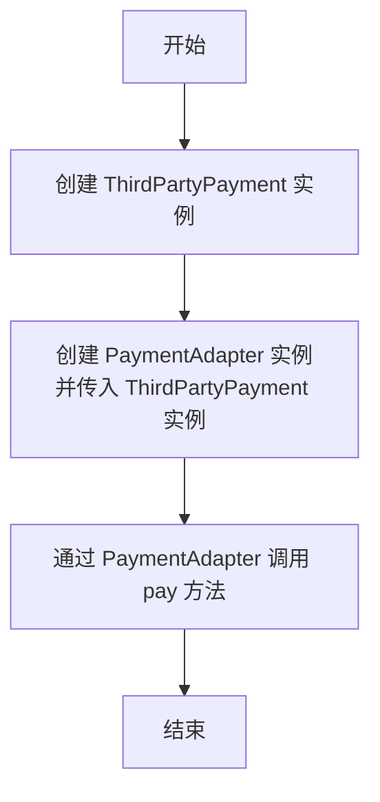

### 一、意图

---

将类的接口转换为客户端期望的另一个接口，从而实现兼容性。

- **目标接口（Target）**：客户端期待使用的接口。
- **需要适配的类（Adaptee）**：现有的接口，它与目标接口不兼容。
- **适配器（Adapter）**：一个中间类，用于将 Adaptee 的接口适配成 Target 接口。

- **客户端（Client）**：调用目标接口的类。


### 二、解释

---

适配器模式允许您将原本不兼容的对象包装在适配器中，以使其与另一个类兼容。


### 三、类适配器

---

类适配器模式在实际业务中通常用于连接两个接口不兼容的系统或模块。

#### 3.1 旧文件处理类

```java
/**
 * 旧文件处理类
 * <p>该类提供了读取和处理文件内容的方法
 * 主要用于处理旧格式的文件
 *
 * @author chance
 * @date 2024/12/5 15:25
 * @since 1.0
 */
public class LegacyFileProcessor {

    /**
     * 读取文件
     *
     * @param fileName 文件名，用于指定需要读取的文件
     */
    public void readFile(String fileName) {
        System.out.println("Reading file: " + fileName);
    }

    /**
     * 处理内容
     * 该方法用于处理文件内容，执行必要的转换或计算
     */
    public void processContent() {
        System.out.println("Processing content...");
    }
}
```

#### 3.2 新文件处理接口

```java
/**
 * 新的文件处理接口
 *
 * @author chance
 * @date 2024/12/5 15:24
 * @since 1.0
 */
public interface FileProcessor {

    /**
     * 处理指定路径的文件
     * 该方法负责读取文件内容，并进行相应的处理操作具体的处理逻辑
     * 可能包括解析文件内容、进行数据转换或者调用其他服务来处理文件数据
     *
     * @param filePath 文件路径，表示需要处理的文件位置不能为空
     */
    void processFile(String filePath);
}
```

#### 3.3 类适配器

```java
/**
 * 类适配器
 * 该类通过继承{@link LegacyFileProcessor}并实现{@link FileProcessor}接口，充当适配器的角色
 * 其目的是使现有的LegacyFileProcessor能够以新的接口FileProcessor被使用，而无需修改其内部逻辑
 * 这种设计模式常用于当希望将一个类的接口转换成客户端所期待的另一个接口时
 *
 * @author chance
 * @date 2024/12/5 15:29
 * @since 1.0
 */
public class FileProcessorAdapter extends LegacyFileProcessor implements FileProcessor {

    /**
     * 处理文件
     * 该方法覆写自FileProcessor接口，旨在通过调用旧的API来适配新的接口
     * 首先调用readFile方法读取文件内容，然后通过processContent方法处理内容
     * 这种方式使得旧的文件处理逻辑无需改动，即可适配新的文件处理接口
     *
     * @param filePath 文件路径，指定需要处理的文件位置
     */
    @Override
    public void processFile(String filePath) {
        readFile(filePath);
        processContent();
    }
}
```

#### 3.4 客户端代码

```java
// 创建FileProcessorAdapter实例
FileProcessorAdapter fileProcessorAdapter = new FileProcessorAdapter();
// 调用处理文件的方法，传入文件名为参数
fileProcessorAdapter.processFile("example.txt");
```


### 四、对象适配器

---



#### 4.1 目标接口

```java
/**
 * 目标接口
 * 定义支付网关的标准接口，用于进行支付操作
 * 该接口未来可能包含其他与支付相关的操作或规范
 *
 * @author chance
 * @date 2024/12/6 16:43
 * @since 1.0
 */
public interface PaymentGateway {

    /**
     * 执行支付操作
     *
     * @param amount 支付金额，单位为元
     */
    void pay(double amount);
}
```

#### 4.2 第三方支付类

```java
/**
 * 第三方支付类
 * 该类提供了处理支付的功能，主要用于模拟第三方支付流程
 * 它允许通过特定的支付方法来执行支付操作，当前支持的支付方法定义在process方法中
 *
 * @author chance
 * @date 2024/12/6 16:44
 * @since 1.0
 */
public class ThirdPartyPayment {

    public void process(double value) {
        System.out.println("Third-party payment processed: " + value);
    }
}
```

#### 4.3 适配器类

```java
/**
 * 适配器类，用于将第三方支付接口转换为当前系统的支付网关接口
 * 此类实现了{@link PaymentGateway}接口，并内部封装了ThirdPartyPayment的逻辑
 * 适配器模式使得现有的第三方支付接口能够与当前系统兼容，无需修改第三方代码
 *
 * @author chance
 * @date 2024/12/6 16:45
 * @since 1.0
 */
public class PaymentAdapter implements PaymentGateway {

    /**
     * 第三方支付接口实例
     */
    private ThirdPartyPayment thirdPartyPayment;

    /**
     * 构造函数，初始化第三方支付接口实例
     *
     * @param thirdPartyPayment 第三方支付接口实例
     */
    public PaymentAdapter(ThirdPartyPayment thirdPartyPayment) {
        this.thirdPartyPayment = thirdPartyPayment;
    }

    /**
     * 实现PaymentGateway接口的pay方法
     * 调用第三方支付接口的process方法来处理支付请求
     *
     * @param amount 支付金额
     */
    @Override
    public void pay(double amount) {
        thirdPartyPayment.process(amount);
    }
}
```

#### 4.4 客户端代码

```java
// 创建ThirdPartyPayment实例
ThirdPartyPayment thirdPartyPayment = new ThirdPartyPayment();
PaymentGateway gateway = new PaymentAdapter(thirdPartyPayment);
gateway.pay(200.0);
```

对象适配器将第三方支付类的 `process()` 方法适配为业务系统需要的 `pay()` 方法。


### 五、类适配器和对象适配器的区别

---

类适配器和对象适配器各有优缺点。类适配器通过绑定到特定的 Adaptee 类来将 Adaptee 适配到 Target，这意味着它不能适配一个类及其所有子类。这种类型的适配器允许适配器覆盖 Adaptee 的某些行为，因为适配器是 Adaptee 的子类。此外，它只引入一个对象，而无需额外的指针间接访问即可到达 Adaptee。

另一方面，对象适配器允许单个适配器与多个 Adaptee 一起工作，包括 Adaptee 及其所有子类。这种类型的适配器可以同时向所有 Adaptee 添加功能。但是，它使覆盖 Adaptee 的行为更加困难，因为它需要对 Adaptee 进行子类化，并让 Adapter 引用此子类而不是 Adaptee 本身。


### 六、Java中适配器模式的实际应用

---

- `java.io.InputStreamReader`以及`java.io.OutputStreamWriter`Java IO 库。
- GUI 组件库允许插件或适配器在不同的 GUI 组件接口之间进行转换。
- `java.util.Arrays#asList()`
- `java.util.Collections#list()`
- `java.util.Collections#enumeration()`
- `javax.xml.bind.annotation.adapters.XMLAdapter`
