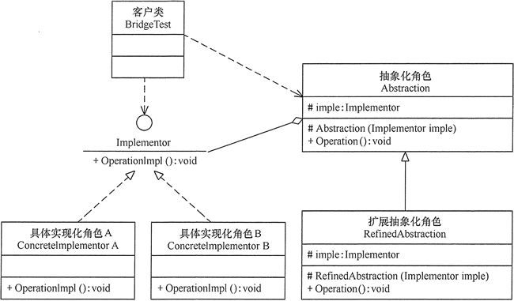

### 一、意图

---

Bridge 设计模式是 Java 中的一种结构模式，它将抽象与实现分离，允许两者独立变化。此模式对于开发灵活且可扩展的软件系统至关重要。


### 二、详细解释

---

桥接模式是指优先选择组合而不是继承。实现细节从一个层次结构推送到另一个具有单独层次结构的对象。

#### 2.1 结构

桥接模式包含以下主要角色。

- **抽象化（Abstraction）：** 定义抽象类的接口，维护一个指向实现化对象的引用。
- **扩展抽象化（Refined Abstraction）：** 抽象类的子类，扩展抽象类的接口。
- **实现化（Implementor）：** 定义实现类的接口，这个接口不一定要与抽象类的接口一致，事实上这两个接口通常会不一致。
- **具体实现化（Concrete Implementor）：** 实现实现化接口的具体类。




### 三、代码示例

---

#### 3.1 支付系统

假设我们有一个支付系统，支持多种支付方式（如支付宝、微信支付、银行卡支付），并且每种支付方式又支持多种支付模式（如刷脸支付、指纹支付、密码支付）。

如果不使用桥接模式，我们可能会使用大量的 if-else 语句或者继承来实现，这会导致代码耦合度高、扩展性差。

使用桥接模式，我们可以将支付方式和支付模式分离：

- **支付方式（Abstraction）：** 定义一个抽象的支付接口 `Payment`，包含一个指向支付模式接口 `PaymentMode` 的引用。
- **具体支付方式（Refined Abstraction）：** 定义具体的支付方式类，如 `Alipay`、`WechatPay`、`BankCardPay`，它们都继承自 `Payment` 接口。
- **支付模式（Implementor）：** 定义一个抽象的支付模式接口 `PaymentMode`。
- **具体支付模式（Concrete Implementor）：** 定义具体的支付模式类，如 `FacePayMode`、`FingerprintPayMode`、`PasswordPayMode`，它们都实现 `PaymentMode` 接口。

#### 3.2 支付模式接口

```java
/**
 * 定义支付模式的接口
 * 该接口用于规范支付操作的方法，实现支付功能的抽象
 * 主要作用是让不同的支付方式有一个统一的操作标准，而具体实现则由实现类来完成
 *
 * @author chance
 * @date 2024/12/26 14:51
 * @since 1.0
 */
public interface PaymentMode {

    /**
     * 执行支付操作的方法
     * 具体的支付行为由实现该接口的类来完成
     */
    void pay();
}
```

#### 3.3 具体支付模式

```java
public class FacePayMode implements PaymentMode {
    @Override
    public void pay() {
        System.out.println("人脸支付");
    }
}
```

```java
public class PasswordPayMode implements PaymentMode {
    @Override
    public void pay() {
        System.out.println("密码支付");
    }
}
```

#### 3.4 支付方式接口

```java
/**
 * 支付方式抽象接口
 * 定义支付过程中的抽象接口，并通过组合PaymentMode接口来实现支付方式的具体行为
 * 此设计模式允许支付方式和支付行为的独立变化，提高了系统的灵活性和可扩展性
 *
 * @author chance
 * @date 2024/12/26 14:55
 * @since 1.0
 */
public abstract class Payment {

    /**
     * 保存支付模式的引用，使得一个支付方式可以对应多种支付模式
     */
    protected PaymentMode paymentMode;

    /**
     * 构造方法，初始化支付模式
     *
     * @param paymentMode 支付模式接口，代表具体的支付方式
     */
    protected Payment(PaymentMode paymentMode) {
        this.paymentMode = paymentMode;
    }

    /**
     * 定义支付行为的抽象方法，由子类实现具体支付逻辑
     * 不同的支付方式将实现不同的支付逻辑
     */
    public abstract void doPay();
}
```

#### 3.5 测试

```java
PaymentMode facePayMode = new FacePayMode();
Payment alipayFacePay = new Alipay(facePayMode);
alipayFacePay.doPay();

PaymentMode passwordPayMode = new PasswordPayMode();
Payment alipayPasswordPay = new Alipay(passwordPayMode);
alipayPasswordPay.doPay();

// 输出：
// 支付宝人脸支付
// 支付宝密码支付
```


### 四、应用场景

---

#### 4.1 消息发送系统

假设需要开发一个消息发送系统，可以发送不同类型的消息（如文本消息、图片消息、语音消息），并且可以使用不同的发送方式（如短信、邮件、微信）。

- **维度一：消息类型**（文本消息、图片消息、语音消息等）
- **维度二：发送方式**（短信、邮件、微信等）

使用桥接模式，我们可以将消息类型和发送方式分离：

- **抽象部分（消息）：** 定义一个抽象的消息接口 Message，包含一个指向发送方式接口 MessageSender 的引用。
- **具体抽象部分（具体消息）：** 定义具体的消息类，如 TextMessage、ImageMessage、VoiceMessage，它们都实现 Message 接口。
- **实现部分（发送方式）：** 定义一个抽象的发送方式接口 MessageSender。
- **具体实现部分（具体发送方式）：** 定义具体的发送方式类，如 SMSMessageSender、EmailMessageSender、WechatMessageSender，它们都实现 MessageSender 接口。

这样，我们就可以灵活地组合不同的消息类型和发送方式，例如发送一条微信语音消息，或者发送一条短信文本消息。

#### 4.2 发送渠道接口

```java
public interface MessageSender {

    /**
     * 发送消息的方法
     *
     * @param message 要发送的消息内容，不能为空
     *                实现此接口的类需要能够处理将此消息发送到指定的目的地
     *                消息的格式和内容由实现者和调用者共同约定
     */
    void send(String message);
}
```

#### 4.3 具体发送渠道类

```java
public class SmsMessageSender implements MessageSender {
    @Override
    public void send(String message) {
        System.out.println("通过短信发送消息：" + message);
    }
}
```

```java
public class EmailMessageSender implements MessageSender {

    @Override
    public void send(String message) {
        System.out.println("通过邮件发送消息：" + message);
    }
}
```

```java
public class WechatMessageSender implements MessageSender {

    @Override
    public void send(String message) {
        System.out.println("通过微信发送消息：" + message);
    }
}
```

#### 4.4 消息抽象类

```java
public abstract class Message {

    /**
     * MessageSender是实际发送消息的工具，由外部传入并初始化
     */
    protected MessageSender messageSender;

    /**
     * 构造方法，初始化Message实例
     *
     * @param messageSender 消息发送器，负责执行实际的消息发送操作
     */
    protected Message(MessageSender messageSender) {
        this.messageSender = messageSender;
    }

    /**
     * 抽象方法，定义了发送消息的操作
     * 子类必须实现此方法，以提供具体的消息发送逻辑
     */
    public abstract void send();
}
```

#### 4.5 具体消息类型类

```java
public class TextMessage extends Message {

    /**
     * 文本消息的内容
     */
    private final String content;

    /**
     * 构造一个 TextMessage 实例
     *
     * @param messageSender 用于发送消息的消息发送接口
     * @param content       文本消息的内容
     */
    public TextMessage(MessageSender messageSender, String content) {
        // 调用父类 Message 的构造方法，初始化消息发送接口
        super(messageSender);
        // 设置文本消息的内容
        this.content = content;
    }

    /**
     * 实现父类 Message 的 send 方法
     * 用于发送文本消息的内容
     */
    @Override
    public void send() {
        // 调用消息发送接口的 send 方法发送文本消息的内容
        messageSender.send(content);
    }
}
```

```java
public class ImageMessage extends Message {

    /**
     * 图像的文件路径
     */
    private final String imagePath;

    /**
     * 构造函数，初始化ImageMessage对象
     *
     * @param messageSender MessageSender对象，用于发送消息
     * @param imagePath     图像的文件路径
     */
    public ImageMessage(MessageSender messageSender, String imagePath) {
        super(messageSender);
        this.imagePath = imagePath;
    }

    /**
     * 发送图像消息的方法
     * 调用MessageSender的send方法来发送图像路径
     */
    @Override

    public void send() {
        messageSender.send("图片路径：" + imagePath);
    }
}
```

#### 4.6  测试

使用桥接模式可以有效地解决消息发送系统中**消息类型**和**发送渠道**多维度变化带来的问题，提高系统的灵活性、可维护性和可扩展性。通过将抽象部分（消息类型）和实现部分（发送渠道）分离，并使用组合关系连接它们，可以轻松地添加新的消息类型或发送渠道，而无需修改现有代码。这使得系统更加健壮和易于维护。

```java
// 使用短信发送文本消息
SmsMessageSender smsMessageSender = new SmsMessageSender();
TextMessage textMessage = new TextMessage(smsMessageSender, "这是一条短信文本消息");
textMessage.send();

// 使用邮件发送图片消息
MessageSender emailSender = new EmailMessageSender();
Message imageMessageByEmail = new ImageMessage(emailSender, "/path/to/image.jpg");
imageMessageByEmail.send();

// 使用微信发送文本消息
MessageSender wechatSender = new WechatMessageSender();
Message textMessageByWechat = new TextMessage(wechatSender, "这是一条微信文本消息");
textMessageByWechat.send();

// 输出：
//通过短信发送消息：这是一条短信文本消息
//通过邮件发送消息：图片路径：/path/to/image.jpg
//通过微信发送消息：这是一条微信文本消息
```


### 五、优点

---

- **解耦消息类型和发送渠道：** 消息类型和发送渠道可以独立扩展，互不影响。例如，我们可以添加新的消息类型（如视频消息），而无需修改现有的发送渠道代码；或者添加新的发送渠道（如钉钉），而无需修改现有的消息类型代码。
- **提高了系统的灵活性和可维护性：** 代码结构清晰，易于理解和维护。
- **符合开闭原则：** 对扩展开放，对修改关闭。