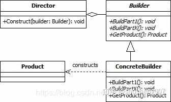

### 一、定义

---

将一个复杂对象的构建与其表示分离，使得**同样的构建过程可以创建不同的表示**。


### 二、使用场景

---

当一个类的构造参数个数超过4个，有些是可选的参数，考虑使用构造者模式。


### 三、解决问题

---

例如我们现在有如下一个类计算机类Computer，其中cpu与ram是必填参数，而其他3个是可选参数，那么我们如何构造这个类的实例呢，通常有两种常用的方式：

```java
public class Computer {
  // 必要参数
  private final String cpu;
  private final String ram;

  // 可选参数
  private final int usbCount;
  private final String keyboard;
  private final String display;
}
```

#### 3.1 折叠构造函数模式

```java
public class Computer {
  ...
  public Computer(String cpu, String ram) {
    this(cpu, ram, 0);
  }
  public Computer(String cpu, String ram, int usbCount) {
    this(cpu, ram, usbCount, "罗技键盘");
  }
  public Computer(String cpu, String ram, int usbCount, String keyboard) {
    this(cpu, ram, usbCount, keyboard, "三星显示器");
  }
  public Computer(String cpu, String ram, int usbCount, String keyboard, String display) {
    this.cpu = cpu;
    this.ram = ram;
    this.usbCount = usbCount;
    this.keyboard = keyboard;
    this.display = display;
  }
}
```

> 弊端：使用及阅读不方便。首先要决定使用哪一个构造函数，然后后面又是一堆参数。

#### 3.2 Javabean模式

```java
public class Computer {
  ...

    public String getCpu() {
    return cpu;
  }
  public void setCpu(String cpu) {
    this.cpu = cpu;
  }
  public String getRam() {
    return ram;
  }
  public void setRam(String ram) {
    this.ram = ram;
  }
  public int getUsbCount() {
    return usbCount;
  }
  ...
}
```

>弊端：构建过程中对象的状态容易发生变化，造成错误。因为那个类中的属性时分步设置的，所以就容易出错。


### 四、Builder简单实现

---

1. Computer中创建一个**静态内部类Builder**，然后将Computer中的参数都复制到Builder类中。
2. 在Computer中**创建一个private的构造函数，参数为Builder类型**。
3. 在Builder中创建一个public的构造函数，参数为Computer中必填的那些参数，cpu和ram。
4. 在Builder中创建设置函数，对Computer中那些可选参数进行赋值，返回值为Builder类型的实例。
5. **在Builder中创建一个build()方法，在其中构建Computer的实例并返回**。

```java
public class Computer {

  private final String cpu;
  private final String ram;

  private final int usbCount;
  private final String keyboard;
  private final String display;

  /**
   * 私有构造函数，参数为Builder类型
   * @param builder
   */
  private Computer(Builder builder) {
    this.cpu = builder.cpu;
    this.ram = builder.ram;
    this.usbCount = builder.usbCount;
    this.keyboard = builder.keyboard;
    this.display = builder.diplay;
  }

  /**
   * 静态内部类，将Couputer中的参数都复制过来
   */
  public static class Builder {
    private String cpu;//必须
    private String ram;//必须
    private int usbCount;//可选
    private String keyboard;//可选
    private String diplay;//可选

    /**
     * 创建一个必填参数的构造函数
     * @param cpu
     * @param ram
     */
    public Builder(String cpu, String ram) {
      this.cpu = cpu;
      this.ram = ram;
    }

    public void setUsbCount(int usbCount) {
      this.usbCount = usbCount;
    }

    public void setKeyboard(String keyboard) {
      this.keyboard = keyboard;
    }

    public void setDiplay(String diplay) {
      this.diplay = diplay;
    }

    /**
     * 创建一个build()方法，在其中构建Computer的实例并返回
     * @return
     */
    public Computer build() {
      return new Computer(this);
    }
  }
}
```

使用**链式调用**，一步一步的把对象构建出来。

```java
Computer computer=new Computer.Builder("因特尔","三星")
    .setDisplay("三星24寸")
    .setKeyboard("罗技")
    .setUsbCount(2)
    .build();
```


### 五、经典Builder模式

---

上述是Builder在Java中一种简化的使用方式，经典的Builder模式与其有一定的不同。



如上图所示，builder模式有4个角色。

- Product：最终要生成的对象，例如Computer实例。
- Builder：构建者的抽象基类（有时会使用接口代替）。其定义了构建Product的抽象步骤，其实体类需要实现这些步骤。其会包含一个用来返回最终产品的方法Product getProduct()。
- ConcreateBuilder：Builder的实现类。
- Director：决定如何构建最终产品的算法，其会包含一个负责组装的方法void Construct(Builder builder)，在这个方法中通过调用builder的方法，就可以设置builder，等设置完成后，就可以通过builder的getProduct()方法获得最终的产品。

##### 5.1 第一步：目标类Computer

```java
public class Computer {
  private String cpu;
  private String ram;

  private int usbCount;
  private String keyboard;
  private String display;

  public Computer(String cpu, String ram) {
    this.cpu = cpu;
    this.ram = ram;
  }
  public void setUsbCount(int usbCount) {
    this.usbCount = usbCount;
  }
  public void setKeyboard(String keyboard) {
    this.keyboard = keyboard;
  }
  public void setDisplay(String display) {
    this.display = display;
  }
  @Override
  public String toString() {
    return "Computer{" +
      "cpu='" + cpu + '\'' +
      ", ram='" + ram + '\'' +
      ", usbCount=" + usbCount +
      ", keyboard='" + keyboard + '\'' +
      ", display='" + display + '\'' +
      '}';
  }
}
```

##### 5.2 第二步：抽象构建者类

```java
public abstract class ComputerBuilder {
    public abstract void setUsbCount();
    public abstract void setKeyboard();
    public abstract void setDisplay();

    public abstract Computer getComputer();
}
```

##### 5.3 实体构建者类

可以根据要构建的产品种类产生多个实体构建者类，这里我们需要构建两种品牌的电脑，苹果电脑和联系电脑，所以生成了两个实体构建者类。

```java
public class MacComputerBuilder extends ComputerBuilder {
    private Computer computer;
    public MacComputerBuilder(String cpu, String ram) {
        computer = new Computer(cpu, ram);
    }
    @Override
    public void setUsbCount() {
        computer.setUsbCount(2);
    }
    @Override
    public void setKeyboard() {
        computer.setKeyboard("苹果键盘");
    }
    @Override
    public void setDisplay() {
        computer.setDisplay("苹果显示器");
    }
    @Override
    public Computer getComputer() {
        return computer;
    }
}
```

```java
public class LenovoComputerBuilder extends ComputerBuilder {
    private Computer computer;
    public LenovoComputerBuilder(String cpu, String ram) {
        computer=new Computer(cpu,ram);
    }
    @Override
    public void setUsbCount() {
        computer.setUsbCount(4);
    }
    @Override
    public void setKeyboard() {
        computer.setKeyboard("联想键盘");
    }
    @Override
    public void setDisplay() {
        computer.setDisplay("联想显示器");
    }
    @Override
    public Computer getComputer() {
        return computer;
    }
}
```

6.4 第四步：指导者类

```java
public class ComputerDirector {
    public void makeComputer(ComputerBuilder builder){
        builder.setUsbCount();
        builder.setDisplay();
        builder.setKeyboard();
    }
}
```

##### 5.4 使用

首先生成一个director，然后生成一个目标builder，接着使用director组装builder，组装完毕后使用builder创建产品实例。

```java
ComputerDirector director=new ComputerDirector();//1
ComputerBuilder builder=new MacComputerBuilder("I5处理器","三星125");//2
director.makeComputer(builder);//3
Computer macComputer=builder.getComputer();//4
```

可以看出一开始使用了传统builder模式的变种，首先其省略了director这个角色，将构建算法交给了client端，其次将builder写到了要构建的产品类里面，最后采用了链式调用。