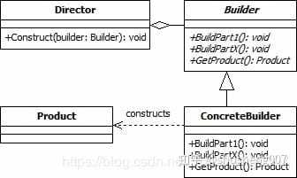

### 一、意图

---

将一个复杂对象的构建与其表示分离，使得**同样的构建过程可以创建不同的表示**。


### 二、详解

---

允许创建不同风格的对象，同时避免构造函数污染。当对象可能有多种风格时很有用。或者当创建对象涉及许多步骤时。

>建造者模式是一种对象创建软件设计模式，旨在为**伸缩构造函数反模式**找到解决方案。
>
>```java
>public Hero(Profession profession,String name,HairType hairType,HairColor hairColor,Armor armor,Weapon weapon){
>    // Value assignments
>}
>```
>
>以上构造函数参数的数量很快就会变得难以理解，很难理解它们的排列方式。此外，如果决定在将来添加更多选项，此参数列表可能会继续增长。这被称为伸缩构造函数反模式。

#### 2.1 组成部分

- 产品：最终要创建的复杂对象。
- 抽象构建者：定义了构建产品各个部分的抽象方法。
- 具体构建者：实现了抽象构建者的方法，负责构建产品的具体部分。
- 指导者（可选）：负责使用构建者来构建产品，隐藏了构建的复杂性。


### 三、解决问题

---

例如我们现在有如下一个类计算机类Computer，其中cpu与ram是必填参数，而其他3个是可选参数，那么我们如何构造这个类的实例呢，通常有两种常用的方式：

```java
public class Computer {
  // 必要参数
  private final String cpu;
  private final String ram;

  // 可选参数
  private final int usbCount;
  private final String keyboard;
  private final String display;
}
```

#### 3.1 折叠构造函数模式

```java
public class Computer {
  ...
  public Computer(String cpu, String ram) {
    this(cpu, ram, 0);
  }
  public Computer(String cpu, String ram, int usbCount) {
    this(cpu, ram, usbCount, "罗技键盘");
  }
  public Computer(String cpu, String ram, int usbCount, String keyboard) {
    this(cpu, ram, usbCount, keyboard, "三星显示器");
  }
  public Computer(String cpu, String ram, int usbCount, String keyboard, String display) {
    this.cpu = cpu;
    this.ram = ram;
    this.usbCount = usbCount;
    this.keyboard = keyboard;
    this.display = display;
  }
}
```

> 弊端：使用及阅读不方便。首先要决定使用哪一个构造函数，然后后面又是一堆参数。

#### 3.2 Javabean模式

```java
public class Computer {
  ...

    public String getCpu() {
    return cpu;
  }
  public void setCpu(String cpu) {
    this.cpu = cpu;
  }
  public String getRam() {
    return ram;
  }
  public void setRam(String ram) {
    this.ram = ram;
  }
  public int getUsbCount() {
    return usbCount;
  }
  ...
}
```

弊端：构建过程中对象的状态容易发生变化，造成错误。因为那个类中的属性时分步设置的，所以就容易出错。


### 四、Builder简单实现

---

1. Computer中创建一个**静态内部类Builder**，然后将Computer中的参数都复制到Builder类中。
2. 在Computer中**创建一个private的构造函数，参数为Builder类型**。
3. 在Builder中创建一个public的构造函数，参数为Computer中必填的那些参数，cpu和ram。
4. 在Builder中创建设置函数，对Computer中那些可选参数进行赋值，返回值为Builder类型的实例。
5. **在Builder中创建一个build()方法，在其中构建Computer的实例并返回**。

```java
public class Computer {

  private final String cpu;
  private final String ram;

  private final int usbCount;
  private final String keyboard;
  private final String display;

  /**
   * 私有构造函数，参数为Builder类型
   * @param builder
   */
  private Computer(Builder builder) {
    this.cpu = builder.cpu;
    this.ram = builder.ram;
    this.usbCount = builder.usbCount;
    this.keyboard = builder.keyboard;
    this.display = builder.diplay;
  }

  /**
   * 静态内部类，将Couputer中的参数都复制过来
   */
  public static class Builder {
    private String cpu;//必须
    private String ram;//必须
    private int usbCount;//可选
    private String keyboard;//可选
    private String diplay;//可选

    /**
     * 创建一个必填参数的构造函数
     * @param cpu
     * @param ram
     */
    public Builder(String cpu, String ram) {
      this.cpu = cpu;
      this.ram = ram;
    }

    public void setUsbCount(int usbCount) {
      this.usbCount = usbCount;
    }

    public void setKeyboard(String keyboard) {
      this.keyboard = keyboard;
    }

    public void setDiplay(String diplay) {
      this.diplay = diplay;
    }

    /**
     * 创建一个build()方法，在其中构建Computer的实例并返回
     * @return
     */
    public Computer build() {
      return new Computer(this);
    }
  }
}
```

使用**链式调用**，一步一步的把对象构建出来。

```java
Computer computer=new Computer.Builder("因特尔","三星")
    .setDisplay("三星24寸")
    .setKeyboard("罗技")
    .setUsbCount(2)
    .build();
```


### 五、经典Builder模式

---

上述是Builder在Java中一种简化的使用方式，经典的Builder模式与其有一定的不同。



如上图所示，builder模式有4个角色。

- Product：最终要生成的对象，例如Computer实例。
- Builder：构建者的抽象基类（有时会使用接口代替）。其定义了构建Product的抽象步骤，其实体类需要实现这些步骤。其会包含一个用来返回最终产品的方法Product getProduct()。
- ConcreateBuilder：Builder的实现类。
- Director：决定如何构建最终产品的算法，其会包含一个负责组装的方法void Construct(Builder builder)，在这个方法中通过调用builder的方法，就可以设置builder，等设置完成后，就可以通过builder的getProduct()方法获得最终的产品。

##### 5.1 产品类Computer

定义要创建的复杂对象的属性。

```java
public class Computer {

    private String cpu;
    private String memory;
    private String hardDisk;
    private String display;

    /**
     * 私有构造函数，防止直接创建对象
     *
     * @param builder
     */
    private Computer(Builder builder) {
        this.cpu = builder.cpu;
        this.memory = builder.memory;
        this.hardDisk = builder.hardDisk;
        this.display = builder.display;
    }

    /**
     * Getter 方法
     *
     * @return
     */
    public String getCpu() {
        return cpu;
    }

    public String getMemory() {
        return memory;
    }

    public String getHardDisk() {
        return hardDisk;
    }

    public String getDisplay() {
        return display;
    }

    @Override
    public String toString() {
        return "Computer{" +
                "cpu='" + cpu + '\'' +
                ", memory='" + memory + '\'' +
                ", hardDisk='" + hardDisk + '\'' +
                ", display='" + display + '\'' +
                '}';
    }

    /**
     * 内部静态类作为构建者
     */
    public static class Builder {
        private String cpu;
        private String memory;
        private String hardDisk;
        private String display;
      
        public Builder cpu(String cpu) {
              this.cpu = cpu;
              return this;
          }

          public Builder memory(String memory) {
              this.memory = memory;
              return this;
          }

          public Builder hardDisk(String hardDisk) {
              this.hardDisk = hardDisk;
              return this;
          }

          public Builder display(String display) {
              this.display = display;
              return this;
          }
      
          public Computer build() {
                return new Computer(this);
          }
    }
}
```

##### 5.2 构建者类（Builder）

在产品内部创建一个静态内部类作为构建者，该类包含于产品类相同的属性，并提交一系列方法来设置这些属性，每个方法都返回this，以便进行链式调用。

#### 5.3 创建构建方法（build()）

在构建者类中创建一个 build() 方法，该方法负责创建最终的产品对象，并将构建者中的属性值赋给产品对象的属性。

#### 5.4 测试

通过调用构建者的各个方法来设置对象的属性，最后调用 `build()` 方法创建对象。

```java
Computer computer = new Computer.Builder()
        .cpu("Intel i7")
        .memory("16GB")
        .hardDisk("1TB SSD")
        .display("27 inch")
        .build();
System.out.println(computer);
```


### 六、优缺点

---

#### 6.1 优点

- **清晰的构建过程**：将对象的构建过程分解为一系列步骤，使代码更易于理解和维护。
- **灵活的对象创建**：可以根据需要选择性地设置对象的属性，创建不同的对象实例。
- **避免构造函数参数过多**：避免了使用大量的构造函数参数，提高了代码的可读性。
- **易于扩展**：可以很容易地添加新的构建步骤或修改现有的构建步骤。

#### 6.2 权衡

- 由于该模式需要创建多个新类，因此代码的整体复杂性可能会增加
- 由于需要创建多个构建器对象，可能会增加内存使用量